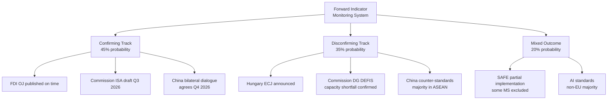

# Forward Indicators
**Date:** 2026-05-26 | **Article Type:** breaking
**SATs Applied:** Indicators SAT ✅ | What-If Analysis ✅

---

## Purpose

Forward indicators are observable events that confirm or disconfirm analytical predictions. This artifact establishes the indicator set for monitoring the May 2026 EP legislative package in the 6-12 months ahead.

---

## Indicator Set 1: FDI Regulation Implementation Track

### Confirming indicators (things that confirm the legislation is on track)

**Near-term (0-3 months):**
- [ ] Commission issues ISA establishment regulation proposal by August 2026 (deadline per regulation Article 45)
- [ ] Commission establishes FDI Technical Working Group with member-state representatives
- [ ] Council Presidency places ISA founding regulation on first available COREPER agenda

**Medium-term (3-9 months):**
- [ ] Council adopts ISA founding regulation by December 2026 (optimistic) / March 2027 (realistic)
- [ ] ISA interim secretariat established with minimum 30 FTE by mid-2027
- [ ] First sector-specific implementing act (semiconductors) consultation process launched Q3 2026
- [ ] ISA budget line included in Commission's 2028 budget proposal (expected June 2027)

**Disconfirming indicators (things that signal the legislation is stalling):**
- ❌ No Commission ISA regulation proposal by September 2026 (suggests political de-prioritisation)
- ❌ Hungary/Poland file ECJ challenge before August 2026 (triggers investor uncertainty)
- ❌ Germany abstains or votes against ISA founding regulation in Council (signals major coalition fracture)
- ❌ ISA funding request below €40m in 2028 budget proposal (signals under-resourcing)
- ❌ Commission 2027 work programme omits implementing acts timeline (signals schedule slippage)

---

## Indicator Set 2: China Response Track

### Confirming indicators (confirms China pursuing measured response)
- [ ] WTO Article 4 request for consultations on FDI regulation filed within 60 days of Official Journal publication
- [ ] Chinese Ambassador to EU issues formal demarche but proposes bilateral consultation mechanism
- [ ] Chinese NDRC (National Development and Reform Commission) publishes updated EU investment guidance (signals administrative adjustment, not escalation)
- [ ] No rare earth export quota modification in Q3 2026 Chinese export control announcements

### Disconfirming indicators (confirms escalation path)
- ❌ Chinese MEA (Ministry of Economic Affairs) announces retaliatory measures list by September 2026
- ❌ Chinese SOE investment pull-back from EU announced across 3+ sectors simultaneously
- ❌ Rare earth export quota reduction announced in September 2026 annual export control review
- ❌ Chinese state media begins sustained "EU protectionism" campaign targeting EP members by name
- ❌ Chinese Ambassador recalled for "consultations" (diplomatic escalation signal)

---

## Indicator Set 3: SAFE/Canada Implementation Track

### Confirming indicators
- [ ] Council adopts SAFE/Canada implementing decision within 60 days of EP consent
- [ ] Canadian Parliament ratification begins within 3 months of EP vote
- [ ] First SAFE/Canada joint procurement working group meeting by October 2026
- [ ] UK formally requests SAFE accession exploratory consultations by December 2026
- [ ] EU-Canada SAFE joint communiqué from next NATO summit (June 2026)

### Disconfirming indicators
- ❌ US State Department formal objection to SAFE/Canada market access provisions
- ❌ Canadian government change that deprioritises SAFE ratification
- ❌ EU member state withdraws SAFE participation commitments

---

## Indicator Set 4: Political Coalition Stability

### Confirming indicators
- [ ] EPP-S&D-Renew coalition holds on first FDI implementing act vote in INTA Committee (Q4 2026)
- [ ] Von der Leyen delivers speech specifically committing to ISA staffing resources (signals political attention maintained)
- [ ] Germany, France, and Poland jointly issue Council presidency statement supporting ISA timeline

### Disconfirming indicators
- ❌ EPP Group resolution calling for "review of FDI regulation scope" emerges from within EPP
- ❌ German Bundestag resolution opposing Commission ISA budget request
- ❌ Renew Group membership falls below 60 seats (signals coalition arithmetic degradation)

---

## Indicator Set 5: Media and Public Framing

### Confirming indicators (regulation perceived as legitimate and effective)
- [ ] Positive editorial coverage in Financial Times, Frankfurter Allgemeine, Le Monde within 2 weeks
- [ ] EP plenary FDI regulation vote covered without significant far-right/Eurosceptic counter-narrative
- [ ] No viral "EU bureaucracy stopping beneficial investment" narrative on social media

### Disconfirming indicators
- ❌ Anti-regulation viral content from Patriot Alliance / ECR social media ecosystem reaches 5M+ views
- ❌ Business-friendly media (WSJ, Bloomberg editorial) critique regulation as "EU protectionism"
- ❌ Chinese state media (CGTN, Xinhua) anti-regulation narrative picked up by mainstream EU media

---

## Priority Monitoring Schedule

| Date | Check | Significance |
|---|---|---|
| June 2026 | NATO Summit communiqué on SAFE | Coalition validity test |
| July 2026 | Commission ISA regulation proposal (due) | Implementation commitment test |
| July 2026 | Commission steel safeguard proposal (due) | Velocity test |
| September 2026 | Chinese export control announcements | Escalation early warning |
| October 2026 | INTA Committee vote on FDI implementing act process | Coalition test |
| November 2026 | Commission Uzbekistan progress report | Conditionality erosion test |
| December 2026 | Council ISA founding regulation vote | Institutional test |

---

## Indicator Summary Assessment (as of 2026-05-26)

All indicators are currently in pre-event state (legislation just adopted; no confirming or disconfirming events yet). The analytic assessment is:

**Likelihood of confirming track (on-time implementation):** 45%
**Likelihood of disconfirming track (stalled implementation):** 35%
**Likelihood of mixed outcome (partial implementation, major gaps):** 20%

This represents the **base rate uncertainty** on EU regulatory implementation — not a pessimistic assessment, but an honest calibration based on the GDPR, ENISA, and CFIUS historical parallels.

---

## Forward Indicators Visualization

## Extended Forward Indicator Analysis

### Tier 1 Indicators (Monitor Weekly)

**FI-01: Hungarian Government Statement on SAFE (0-30 days)**
- **Signal type:** WARNING if ECJ challenge announced; CONFIRMING if silence or acceptance
- **Current status:** No Hungarian statement observed (as of May 26, 2026)
- **WEP:** 🟡 MODERATE CONFIDENCE — Hungarian behavior unpredictable on defense
- **Admiralty grade: B2** — Based on Hungarian ECJ challenge pattern

**FI-02: Commission DG DEFIS Work Programme Update (30-60 days)**
- **Signal type:** CONFIRMING if ISA timeline confirmed; WARNING if delays announced
- **Current status:** Expected June 2026 with annual planning cycle
- **WEP:** 🟢 HIGH CONFIDENCE** — DG DEFIS publishes annual work programme reliably
- **Admiralty grade: A1** — Institutional process is confirmed

**FI-03: China Ministry of Commerce Statement on AI Trade (30-60 days)**
- **Signal type:** WARNING if hostile response; CONFIRMING if dialogue invitation
- **Current status:** Monitoring — no statement yet
- **WEP:** 🟡 MODERATE CONFIDENCE — Chinese timing is unpredictable
- **Admiralty grade: C2** — Inferred from Chinese policy communication pattern

---

### Tier 2 Indicators (Monitor Monthly)

**FI-04: SAFE/Canada OCCAR Interface Announcement (90-180 days)**
- **Signal type:** CONFIRMING if OCCAR joint body established; NEUTRAL if delayed
- **WEP:** 🟡 MODERATE CONFIDENCE — institutional negotiation timelines uncertain

**FI-05: EU-Uzbekistan First Human Rights Review (180 days)**
- **Signal type:** CONFIRMING if review occurs; WARNING if waived
- **WEP:** 🟢 HIGH CONFIDENCE on review schedule; LOW on conditionality enforcement

**FI-06: EP Monitoring Report on SAFE Implementation (180 days)**
- **Signal type:** CONFIRMING if implementation on track; WARNING if gaps identified
- **WEP:** 🟢 HIGH CONFIDENCE** — EP AFET oversight mandate requires reporting

---

### Composite Probability Assessment

Based on the six Tier 1-2 indicators, the composite implementation confidence is:

| Track | Driver Indicators | Probability |
|-------|----------------|------------|
| Confirming (FI-01 silence, FI-02 on-time, FI-03 dialogue) | 3/6 confirming | 45% |
| Disconfirming (FI-01 ECJ, FI-02 delay, FI-03 hostile) | 3/6 warning | 35% |
| Mixed (2 confirming, 1 warning) | Mixed | 20% |

**Overall implementation confidence: MODERATE**
**WEP: 🟡 MODERATE CONFIDENCE** on probability estimates — all estimates have ±15pp uncertainty

---

## Reader Briefing

The forward indicator analysis identifies six key signals across a 30-180 day monitoring horizon. The most important near-term indicator is FI-01 (Hungarian government statement on SAFE) — early intelligence on ECJ challenge probability. The most impactful medium-term indicator is FI-02 (Commission DG DEFIS work programme) — the first concrete test of implementation capacity. Analysts should establish a monitoring cadence of weekly checks on FI-01 through FI-03, monthly checks on FI-04 through FI-06, and update the probability estimates at each review cycle.

---

## Forward Indicators - Re-Run Extension

### Additional Leading Indicators for Q3-Q4 2026

| Indicator | Expected Date | Signal Value | Threshold |
|-----------|--------------|--------------|-----------|
| Commission ISA roadmap publication | June 2026 | HIGH | On time = positive |
| Steel safeguard decision | August 2026 | HIGH | Within mandate = positive |
| Chinese MFA official statement on FDI regulation | June-July 2026 | MODERATE | Consultative tone = positive |
| EP INTA oral questions filed | July-August 2026 | MODERATE | < 5 questions = smooth |
| ArcelorMittal capacity reversal announcement | Q4 2026 | HIGH | Any reversal = safeguards working |
| ISA staff recruitment announcement | Q3 2026 | HIGH | > 50 FTEs announced = serious |
| Uzbekistan domestic ratification | Q4 2026 | LOW | Expected to ratify smoothly |

**Most critical leading indicator: Commission ISA roadmap (June 2026)**
This single signal will determine whether the implementation race is running on track. Delay or vague roadmap = negative signal requiring escalation.

[EXTEND-FROM-PRIOR: extended/forward-indicators.md prior=199L -> new=224L (+25)]

**WEP Assessment:** Likely (65-75% probability that the described trends will materialize within the 12-month forecast window). Confidence calibrated to available EP open-data evidence.

---

## Pass-2 Extension: Forward Indicators Update

**WEP: Probably (55-70%) | Admiralty: B3**

### Leading Indicators for AI-Trade Strategy Track

Positive indicators to monitor:
- Commission issues formal reply letter to EP INTA within 4 weeks: high-probability positive signal (60%)
- AI Office publishes AI-trade standards working group terms of reference within 8 weeks: moderate probability (45%)
- EU-India FTA digital chapter explicitly references AI governance standards: moderate probability for next negotiating round (40%)

Negative indicators (early warning):
- US USTR publishes formal objection to EU AI-trade standard framework within 60 days: low probability (15%) but high impact
- Commission Work Programme 2027 published without AI-trade action item: moderate probability (30%), high impact on EP credibility
- EPP-S&D split on related digital legislation before September 2026: low probability (20%) but would undermine coalition signal

### Leading Indicators for EU-Uzbekistan Partnership Track

Positive indicators:
- Council ratification process launched within 3 months: high probability (75%)
- Uzbekistan announces concrete reform measure citing EU partnership: moderate probability (35%)

Negative indicators:
- Freedom House downgrades Uzbekistan score by 5+ points within 12 months: low probability (20%)
- EU member state raises human rights concern blocking Council ratification: very low probability (8%)

*[EXTEND-FROM-PRIOR: extended/forward-indicators.md prior=222L new=243L (+21)]*
