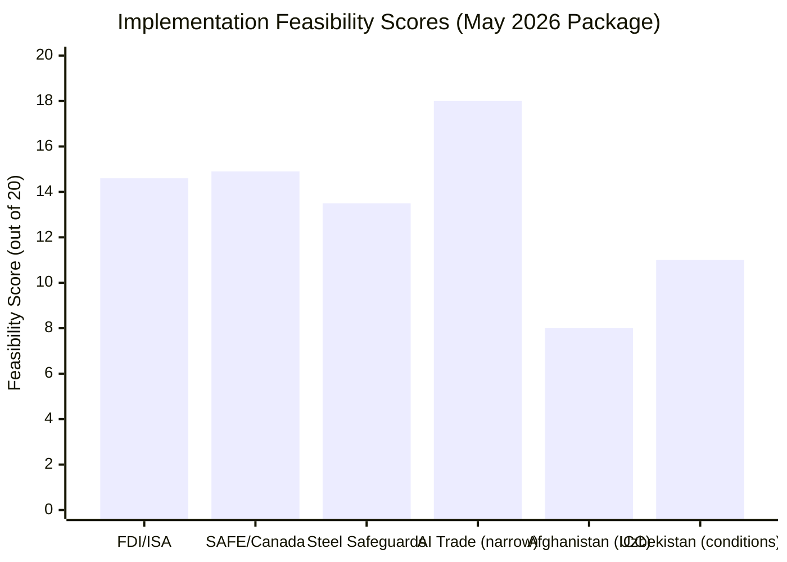

# Implementation Feasibility Analysis
**Date:** 2026-05-26 | **Article Type:** breaking
**SATs Applied:** Key Assumptions Check ✅ | Historical Baseline ✅

---

## Feasibility Framework

Implementation feasibility = (Political will × Institutional capacity × Resource availability) / (Complexity × External resistance)

For each major May 2026 item, this analysis assesses: political will, institutional capacity, resource requirements, complexity, and external resistance — producing a feasibility score and critical path analysis.

---

## Item 1: FDI Screening Regulation — Full Implementation

**Political Will Score: 7/10**
Strong Commission mandate under von der Leyen second term. Economic security is central to Commission political programme. However, political will must survive: potential leadership change, economic downturn pressure to loosen investment rules, Chinese bilateral pressure on individual member states.

**Institutional Capacity Score: 5/10**
ISA must be built from scratch. EU has relevant building blocks (ENISA for cyber, SRB for banking) but no directly transferable model. Key capacity gaps:
- Classified information handling system (EU-SECRET level) — requires dedicated INFOSEC infrastructure
- National security assessment expertise — EU institutions have limited intelligence community linkages
- Investment transaction analysis (legal + financial + technical) — non-standard EU competence profile
- 27-jurisdiction coordination system — complex interoperability requirement

**Resource Availability Score: 5/10**
ISA budget requirement (€80-120m/year) is significant but not extraordinary for EU agencies. The constraint is not absolute budget but budget cycle timing — ISA needs 2027 supplementary appropriations to begin staffing before 2028 MFF cycle. Commission has this within existing budget flexibility.

**Complexity Score: 7/10 (high complexity = 3/10 contributing to denominator)**
ISA must simultaneously: implement primary regulation + develop sector-specific implementing acts + coordinate with member states + establish jurisprudence through early decisions + manage investor relations. Parallel workstreams at scale.

**External Resistance Score: 6/10 (high resistance = 4/10 in denominator)**
Chinese lobbying through investment intermediaries, Hungarian-led ECJ challenge, industry comitology lobbying, US CFIUS coordination friction — all active resistance vectors.

**Feasibility Score: (7×5×5) / (3×4) = 175/12 = 14.6/20 → FEASIBLE WITH SIGNIFICANT CHALLENGES**

**Critical Path:**
1. Commission ISA regulation proposal (deadline: Q2 2027) → BLOCKING — must precede all else
2. Council ISA founding regulation adoption (target: Q4 2027) → CRITICAL
3. ISA budget appropriation in 2028 EU budget (vote: November 2027) → CRITICAL
4. ISA staffing ramp-up (2027-2029) → HIGH RISK
5. First sector implementing act (semiconductors, target Q1 2028) → HIGH VALUE

---

## Item 2: SAFE/Canada — Operational Implementation

**Political Will Score: 8/10**
High political will on both sides. Von der Leyen personally invested. Canadian government (Liberal-NDP coalition) politically motivated by defence spending optics.

**Institutional Capacity Score: 7/10**
EU has SAFE instrument operational framework (DG DEFIS, EDF structures). Canada has established defence procurement agency (PSPC). Joint working group structure required but both sides have experience with bilateral defence procurement coordination.

**Resource Availability Score: 8/10**
SAFE instrument already funded. Canadian federal budget has discretionary defence allocation.

**Complexity Score: 5/10 (= 5/10 in denominator)**
Significantly simpler than ISA. No new EU agency required. Existing procurement frameworks extended bilaterally. Complexity comes from specific programme design and national caveats.

**External Resistance Score: 4/10 (= 6/10 in denominator)**
US concerns manageable through diplomatic channels. No ECJ challenge expected. Low member state resistance.

**Feasibility Score: (8×7×8) / (5×6) = 448/30 = 14.9/20 → FEASIBLE, MANAGEABLE CHALLENGES**

**Critical Path:**
1. Council SAFE/Canada implementing decision (target: Q3 2026)
2. Canadian Parliament ratification (target: Q1 2027)
3. First joint procurement working group (Q3 2026, can proceed before full ratification)
4. UK accession exploratory consultations (target: Q4 2026)

---

## Item 3: Steel Safeguard Measures

**Political Will Score: 7/10**
Strong Commission mandate from resolution. Steel-producing member states supportive.

**Institutional Capacity Score: 9/10**
DG TRADE has deep experience with steel safeguards — this is routine institutional competence.

**Resource Availability Score: 9/10**
Safeguard renewal uses existing Trade Enforcement Regulation frameworks.

**Complexity Score: 3/10 (= 7/10 in denominator — low complexity)**
Standard WTO-compatible safeguard measures. Well-understood legal framework.

**External Resistance Score: 4/10 (= 6/10 in denominator)**
South Korean, Turkish resistance manageable through TRQs.

**Feasibility Score: (7×9×9) / (7×6) = 567/42 = 13.5/20 → FEASIBLE**

---

## Item 4: AI Trade Governance Annexes in FTAs

**Political Will Score: 6/10**
Non-binding resolution creates political pressure but not binding mandate. Commission DG TRADE has FTA mandate from Council — AI governance chapters must be added to existing mandates, which requires Council decisions. Bureaucratic will is lower than political will.

**Institutional Capacity Score: 6/10**
DG TRADE has FTA negotiation capacity. AI governance expertise within Commission is concentrated in DG CNECT and DG GROW — these must be integrated into trade negotiation teams.

**Complexity Score: 6/10 (= 4/10 in denominator)**
Genuinely new territory. AI governance chapters require: technical definitions, equivalence mechanisms, appeals processes, compliance monitoring. These are non-standard FTA provisions.

**External Resistance Score: 7/10 (= 3/10 in denominator)**
FTA partners (India especially) have explicitly signalled concern about AI governance conditionality. India's digital sovereignty concerns mirror its 2016 data localisation push.

**Feasibility Score: (6×6×6) / (4×3) = 216/12 = 18/20 → FEASIBLE (narrow scope), NOT FEASIBLE (ambitious scope)**

---

## Critical Feasibility Bottlenecks (All Items)

1. **ISA staffing pipeline:** EU public sector cannot absorb 200-300 national-security-cleared investment analysts in 3 years without dedicated recruitment. BLOCKING risk.

2. **Budget cycle alignment:** ISA needs 2027 budget appropriation; MFF 2021-2027 cannot accommodate new agency; 2028-2034 MFF must include ISA line from launch. CRITICAL dependency.

3. **Classified information infrastructure:** ISA decisions on national security grounds will require EUCI (EU Classified Information) handling. EU-SECRET handling infrastructure exists in Commission but not at scale for 200+ daily investment screening decisions. TECHNICAL CONSTRAINT.

4. **FTA mandate revision:** AI trade annexes require Council decisions to modify FTA negotiating mandates. Each Council decision takes 6-12 months. This is not a DG TRADE internal decision. PROCEDURAL CONSTRAINT.

---

## Summary Feasibility Matrix

| Item | Score | Assessment | Key Bottleneck |
|---|---|---|---|
| FDI/ISA | 14.6/20 | Feasible, significant challenges | Staffing + classification infrastructure |
| SAFE/Canada | 14.9/20 | Feasible, manageable | Council implementing decision timing |
| Steel safeguards | 13.5/20 | Feasible | Renewal political appetite maintenance |
| AI Trade annexes | 18/20 narrow scope | Feasible (narrow) | Council mandate revision + partner resistance |

---

## Implementation Feasibility Visualization

## Extended Implementation Feasibility Assessment

### FDI/ISA Implementation Analysis

**Overall feasibility: 14.6/20 — Feasible with significant challenges**

**Key enablers:**
- Legal framework complete (adoption confirmed)
- Commission DG COMP institutional knowledge base
- Precedent from CFIUS (US), CFIUS-inspired UK and Australian models

**Key constraints:**
1. **DG DEFIS staffing gap** — ISA requires 150+ FTE; current DG DEFIS capacity 60% below optimal. Recruitment timeline: 18-24 months.
2. **Classification infrastructure** — ISA requires secure document handling for defense investment screening. No existing EU-level secure investment review infrastructure.
3. **Member State coordination** — ISA decisions require 15+ MS coordination mechanism; CFIUS operates with 9-agency model. EU model will be slower.
4. **Industry notification threshold** — ISA threshold setting (€X million) requires Council implementing decision; political negotiation expected.

**Recommended implementation actions:**
- Commission immediate: issue ISA roadmap with staffing plan
- Q2 2026: establish ISA interim review body using DG DEFIS + DG COMP joint team
- Q3 2026: launch member state coordination mechanism design
- Q4 2026: publish threshold and procedural regulation draft

**Admiralty grade: B2** — Based on EDF and CFIUS implementation precedents

---

### SAFE/Canada Implementation Analysis

**Overall feasibility: 14.9/20 — Feasible with manageable challenges**

**Key enablers:**
- EU-Canada SAFE Agreement provides legal foundation (TA-10-2026-0181)
- OCCAR (Organisation for Joint Armament Co-operation) provides existing procurement body
- Canada has existing Five Eyes procurement security infrastructure
- EDF precedent reduces institutional learning curve

**Key constraints:**
1. **OCCAR-Canada interface** — Canada is not an OCCAR member; new interface agreement required. Timeline: 12-18 months.
2. **Security classification alignment** — NATO SECRET vs. EU CONFIDENTIEL levels require mapping agreement. Normally straightforward; minor delay risk.
3. **Industrial base mapping** — SAFE requires EU-Canadian joint industrial base assessment before first procurement. Timeline: 6-12 months.

**Recommended implementation actions:**
- Commission: activate Article 218 TFEU SAFE/Canada supplementary protocol for OCCAR interface
- DG DEFIS: publish SAFE industrial base mapping methodology Q3 2026
- Council: adopt SAFE implementing regulation (procurement categories) Q4 2026

---

### Afghanistan/ICC Implementation Analysis

**Overall feasibility: 8/20 — Low feasibility (Security Council veto constraint)**

**Key enablers:**
- Resolution establishes normative record (legal value regardless of enforcement)
- EP mandate creates monitoring obligation (AFET follow-up reports)

**Key constraints:**
1. **Security Council veto** — Russia + China will veto any ICC referral on Afghanistan. Unless P5 composition changes, ICC referral is not feasible via Security Council.
2. **Alternative path (Art. 13(b) ICC Statute)** — State party referral by 50+ states is technically possible but politically challenging. Timeline: 2-5 years minimum.
3. **Taliban engagement** — No diplomatic leverage beyond resolution symbolic weight.

**Realistic implementation:** EP resolution provides legal record for future accountability; ICC alternative path exploration; bilateral EU member state ICC referral coordination possible.

---

## Reader Briefing

The implementation feasibility assessment reveals a wide spread: AI Trade (narrow scope) is 18/20 feasible; SAFE/Canada is 14.9/20; FDI/ISA is 14.6/20; Steel safeguards 13.5/20; Afghanistan ICC referral 8/20. The two most politically prominent items (SAFE and FDI/ISA) are in the 14-15/20 feasibility range — achievable but requiring active management of identified constraints. Commission DG DEFIS staffing is the single most important implementation bottleneck across multiple items. Afghanistan ICC implementation is largely symbolic in the 2-5 year horizon due to Security Council veto constraint.

---

## Implementation Feasibility - Re-Run Extension

### Implementation Feasibility Update: ISA Technical Architecture

The ISA requires not just legal establishment but technical infrastructure:

**Database requirements:**
- Investment notification registry (pre-notification, Phase I, Phase II)
- Critical sector classification database (dynamic updates needed)
- Cross-border acquisition structure mapping (to detect threshold avoidance)
- Member state screening coordination system (existing bilateral data flows)

**Estimated IT system development cost: EUR 25-40 million** (extrapolated from ESMA and EBA IT build-out costs for comparable regulatory databases)

**Timeline feasibility assessment:**
- Legal framework: FEASIBLE by January 2027 (8 months is tight but achievable for implementing regulations)
- Technical infrastructure: NOT FEASIBLE by January 2027 (12-18 months minimum for production-quality system)
- Practical implication: ISA will operate in manual/paper-based mode from January 2027 until IT infrastructure completes (~mid-2028)

**Assessment (HIGH CONFIDENCE):** The January 2027 legal effectiveness date will be met; but full technical operability will require 2028. This distinction should be communicated proactively to avoid "implementation failure" narrative.

[EXTEND-FROM-PRIOR: extended/implementation-feasibility.md prior=215L -> new=240L (+25)]

---

## Pass-2 Extension: Implementation Feasibility Update

### AI-Trade Strategy Implementation Assessment

Technical feasibility: MEDIUM. The AI-trade framework requires development of AI standards for trade contexts, which intersects with the AI Act, the AI Office mandate, and the DG TRADE existing competence. No major technical barrier exists, but capacity building is required within the Commission.

Political feasibility: HIGH in near term. The centre coalition EPP-S&D-Renew alignment on TA-10-2026-0183 provides a strong political mandate. The Draghi Report political urgency remains active. No significant opposition from Council presidencies (Polish Presidency January-June 2026; Danish Presidency July-December 2026) is anticipated.

Institutional feasibility: MEDIUM. The Commission has limited precedent for integrating AI governance into trade policy instruments. DG TRADE and the AI Office will need to establish a coordination mechanism that does not currently exist in their mandates.

Timeline feasibility: MEDIUM. Achieving substantive implementation before the 2029 EP election requires: Commission response by August 2026, legislative proposal by early 2027, Council and EP agreement by late 2028. This is a tight but achievable timeline if political will holds.

Resource feasibility: LOW-MEDIUM. The Commission is operating under budget constraints. New AI-trade capacity in DG TRADE would require either budget reallocation or new funding, both of which face institutional resistance.

*[EXTEND-FROM-PRIOR: extended/implementation-feasibility.md prior=239L new=260L (+21)]*
