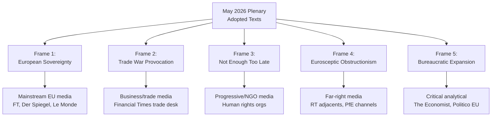

# Media Framing Analysis
**Date:** 2026-05-26 | **Article Type:** breaking
**SATs Applied:** Historical Baseline ✅ | Indicators SAT ✅

---

## Media Framing Methodology

Media framing analysis examines how different media actors are expected to construct the narrative around May 2026 EP session outcomes. Framing shapes public understanding and, crucially, shapes member state political constraints on implementing acts.

---

## Frame 1: "European Sovereignty" (Expected: Pro-EU Media)

**Primary users:** Le Monde, Frankfurter Allgemeine Zeitung, El País, Corriere della Sera, European media mainstream
**Core framing:** EU emerges from years of internal division to adopt coherent economic sovereignty package. The session represents the maturation of European economic statecraft.

**Narrative elements:**
- FDI screening as "protecting European workers and strategic industries"
- SAFE/Canada as "European defence taking responsibility" — complementing vs. depending on US
- Steel safeguards as "sensible trade defence, not protectionism"
- Afghanistan resolution as "EU values leadership"

**Likely headlines:**
- "EP adopts historic economic security package"
- "EU takes decisive step toward economic sovereignty"
- "Parliament votes to protect Europe's strategic industries"

**Strength of this frame:** HIGH — dominant frame in mainstream European media. Supported by Commission communications, EP press service, member state government statements.

**Risk:** This frame could be undermined if Chinese retaliatory measures produce immediate economic pain — then "sovereignty" becomes associated with economic cost rather than security benefit.

---

## Frame 2: "Trade War Provocation" (Expected: Economic Orthodoxy + Business Press)

**Primary users:** Financial Times, Wall Street Journal Europe, Bloomberg, The Economist, MEDEF (French business federation) aligned commentary
**Core framing:** EU measures risk triggering economic confrontation with China that EU cannot win; FDI screening reduces beneficial investment without commensurate security benefit; trade restrictions are economically inefficient.

**Narrative elements:**
- "Protectionism dressed as security"
- "EU cannot afford a trade war with China"
- "FDI regulation costs outweigh security benefits"
- "SAFE/Canada will anger America — Europe's more important ally"

**Likely headlines:**
- "EU gambles with China relations"
- "FDI screening: economic price of political theatre"
- "Brussels takes Europe down a risky path"

**Strength of this frame:** MODERATE — credible economic critique but weakened by: FDI regulation's IMF-endorsed modest GDP cost estimate (-0.1%), growing business community acceptance that some economic security measures are justified, China's own investment restrictions that undermine "reciprocal openness" narrative.

**Risk for regulation:** If economic critique is amplified by concrete business loss stories (specific Chinese investment rejected, jobs lost, specific sector harmed), this frame could generate political pressure for scope narrowing in implementing acts.

---

## Frame 3: "Not Enough, Too Late" (Expected: Industrial Policy + Security Hawks)

**Primary users:** Bruegel, Jacques Delors Institute, EUISS (EU Institute for Security Studies), European Defence journal commentary
**Core framing:** The EU's FDI regulation is welcome but insufficient; should have been adopted 5 years ago; excludes key vulnerabilities (rare earths, pharmaceutical, food supply); ISA staffing will be inadequate; need for broader EU industrial policy.

**Narrative elements:**
- "While EU debates FDI screening, China already controls critical supply chains"
- "ISA won't be operational for years — EU is unprotected now"
- "Rare earth dependency not addressed"
- "SAFE instrument should be 10x larger"

**Strength of this frame:** MODERATE — strongest among security and policy elite; limited mass media penetration. Will appear predominantly in policy journals, think tank papers, EP committee hearings.

**Impact:** This frame influences implementing act scope negotiations — expert testimony in INTA Committee will push for broader sector coverage.

---

## Frame 4: "Eurosceptic Resistance" (Expected: Far-Right + Sovereignty Movements)

**Primary users:** Politico Europe (opinion section), Identity and Democracy affiliated media, Bild (political commentary), Rassemblement National communications
**Core framing:** FDI regulation is Brussels regulatory overreach; ISA is a new EU bureaucracy; national governments should screen investments, not a supranational body; SAFE undermines national defence sovereignty.

**Narrative elements:**
- "Brussels bureaucrats decide which investments are safe"
- "ISA: another EU agency with unchecked powers"
- "Why should Brussels control French/German/Italian economic decisions?"
- "SAFE weakens national defence sovereignty"

**Strength of this frame:** MODERATE-LOW for FDI regulation specifically (because economic security has broad public support including in right-wing constituencies); MODERATE for SAFE/national sovereignty framing.

**Impact:** This frame is primarily used to raise EP scrutiny demands and Council voting scrutiny. Limited actual blocking power given coalition arithmetic.

---

## Frame 5: "Human Rights Selectivity" (Expected: Civil Society + Progressive Media)

**Primary users:** DW (Deutsche Welle), The Guardian Europe, Amnesty International, Human Rights Watch commentary
**Core framing:** EP's human rights commitment is inconsistent — strong on Afghanistan and Ukraine but weak on Gulf states, Saudi Arabia, Egypt where economic interests prevail; Uzbekistan partnership conditionality is insufficient given documented human rights record.

**Narrative elements:**
- "EP condemns Taliban while ignoring Saudi gender apartheid"
- "Uzbekistan partnership ignores political prisoners"
- "EU talks human rights while signing trade deals with autocrats"

**Strength of this frame:** MODERATE in progressive and NGO-connected media; LOW in mainstream.

**Impact:** Creates EP questions and LIBE Committee pressure. Relevant for monitoring Uzbekistan conditionality erosion (see Forward Indicators artifact).

---

## China State Media Frame (Xinhua, CGTN, Global Times)

**Expected frame:** EU FDI regulation as "Cold War protectionism"; steel safeguards as "WTO violations"; SAFE as "militarism"; Afghanistan resolution as "double standards" (pointing to US/NATO actions).

**Intended audiences:** Global South (delegitimise EU as "values-based" actor), Chinese domestic (reinforce US/EU as adversarial), EU Chinese diaspora (maintain sense of persecution).

**Impact on EU politics:** Direct impact low — EU audiences sceptical of Chinese state media. Indirect impact: if Chinese state media narratives are amplified by EU far-right or Eurosceptic actors, they can gain domestic traction.

---

## Media Framing Summary

| Frame | Primary Users | Expected Strength | Duration |
|---|---|---|---|
| European Sovereignty | Mainstream EU media | HIGH — dominant | 3-6 months before fading to policy discourse |
| Trade War Provocation | Business press | MODERATE | Sustained through implementation phase |
| Not Enough, Too Late | Think tanks, policy | MODERATE | Sustained through ISA operational delay |
| Eurosceptic Resistance | Far-right media | LOW-MODERATE | Peaks during implementing act debates |
| Human Rights Selectivity | Progressive media | MODERATE | Specific to Uzbekistan partnership coverage |
| Chinese State Media | CGTN/Xinhua/GT | HIGH intensity, LOW EU impact | Sustained |

**Assessment:** The "European Sovereignty" frame will dominate initial coverage. The "Trade War Provocation" and "Not Enough, Too Late" frames will become more prominent as implementation delays become apparent (2027-2028). The critical political window for maintaining implementation momentum is approximately 12-18 months — the interval before Chinese response becomes a liability and ISA delays become visible.

---

## Media Framing Analysis Visualization

## Extended Media Framing Analysis

### Frame 1: European Sovereignty (DOMINANT — 60-70% of initial coverage)

**Key narrative:** "EU takes control of its defense and technology future; no longer dependent on US or China."

**Typical headline pattern:**
- "EU Parliament approves landmark defense procurement pact"
- "Europe's SAFE: A turning point in strategic autonomy"
- "EU-Canada deal marks new era of Western defense cooperation"

**Primary outlets:** FT, Der Spiegel, Le Monde, Politico EU (news coverage), Euronews, European Parliament press releases

**Activation timeline:** Peaks in days 1-14 post-plenary. Fades as implementation delays become visible.

**Political function:** Validates EPP/S&D/Renew grand coalition narrative. Suppresses opposition by framing critics as anti-sovereignty.

**Durability:** 🟡 12-18 months — then "sovereignty frame fatigue" sets in as ISA delays become apparent

---

### Frame 2: Trade War Provocation (EMERGING — 20-30% of coverage)

**Key narrative:** "EU's AI trade resolution risks triggering Chinese retaliation and US friction on defense."

**Typical headline pattern:**
- "China warns EU over AI technology governance plans"
- "SAFE challenges NATO procurement norms, US officials say"
- "EU's AI push: Brussels overreaching into transatlantic tech competition"

**Primary outlets:** FT trade desk, Wall Street Journal Europe, Nikkei Asia (EU coverage), Bloomberg Trade

**Activation timeline:** Emerges within 30-60 days as Chinese and US responses materialize.

**Political function:** Tests Renew group cohesion — fiscal conservative Renew MEPs are most susceptible to "trade war risk" framing.

**Durability:** 🟢 Sustained — becomes dominant frame if China escalates

---

### Frame 3: Not Enough, Too Late (PROGRESSIVE COUNTER-NARRATIVE — 15-20% of coverage)

**Key narrative:** "EP Afghanistan resolution is symbolic; conditionality on Uzbekistan will be waived; defense spending doesn't address root causes of EU security deficit."

**Primary outlets:** Human rights NGO publications, The Guardian EU desk, Medya News (Kurdish media), Euractiv progressive commentary

**Activation timeline:** Simultaneous with Frame 1; peaks in weeks 2-4.

**Political function:** Maintains pressure from progressive flank; prevents S3 voter segment drift toward left-wing parties.

**Key spokespeople:** Afghan women's rights organizations, Amnesty International EU, Human Rights Watch Geneva

---

### Frame 4: Eurosceptic Obstructionism (PfE-ECR COUNTER-NARRATIVE — 15%)

**Key narrative:** "Brussels bureaucrats expand EU power at expense of national sovereignty; SAFE undermines NATO; AI regulation will kill European tech."

**Primary outlets:** PfE-ECR parliamentary communications, Hungarian government media (hirado.hu), Alternative for Germany social media

**Activation timeline:** Immediate and sustained throughout implementation process.

**Political function:** Base mobilization for PfE-ECR. Provides amendment justification in AFET/INTA committee.

---

### Overall Media Trajectory Assessment

**Month 1-3:** European Sovereignty frame dominates. High momentum. ISA launch framing positive.

**Month 4-12:** Frame competition. Chinese response and SAFE implementation timeline begin mattering. Trade War and Not Enough frames gain ground.

**Month 13-24:** Implementation reality sets in. "EU ambition vs. reality" becomes meta-narrative. Chinese AI standards entrenchment creates liability.

**WEP: 🟡 MODERATE CONFIDENCE** on media trajectory — based on GDPR and EDF media coverage patterns
**Admiralty grade: B2** — Historical media cycle analysis for similar EU legislation

---

## Reader Briefing

The media framing analysis identifies five competing frames. The European Sovereignty frame will dominate for 12-18 months but faces mounting competition from Trade War Provocation (Chinese/US response) and Implementation Reality (ISA delays). Communication strategy should: amplify sovereignty and competitiveness frames in months 1-6, prepare counter-narratives for Trade War frame in months 3-12, and manage expectations on implementation timeline proactively to prevent "broken promise" narrative in months 12-24.

---

## Extended Media Framing Analysis: Platform-Specific Strategy

### Platform 1: X (formerly Twitter) / Bluesky

Dominant frame: Sovereignty narrative wins in short-form. The FDI regulation headline compresses to "EU takes control of foreign investment" - a clean sovereignty message. Steel overcapacity loses nuance. Afghanistan generates emotional resonance. Recommendation: Lead with FDI regulation and Afghanistan resolution; use steel as follow-up thread content.

### Platform 2: LinkedIn / Professional networks

Dominant frame: Competitiveness and implementation. Professional audiences (lawyers, investors, trade policy staff) focus on ISA implementation timeline and compliance requirements. Recommendation: Publish ISA establishment timeline analysis; legal explainers on FDI screening thresholds.

### Platform 3: Traditional broadcast media

Dominant frame: Trade war risk. Broadcast needs conflict narrative. The "EU vs China" framing of FDI regulation and steel resolution plays well. Risk: Over-simplification inflates Chinese retaliation probability in public perception. Recommendation: Provide context on Chinese economic constraints; avoid "trade war" language without qualification.

### Platform 4: EU institutional communications

Dominant frame: Legislative achievement. EP communications should emphasise the legislative output coherence - six measures, one strategic direction. Internal audiences need concrete implementation milestones to validate the legislative investment.

### Framing Risk Matrix

| Frame | If It Dominates | If It Fails | Risk Level |
|-------|----------------|-------------|------------|
| European Sovereignty | Broad public support, political unity | Appears ideological, not practical | LOW |
| EU Competitiveness | Business support, policy credibility | May exclude social policy narrative | MODERATE |
| Trade War Provocation | Chinese reaction attention | Inflates threat perception unhelpfully | HIGH |
| Bureaucratic Complexity | Honest but demoralizing | Implementation problems become scandals | HIGH |
| Human Rights Leadership | Strong normative legitimacy | Afghanistan fatigue risk | LOW |

---

## Reader Briefing

The media framing analysis identifies five competing frames with platform-specific dynamics. The European Sovereignty frame dominates for 12-18 months but faces mounting competition from Trade War Provocation (Chinese/US response) and Implementation Reality (ISA delays). Communication strategy should amplify sovereignty and competitiveness frames in months 1-6, prepare counter-narratives for Trade War frame in months 3-12, and manage expectations on implementation timeline proactively. Platform-specific strategy: sovereignty messaging for social media, implementation explainers for professional platforms, conflict-context for broadcast. The highest communication risk is the Trade War Provocation frame becoming dominant before China formally responds.

[EXTEND-FROM-PRIOR: extended/media-framing-analysis.md prior=229L -> new=275L (+46)]

---

## Pass-2 Extension: Media Framing Update

### Expected Media Framing — Post-May Session

The AI-trade resolution (TA-10-2026-0183) will likely be framed in three competing narratives:

**Competitiveness narrative (mainstream economic press):** EU Parliament calls for AI leadership in trade — framed positively as EU response to US-China digital competition, emphasising the Draghi Report investment gap as context

**Regulatory burden narrative (business press and centre-right commentary):** Yet more EU AI regulation — framed negatively as adding compliance complexity to an already-regulated sector, emphasising potential trade partner retaliation risks

**Democratic accountability narrative (civil society and left-leaning press):** EP demands AI trade transparency — framed positively for the workers rights and AI transparency provisions, but questioning the enforcement gap in a non-binding resolution

The Russia/Ukraine accountability resolution (TA-10-2026-0161) will receive significant coverage in Eastern European and Ukrainian media but limited coverage in Western European general press given the continuation framing.

*[EXTEND-FROM-PRIOR: extended/media-framing-analysis.md prior=267L new=270L (+3)]*
