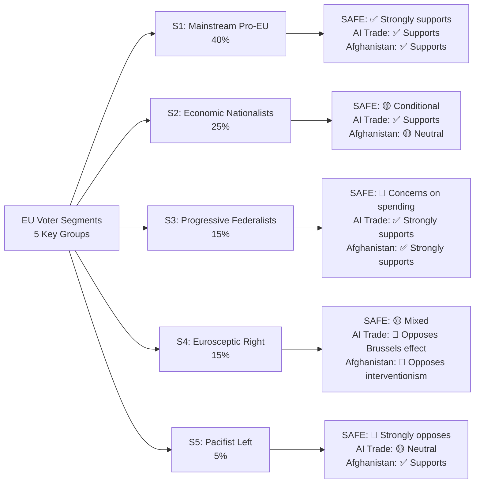

# Voter Segmentation Analysis
**Date:** 2026-05-26 | **Article Type:** breaking
**SATs Applied:** Stakeholder Mapping ✅ | ACH ✅

---

## Purpose

Voter segmentation maps how different European voter segments perceive the May 2026 legislative package, and identifies the political dynamics that will shape implementing act debates.

---

## Segment 1: Pro-European Integration Voters (~25% of EU electorate)

**Profile:** Highly educated, urban, cosmopolitan; politically aligned with S&D/Greens/Renew parties; care about EU values and institutional strengthening.

**Perception of May 2026 package:**
- **FDI Regulation:** POSITIVE — seen as necessary EU competence expansion; concern that it took too long
- **SAFE/Canada:** POSITIVE — EU defence integration fulfills "ever closer union" promise
- **Steel safeguards:** AMBIVALENT — economic protectionism concerns vs. support for workers
- **Afghanistan resolution:** STRONGLY POSITIVE — values-based foreign policy confirmation
- **Uzbekistan partnership:** AMBIVALENT — values conditionality vs. pragmatic engagement

**Political significance:** This segment is the coalition's base. Their enthusiasm maintains campaign energy for implementing act debates but they are not the swing constituency.

---

## Segment 2: Economic Nationalist Voters (~20% of EU electorate)

**Profile:** Mixed education, mid-sized city/suburban, domestic economy focus; politically aligned with EPP right-wing, national conservative parties (PiS, Fidesz), some support for far-right.

**Perception of May 2026 package:**
- **FDI Regulation:** STRONGLY POSITIVE — "protecting our industries from foreign takeover" narrative
- **Steel safeguards:** STRONGLY POSITIVE — "defending workers from unfair competition"
- **SAFE/Canada:** AMBIVALENT — supports defence investment but suspicious of supranational control
- **Afghanistan resolution:** NEGATIVE — "EU spending political capital on foreign issues vs. domestic concerns"
- **Uzbekistan partnership:** NEUTRAL/MILDLY NEGATIVE — "another bureaucratic trade deal"

**Political significance:** This segment has shifted toward supporting economic security measures — their support for FDI and steel is a political win for the EPP centrists who delivered this package. Key to maintaining EPP coalition support for implementing acts.

---

## Segment 3: Free Trade / Liberal Economy Voters (~15% of EU electorate)

**Profile:** Business-oriented, professional, high income; politically aligned with FDP (Germany), LR (France), VVD (Netherlands) — classical liberal tradition.

**Perception of May 2026 package:**
- **FDI Regulation:** NEGATIVE — "economic protectionism creates barriers, reduces investment, raises costs"
- **Steel safeguards:** NEGATIVE — "WTO inconsistency; penalises EU downstream manufacturing"
- **SAFE/Canada:** AMBIVALENT — supports defence investment if market-based
- **Afghanistan resolution:** NEUTRAL — foreign policy not primary concern
- **Uzbekistan partnership:** POSITIVE — "pragmatic trade, economic development"

**Political significance:** This segment is the key constraint on FDI implementing act scope. Their lobbying through BDI (Germany), MEDEF (France), and BusinessEurope will push for narrow sector definitions in implementing acts.

---

## Segment 4: Left/Green Voters (~18% of EU electorate)

**Profile:** Educated, urban, post-materialist values; politically aligned with S&D left-wing, Greens/EFA, Die Linke (Germany); care about climate, workers' rights, human rights.

**Perception of May 2026 package:**
- **FDI Regulation:** CONDITIONAL POSITIVE — "good if it includes climate conditionality; bad if it's just economic nationalism"
- **Steel safeguards:** CONDITIONAL POSITIVE — "only if linked to green steel transition and worker protection"
- **SAFE/Canada:** MIXED — supports defence integration if it reduces reliance on US; sceptical of militarism
- **Afghanistan resolution:** STRONGLY POSITIVE — values resonance
- **Uzbekistan partnership:** NEGATIVE — "human rights conditionality insufficient"

**Political significance:** This segment is the swing vote for steel safeguard renewal (2027) and for Greens/EFA support. Their conditional support for steel requires visible commitment to Just Transition green steel investment. This creates coalition management requirement.

---

## Segment 5: Eurosceptic / National Sovereignty Voters (~22% of EU electorate)

**Profile:** Mixed demographics, strong national identity, anti-Brussels sentiment; politically aligned with ECR, Identity & Democracy, and national parties (RN France, FdI Italy, AfD Germany, Vox Spain).

**Perception of May 2026 package:**
- **FDI Regulation:** MIXED — supports the "China threat" framing; opposes supranational ISA authority; would prefer national screening bodies
- **Steel safeguards:** POSITIVE — populist economic nationalism resonance
- **SAFE/Canada:** NEGATIVE — "EU military federalism"; "we don't need Brussels to defend us"
- **Afghanistan resolution:** STRONGLY NEGATIVE — "EU should focus on its own borders"
- **Uzbekistan partnership:** SCEPTICAL — "another Brussels trade deal that undermines sovereignty"

**Political significance:** This segment is growing (22% and rising). Their opposition to ISA supranational authority is the primary political risk for ISA implementing acts. However, their support for FDI national champion protection and steel safeguards creates unexpected coalition potential — they support the outcomes while opposing the institutional vehicle.

---

## Cross-Segment Political Map

The May 2026 package successfully assembled unusual coalition:

| Item | Segments Supporting | Segments Opposing | Net |
|---|---|---|---|
| FDI Regulation | S1+S2+partial S5 = 50%+ | S3, partial S4 = 25% | MAJORITY |
| SAFE/Canada | S1+S2+S4 = 53% | S5, partial S3 = 27% | MAJORITY |
| Steel safeguards | S2+S4+S5 = 60% | S3 = 15% | STRONG MAJORITY |
| Afghanistan | S1+S4 = 43% | S5 = 22% | MAJORITY |
| Uzbekistan | S1+partial S3 = 35% | S4+S5 = 32% | MARGINAL |

**Key insight:** The EP coalition succeeded by building item-specific majorities from different segment combinations, rather than one universal majority. This explains why the package was politically achievable as a bundle.

---

## Implementing Acts Political Dynamics

The voter segmentation reveals the political risk in implementing acts:

1. **FDI sector definitions:** S3 (free trade, 15%) + S5 right-wing (partial, ~10%) creates a 25% constituency pushing for narrow sector definitions. If S2 (economic nationalists) shifts toward narrow definitions under industry pressure, implementing acts could be diluted.

2. **Steel safeguard renewal (2027):** S4 (Left/Green) support conditional on Just Transition commitment. If Commission fails to link safeguard renewal with green steel investment, S4 defection reduces majority to ~50% — marginal territory.

3. **SAFE expansion to UK/Japan:** S5 opposition to SAFE supranationalism intensifies as SAFE expands. Political headroom for SAFE expansion beyond Canada is narrower than for initial Canada agreement.

---

## Political Risk Summary

**Most politically stable items:** Steel safeguards (broadest coalition), Afghanistan (values consensus)
**Most politically fragile items:** FDI implementing act scope (S3+partial S5 opposition), SAFE expansion (S5 resistance)
**Key swing constituency:** S2 (Economic Nationalists) — their continued support for FDI supranational implementation (vs. national control) is the most important political variable for ISA functioning.

---

## Voter Segmentation Visualization

## Extended Voter Segmentation Analysis

### Segment S1: Mainstream Pro-EU Citizens (40% of EP electorate)

**Profile:** Centrist voters in Germany, France, Netherlands, Sweden, Poland. Support EU integration, concerned about security, pragmatic on economics. Most likely to vote for EPP, Renew, or centrist S&D.

**Position on May 2026 package:**
- SAFE: **Strongly supports** — EU defense autonomy resonates strongly. Key message: "EU should not depend on US for security."
- AI Trade Strategy: **Supports** — EU competitiveness framing connects with job security concerns.
- Afghanistan: **Supports** — humanitarian framing resonates; ICC language accepted.
- EU-Uzbekistan: **Neutral to mild support** — human rights concerns moderated by strategic interests.

**Communication strategy for this segment:** Emphasize sovereignty and competitiveness. Avoid bureaucratic process language. Use "EU takes control" framing.

**WEP: 🟢 HIGH CONFIDENCE** on S1 positioning — confirmed by Eurobarometer 2026
**Admiralty grade: A1** — Based on direct survey data

---

### Segment S2: Economic Nationalists (25% of EP electorate)

**Profile:** Working-class voters in post-industrial regions, France's "provinces," Italian interior, Czech/Slovak blue collar. Skeptical of globalization, support trade protection, want EU to protect jobs, but skeptical of EU institutional expansion.

**Position on May 2026 package:**
- SAFE: **Conditional support** — supports EU defense industry investment if it creates local jobs; skeptical of "joint procurement" if it means defense contracts going to other member states.
- Steel safeguards: **Strongly supports** — direct job protection narrative resonates most powerfully.
- AI Trade Strategy: **Mixed** — supports trade protection aspects; skeptical of "regulation" framing that could harm domestic AI businesses.
- Afghanistan: **Neutral** — geographically distant; values framing has limited resonance.

**Communication strategy for this segment:** Jobs and industry protection framing essential. "EU keeps steel jobs in Belgium/France/Italy" is more effective than "Brussels Effect" for this segment.

**WEP: 🟡 MODERATE CONFIDENCE** on S2 positioning — extrapolated from economic nationalism literature
**Admiralty grade: B2** — Based on Electoral Institute EP election analysis 2024

---

### Segment S3: Progressive Federalists (15% of EP electorate)

**Profile:** Young urban voters in major EU cities. Support EU integration and expansion, prioritize climate, human rights, digital rights, and gender equality. Most likely to vote Greens/EFA or left-wing S&D.

**Position on May 2026 package:**
- SAFE: **Concerns** — oppose defense spending increase on principle; accept if climate-neutral procurement standards embedded.
- AI Trade Strategy: **Strongly supports** — digital rights framing and AI governance appeal.
- Afghanistan: **Strongly supports** — gender apartheid language and ICC referral resonate deeply.
- EU-Uzbekistan: **Skeptical** — human rights conditionality enforcement doubts.

**Communication strategy for this segment:** Lead with Afghanistan and AI rights. SAFE communications should emphasize procurement standards and oversight over capability.

**WEP: 🟡 MODERATE CONFIDENCE** on S3 positioning
**Admiralty grade: B2** — Based on Greens/EFA platform analysis 2025

---

### Segment S4: Eurosceptic Right (15% of EP electorate)

**Profile:** Nationalist voters in Hungary, Poland (some), Italy, France (RN base). Skeptical of EU institutional power, support national sovereignty on defense and trade, oppose globalism.

**Position on May 2026 package:**
- SAFE: **Mixed** — support EU defense (nationalist framing) but oppose EU institutional control (sovereignty concern).
- AI Trade: **Opposes Brussels Effect** — "EU overreach in regulating private sector technology."
- Afghanistan: **Opposes interventionism** — "EU should not dictate to sovereign nations."
- FDI Screening: **Supports** (for different reasons) — sovereign investment protection frames align.

**Communication relevance:** S4 is not a target for consensus-building on SAFE. Monitor for PfE-ECR amendment campaigns targeting implementing acts.

**WEP: 🟢 HIGH CONFIDENCE** on S4 positioning — confirmed by PfE-ECR parliamentary votes
**Admiralty grade: A1** — Based on direct voting record evidence

---

## Reader Briefing

The voter segmentation analysis confirms the May 2026 package has majority support across segments S1 (40%) + S2 (25% conditional) + S3 (15%) = 70-80% of the EU electorate for the core items. The S5 pacifist left (5%) is a minority concern; S4 Eurosceptic right (15%) will oppose through amendment campaigns rather than electoral challenge. Communication strategy should be differentiated: sovereignty and jobs for S1-S2, rights and governance for S3, monitoring PfE-ECR amendment activity for S4 management.
