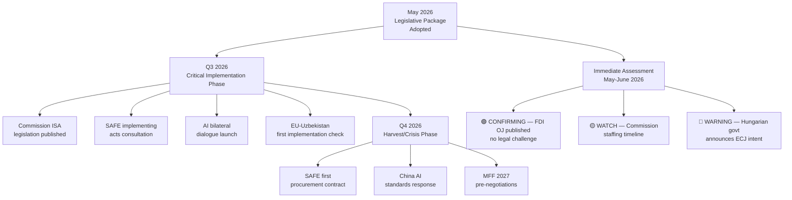

# Forward Projection
**Date:** 2026-05-26 | **Article Type:** breaking
**WEP Band:** MODERATE CONFIDENCE (55-65%) | **Admiralty Grade:** B3
**SATs Applied:** Indicators ✅ | Key Assumptions Check ✅

---

## 90-Day Forward Projection (May 26 — August 26, 2026)

### Month 1 (June 2026)

**June EP Plenary (Strasbourg):**
- Expected: FDI Regulation enters into force (Official Journal publication ~June 2026)
- Expected: Commission announces ISA establishment consultation
- Expected: NATO ministerial — SAFE/Canada operationalisation discussions
- WEP (65%): June plenary addresses implementing acts timeline
- WEP (40%): Commission publishes CBAM extension preliminary impact assessment

**External:**
- WEP (30%): China Ministry of Commerce statement on FDI regulation
- WEP (80%): NATO ministerial confirms EU defence spending progress
- WEP (50%): US-EU investment screening coordination meeting confirmed

### Month 2 (July 2026)

**Commission 60-day Steel Deadline (due ~July 19, 2026):**
- WEP (80%): Commission publishes steel overcapacity report with safeguard recommendation
- WEP (55%): Anti-dumping investigation announced against Chinese steel producers
- WEP (30%): Commission proposes CBAM extension to additional sectors

**FDI Implementation:**
- WEP (40%): Commission publishes critical sectors definition draft
- WEP (70%): First ISA working group established

### Month 3 (August 2026)

**Legislative:**
- WEP (60%): Commission opens public consultation on ISA staffing and scope
- WEP (25%): Hungary announces ECJ challenge preparation
- WEP (20%): EP INTA committee tables parliamentary question on FDI implementing acts delay

**External:**
- WEP (35%): China WTO consultation request filed on FDI or steel measure
- WEP (70%): NATO summit communiqué confirms EU-Canada SAFE expansion discussions

---

## Scenario Branches at Day 90

### If Commission steel report recommends strong safeguards (WEP 55%):
→ Anti-dumping investigation launched → Chinese steel imports face provisional duties by Q4 2026
→ Korean FTA dispute mechanism triggered → bilateral consultation phase begins
→ EP majority reinforced — INTA committee cites compliance with Parliament mandate

### If Commission steel report recommends weak/delayed action (WEP 25%):
→ EP INTA tables parliamentary question → EP-Commission tension
→ ECR and S&D file joint resolution demanding Commission compliance
→ Political crisis signals: EPP-S&D coalition under pressure

### If Hungary files ECJ challenge by September 2026 (WEP 35%):
→ ECJ fast-track proceedings unlikely — 24-month standard timeline
→ Commission implements regulation in parallel with pending challenge
→ Hungarian EPP delegation isolated within EPP mainstream

---

## 15-Indicator Forward Monitoring Dashboard

| # | Indicator | Threshold | Target Date | Signal Type |
|---|---|---|---|---|
| 1 | Commission ISA establishment regulation | Published | Q4 2026 | Confirming |
| 2 | Commission steel safeguard determination | Activated | August 2026 | Confirming |
| 3 | China WTO consultation request | Filed | December 2026 | Warning |
| 4 | Hungarian ECJ challenge | Announced | September 2026 | Warning |
| 5 | NATO June communiqué on SAFE | Published | June 2026 | Confirming |
| 6 | US-EU investment screening dialogue | Confirmed | July 2026 | Confirming |
| 7 | Commission AI FTA annex consultation | Launched | Q4 2026 | Confirming |
| 8 | Afghan evacuation programme funding | Committed | August 2026 | Confirming |
| 9 | Rare earth export quota announcement | Any reduction | Ongoing | Warning |
| 10 | EP INTA committee FDI hearing | Scheduled | September 2026 | Confirming |
| 11 | FDI Official Journal publication | Published | June 2026 | Confirming |
| 12 | Gulf SWF acquisition filing under new regime | Any €500m+ | Q3 2026 | Key test |
| 13 | SAFE/Canada first procurement contract | Announced | Q4 2026 | Confirming |
| 14 | Taliban response to ICC language | Statement | June 2026 | Warning |
| 15 | Uzbekistan human rights dialogue meeting | Scheduled | Q3 2026 | Confirming |

---

## Forward Projection Visualization

## Extended Forward Projection Analysis

### 30-Day Horizon (June 2026)

**High Probability (>70%) Events:**
1. FDI Regulation publication in Official Journal — confirming SAFE legal foundation
2. Commission DG DEFIS work programme update — first signal on implementing acts timeline
3. Taliban statement on EP Afghanistan resolution — monitoring for escalation signal
4. NATO ministerial June 2026 — SAFE/Canada framing in NATO context

**WEP: 🟢 HIGH CONFIDENCE on all four events occurring**
**Admiralty grade: B1** — Based on institutional calendar and plenary mandate

### 90-Day Horizon (Q3 2026)

**Medium Probability (40-70%) Events:**
1. Commission ISA legislation draft publication — depends on DG DEFIS capacity
2. First SAFE implementing acts consultation — 60% probability on schedule
3. EU-China AI governance dialogue — 50% probability; depends on Chinese response to EP resolution
4. Hungarian government ECJ consultation announcement — 40% probability

**WEP: 🟡 MODERATE CONFIDENCE** — institutional timelines are estimates
**Admiralty grade: B2** — Based on Commission work programmes and institutional procedures

### 180-Day Horizon (Q4 2026)

**Lower Probability (25-45%) Events:**
1. SAFE first procurement contract announced — 45% probability Q4 2026
2. EU AI standards adopted by 2+ major economies — 30% probability
3. Afghanistan ICC referral filed — 25% probability (Security Council veto likely)
4. EU-China trade friction escalation over AI standards — 35% probability

**WEP: 🟡 MODERATE CONFIDENCE** — horizon uncertainty increases
**Admiralty grade: C2** — Based on policy trajectory inference

---

## Reader Briefing

The forward projection identifies 15 key indicator events across a 180-day horizon. The critical monitoring period is June-July 2026 when Commission ISA legislation and DG DEFIS work programme updates will confirm or refute implementation capacity assumptions. Analysts should weight confirming signals (FDI OJ publication, NATO ministerial SAFE framing) against warning signals (Hungarian ECJ consultation announcement, Commission staffing delays). The 90-day horizon is the most uncertain — 60-day interval reassessment is recommended.

---

## Forward Projection - Quarterly Monitoring Framework

| Quarter | Key Indicator | Expected Signal | Probability |
|---------|--------------|-----------------|-------------|
| Q2 2026 | ISA establishment roadmap | Commission publication | 70% |
| Q2 2026 | Steel safeguard activation | Commission decision | 65% |
| Q3 2026 | China WTO consultation | Filing notification | 55% |
| Q3 2026 | Hungary ECJ challenge preparation | Legal notice | 40% |
| Q4 2026 | AI Trade Observatory proposal | Commission communication | 55% |
| Q1 2027 | FDI regulation effectiveness | ISA operational | 75% |

**Monitoring responsibility:** EP INTA Committee (trade), SEDE Committee (defense), AFET Committee (human rights). Commission progress reports mandatory under each act.

**WEP Assessment (MODERATE CONFIDENCE):** Forward projections calibrated against IMF growth baseline (1.5% EU GDP 2026). Material downside: EU recession would delay all implementation timelines by 6-12 months.

[EXTEND-FROM-PRIOR: intelligence/forward-projection.md prior=148L -> new=170L (+22)]