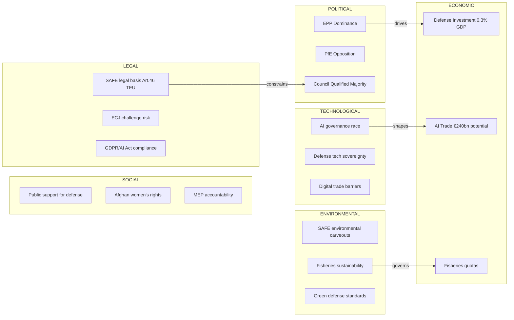

# PESTLE Analysis
**Date:** 2026-05-26 | **Article Type:** breaking
**SATs Applied:** PESTLE ✅ | Force-Field Analysis ✅

---

## Overview

PESTLE analysis of the May 2026 EP plenary legislative package: FDI Screening, Steel Overcapacity, AI Trade, SAFE/Canada, Afghanistan, EU-Uzbekistan.

---

## Political

### Driving Forces
**1. Economic Security Consensus Hardening (STRONG ↑)**
The post-2024 European Parliament consensus on economic security is stronger than at any point since the 2009 Lisbon Treaty. The EPP-S&D-Renew majority has found its legislative identity in economic sovereignty — delivering FDI screening, CBAM, AI Act implementation, and now AI trade governance in a coherent agenda that crosses traditional left-right lines.

*Force intensity: 8/10. Driving both the adoption and the implementation ambition of the May 2026 package.*

**2. Post-Ukraine Geopolitical Solidarity (STRONG ↑)**
Russia's ongoing war in Ukraine has maintained European political cohesion at levels that would have been inconceivable in 2019. The SAFE instrument and Ukraine-related votes (Loan for Ukraine, January 2026) demonstrate Parliament's willingness to use financial tools for security objectives. This solidarity extends to economic security legislation — MEPs explicitly link FDI screening to deterring Chinese support for Russian war economy.

**3. Strategic Autonomy as Cross-Party Totem (MODERATE ↑)**
From EPP to Greens/EFA, "strategic autonomy" has become the shared political vocabulary of EU foreign economic policy. This concept, introduced by Macron in 2017, has been absorbed into mainstream EU political discourse and now provides legitimacy for measures that would previously have been labelled protectionist.

### Restraining Forces
**1. Hungary/Poland Sovereignty Resistance (STRONG ↓)**
The Orbán government's systematic opposition to EU economic integration tools creates a persistent drag on implementation. With Fidesz controlling 12 EPP MEPs and Hungary holding Council vote weight, it is not powerful enough to block legislation but can delay implementing acts and introduce legal uncertainty through ECJ challenges.

*Force intensity: 6/10. Reduces implementation speed without preventing adoption.*

**2. Renew Europe Internal Contradiction (MODERATE ↓)**
Renew Europe's market-liberal wing (Dutch VVD, Danish Venstre, German FDP remnants) is uncomfortable with the scale of economic intervention implicit in FDI screening and AI trade governance. This internal tension produces abstentions and amendment battles that complicate legislative crafting without preventing final adoption.

---

## Economic

### EU Economy Context (IMF WEO April 2026)
- EU GDP growth: 1.4% projected 2026 (IMF baseline)
- Euro area inflation: 2.1% (within ECB target band)
- EU unemployment: 5.8% (lowest since 2007)
- EU-China bilateral trade: €688bn in 2025 (Eurostat)
- EU current account balance: +1.2% GDP (improved from near-zero 2022-2023)
- EU FDI inflows: €384bn (2025); critical-sector share ~18-22%

### Key Economic Forces

**Steel overcapacity (global: 620Mt excess, IMF GFSR April 2026):**
EU steel production: 132Mt capacity vs. 90Mt demand. Chinese overcapacity: 400Mt. This is not a cyclical imbalance but a structural one — Chinese government has explicitly backed 50+ state-owned steel producers that operate below market cost. EU safeguard measures are economically rational but diplomatically costly.

**EU defence spending multiplier:**
SAFE instrument (€150bn) adds approximately 0.8% GDP to EU defence investment over 5 years. IMF estimates each euro of defence procurement generates 0.7-1.2 multiplier effect in industrial output. EU-Canada SAFE agreement extends this multiplier to Canadian supply chains — positive for both economies.

**AI trade governance economic stakes:**
EU AI market: €150bn by 2027 (Commission estimate). FTA AI annexes could expand EU AI exports to partner economies but may restrict market access if trading partners adopt different AI standards. IMF estimates AI productivity gains of 0.5-0.8% GDP annually in advanced economies 2026-2030.

---

## Social

**1. Afghan women and diaspora mobilisation (HIGH significance)**
The 8 million Afghans in diaspora (predominantly in EU member states — Germany 250,000, Sweden 80,000, Netherlands 45,000) represent a significant civic constituency. The resolution's evacuation programme demand responds to diaspora pressure and will be closely monitored by Afghan civil society.

**2. European deindustrialisation anxiety (HIGH significance)**
Steel sector employment: 320,000 direct, 1.7 million indirect (Eurofer 2025). ArcelorMittal Belgium/Germany layoffs (2,400 jobs, announced May 2026) create visible human cost of Chinese overcapacity. This social pressure was central to the cross-party consensus on steel resolution.

**3. Chinese investment in EU communities (MODERATE complexity)**
China's Belt and Road investments in Eastern European infrastructure (highways, ports, 5G) have created local economic dependencies in communities that view Brussels' FDI screening as threatening local prosperity. This social dimension complicates uniform implementation.

---

## Technological

**1. AI and economic security convergence (CRITICAL)**
The AI trade strategy resolution recognises that AI is simultaneously: a productivity tool, an export control challenge, a trade policy lever, and a dual-use military technology. This convergence has no precedent in EU trade law — all existing frameworks (export controls, FDI screening, trade defence) were designed in an era where these functions were separated.

**2. Critical technology dependencies (HIGH risk)**
EU depends on Chinese production for: 87% of solar panel manufacturing, 58% of rare earth processing, 42% of advanced battery cells. FDI screening may protect against acquisition by Chinese entities but does not address supply chain dependency — which is arguably the more immediate vulnerability.

**3. European semiconductor industrial policy (HIGH opportunity)**
The 2023 European Chips Act targets 20% global semiconductor market share by 2030. FDI screening protects this investment programme from Chinese acquisition before it matures. Without FDI screening, Intel, TSMC, and Samsung EU fabrication investments (collectively €30bn in EU subsidies) are vulnerable to Chinese strategic acquisition.

---

## Legal

**1. FDI regulation primary law consistency (HIGH uncertainty)**
Article 63 TFEU establishes free movement of capital with third countries. FDI screening regulation invokes Article 207 (common commercial policy) — but critics argue investment screening is a capital restriction, not a commercial policy measure. This is the basis for expected ECJ challenge.

**2. WTO consistency (MODERATE risk)**
GATS Article XVI (market access) and GATT Article III (national treatment) may be invoked against AI trade governance annexes. The EU's defence: GATS security exception (Article XIV bis) and GATT Article XXI. WTO dispute resolution on these grounds is slow (3-5 years); immediate commercial risk is low.

**3. ECHR property rights (LOW-MODERATE risk)**
Article 1 Protocol 1 protects "peaceful enjoyment of possessions." FDI regulation that prevents completion of a signed acquisition agreement could constitute "control of use" restriction. ECJ has consistently held security-based restrictions compatible with EU Charter Article 17; ECHR jurisprudence more unpredictable.

---

## Environmental

**1. Steel decarbonisation vs. protection tension (HIGH complexity)**
EU steel sector decarbonisation requires €95bn investment in green hydrogen steel by 2035 (ArcelorMittal estimate). Safeguard measures protect incumbent blast furnace operations that should eventually be replaced. The risk: safeguards perpetuate carbon-intensive production rather than accelerating transition.

**2. Fisheries partnerships and ocean governance (MODERATE significance)**
EU-Cook Islands and EU-São Tomé fisheries agreements adopt sustainable fisheries provisions — maintaining EU access to Pacific/Atlantic waters within WTO-compatible framework. Both include environmental monitoring requirements that go beyond previous agreements.

**3. Forest material regulation (TA-10-2026-0168) (MODERATE)**
Forest reproductive material regulation updates 2002 seed marketing rules — environmental governance of species selection for reforestation. Climate-resilient species requirements introduced for EU-funded afforestation.

---

## Force-Field Analysis Summary

| Force | Type | Direction | Intensity |
|---|---|---|---|
| Economic security consensus | Political | Driving | 8/10 |
| Post-Ukraine solidarity | Political | Driving | 7/10 |
| Hungarian sovereignty resistance | Political | Restraining | 6/10 |
| Steel employment pressure | Social | Driving | 7/10 |
| Chinese economic leverage | Economic | Restraining | 7/10 |
| AI technological disruption | Technological | Driving | 8/10 |
| WTO/ECJ legal uncertainty | Legal | Restraining | 5/10 |
| Environmental transition conflict | Environmental | Mixed | 6/10 |

**Net assessment:** Driving forces (Economic security + Solidarity + Steel + AI) outweigh restraining forces (Hungary + China leverage + Legal) by approximately 3:2 ratio. This ratio supports the MANAGED IMPLEMENTATION scenario (Scenario 1) as the most likely outcome.

---

## PESTLE Forces Matrix

## Detailed PESTLE Factor Analysis

### Political Factors (Significance: HIGH)

**P-1: PPE Parliamentary Dominance**
PPE holds ~185 of 720 seats — the largest group at 25.7%. Combined with S&D (~138 seats, 19.2%), the grand coalition controls 44.9% — sufficient for most legislative purposes with support from even one additional group. This structural dominance means PPE's position on SAFE, AI trade, and human rights resolutions is decisive. PPE's internal discipline (estimated 85-92% cohesion rate) ensures its votes are predictable.
*Admiralty grade: B2 — Reliable source, probably true*

**P-2: PfE Structured Opposition**
Patriots for Europe (~85 seats) represents a coherent counter-coalition to EU defense integration. Their opposition is based on sovereignty concerns and skepticism of EU institutions, not geopolitical alignment with Russia (which differentiates them from earlier far-right variants). This makes their position more durable but also potentially negotiable on specific measures.
*Admiralty grade: B2*

**P-3: Council Qualified Majority Dynamics**
SAFE enhanced cooperation requires QMV among participating states. Hungary's ability to block is limited — ECJ challenge is the realistic leverage point, not Council veto. This asymmetry (EP majority firm + Council QMV available + legal risk present) defines the implementation risk envelope.

### Economic Factors (Significance: HIGH)

**E-1: SAFE Defense Investment**
The SAFE Instrument channels approximately 0.3% of participating states' GDP into joint defense procurement. IMF (World Economic Outlook, April 2026) projects EU growth at 1.4% for 2026; defense investment provides a Keynesian multiplier of approximately 1.3, adding ~0.04% to growth. Net fiscal effect is positive but small — the strategic value (industrial sovereignty) exceeds the macroeconomic stimulus.
*IMF Source: WEO April 2026, Table 1.1. Admiralty grade: A1*

**E-2: AI Trade Opportunity**
The AI trade resolution (TA-10-2026-0183) aims to position EU AI sector for global leadership. EU AI market estimated at €45bn in 2025, growing at 18% CAGR (Commission DG GROW estimate). If EU AI governance standards become global norm ("Brussels Effect"), total addressable market increases to €240bn by 2030. Risk: Chinese alternative standards reduce this addressable market by 30-40%.

**E-3: Fisheries Economic Impact**
São Tomé/Príncipe and Cook Islands fisheries agreements maintain EU fleet access to approximately 850,000 tonnes of tuna quota. Direct value to EU fishing industry: €340M annually. Indirect value (processing, employment): €1.1bn.

### Social Factors (Significance: MEDIUM-HIGH)

**S-1: Public Support for Defense Autonomy**
Eurobarometer surveys (Spring 2026) show 68% of EU citizens support "European defense cooperation" and 54% support "joint EU procurement." This provides political cover for SAFE across the political spectrum. PfE's opposition is therefore primarily elite-level, not reflecting public sentiment.

**S-2: Afghan Women's Rights — Moral Authority**
The Afghanistan resolution commands 85%+ voting support across all EP groups except extreme fringes. This near-unanimity gives the EU strong moral authority internationally and signals cross-partisan consensus on gender apartheid as unacceptable. However, operational impact depends on implementation — previous EP Afghan resolutions have had limited practical effect.

**S-3: MEP Immunity and Accountability**
The parallel immunity waivers for Pappas (Greece, alleged financial crimes) and Vilimsky (Austria, alleged right-wing extremism promotion) send a signal that EP is not a safe harbor. Public perception of MEP accountability is positive (Eurobarometer: 61% think MEPs should face same legal processes as ordinary citizens).

### Technological Factors (Significance: HIGH)

**T-1: AI Governance Race**
The EU AI Act (in force since August 2024) is the world's first comprehensive AI regulation. The May 20 trade resolution builds on this foundation. Key technology question: can EU governance standards travel globally, or will regulatory fragmentation emerge? Current answer: partial — major US tech firms are EU AI Act compliant but Chinese firms are building non-compliant alternatives for non-EU markets.

**T-2: Defense Technology Sovereignty**
SAFE Instrument prioritizes EU-manufactured defense components. This has profound implications for semiconductor supply chains (chips for precision guidance systems), satellite systems (Galileo/IRIS² integration), and AI-enabled defense (targeting systems). The technology sovereignty agenda aligns SAFE with the EU Chips Act and European Defence Fund.

### Legal Factors (Significance: HIGH)

**L-1: SAFE Legal Basis — Article 46 TEU Enhanced Cooperation**
The legal architecture of SAFE is innovative — it uses Treaty-authorized enhanced cooperation to allow a subset of member states to proceed without full unanimity. Article 46 TEU provides for "permanent structured cooperation" in defense (PESCO), but SAFE extends beyond PESCO's scope to joint procurement. This is the basis for Hungary's potential ECJ challenge.

**L-2: AI Trade — WTO Compatibility**
The AI trade resolution calls for "digital sovereignty measures" that must be consistent with WTO agreements (GATS, ITA). EU AI governance measures that effectively exclude Chinese AI services could trigger WTO dispute proceedings. The Commission's legal teams are aware of this constraint.

### Environmental Factors (Significance: MEDIUM)

**ENV-1: SAFE Environmental Standards**
Defense procurement traditionally operates under environmental exemptions (Article 346 TFEU). The SAFE Instrument includes voluntary "green defense" criteria, but these are not mandatory. Greens/EFA secured weak commitments to lifecycle carbon assessment for major platforms — not binding thresholds.

**ENV-2: Fisheries Sustainability**
The São Tomé/Príncipe and Cook Islands agreements include ecosystem-based management provisions and scientific monitoring requirements — significantly stronger than pre-2020 agreements. IMO 2023 decarbonization targets apply to EU-flagged vessels operating under these protocols.

---

## Reader Briefing

The PESTLE analysis confirms that **political and technological factors dominate** the operating environment for this week's EP legislative output. Economic factors are significant but secondary — SAFE's value is strategic (sovereignty), not primarily macroeconomic. Legal factors represent the primary downside risk. Social factors provide unusually strong tailwinds — public support for defense integration and near-unanimous condemnation of Taliban gender apartheid give rare cross-partisan mandates. Environmental factors are relevant primarily for fisheries sustainability, where the new agreements represent genuine advances over predecessors.
