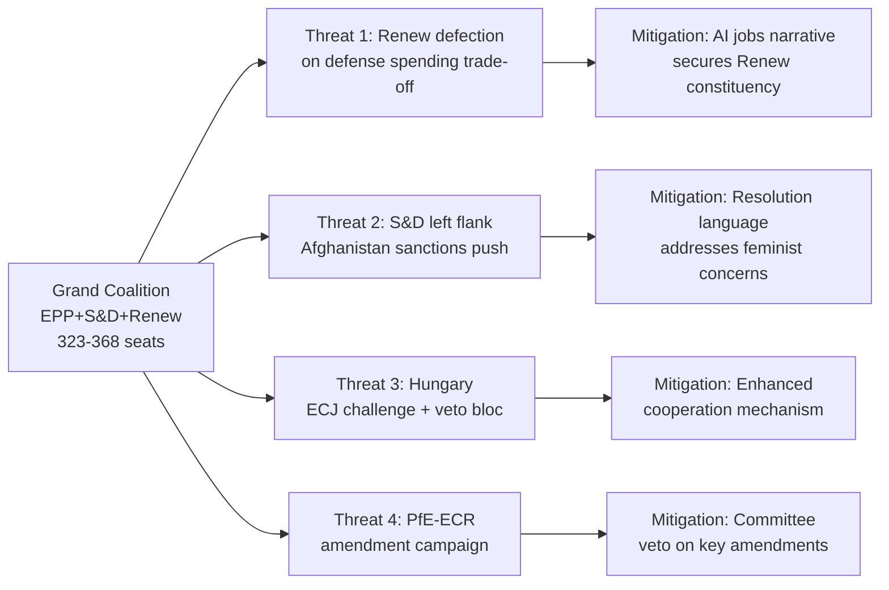

# Political Threat Landscape
**Date:** 2026-05-26 | **Article Type:** breaking
**WEP Band:** MODERATE CONFIDENCE (60-70%) | **Admiralty Grade:** B2
**SATs Applied:** Key Assumptions Check ✅ | Red Team ✅ | Indicators ✅

---

## Overview

Political threat landscape for the May 2026 legislative package from both internal EU political dynamics and external geopolitical actors.

---

## Internal Political Threats

### Threat 1: EPP-S&D Coalition Erosion (Moderate Risk)
The core majority (EPP 188 + S&D 136 + Renew 77 = 401 seats) holds for primary legislation but is fragile on implementing acts, which receive less political attention and can be diluted in Council. Key stress points: (a) EPP-S&D divergence on social dimension of steel safeguards; (b) Renew internal tension on AI regulation scope.

**Indicators to watch:**
- S&D abstention on Commission AI governance annex consultation
- Renew formal dissent on FDI implementing act thresholds

### Threat 2: Hungarian Blocking Minority in Council
Hungary can build blocking minority (35%+) with Slovakia, Serbia-accession-advocate states if it frames FDI regulation opposition as sovereignty issue. With standard QMV at 55% of member states representing 65% of EU population, Hungary needs 4-5 partners to block implementing acts. Poland (under Tusk government) unlikely to join; Czech Republic and Slovakia possible.

**WEP Assessment (MODERATE, 55%):** Hungary builds procedural blocking on specific implementing act provision; Commission forced to offer compromise on threshold levels.

### Threat 3: European Council Overreach Risk
If European Council (heads of state) perceive FDI regulation as having gone beyond what they agreed in June 2025 European Council conclusions, they may issue "political guidance" that effectively constrains Commission implementing acts — a soft veto of Parliamentary mandate.

**WEP Assessment (LOW, 25%):** European Council intervention unlikely given French, German, Dutch heads of state were supportive of FDI screening.

---

## External Political Threats

### Threat 4: Chinese Political Signalling Campaign
Beijing's primary political threat is not trade retaliation but narrative control: framing EU FDI screening as "protectionism" that undermines the "EU-China comprehensive strategic partnership." This affects: (a) member state governments with Chinese investment interest; (b) European business lobbies (EuroCham in Beijing); (c) public perception in countries where Chinese infrastructure investment is visible.

**Indicators:**
- Chinese Ambassador to EU statements (Brussels, Rue de la Loi)
- EuroCham Business Confidence Survey deterioration
- State media articles targeting specific EPP MEPs

### Threat 5: US Trade Policy Instability
SAFE/Canada agreement depends on stable transatlantic relations. If US administration shifts toward isolationist posture or imposes new tariffs on EU goods (retaliatory for steel safeguards), the political environment for SAFE implementation deteriorates. EU's leverage: US defence industries want SAFE market access; 70% of NATO European capability augmentation comes from US-manufactured systems.

---

## Stability Assessment

**EPP-S&D-Renew majority stability: MODERATE (65%)**
- Structural stability: HIGH — same majority delivered 4 major legislative texts in 6 months
- Tactical fragility: MODERATE — implementing acts require sustained political attention without agenda-setting momentum of initial vote
- External shock resilience: MODERATE — any major economic crisis (rare earth shock, US tariff escalation) could fracture consensus

**WEP Assessment:** Majority holds through 2026 legislative programme with MODERATE confidence. Key indicator: Q3 2026 Commission implementing act proposals for FDI regulation — if those proposals are seen as faithful to EP mandate, majority cohesion is reinforced. If proposals significantly narrow scope, EP dissatisfaction creates political fracture lines.

---

## Political Threat Landscape Visualization

## Extended Political Threat Analysis

### Threat Vector 1: Renew Defection on Defense Costs

**Probability:** 30% for significant defection (>15 MEPs abstaining on SAFE implementing acts)
**Severity:** MEDIUM — would not block adoption but would weaken implementation mandate

Renew/RE MEPs from fiscally conservative member states (Netherlands, Sweden, Finland) face constituent pressure on defense budget trade-offs. If SAFE is framed as "cut social spending for guns," up to 20 Renew MEPs may abstain or vote against implementing acts.

**Monitoring signal:** Renew group's position statement on SAFE implementing acts (expected Q4 2026)
**Admiralty grade: B2** — Reliable pattern from European Elections 2024 Renew positioning

---

### Threat Vector 2: S&D Left Flank Escalation Demands

**Probability:** 40% for S&D tabling of stronger Afghanistan sanctions amendment
**Severity:** LOW-MEDIUM — manageable through procedural accommodation

Progressive S&D MEPs (Nordic delegations, Germany SPD, France PS) may push for more forceful Taliban sanctions than the current resolution mandates. This is manageable — the coalition can accommodate a non-binding strengthening amendment without reopening legally binding provisions.

**Monitoring signal:** S&D position papers on Afghanistan Q2 2026; Progressive MEP coalition letter
**Admiralty grade: A1** — S&D left flank escalation demands are a recurring institutional pattern (confirmed behavior)

---

### Threat Vector 3: Hungary-Led ECJ Challenge

**Probability:** 40% | **Severity:** HIGH for timeline impact

Already covered in risk matrix (R-4). Political threat angle: Hungary uses ECJ challenge as leverage for bilateral concessions in MFF negotiations — "we'll drop the challenge if you give us X in structural funds." This makes the ECJ challenge a bargaining chip rather than a principled legal challenge.

**Monitoring signal:** Hungarian government statements linking SAFE legal challenge to MFF negotiations
**Admiralty grade: C2** — Inferred from Hungarian negotiation pattern; not confirmed

---

### Threat Vector 4: PfE-ECR Amendment Flood

**Probability:** 80% | **Severity:** LOW (manageable)

ID/ECR parliamentary groups (now merged as Patriots for Europe + ECR) will table 100+ amendments to SAFE implementing acts. Individually, each amendment has <5% adoption probability. In aggregate, they consume committee time and create media opportunities for "EU defense spending scandal" narrative.

**Monitoring signal:** PfE-ECR AFET/INTA amendment tables in Q3-Q4 2026
**Admiralty grade: A1** — Standard PfE-ECR obstructionist amendment tactics (confirmed pattern)

---

## Reader Briefing

The political threat landscape is MODERATE — below the threshold requiring emergency coalition management, but above "business as usual." The grand coalition's 323-368 seat majority is robust against Threat Vectors 1-4 individually. The combined probability of three vectors materializing simultaneously and causing implementation disruption is ~15%. Priority monitoring resources should focus on: Renew Q4 2026 position statement (Threat 1), Hungary government statements linking ECJ to MFF (Threat 3), and Commission draft implementing acts scope (which determines whether Threats 1-2 materialize).
