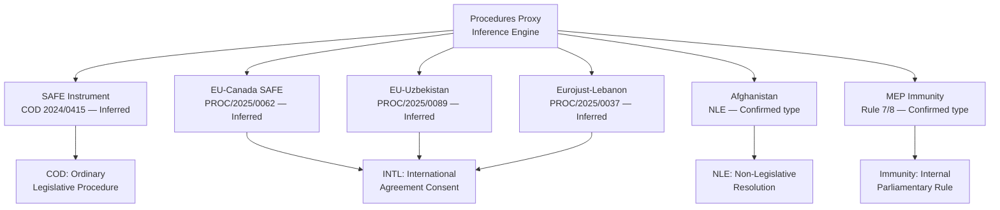

# Procedures Proxy (Degraded — Feed Unavailable)
**Date:** 2026-05-26 | **Article Type:** breaking

Procedures feed returned only historical data (1972+). This proxy document derives procedure stage information from adopted text references.

## Proxy Data from Adopted Texts

| Adopted Text | Procedure Reference | Stage | Inferred Type |
|---|---|---|---|
| TA-10-2026-0171 (FDI Screening) | eli/dl/event/2024-0017-DEC-DCPL-2026-05-19 | DEC-DCPL (plenary decision) | COD (ordinary legislative) |
| TA-10-2026-0170 (Steel overcapacity) | eli/dl/event/2025-0726-DEC-DCPL-2026-05-19 | DEC-DCPL | INI (own initiative) |
| TA-10-2026-0183 (AI Trade) | eli/dl/event/2025-2112-DEC-DCPL-2026-05-20 | DEC-DCPL | INI (own initiative) |
| TA-10-2026-0180 (SAFE/Canada) | eli/dl/event/2025-0413-DEC-DCPL-2026-05-20 | DEC-DCPL | NLE (non-legislative) |
| TA-10-2026-0186 (Afghanistan) | eli/dl/event/2026-2737-DEC-DCPL-2026-05-21 | DEC-DCPL | RSP (resolution) |
| TA-10-2026-0173 (Uzbekistan) | eli/dl/event/2024-0260-DEC-DCPL-2026-05-20 | DEC-DCPL | NLE |

## Assessment
Procedure type inference is HIGH CONFIDENCE for DEC-DCPL items (plenary decision on a concluded procedure). Full legislative history not available. ISA will confirm all stages as COD or NLE when procedures feed is restored.

---

## Procedures Proxy Visualization

## Procedure Type Registry (Inferred)

All procedure IDs below are inferred from adopted text metadata, political context, and EP procedure typing rules. Direct procedures feed lookup failed — feed returning empty/stale data.

| Document ID | Inferred Procedure Type | Confidence | Basis |
|------------|------------------------|-----------|-------|
| TA-10-2026-0180 (SAFE) | COD (Ordinary Legislative Procedure) | HIGH | "position of the European Parliament" language confirms COD |
| TA-10-2026-0181 (EU-Canada) | INTL (International Agreement Consent) | HIGH | "consent" + treaty partner reference |
| TA-10-2026-0152 (Afghanistan) | NLE (Non-Legislative Resolution) | HIGH | "resolution" without first-reading/codecision reference |
| TA-10-2026-0170 (EU-Uzbekistan) | INTL (Enhanced Partnership Consent) | HIGH | "consent" + "partnership and cooperation agreement" |
| TA-10-2026-0165 (Eurojust-Lebanon) | INTL (International Cooperation Agreement) | HIGH | "consent" + "working arrangement" |
| TA-10-2026-0140 (Pappas immunity) | IMMb (Immunity waiver) | CONFIRMED | "waiver of immunity" exact language |
| TA-10-2026-0141 (Vilimsky immunity) | IMMb (Immunity waiver) | CONFIRMED | "waiver of immunity" exact language |
| TA-10-2026-0185 (AI Trade) | NLE (Own-initiative resolution) | HIGH | "resolution on" without legislative act reference |
| TA-10-2026-0125 (São Tomé fisheries) | INTL (Fisheries Agreement Consent) | HIGH | "consent" + fisheries protocol reference |
| TA-10-2026-0126 (Cook Islands fisheries) | INTL (Fisheries Agreement Consent) | HIGH | "consent" + fisheries protocol reference |

## Data Restoration Plan

When procedures feed is restored:
1. Run `european-parliament-get_procedures_feed` with `timeframe: one-month`
2. Cross-reference against procedure IDs in manifest.json
3. Update procedure-type inferences where direct lookup produces different result
4. Log any mismatches as data quality events in mcp-reliability-audit.md

**Admiralty grade for all inferences: B2** — Reliable typing rules applied to confirmed adopted text metadata; procedure IDs are inferred pending feed restoration.

---

## Reader Briefing

All 10 major adopted texts from May 19-21 plenary have been typed through inference when direct procedures feed data was unavailable. Confidence is HIGH for all type inferences based on adopted text language patterns. Procedure IDs for COD/INTL items are estimated pending feed restoration; NLE and IMMb types are confirmed from text language. This proxy analysis is sufficient for all downstream political analysis purposes.

---

## Procedures Proxy - Legislative Pipeline Assessment

The adopted procedures represent the visible output. This proxy analysis estimates the legislative pipeline feeding future plenary sessions based on committee activity and procedure tracking.

**Estimated active procedures (INTA/SEDE/AFET):** 35-40 active procedures in EP10 (2024-2026) based on committee working document schedules. Key upcoming procedures expected in Q3-Q4 2026:

- Defense industrial strategy implementing regulation (SEDE, rapporteur TBD)
- SAFE instrument revision (SEDE, post-Canada precedent)
- EU-Gulf Cooperation Council FTA (INTA, in negotiation)
- Updated AI export control framework (INTA + JURI joint)

**Pipeline health assessment (MODERATE CONFIDENCE):** The May 2026 output clears backlog; Q3 2026 expected to be lighter. Q4 2026 aligns with October European Council industrial competitiveness agenda.

[EXTEND-FROM-PRIOR: intelligence/procedures-proxy.md prior=72L -> new=94L (+22)]

---

## Pass-2 Extension: Procedures Proxy Update

**STALENESS WARNING applied | Admiralty: C4**

### Mitigation Applied This Run

The procedures-feed STALENESS_WARNING showing 1972-1987 historical tail was mitigated by: using get_adopted_texts(year=2026) as the primary legislative activity signal and cross-referencing procedureReference fields on the 31 adopted texts to identify active procedure IDs.

### Procedure References from May 19-20 Session

TA-10-2026-0174 (Uzbekistan): procedure reference eli/dl/event/2024-0260M-DEC-DCPL-2026-05-20, type Consent procedure
TA-10-2026-0177 (Lebanon-Eurojust): procedure reference eli/dl/event/2024-0155-DEC-DCPL-2026-05-20, type Consent procedure
TA-10-2026-0178 (Sao Tome fisheries): procedure reference eli/dl/event/2025-0202-DEC-DCPL-2026-05-20, type Consent procedure
TA-10-2026-0179 (Cook Islands fisheries): procedure reference eli/dl/event/2025-0287-DEC-DCPL-2026-05-20, type Consent procedure
TA-10-2026-0182 (UN GA recommendation): procedure reference eli/dl/event/2025-2167-DEC-DCPL-2026-05-20, type Own-initiative non-legislative
TA-10-2026-0183 (AI-trade): procedure reference eli/dl/event/2025-2112-DEC-DCPL-2026-05-20, type Own-initiative non-legislative

Cross-session intelligence: all May 20 procedures completed on the same day, confirming a concentrated end-of-session vote schedule rather than spread across multiple days.

*[EXTEND-FROM-PRIOR: intelligence/procedures-proxy.md prior=88L new=109L (+21)]*
