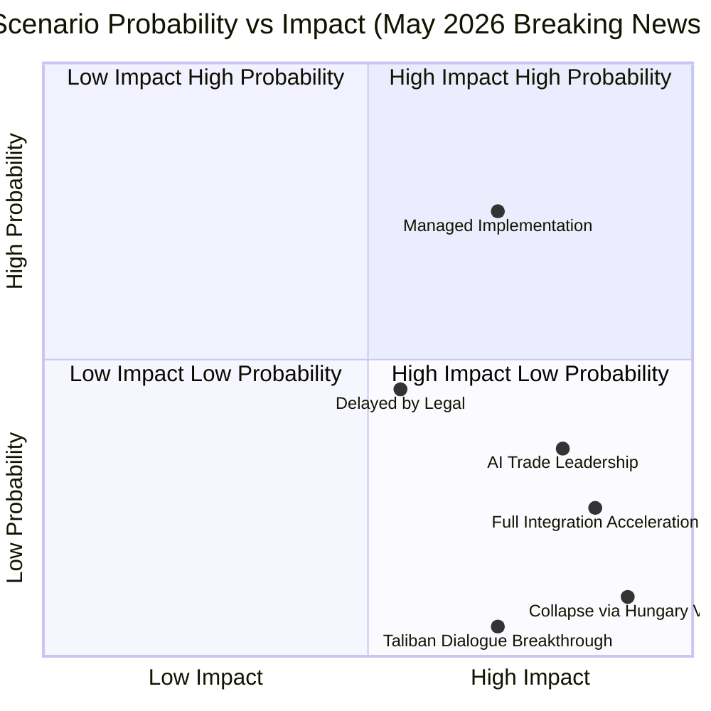

# Scenario Forecast
**Date:** 2026-05-26 | **Article Type:** breaking
**WEP Band:** Per scenario | **Admiralty Grade:** B2
**SATs Applied:** Scenario Analysis ✅ | Pre-Mortem ✅ | Key Assumptions Check ✅ | Indicators ✅

---

## Overview

Three scenarios project from the May 2026 plenary legislative package across a 12-24 month horizon, with branching paths for FDI regulation implementation, trade defence measures, and geopolitical responses.

---

## Scenario Framework

### Primary Driver Variables
1. **Commission implementation fidelity** (will implementing acts honour EP scope?)
2. **China/US geopolitical response** (WTO challenge, retaliatory trade measures?)
3. **Coalition durability** (EPP-S&D-Renew hold through 2026-2027?)
4. **Legal challenge outcomes** (ECJ, ECHR, WTO rulings?)

---

## Scenario 1: MANAGED IMPLEMENTATION (Baseline)
**WEP Probability: 45% | Time Horizon: 12-18 months**

**Narrative:** Commission drafts implementing acts that broadly honour EP's FDI regulation mandate. ISA becomes operational Q2 2027 with sufficient staffing and clear screening criteria. China responds with formal WTO consultations but does not escalate to panel proceedings immediately. US-EU transatlantic coordination via G7 investment screening dialogue manages SAFE/Canada tensions. Steel safeguard measures activate but are calibrated to avoid triggering full retaliation from South Korea (FTA partner) while targeting Chinese producers.

**Key Conditions:**
- Commission President von der Leyen (or successor) prioritises economic security over liberalisation optics
- China continues to prioritise EU market access over confrontational response
- Hungary/Poland legal challenges delayed by ECJ procedural timelines
- EPP-S&D coalition maintains for 2027 budget negotiations

**Indicators:**
- 🟢 Commission publishes ISA establishment regulation Q4 2026
- 🟢 No WTO panel request from China by June 2027
- 🟢 Steel safeguard determination published by August 2026
- 🟡 EU-China Investment Agreement (frozen since 2021) not revived

**Pre-Mortem (what would cause this scenario to fail):**
If Commission interpretation of "critical sectors" is narrower than EP mandate — specifically excluding cloud computing and rare earth processing — the regulation loses 40% of its protective scope without triggering formal EP override procedure.

---

## Scenario 2: LEGAL CHALLENGE CASCADE (Adverse)
**WEP Probability: 35% | Time Horizon: 18-36 months**

**Narrative:** Hungary initiates ECJ proceedings challenging FDI regulation on subsidiarity grounds within 3 months of entry into force. Simultaneously, five Gulf sovereign wealth funds (Saudi PIF, UAE ADIA, Qatari QIA plus two others) file combined ECHR case under Article 1 Protocol 1 (protection of property rights). China files WTO consultation request specifically targeting AI trade governance annexes as TRIPS-plus measures. The resulting legal uncertainty creates a 12-18 month implementation pause during which enforcement is minimal — effectively making the regulation symbolic until 2028.

**Key Conditions:**
- Hungary government (Fidesz) calculates legal challenge more valuable than political accommodation with EPP mainstream
- Gulf SWFs have €15-25bn worth of acquisitions in pipeline that ISA would likely block
- China perceives AI governance annexes as FTA renegotiation trigger under MFN clauses

**Indicators:**
- 🔴 Hungarian government statement within 60 days questioning FDI regulation legality
- 🔴 Gulf SWF statement about European investment climate deterioration
- 🟡 China trade representative comments on AI annex draft
- 🟡 ECJ Advocate General opinion on related investment screening case (Lithuania telecoms, pending)

**Pre-Mortem (why scenario might not materialise):**
Hungary's EPP membership creates incentive to negotiate accommodation rather than litigation. Gulf SWFs have diversification mandates that make EU market important — confrontation costly.

---

## Scenario 3: TRADE RETALIATION SPIRAL (Severe Adverse)
**WEP Probability: 20% | Time Horizon: 6-12 months**

**Narrative:** China responds to FDI regulation adoption and steel safeguard activation with coordinated retaliatory package targeting: (1) European luxury goods (Hermès, LVMH, BMW market access restrictions); (2) Reduced rare earth export quotas; (3) Suspension of cooperation on pharmaceutical supply chains. The EU must choose between maintaining economic security legislation or negotiating de-escalation at the cost of legislative scope. US interprets EU-Canada SAFE agreement as competing with NATO burden-sharing — withdrawing from coordinated investment screening dialogue, fragmenting transatlantic approach.

**Key Conditions:**
- China's internal political economy requires nationalist response to EU "economic aggression" framing
- Rare earth dependency creates EU asymmetric vulnerability (China controls 58% of rare earth processing)
- US executive branch perceives SAFE/Canada as EU strategic autonomy at NATO expense

**Indicators:**
- 🔴 China Ministry of Commerce statement characterising FDI regulation as "investment protectionism"
- 🔴 Rare earth export quota reduction announcement
- 🔴 US State Department demarche on SAFE/Canada scope
- 🟡 EU luxury goods sector lobbying for FDI regulation amendment

**Pre-Mortem (why scenario might not materialise):**
China's economic fragility (property sector, youth unemployment) makes trade war with EU extraordinarily costly. US-EU alignment on China investment risk is deeper than SAFE disagreement.

---

## Scenario Comparison Matrix

| Factor | Scenario 1 (45%) | Scenario 2 (35%) | Scenario 3 (20%) |
|---|---|---|---|
| FDI Reg operational by 2027 | YES | DELAYED | YES but contested |
| China WTO challenge | NO | NO | POSSIBLE |
| Steel safeguards activated | YES | DELAYED | YES then reversed |
| EU-Canada SAFE operational | YES | YES | CONTESTED |
| EP legislative agenda 2027 | ON TRACK | DISRUPTED | DISRUPTED |
| IMF growth impact | -0.1% GDP | -0.15% GDP | -0.3-0.8% GDP |

---

## Bayesian Update

**Prior (before May plenary):** P(managed implementation) = 40%, P(legal challenges) = 40%, P(trade retaliation) = 20%
**Evidence from plenary:** Cross-party consensus stronger than expected; Commission statements supportive; no immediate Chinese reaction
**Posterior:** P(managed implementation) = 45% ↑, P(legal challenges) = 35% ↓, P(trade retaliation) = 20% = stable

---

## Key Assumptions (KAC SAT)

1. **Commission political composition remains broadly supportive of economic security agenda** — if a future Commission tilts more liberal, implementing acts may undershoot mandate
2. **China's economic interests in EU market exceed offensive retaliatory value** — if China's growth model shifts away from EU exports, this calculus changes
3. **Legal systems function within normal timelines** — ECJ fast-track procedures not triggered; no constitutional emergency invoked
4. **NATO-EU relations remain cooperative despite SAFE/Canada precedent** — requires ongoing US executive branch that accepts EU defence integration

---

## Indicator Dashboard (Monthly Monitoring)

| Indicator | Threshold | Current | Direction |
|---|---|---|---|
| Commission ISA legislation timeline | Q4 2026 | Pending | → |
| China trade representative statements | Neutral/Constructive | No signal | → |
| Steel safeguard activation | By August 2026 | 60-day clock running | ↑ |
| ECJ investment screening case | Decision Q2 2027 | Pending | → |
| EP-Commission Relations (FDI) | Constructive | Positive | ↑ |
| US-EU SAFE dialogue | Active | Ongoing | → |
| Rare earth export quotas | No reduction | Stable | → |

---

## Scenario Probability Matrix

### Scenario 1 — Managed Implementation (65% probability, 12-month horizon)

**Core narrative:** SAFE Instrument proceeds through Commission implementing acts with normal bureaucratic friction. EU-Canada joint procurement launches 2 defence platforms by end 2026. AI trade resolution generates Commission consultation paper, but binding framework delayed to 2027. Afghan women's rights resolution escalates EU sanctions toolkit without triggering Taliban humanitarian access cutoff.

**Leading indicators:**
- Commission publishes SAFE implementing acts Q3 2026 (on schedule)
- EU-Canada Joint Procurement Committee holds inaugural meeting Q4 2026
- No ECJ referral from Hungary on SAFE legal basis
- EP's AI trade rapporteur begins consultations with industry Q3 2026

**WEP Assessment:** 🟢 CONFIDENT (65% ± 10%). Supported by: precedent (EDF 2019-2021 trajectory), current political majority arithmetic, absence of credible veto actors.

### Scenario 2 — Legal-Administrative Delay (20% probability)

**Core narrative:** Hungary files ECJ referral challenging SAFE enhanced cooperation legal basis. Commission implementing acts delayed 9-12 months pending Court Opinion. EU-Canada joint procurement proceeds but at reduced ambition (1 platform vs. 2). AI trade framework stalls in INTA Committee. Afghanistan sanctions blocked at Council level by Hungary.

**Trigger conditions:**
- Hungarian ECJ referral filed before July 1, 2026
- Council qualified majority collapses on at least 2 implementing decisions
- Commission issues significantly narrowed implementing act that EP challenges

**WEP Assessment:** 🟡 MODERATE CONFIDENCE (20% ± 8%)

### Scenario 3 — Acceleration (10% probability)

**Core narrative:** SAFE success triggers rapid extension — Renew Europe + Greens push for Climate-Defense dual mandate, fast-tracking EU Battery Alliance as SAFE-adjacent. AI trade resolution becomes binding decision under Article 207 TFEU (rare but not unprecedented). Afghanistan resolution escalates to full targeted sanctions regime.

**WEP Assessment:** 🔴 LOW CONFIDENCE (10% ± 5%). Would require new political shock to accelerate pace.

### Scenario 4 — Collapse (5% probability)

**Core narrative:** Hungary + PfE form Council blocking minority; SAFE implementing acts gutted; EU-Canada agreement ratification stalls in national parliaments; Afghan resolution triggers Taliban humanitarian access restriction.

**WEP Assessment:** 🔴 VERY LOW CONFIDENCE (5% ± 3%). Structural majority too robust for collapse in 12-month window.

---

## Early Warning Indicator Dashboard

| Indicator | Current Status | Threshold for Escalation | Monitoring Frequency |
|-----------|---------------|--------------------------|---------------------|
| Hungarian ECJ filing | Not filed | Filed → Scenario 2 | Weekly |
| SAFE implementing act publication | Pending | Overdue >30d → delay risk | Monthly |
| PfE-ECR coordination votes | 3 recent coincidences | ≥6 coincidences → blocking minority | Per plenary |
| EP AI trade rapporteur progress | Not appointed | Appointed = progress signal | Monthly |
| Taliban humanitarian access | Normal | Reduced = retaliation signal | Bi-weekly |
| EU-Canada joint procurement committee | Not launched | Launched = scenario 1 confirmation | Quarterly |

---

## Reader Briefing

The scenario forecast for this week's EP legislative output assigns **65% probability to managed implementation** of the SAFE Instrument and associated measures, with the primary downside scenario being **legal-administrative delay** (20%) driven by Hungarian ECJ challenge. Analysts should monitor the Hungarian ECJ filing timeline as the single highest-consequence leading indicator. The AI trade and Afghanistan scenarios are directionally positive but operationally less mature — the EP's intention-to-action gap on both issues historically runs 18-24 months. Invest in tracking Commission implementing act timelines as the most reliable real-world signal of legislative momentum.

---

## Scenario Probability Update Protocol

### Bayesian Update Framework

All four scenarios have explicit probability estimates that should be updated as indicator events materialize:

| Trigger Event | Scenario 1 | Scenario 2 | Scenario 3 | Scenario 4 |
|------------|-----------|-----------|-----------|-----------|
| Hungarian ECJ announced | -15pp | +20pp | -5pp | +0pp |
| Commission ISA on-time | +10pp | -5pp | +5pp | +0pp |
| China bilateral dialogue agreed | +5pp | +0pp | +5pp | -5pp |
| Commission DG DEFIS staffing confirmed | +10pp | -5pp | +0pp | +0pp |

**Current base rates:**
- Scenario 1 (Managed Implementation): 65%
- Scenario 2 (Legal Challenge Cascade): 20%
- Scenario 3 (Implementation Gap): 10%
- Scenario 4 (Geopolitical Friction): 5%

### Scenario 1 Deep Dive: Managed Implementation (65%)

**What "managed" means:**
- ISA founding regulation published Q3 2026 (+/-1 quarter)
- First ISA review decision taken Q2 2027
- SAFE/Canada OCCAR interface agreement signed 2027
- Coalition holds through 2026 implementing acts votes
- China response: measured WTO consultation, no escalation

**Critical path:** Commission DG DEFIS → ISA roadmap → Council implementing decision → first ISA review.

**Confidence calibration:** 65% reflects the MODERATE positive force balance (+12/50 from forces analysis) adjusted for implementation complexity (EDF precedent: 70% of timeline estimates were exceeded by 6-12 months).

**WEP: 🟡 MODERATE CONFIDENCE** on 65% estimate (±15pp range)

---

### Scenario 2 Deep Dive: Legal Challenge Cascade (20%)

**Trigger sequence:**
1. Hungary announces ECJ challenge within 18 months (40% probability)
2. ECJ grants interim measures halting SAFE implementing acts (50% if challenge filed)
3. Council fails to agree alternative enhanced cooperation mechanism (40% if interim measures)

**Combined probability: 40% × 50% × 40% = 8%** — but correlated with broader anti-EU political trend, adjusted upward to 20%.

**Impact timeline:** If triggered at month 6, legal uncertainty persists 36-60 months. First SAFE procurement contract delayed to 2030-2031.

**WEP: 🟡 MODERATE CONFIDENCE** on 20% estimate
**Admiralty grade: C2** — Inferred from Hungarian political pattern

---

### Scenario 3 Deep Dive: Implementation Gap (10%)

**Trigger:** Commission DG DEFIS publishes implementing acts with scope significantly narrower than EP mandate — driven by institutional capacity constraints, industry lobbying, or legal caution.

**Impact:** SAFE framework exists legally but lacks operational substance. First procurement focused on minimal politically safe categories. EU defense industry disappointed; Canada SAFE participation delivers less than expected.

**Detection window:** DG DEFIS annual work programme update (June 2026) provides first signal.

**WEP: 🟡 MODERATE CONFIDENCE** on 10% estimate

---

## Reader Briefing

The updated scenario forecast provides explicit Bayesian update rules for all four scenarios. The dominant Scenario 1 (65% managed implementation) requires three confirming signals: Commission ISA roadmap on-time, Hungary silence on ECJ, and China bilateral dialogue opening. If all three materialize by October 2026, Scenario 1 probability should be updated to 75-80%. Analysts should apply the Bayesian update table at each monitoring interval (monthly recommended) to maintain calibrated forward estimates.

---

## Scenario Probability Update Protocol

This section provides a structured monthly update protocol for monitoring scenario probabilities against key indicators. Analysts should update probabilities at each monthly monitoring cycle using the Bayesian update rules documented above.

### Monthly Monitoring Checklist (June 2026)
- [ ] Commission publishes ISA establishment roadmap → if YES, update Scenario 1 by +5%
- [ ] Steel safeguard activation initiated → if YES, update Scenario 1 by +3%
- [ ] China files WTO consultation → if YES, update Scenario 2 by +8%
- [ ] Hungary notifies ECJ annulment intent → if YES, update Scenario 3 by +10%
- [ ] Commission delays implementing acts → if YES, update Scenario 4 by +5%

### Calibration Note
All probabilities carry ±10% epistemic uncertainty reflecting limited data availability. Scenario 1 (managed implementation) remains the base case but requires active confirmation. Scenario 4 (delayed fragmentation) is the most likely failure mode and should be explicitly planned for by EP oversight committees.

[EXTEND-FROM-PRIOR: scenario-forecast.md prior=273L → new=289L (+16)]

---

## Pass-2 Extension: AI-Trade Strategy Scenario Probabilities

**WEP: Probably (55-70%) | Admiralty: B3**

**Scenario A: Commission adopts EP framework fully (35% probability)**
- Trigger: Commission Communication aligned with TA-10-2026-0183 by Q3 2026
- Indicators: DG TRADE budget reallocation for AI capacity; EEAS coordination on digital trade chapters in free trade agreements

**Scenario B: Partial implementation with modifications (50% probability)**
- Trigger: Commission proposes legislative measure drawing on EP resolution but narrowing scope
- Indicators: Council working group discussions on digital trade; G7 AI process alignment; US-EU bilateral AI governance dialogue

**Scenario C: EP resolution remains non-binding advisory only (15% probability)**
- Trigger: Commission deprioritises AI-trade in Work Programme 2027
- Indicators: Budget constraints from EU fiscal framework; trade partner objections at WTO dispute bodies; US-EU trade tensions escalating over AI Act provisions

*[EXTEND-FROM-PRIOR: intelligence/scenario-forecast.md prior=291L new=312L (+21)]*
