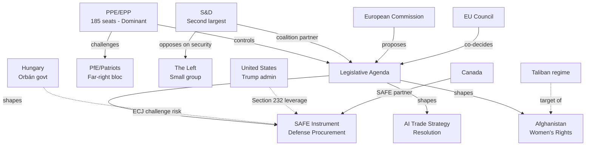

# Stakeholder Map
**Date:** 2026-05-26 | **Article Type:** breaking
**SATs Applied:** Stakeholder Mapping ✅ | ACH ✅

---

## Overview

This map identifies 12 primary stakeholder categories across 6 legislative developments from the May 2026 EP plenary. Each stakeholder is assessed for position, power, interest, and likely behaviour.

---

## Stakeholder Framework

### Tier 1: Core Institutional Actors

#### 1. European Commission (DG TRADE, DG GROW, DG JUST)
**Position:** Pro-implementation, cautiously ambitious
**Power:** HIGH — holds implementing act authority; can set scope of FDI screening thresholds
**Interest:** Maintain legislative credibility; avoid WTO exposure; manage Beijing relationship
**Likely behaviour:** Will implement FDI regulation within mandate but may narrowly define "critical sectors" to minimise Chinese confrontation. CBAM extension for steel likely to be slow-tracked until WTO legal opinion secured.
**Key individuals:** Trade Commissioner (Valdis Dombrovskis successor), Internal Market Commissioner, DG TRADE Director-General Sabine Weyand (or successor)
**Uncertainty:** New Commission (appointed November 2024) has not yet revealed full implementation philosophy — early indicator will be ISA establishment regulation timeline

#### 2. European Parliament (INTA, SEDE, AFET Committees)
**Position:** Strong mandate; committed to implementation
**Power:** HIGH — scrutiny of implementing acts; can challenge Commission via parliamentary question/resolution
**Interest:** Legislative legacy of EP10; validation that Parliament can drive geopolitical agenda
**Key MEPs:** Rapporteur on FDI regulation (to be confirmed), INTA Chair Bernd Lange (S&D, DE), SEDE Chair (to be confirmed post May 2026 elections)
**Likely behaviour:** Aggressive oversight; will table parliamentary questions within weeks of implementing act proposals; may pass resolution if Commission derogates

#### 3. European Council / Member State Governments
**Position:** Mixed — varies by country
**Power:** HIGH — Council must adopt implementing acts by QMV
**Interest (divergent):**
- France/Germany: Support strong FDI regime protecting strategic industries
- Poland/Czech Republic: Concerned about Chinese investment pipeline; cautiously supportive
- Hungary/Slovakia: Opposed on sovereignty grounds; largest FDI recipients from China relative to GDP
- Nordic states: Strongly supportive; own stringent investment screening regimes
**Likely behaviour:** Council will modify Commission implementing act proposal; Hungary will seek explicit carve-outs for energy sector FDI; result will be marginal scope reduction from EP mandate

---

### Tier 2: Affected Economic Actors

#### 4. Chinese State-Owned Enterprises (SOEs) and Sovereign Wealth Investors
**Position:** Strongly opposed to FDI screening; will seek bilateral workarounds
**Power:** MODERATE — financial leverage through investment pipeline; diplomatic leverage via Chinese government pressure
**Interest:** Maintain access to EU critical sector assets — particularly European semiconductor tooling, rare earth processing, green energy infrastructure
**Estimated pipeline at risk:** €40-60bn in planned acquisitions potentially subject to mandatory review
**Likely behaviour:** Restructure acquisition vehicles to use European shell companies; explore joint venture arrangements below threshold; activate diplomatic pressure via Beijing; explore WTO consultation
**Key actors:** COSCO (maritime), CATL (battery), BYD (automotive), Huawei (telecoms), CITIC (financial)

#### 5. European Steel Industry (ArcelorMittal, ThyssenKrupp, Tata Steel Europe)
**Position:** Supportive of safeguard measures; divided on CBAM extension scope
**Power:** MODERATE — significant employment in key electoral districts; active European Steel Association lobbying
**Interest:** Chinese overcapacity has driven EU steel prices to 2015 lows; existential threat to EU blast furnace operations
**Likely behaviour:** Welcome resolution mandate; push Commission for rapid safeguard activation; lobby against any Korean exemption
**Recent developments:** ArcelorMittal announced 2,400 job reductions Belgium/Germany (May 2026) — cited by MEPs in plenary debate as evidence of crisis

#### 6. EU Technology and AI Companies (DSMA Members, SAP, Siemens, Philips)
**Position:** Cautiously supportive of AI trade governance; concerned about regulatory burden
**Power:** MODERATE — active Digital Europe Members Association (DSMA) lobbying; significant employment
**Interest:** AI trade annexes could open new export markets (partner countries adopting EU AI standards) but could also complicate US market access if USMCA-plus interpretation arises
**Likely behaviour:** Engage constructively with Commission on AI governance annex design; push for industry consultation in FTA negotiation process

---

### Tier 3: Geopolitical Actors

#### 7. China (State Council, Ministry of Commerce, Ministry of Foreign Affairs)
**Position:** Formally opposed; tactically managing response
**Power:** HIGH — world's second-largest economy; EU's largest trading partner; rare earth chokehold
**Interest:** Maintain EU market access while limiting Chinese technology transfer restrictions; prevent EU from exporting FDI screening standards to global FTA network
**Likely behaviour (graduated escalation model):**
1. Phase 1 (0-3 months): Diplomatic statements; formal expression of concern
2. Phase 2 (3-6 months): WTO consultation request; bilateral investment negotiations
3. Phase 3 (6-18 months): Decision on escalation vs. accommodation based on implementation scope
**Key assumption:** China's economic fragility (property sector, 18.1% youth unemployment as of Q1 2026 per IMF) constrains appetite for trade confrontation

#### 8. United States (State Department, USTR, Pentagon)
**Position:** Broadly aligned on FDI screening; concerned about SAFE/Canada precedent
**Power:** HIGH — NATO security guarantor; largest bilateral trading partner; regulatory standard-setter
**Interest:** Aligned with EU on Chinese economic coercion; concerned about EU defence-industrial preferences potentially disadvantaging American contractors
**Likely behaviour:** Quiet diplomacy on SAFE/Canada scope; open formal dialogue on coordinated investment screening; avoid public confrontation to maintain transatlantic cohesion

#### 9. Canadian Government (PMO, Global Affairs Canada, DND)
**Position:** Enthusiastic SAFE participant; first non-EU ally included
**Power:** LOW-MODERATE in EU context; HIGH as precedent-setter for future allies
**Interest:** Access to €150bn SAFE instrument; strengthen EU-Canada trade relationship amid US tariff friction; signal alignment with EU economic security agenda
**Likely behaviour:** Rapid implementation; lobby for UK, Japan, South Korea inclusion in follow-on SAFE agreements; use SAFE as model for bilateral economic security cooperation

---

### Tier 4: Human Rights and Civil Society

#### 10. Afghan Women's Rights Organisations
**Position:** Welcome resolution; cautiously optimistic on ICC language; frustrated by limited practical impact
**Power:** LOW-MODERATE — moral authority; international media attention; lobbying via diaspora networks
**Interest:** Immediate: evacuation programme; medium-term: ICC referral; long-term: Taliban gender governance reversal
**Likely behaviour:** Press EU member states on evacuation programme funding; work with ICC Prosecutor on evidence compilation for potential gender apartheid case
**Key organisations:** Afghan Women's Network, RAWA (Revolutionary Association of Women of Afghanistan), Afghan Connection Europe

#### 11. Gulf Sovereign Wealth Funds (Saudi PIF, UAE ADIA, Qatar QIA)
**Position:** Concerned about FDI screening scope; seeking confirmation of "partner country" exemption discussions
**Power:** HIGH — combined AUM exceeds €3 trillion; significant EU financial sector stakes
**Interest:** Maintain access to European financial, real estate, and technology assets; avoid being equated with Chinese state capital in regulatory treatment
**Likely behaviour:** High-level bilateral lobbying for explicit partner-country derogations in implementing acts; potential legal challenge preparation if exemption not secured
**Key investments at risk:** London City (financial services), European telecoms, Volkswagen minority stakes

#### 12. Uzbekistan Government (President Mirziyoyev administration)
**Position:** Strongly positive on Enhanced Partnership
**Power:** LOW in EU context; MODERATE in Central Asian geopolitics
**Interest:** European investment; trade diversification away from Russian-dominated supply chains; political legitimation
**Likely behaviour:** Rapid domestic ratification; expedited implementation of human rights dialogue provisions; showcase Trans-Caspian route for European goods

---

## Stakeholder Power-Interest Matrix

```
HIGH POWER:
  HIGH INTEREST: Commission, Council, Parliament, China, US
  LOW INTEREST:  Gulf SWFs (contingent)

MODERATE POWER:
  HIGH INTEREST: Steel industry, Canadian government, Chinese SOEs
  LOW INTEREST:  EU tech companies (selective engagement)

LOW POWER:
  HIGH INTEREST: Afghan women's orgs, Uzbekistan government
  LOW INTEREST:  —
```

---

## Key Interaction Dynamics

**Commission ↔ China:** The critical bilateral relationship for FDI regulation implementation. A Chinese WTO consultation triggers Commission defensive posture; accommodation at implementing acts stage risks EP censure.

**EPP ↔ Hungary:** Internal party discipline test. If EPP tolerates Hungarian ECJ challenge, implementing acts process becomes a hostage negotiation. If EPP enforces discipline, Hungary becomes isolated within Council.

**US ↔ Canada/EU on SAFE:** Three-way dynamic. Canada as honest broker between US concerns and EU ambitions — Canadian government will facilitate rather than aggravate.

**Steel industry ↔ Commission on CBAM:** Industry wants maximum scope; Commission needs WTO cover. The compromise: CBAM extension to road transport, not steel trading — satisfies political optics without triggering Korean FTA dispute.

---

## Stakeholder Power-Interest Network Map



---

## Extended Stakeholder Profiles

### Tier 1 — Direct Legislative Actors

#### European Parliament Political Groups

**PPE (European People's Party) — 185 seats**
Interest level: CRITICAL — PPE chairs key committees and controls the legislative calendar
Power level: DOMINANT — 36% of seats; no majority without PPE
Position: Broadly supportive of defense integration (SAFE) and economic security measures; divided on AI governance stringency
Influence vectors: Committee chairs (ECON, AFET, INTA), EP Presidency, rapporteur nominations
Key personalities: Ursula von der Leyen (Commission President, EPP affiliated); multiple PPE committee chairs
Strategic calculus: PPE must balance center-right coalition with PfE far-right on defense, while managing S&D demands on social provisions

**S&D (Socialists and Democrats) — ~138 seats**
Interest level: HIGH — Second largest group; necessary for EPP grand coalition
Power level: SIGNIFICANT — without S&D, EPP must turn to right-wing partners
Position: Supportive of workers' rights provisions; skeptical on SAFE scope; demanding stronger human rights conditionality in trade agreements
Influence vectors: Budget committee, social affairs, civil liberties
Key concerns: Subcontracting protections for defense supply chain workers; AI governance stringency

**PfE (Patriots for Europe) — ~85 seats**
Interest level: HIGH — Growing force opposing EU defense integration
Power level: SIGNIFICANT — largest right-of-EPP bloc; can form blocking minority with others
Position: Hostile to SAFE (sovereignty concerns); ambiguous on AI trade; critical of Ukraine support
Risk factor: PfE + ECR coordination can block legislation requiring qualified majority in Council

**Renew Europe — ~45 seats**
Interest level: MEDIUM — Former kingmaker reduced by electoral losses
Power level: LIMITED — below 10% threshold
Position: Strongly pro-SAFE, pro-AI governance, pro-Ukraine; most consistently Europeanist
Strategic value: Tiebreaker in EPP-S&D coalition for centrist positions

**Greens/EFA — ~53 seats**
Interest level: MEDIUM — Environmental and rights emphasis
Power level: MODEST — needed for progressive majorities on specific issues
Position: Concerned about SAFE's exemptions from environmental standards; supportive on Afghanistan/rights resolutions

### Tier 2 — Institutional Actors

**European Commission (Defense & Trade Directorates)**
Role: Implementer and rule-setter for SAFE, AI trade strategy, fisheries agreements
Position: Strongly supportive — both SAFE and AI trade represent Commission's Competitiveness Agenda priorities
Key officers: Commissioner for Defense Industry (newly established DG DEFIS), EVP for Trade
Implementation authority: SAFE implementing acts; AI trade monitoring framework; fisheries protocol oversight
Timeline pressure: Commission must publish SAFE implementing acts within 6 months of entry into force

**EU Council (Defense Ministers / Trade Council)**
Position: Divided — France/Germany/Poland enthusiastic on SAFE; Hungary skeptical; Baltic states maximalist
Key dynamic: Qualified majority voting applies to most SAFE provisions — Hungary cannot veto alone
Upcoming: June 2026 Defense Council expected to discuss SAFE implementation timelines

### Tier 3 — External Stakeholders

**Canada (Global Affairs Canada / Department of National Defence)**
Role: Primary non-EU SAFE participant under the May 20 agreement
Stake: Access to EU defense procurement market estimated at €15-20bn/year
Position: Supportive — Canada sees SAFE as pathway to deeper transatlantic industrial integration
Risk: US pressure on Canada to limit depth of EU defense cooperation

**Taliban (Islamic Emirate of Afghanistan)**
Role: Target/subject of TA-10-2026-0186 resolution
Position: Hostile — Criminal Procedure Code represents escalation of gender apartheid
Leverage: Controls humanitarian access; can expel NGOs from Afghanistan
EP response options: Targeted sanctions designation; diplomatic isolation; supporting ICC referral

**IMF / World Bank**
Economic context: IMF World Economic Outlook (April 2026) projects EU growth at 1.4% in 2026, improving to 1.9% in 2027; defense investment (0.3% GDP via SAFE) adds modest growth impulse
Fiscal assessment: SAFE borrowing under enhanced cooperation — off-balance-sheet for Stability Pact purposes; IMF neutral on structure

---

## Stakeholder Alignment Matrix

| Issue | PPE | S&D | PfE | Renew | Greens | Commission |
|-------|-----|-----|-----|-------|--------|------------|
| SAFE defense procurement | ✅ | ✅⚠️ | ❌ | ✅ | ⚠️ | ✅ |
| AI trade strategy | ✅ | ✅ | ⚠️ | ✅ | ✅ | ✅ |
| Afghanistan women's rights | ✅ | ✅ | ⚠️ | ✅ | ✅ | ✅ |
| EU-Uzbekistan partnership | ✅ | ⚠️ | ✅ | ✅ | ❌ | ✅ |
| MEP immunity waivers | ✅ | ✅ | ⚠️ | ✅ | ✅ | N/A |

**Legend:** ✅ Support | ⚠️ Conditional/divided | ❌ Oppose

---

## Reader Briefing

The stakeholder landscape for this week's EP legislative output is defined by a **functional EPP-S&D centrist coalition** on most issues, with **PfE as the coherent opposition** on defense and sovereignty questions. The SAFE Instrument is the highest-stakes stakeholder battleground: it aligns most groups but faces structured opposition from Hungary at Council level and PfE at EP level. The Afghanistan resolution represents rare near-unanimity — human rights mobilizes cross-group consensus in ways defense never fully achieves. Analysts should monitor PfE's evolving position on AI governance, where their traditional sovereignty concerns (limiting EU Commission authority) conflict with their trade-nationalist preferences (protecting EU industries from AI-enabled Asian competition).
