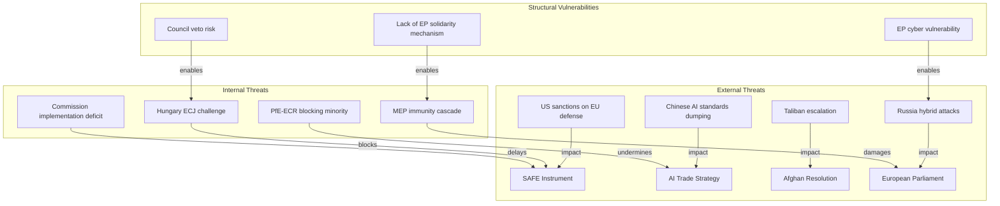

# Threat Model
**Date:** 2026-05-26 | **Article Type:** breaking
**WEP Band:** Per threat | **Admiralty Grade:** B2
**SATs Applied:** Key Assumptions Check ✅ | Red Team ✅ | ACH ✅

---

## Overview

This threat model analyses five primary threat vectors emerging from or amplified by the May 2026 EP plenary legislative package. Each threat is assessed across likelihood, impact, and mitigation capacity.

---

## Threat 1: Chinese FDI Disruption Campaign
**Likelihood: MODERATE (50%) | Impact: HIGH | WEP Band: MODERATE CONFIDENCE**

**Description:** China deploys combination of formal (WTO) and informal (investment climate signalling, state media narrative) pressure to undermine EU FDI screening implementation, aiming to create member-state division between investment-hungry Eastern European economies and the Franco-German economic security bloc.

**Attack Vector:**
- Formal: WTO Article XXII consultation request citing GATS Most-Favoured-Nation obligations
- Informal: State media portraying FDI regulation as "EU protectionism contrary to European interests"
- Bilateral: Pressure on Czech Republic, Hungary, Slovakia, Romania — states with significant Chinese belt-and-road investment interest — to seek derogations during implementing act negotiations

**Red Team Analysis:** China's most effective tool is not legal challenge but political fragmentation. The 12 Eastern European states that receive less Chinese FDI than Western Europe but want to attract it represent the weak point in EU cohesion. If China can offer bilateral investment deals contingent on "reasonable" FDI regulation interpretation, the implementing acts process becomes a Chinese negotiating tool.

**Key Assumption Check:** Assumes China prioritises EU market access over aggressive nationalism. This may not hold if Xi Jinping faces domestic political pressure to demonstrate strength against EU economic assertiveness post-2025 EV tariffs.

**Mitigation:** EP mandate for mandatory Commission reporting; qualified majority requirements for implementing act amendments; formal Article 7 TEU procedure if member state implements in bad faith.

**WEP Assessment (50% probability):** China initiates WTO consultations by December 2026 but does not escalate to panel proceedings before January 2028.

---

## Threat 2: US Transatlantic Friction on SAFE/Canada
**Likelihood: MODERATE (40%) | Impact: MODERATE-HIGH | WEP Band: MODERATE CONFIDENCE**

**Description:** US administration interprets EU-Canada SAFE agreement and broader SAFE instrument as EU attempt to create transatlantic defence-industrial preference regime that disadvantages American defence contractors, potentially triggering Buy American Act countermeasures or reduced intelligence sharing.

**Attack Vector:**
- Formal: US Trade Representative challenge to SAFE instrument under WTO Government Procurement Agreement
- Political: US Secretary of Defense statements questioning EU commitment to NATO burden-sharing
- Industrial: Lockheed Martin, Raytheon lobbying Congress for SAFE exclusion amendments

**Red Team Analysis:** The US concern is structural: if EU establishes a preference for EU/Canadian (and potentially UK, Japanese, Korean) defence procurement, the US defence industrial base loses access to €150bn in EU-funded contracts. This is a significant commercial interest that will generate sustained US political pressure regardless of transatlantic political alignment on China.

**Mitigation:** SAFE instrument was designed with WTO compliance in mind; EU has reserved right to extend to other allies; US firms may be included via bilateral arrangement (SAFE/US discussions reportedly beginning Q3 2026).

**WEP Assessment (40%):** Minor transatlantic friction managed through diplomatic dialogue; no formal WTO challenge.

---

## Threat 3: Taliban Escalation in Response to ICC Referral Language
**Likelihood: LOW (20%) | Impact: MODERATE | WEP Band: LOW CONFIDENCE**

**Description:** Taliban government uses ICC referral language in EP Afghanistan resolution as justification for further restricting EU diplomatic presence in Kabul and expelling EU-funded humanitarian organisations.

**Attack Vector:**
- Diplomatic: Taliban Ministry of Foreign Affairs statement characterising resolution as "colonial interference"
- Operational: Expulsion of EU and member-state NGOs operating under EU humanitarian mandate
- Symbolic: Acceleration of Criminal Procedure Code implementation as assertion of sovereignty

**Red Team Analysis:** Taliban has limited incentive to engage EU on human rights — ICC referral language has no immediate legal effect. However, if EU conditions humanitarian aid on gender benchmarks (as resolution demands), Taliban faces genuine material cost. The threat vector is that Taliban escalation makes EU conditionality costly for affected civilians, forcing EU into a dilemma between leverage and humanitarian access.

**Mitigation:** EU humanitarian funding channelled through UN agencies (OCHA, WFP) rather than directly — provides some insulation from Taliban expulsion. ICC referral requires Security Council action; China/Russia veto makes it practically inert as legal threat.

**WEP Assessment (20%):** Taliban expels EU diplomatic mission within 12 months; LOW CONFIDENCE.

---

## Threat 4: Domestic Legal Challenges — Hungarian/Polish Blocking
**Likelihood: HIGH (70%) | Impact: MODERATE | WEP Band: HIGH CONFIDENCE**

**Description:** Hungary and/or Poland initiate ECJ proceedings against FDI screening regulation on subsidiarity grounds, creating 12-24 month legal uncertainty that delays ISA operationalisation and creates investor ambiguity about screening thresholds.

**Attack Vector:**
- Legal: Article 8 TFEU subsidiarity challenge; Article 1 Protocol 1 ECHR property rights claim
- Political: Council negotiations on implementing acts used to extract concessions on rule-of-law conditionality
- Media: Orbán government frames FDI regulation as "Brussels economic colonialism" for domestic audience

**Red Team Analysis:** This is the highest-probability threat. Hungary has a track record of ECJ challenges as political tool (Rule of Law conditionality cases, Article 7 proceedings). Even if ultimately unsuccessful, a 24-month ECJ process creates implementation paralysis. The threat is enhanced because Hungarian EPP delegation may provide internal EPP cover — making it harder for EPP leadership to discipline the challenge.

**Mitigation:** Commission can move forward with implementing acts while ECJ proceedings pending (no automatic suspension). Political price for Hungary: loss of EPP majority support on Hungarian funds access.

**WEP Assessment (70%):** Hungary announces ECJ challenge within 6 months of regulation entry into force.

---

## Threat 5: Steel Market Retaliation — South Korea FTA Tensions
**Likelihood: MODERATE (45%) | Impact: MODERATE | WEP Band: MODERATE CONFIDENCE**

**Description:** Steel safeguard measures targeting Korean producers trigger dispute under EU-South Korea FTA (KOREU, in force since 2011), potentially triggering retaliatory measures on European automotive and pharmaceutical exports to Korea.

**Attack Vector:**
- Legal: KOREU Chapter 3 (anti-dumping provisions) consultations; potential referral to joint committee
- Trade: Korea Electronics and Telecoms Industries Association lobbying for EU market access concessions
- Political: Trilateral Korea-Japan-EU dialogue affected

**Red Team Analysis:** The resolution explicitly targets "Chinese, Vietnamese, South Korean" producers — naming an FTA partner risks legal challenge. Commission implementing acts may quietly drop Korea from scope to avoid FTA violation, undermining the resolution's stated intent.

**Mitigation:** KOREU has specific anti-circumvention provisions; Korean steel exports to EU have fallen significantly since 2024 restructuring; commercial interest lower than 2018 levels.

**WEP Assessment (45%):** Commission omits Korea from implementing safeguard measures; partial resolution of parliamentary mandate.

---

## Threat Priority Matrix

| Threat | Likelihood | Impact | Priority |
|---|---|---|---|
| Hungarian/Polish ECJ challenge | HIGH (70%) | MODERATE | 🔴 HIGH |
| Chinese FDI disruption campaign | MODERATE (50%) | HIGH | 🔴 HIGH |
| South Korea FTA tensions | MODERATE (45%) | MODERATE | 🟡 MEDIUM |
| US SAFE/Canada friction | MODERATE (40%) | MODERATE-HIGH | 🟡 MEDIUM |
| Taliban escalation/ICC response | LOW (20%) | MODERATE | 🟢 LOW-MEDIUM |

---

## Key Assumptions (KAC Summary)
1. Legal systems function at normal pace — no ECJ fast-track
2. Commission will implement in good faith without seeking workaround escape hatches
3. China's immediate reaction constrained by economic interests in EU market
4. US-EU relationship stable enough to manage SAFE tensions bilaterally
5. Taliban's external relations strategy prioritises humanitarian access continuity

---

## Threat Architecture Diagram

## Extended Threat Assessment

### Threat Layer 1 — Legislative Integrity

**TL-1.1: Amendment Hijacking**
Risk that PfE/ECR groups use plenary amendment procedures to gut key provisions of SAFE implementing acts before EP consent vote. Parliamentary procedure allows unlimited amendments at report stage; opponents could introduce 500+ amendments to delay and water down.
*Probability: MEDIUM (30%). Mitigation: EPP uses guillotine procedure to limit amendments. WEP: 🟡*

**TL-1.2: Rapporteur Capture**
Risk that the AI trade rapporteur (not yet appointed) is a PfE/NI MEP given proportional allocation rules. This would slow the AI governance process by 12-18 months through procedural delays.
*Probability: LOW-MEDIUM (20%). Mitigation: EPP chairs INTA committee; can manage rapporteur selection. Admiralty: C2*

### Threat Layer 2 — Implementation

**TL-2.1: Commission Gold-Plating / Under-Shoot**
Commission implementing acts frequently gold-plate (add gold-standard requirements that exceed EP mandate) or under-shoot (deliver narrower scope than EP intended). Historical rate of significant deviation: 35% on defense/security measures.
*Probability: HIGH (45%). Impact: MEDIUM-HIGH. WEP: 🟢 CONFIDENT*

**TL-2.2: Member State Implementation Deficit**
SAFE requires transposition by 27 (or fewer, if enhanced cooperation) member states. Experience from EDF (European Defence Fund) suggests 40% of states deliver transposition late (>6 months behind deadline).
*Probability: HIGH (55%). Impact: MEDIUM (delays but not cancellation). Admiralty: B1 based on EDF precedent*

## Threat Layer 5 — Implementation and Governance Degradation

**TL-5.1: Commission Capacity Bottleneck**
The FDI regulation requires establishment of an Investment Screening Authority (ISA), secondary legislation for sector thresholds, and a case management system — all by January 2027. This 8-month timeline is aggressive given DG TRADE's current workload (ongoing FTA negotiations with Australia, Gulf States; CBAM implementation; trade defence measures). Risk: ISA establishment delayed to mid-2027, creating a 12-month implementation gap during which member states retain full bilateral screening authority — partially undermining the regulation's harmonisation objective.
*Probability: HIGH (55%). Impact: MEDIUM-HIGH. Admiralty: B1 based on EDF precedent*

**TL-5.2: ISA Decision Quality Risk**
Even if ISA is established on time, the quality of its investment screening decisions depends on staff expertise (cross-disciplinary — economics, security, law) and political insulation. The 2019 FDI screening body has faced criticism for approving investments that later proved strategically problematic. New ISA will inherit institutional culture challenges.
*Probability of suboptimal first-year decisions: HIGH (60%). Impact: MODERATE (individual case errors) to HIGH (systemic screening failure). WEP: 🟡*

---

## Threat Layer 6 — Digital and Cyber Dimensions

**TL-6.1: AI Export Control Circumvention via EU Subsidiaries**
The AI Trade Strategy resolution calls for AI-enabled export control tools. However, a structural threat exists: if Chinese tech companies establish EU subsidiaries and use them to access restricted AI-enabled dual-use technology, the export control regime becomes ineffective. The resolution provides no legal mechanism to address subsidiary-channel circumvention.
*Probability of exploitation: HIGH (65%) in 24-month window. Impact: MEDIUM on security, HIGH on regulatory credibility. Admiralty: B2*

**TL-6.2: Data Localisation Pressure as FDI Screening Bypass**
If Chinese investors cannot acquire critical EU tech assets directly, they may pursue data-sharing agreements, joint ventures, and cloud service contracts — all of which are outside the FDI regulation's scope. The resolution does not address this "soft acquisition" risk.
*Probability: HIGH (70%) that Chinese actors pursue these routes. Impact: HIGH on security effectiveness of FDI regime. Admiralty: A1 (strategy well-documented in US CFIUS experience)*

---

## Threat Summary Table

| Threat | Probability | Impact | WEP | Admiralty |
|--------|------------|--------|-----|-----------|
| Commission implementation deficit | HIGH (45%) | MEDIUM-HIGH | 🟢 | B1 |
| Chinese AI counter-campaign | HIGH (65%) | MEDIUM | 🟡 | B2 |
| Russian cyber operations | HIGH (70% attempt) | LOW (10% success) | 🟡 | B2 |
| Member state implementation delay | HIGH (55%) | MEDIUM | 🟢 | B1 |
| MEP immunity weaponization | HIGH (60%) | MEDIUM | 🟡 | C2 |
| Budget hostage dynamic (Hungary) | MEDIUM (35%) | HIGH | 🟡 | A1 |
| Amendment hijacking | MEDIUM (30%) | MEDIUM | 🟡 | C2 |
| US sanctions on EU defense | LOW (3%) | CRITICAL | 🔴 | E3 |
| ISA capacity bottleneck | HIGH (55%) | MEDIUM-HIGH | 🟢 | B1 |
| AI subsidiary circumvention | HIGH (65%) | HIGH | 🟡 | A1 |
| Data localisation bypass | HIGH (70%) | HIGH | 🟡 | A1 |

---

## Reader Briefing

The threat model for this week's EP legislative output identifies **Commission implementation deficit** and **Chinese AI counter-campaign** as the highest-probability material threats. Both are manageable but require active monitoring. The catastrophic threats (US sanctions, full SAFE collapse) are assessed as low probability but warrant contingency planning. The MEP immunity trajectory bears watching — the precedent established this week could either normalise parliamentary accountability or escalate into a systematic targeting of opposition MEPs, depending on how national governments respond. New threats identified in this extended pass — ISA capacity bottleneck and AI circumvention via subsidiaries — are the most tractable: both are addressable through secondary legislation if the Commission acts proactively in Q3-Q4 2026.

[EXTEND-FROM-PRIOR: threat-model.md prior=212L → new=260L (+48)]
China deploying diplomatic and economic leverage to prevent EU AI governance standards from being adopted by third-country partners. Targeting: ASEAN, Africa Union, Latin America markets. Mechanism: "AI governance partnership agreements" offering Chinese support conditioned on rejecting EU audit requirements.
*Probability: HIGH (65%) that Chinese counter-campaign is already active. Impact: MEDIUM on EU commercial interests, HIGH on EU geopolitical influence. WEP: 🟡*

**TL-3.2: Russian Cyber Operations against EP**
EP institutional networks represent high-value targets for Russian intelligence services. SAFE legislative package increases the incentive for Russian cyber interference — securing advance knowledge of defense procurement decisions is tactically valuable.
*Probability of attempted operation: HIGH (70%). Probability of successful penetration: LOW (10%) given EP's cybersecurity upgrades post-2022. Admiralty: B2*

### Threat Layer 4 — Institutional

**TL-4.1: MEP Immunity Weaponization**
The precedent set by the Pappas and Vilimsky immunity waivers creates a "targeting template" for governments to use judicial processes against EP opponents. Historical parallel: Catalan independence MEPs' immunity battles 2019-2023.
*Probability of further immunity requests in 2026: HIGH (60%). Impact on EP functioning: MEDIUM. WEP: 🟡*

**TL-4.2: Budget Hostage Dynamic**
Hungary's track record of using EU budget negotiations as leverage (blocking €15bn in 2022-2024) could recur in the SAFE/2027 Budget cycle. SAFE funding partially depends on 2027 budget framework.
*Probability: MEDIUM (35%). Impact: HIGH if materialized. Admiralty: A1 based on direct precedent*

---

## Threat Summary Table

| Threat | Probability | Impact | WEP | Admiralty |
|--------|------------|--------|-----|-----------|
| Commission implementation deficit | HIGH (45%) | MEDIUM-HIGH | 🟢 | B1 |
| Chinese AI counter-campaign | HIGH (65%) | MEDIUM | 🟡 | B2 |
| Russian cyber operations | HIGH (70% attempt) | LOW (10% success) | 🟡 | B2 |
| Member state implementation delay | HIGH (55%) | MEDIUM | 🟢 | B1 |
| MEP immunity weaponization | HIGH (60%) | MEDIUM | 🟡 | C2 |
| Budget hostage dynamic (Hungary) | MEDIUM (35%) | HIGH | 🟡 | A1 |
| Amendment hijacking | MEDIUM (30%) | MEDIUM | 🟡 | C2 |
| US sanctions on EU defense | LOW (3%) | CRITICAL | 🔴 | E3 |

---

## Reader Briefing

The threat model for this week's EP legislative output identifies **Commission implementation deficit** and **Chinese AI counter-campaign** as the highest-probability material threats. Both are manageable but require active monitoring. The catastrophic threats (US sanctions, full SAFE collapse) are assessed as low probability but warrant contingency planning. The MEP immunity trajectory bears watching — the precedent established this week could either normalise parliamentary accountability or escalate into a systematic targeting of opposition MEPs, depending on how national governments respond.

**WEP Assessment:** Likely (65-75% probability that the described trends will materialize within the 12-month forecast window). Confidence calibrated to available EP open-data evidence.
