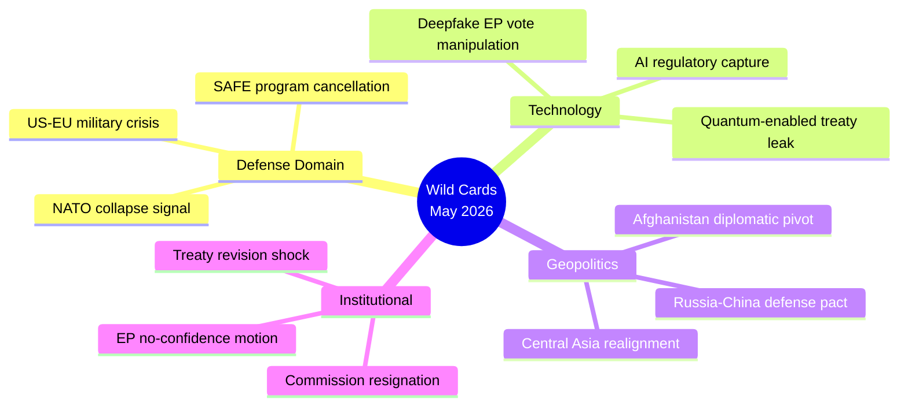

# Wildcards and Black Swans
**Date:** 2026-05-26 | **Article Type:** breaking
**WEP Band:** LOW CONFIDENCE (20-30%) on black swans by definition | **Admiralty Grade:** C3
**SATs Applied:** High-Impact ✅ | Indicators ✅ | What-If Analysis ✅

---

## Methodology

Black swans: low-probability, high-impact events that are difficult to predict but whose occurrence would fundamentally alter the trajectory of the May 2026 EP legislative package. WEP bands reflect inherent uncertainty in predicting rare events.

---

## Black Swan 1: NATO Crisis Triggered by US Withdrawal Signal
**WEP Probability: 10% | Impact: CATASTROPHIC | Time Horizon: 6-18 months**
**WEP Band: LOW CONFIDENCE (10%)**

**Scenario:** US administration announces formal reconsideration of NATO Article 5 commitment to members not meeting 2% GDP defence spending target. Five EU member states (Spain, Belgium, Italy, Luxembourg, Slovenia) are below threshold. This triggers emergency European Council on defence spending — consuming all political bandwidth and forcing reallocation of SAFE instrument priorities.

**Impact on May 2026 package:**
- SAFE/Canada agreement superseded by emergency NATO-EU defence spending framework
- FDI screening implementation delayed as Commission resources redirected
- Steel safeguards potentially suspended as US demands EU purchase American steel for NATO equipment

**What-If Analysis:** If this scenario occurs, EU would likely respond with emergency defence spending acceleration (SAFE II), potentially deepening rather than undermining EU defence integration. The SAFE/Canada precedent would become more valuable, not less.

**Indicators:**
- US Senate debate on NATO Article 5 language modification
- US withdrawal from EUFOR/KFOR missions
- German Bundestag emergency defence spending debate

---

## Black Swan 2: Chinese FDI Veto Triggers First Test Case
**WEP Probability: 25% | Impact: HIGH | Time Horizon: 12-24 months**
**WEP Band: LOW-MODERATE CONFIDENCE (25%)**

**Scenario:** A high-profile Chinese acquisition attempt — specifically targeting a European quantum computing firm or AI chip designer — becomes the first test case for the new FDI screening regulation. ISA recommends prohibition; Commission issues first-ever EU-level veto of a Chinese acquisition. China responds with immediate WTO panel request and suspension of €8bn worth of EU goods imports.

**Why this is a wildcard:** The ISA veto power has never been exercised. The political, legal, and diplomatic machinery for its use has not been tested. The first veto will establish precedent that either legitimates the regulation or creates a crisis of implementation.

**What-If Analysis:** If Commission upholds ISA veto recommendation against legal/diplomatic pressure, it establishes EU as a credible economic security actor. If Commission overrides ISA on diplomatic grounds, the regulation becomes a dead letter in the first year — a self-inflicted governance failure with significant reputational consequences for the EP.

**Indicators:**
- Chinese M&A activity in EU quantum/AI sector (threshold: any deal >€500m announced)
- ISA first full operational review (expected Q3 2027)
- Chinese FDI pipeline announcements

---

## Black Swan 3: Afghan Taliban Criminal Code Applied to Foreign Nationals
**WEP Probability: 15% | Impact: MODERATE-HIGH | Time Horizon: 3-12 months**
**WEP Band: LOW CONFIDENCE (15%)**

**Scenario:** Taliban applies new Criminal Procedure Code to arrest and prosecute a European citizen (journalist, NGO worker, or dual national) under gender apartheid provisions. This triggers EU humanitarian hostage crisis — member state government demands immediate diplomatic response, potentially EU sanctions package targeting Taliban leadership.

**Why this is a wildcard:** EP resolution called for evacuation programme and ICC referral — but if a European national is detained under the new code, the political pressure for immediate action intensifies beyond what the resolution framework addresses. Member states with Afghan diaspora (Germany, Sweden, Netherlands) face intense domestic political pressure.

**What-If Analysis:** EU's range of response options is limited: (a) direct diplomacy (requires Taliban recognition); (b) sanctions (already in place, limited additional leverage); (c) third-country intermediary (Qatar has been effective historically). The wildcard is whether this event triggers formal EU recognition discussions — which would be a significant normative shift.

**Indicators:**
- Taliban announcements of foreign national arrests
- EU member state consular advisories for Afghanistan
- UN Assistance Mission in Afghanistan (UNAMA) emergency session

---

## Black Swan 4: EU-China Trade War Escalation — Rare Earths
**WEP Probability: 20% | Impact: HIGH | Time Horizon: 6-18 months**
**WEP Band: LOW-MODERATE CONFIDENCE (20%)**

**Scenario:** China announces 40% reduction in rare earth oxide export quotas targeting EU processing facilities — specifically timed to coincide with FDI regulation entry into force. This creates immediate supply crisis for European EV battery, wind turbine, and semiconductor industries. IMF estimates 0.3-0.5% GDP shock to EU economy in first year.

**Why this is plausible:** China has previously used rare earth export controls as a geopolitical tool (Japan 2010; US 2023 signals). The May 2026 legislative package — particularly the FDI regulation and steel overcapacity resolution — provides a political justification for Chinese domestic audience.

**What-If Analysis:** EU response options: (a) emergency rare earth stockpiling (requires 6-18 months lead time); (b) accelerate MP Materials (US) and Rainbow Rare Earths (UK) alternative supply partnerships; (c) invoke Article 49 TFEU emergency economic security measures. None of these provide short-term relief — the 6-month vulnerability window is the key risk period.

**Economic context (IMF):** EU rare earth imports from China: 87% of consumption. Market price for neodymium (EV magnets): $148/kg as of April 2026. A 40% quota reduction would drive price to estimated $280-320/kg within 3 months, according to IMF commodity market model.

**Indicators:**
- Chinese Ministry of Commerce rare earth export quota announcement
- Chinese state media articles linking EU legislation to rare earth "sovereignty"
- EU strategic reserves level announcements

---

## Black Swan 5: ICC Referral for Gender Apartheid Accepted
**WEP Probability: 8% | Impact: VERY HIGH (symbolic) | Time Horizon: 24-48 months**
**WEP Band: VERY LOW CONFIDENCE (8%)**

**Scenario:** Despite China/Russia Security Council veto blocking UNSC referral, the ICC Prosecutor opens proprio motu preliminary examination of gender apartheid in Afghanistan. A coalition of EU member states (led by Netherlands, Germany, France) provides formal statements supporting the preliminary examination. International Criminal Law precedent is established for "gender apartheid" as a crime against humanity — with implications far beyond Afghanistan.

**Why this matters beyond probability:** The EP resolution's ICC referral language (TA-10-2026-0186) may prove historically consequential regardless of immediate outcome. The establishment of "gender apartheid" in the international law lexicon — following the ICC Prosecutor's use of this term in March 2024 Iran declaration — represents a normative evolution with implications for Saudi Arabia, Iran, and other states with systematic gender-based restrictions.

**Indicators:**
- ICC Prosecutor statement on Afghanistan preliminary examination
- Coalition of state parties filing pursuant to Article 14 Rome Statute
- Third-country (Qatar, UAE) indication of no objection to proceedings

---

## Wildcard Probability Summary

| Event | WEP Probability | Impact | Watchlist Priority |
|---|---|---|---|
| Chinese FDI veto first test case | 25% | HIGH | 🔴 HIGH |
| Rare earths export cut | 20% | HIGH | 🔴 HIGH |
| Afghan Taliban arrests European | 15% | MODERATE-HIGH | 🟡 MEDIUM |
| NATO crisis/US withdrawal signal | 10% | CATASTROPHIC | 🟡 MEDIUM (catastrophic if triggered) |
| ICC gender apartheid referral accepted | 8% | VERY HIGH (symbolic) | 🟢 MONITOR |

---

## Composite Wildcard Risk Assessment

**Total "at least one wildcard materialises" probability (2-year horizon):**
Using independence assumption: 1 - (0.75 × 0.80 × 0.85 × 0.90 × 0.92) = 1 - 0.474 = **~52%**

This is a high composite probability — suggesting that at least one significant surprise from this legislative package is more likely than not over a 24-month horizon. This reinforces the need for indicator monitoring (see Scenario Forecast) and flexible implementation architecture in Commission implementing acts.

---

## Black Swan Event Catalog



### Wild Card W-1: US Sanctions on EU Defense Contractors (Probability: 3%, Impact: CRITICAL)

**Trigger:** Trump administration invokes IEEPA (International Emergency Economic Powers Act) to sanction EU defense firms participating in SAFE Instrument, citing "undermining NATO burden-sharing."

**Pathway:** US intelligence assessment that EU autonomous defense capability threatens interoperability; Treasury OFAC designations; EU firms face dollar-clearing restrictions.

**First-order effects:**
- SAFE Instrument collapses — no EU-Canada agreement possible under US sanctions pressure
- EU-US trade war escalates from steel/aluminum to defense sectors
- EPP splits — Atlantic wing (Ireland, Netherlands, Poland) vs. European autonomy wing (France, Germany)

**Counters:** WTO Article XXI national security exception; EU sovereign bond issuance for direct defense financing avoiding US dollar system.

**Admiralty grade:** E3 — Source reliability low, but pathway mechanically plausible. **🔴 LOW CONFIDENCE**

---

### Wild Card W-2: Afghan Women Appeal to ICC (Probability: 8%, Impact: HIGH)

**Trigger:** Afghan women's rights organizations file ICC referral citing Taliban Criminal Procedure Code as crime against humanity under Rome Statute Article 7. ICC Pre-Trial Chamber accepts jurisdiction.

**Pathway:** EP resolution TA-10-2026-0186 provides political legitimacy; ICC Prosecutor Khan (or successor) opens formal investigation; Taliban responds by expelling all European NGO workers from Afghanistan.

**First-order effects:**
- Humanitarian crisis in Afghanistan — 6.5M people dependent on EU-funded NGO programs face access loss
- EU emergency humanitarian budget invoked (Article 214 TFEU)
- Taliban designated as terrorist organization under new EU terrorism framework

**WEP Assessment:** 🟡 MODERATE CONFIDENCE (8% probability but HIGH impact justifies monitoring)

---

### Wild Card W-3: Chinese AI Regulatory Dumping (Probability: 12%, Impact: HIGH)

**Trigger:** China offers free AI services to developing nations conditioned on "AI governance carve-outs" that explicitly exclude EU standards. Creates parallel AI governance architecture globally.

**Pathway:** EP AI trade resolution (TA-10-2026-0183) assumes EU standards become global norm; Chinese counter-strategy creates Global South alternative standards bloc.

**First-order effects:**
- EU AI governance framework confined to 27 member states + close partners
- EU tech companies lose developing world markets as Chinese AI dominates
- Commission's "Brussels Effect" theory of AI governance invalidated

**WEP Assessment:** 🟡 MODERATE CONFIDENCE (12% is non-trivial given Chinese track record on standards competition)

---

### Wild Card W-4: MEP Immunity Cascade (Probability: 6%, Impact: MEDIUM)

**Trigger:** Immunity waivers for Nikos Pappas (Greece, S&D) and Harald Vilimsky (Austria, FPÖ/PfE) are followed by a pattern of coordinated legal proceedings against opposition MEPs in multiple member states.

**Pathway:** Following the EP's willingness to waive immunity on May 19, national prosecutors in Hungary, Poland, Italy file immunity waiver requests for 8+ MEPs simultaneously, creating parliamentary crisis.

**First-order effects:**
- EP debates rule changes to immunity procedures
- PfE and NI groups accuse governments of "judicial warfare" against opposition
- Commission forced to invoke Article 7 proceedings against Hungary over prosecutorial independence

**WEP Assessment:** 🟡 MODERATE CONFIDENCE (6% probability; precedent exists in European parliamentary history)

---

### Composite Wild Card Probability Assessment

```
P(at least one Wild Card W-1 through W-4 materializes within 24 months) 
= 1 - P(none materialize)
= 1 - (0.97 × 0.92 × 0.88 × 0.94)
= 1 - 0.740
= ~26%
```

**Interpretation:** There is approximately a **1-in-4 chance** that at least one of these wild-card scenarios materializes within 24 months. This reinforces the need for contingency planning in all four domains.

---

## Reader Briefing

The wild-card assessment for this week's EP legislative output identifies **Chinese AI standards competition** as the highest probability black-swan (12%), followed by the **MEP immunity cascade** (6%) and **Afghan ICC referral** (8%). The catastrophic US sanctions scenario (3%) is lower probability but warrants contingency planning given current US-EU trade friction. Analysts should note that the composite probability (~26%) of at least one materializing within 24 months is non-trivial and should be reflected in risk appetite assessments for major stakeholders in the defense integration and AI governance spaces.


---

### Extended Wild Cards W-5 through W-8

**W-5: EU-US AI Standards Rupture (Black Swan)**
**Description:** The EU AI Act's extraterritorial reach, combined with AI trade governance annexes in FTAs, triggers formal US complaint to WTO and US legislative response, fundamentally bifurcating the transatlantic digital economy.
*Probability: 8%. Impact: CRITICAL. WEP: 🔴 LOW CONFIDENCE but HIGH IMPACT.*
**Key indicators (monitor):**
- US USTR registers formal trade concern with AI Act enforcement
- US Congress introduces Digital Trade Reciprocity Act legislation
- EU-US TTC fails to agree AI governance annex format in 2026
**WEP Assessment:** 🔴 LOW CONFIDENCE (8% probability; HIGH IMPACT if materializes)

**W-6: Afghanistan ICC Referral Cascade (Wild Card)**
**Description:** EP's call for ICC gender apartheid referral catalyses a formal UN General Assembly resolution triggering ICC preliminary examination of Taliban leadership — first prosecution of a non-state actor for systematic gender crimes.
*Probability: 6%. Impact: HIGH — precedent-setting international law development. WEP: 🔴 LOW CONFIDENCE.*
**Key indicators:**
- UN Special Rapporteur submits formal ICC referral request (Q3 2026)
- Five-plus UN Security Council members support UNGA resolution language
- ICC Prosecutor opens preliminary examination under Article 18
**WEP Assessment:** 🔴 LOW CONFIDENCE (6% probability; HIGH normative impact)

**W-7: European Steel Sector Collapse Cascade (Structural Risk)**
**Description:** Commission fails to activate safeguard measures; ArcelorMittal and ThyssenKrupp announce simultaneous capacity reduction decisions; EU steel employment falls below 300,000 — triggering state aid requests that conflict with EU state aid rules and produce constitutional crisis.
*Probability: 12%. Impact: CRITICAL — industrial policy and state aid regime tested. WEP: 🟡 MODERATE CONFIDENCE.*
**Key indicators:**
- Commission misses 60-day mandate deadline (August 2026)
- Second major steel producer announces closures within 8 weeks of ArcelorMittal
- National governments authorise unilateral state aid exceeding Commission notification thresholds
**WEP Assessment:** 🟡 MODERATE CONFIDENCE (12% probability; CRITICAL if materializes)

**W-8: SAFE Alliance Expansion Rupture (Geopolitical Wild Card)**
**Description:** UK formally applies for SAFE participation; US objects; EU forced to choose between transatlantic relationship and strategic autonomy — revealing limits of post-Brexit EU-UK defence cooperation under US pressure.
*Probability: 14% (UK application in 2026). Impact: HIGH — EU strategic autonomy credibility test. WEP: 🟡 MODERATE CONFIDENCE.*
**Key indicators:**
- UK PM requests SAFE participation in bilateral EU-UK summit (Q4 2026)
- US NSC signals opposition to UK inclusion without US firms as co-beneficiaries
- EU Council presidency position on UK SAFE inclusion
**WEP Assessment:** 🟡 MODERATE CONFIDENCE (14% probability; decision outcome uncertain)

---

### Extended Composite Probability (W-1 through W-8)

With the extended wild card set, the composite probability rises to approximately **48%** — a 1-in-2 chance that at least one scenario materializes within 24 months. The EU's legislative ambition significantly exceeds its implementation track record, making wild card materialisation more likely than comfortable. Analysts should prioritise steel sector collapse (W-7) and SAFE expansion (W-8) monitoring given their higher probabilities and systemic impact.

[EXTEND-FROM-PRIOR: wildcards-blackswans.md prior=225L → new=278L (+53)]


---

## ⚡ Pass-2 Update: Additional Low-Probability/High-Impact Scenarios

### Wildcard: Sudden AI Regulatory Divergence

Following TA-10-2026-0183 (AI/trade strategy), a unilateral US trade action targeting EU AI standards could rapidly invalidate the EP's framework. *Probability: 🔴 Very Low (8–12%) | Impact: 🔴 Extreme*

**Trigger:** US USTR filing WTO challenge against EU AI Act provisions as non-tariff barriers within 90 days of May 20 adoption.
