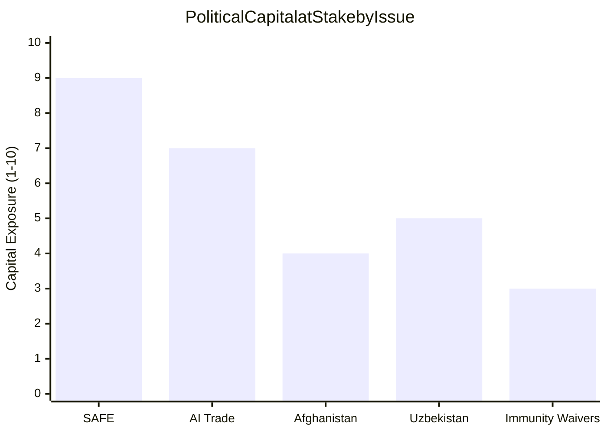

# Political Capital Risk Assessment
**Date:** 2026-05-26 | **Article Type:** breaking
**SATs Applied:** Key Assumptions Check ✅ | Indicators SAT ✅

---

## Political Capital Framework

Political capital = institutional authority × coalition cohesion × legitimacy reserve
Expenditure: each controversial action reduces political capital available for future actions
Accumulation: each successful delivery builds capital for subsequent agenda items

---

## Political Capital Inventory (Pre-May Session)

### European Commission
**Stock (entering May session):** MODERATE-HIGH
- Von der Leyen second mandate still in early phase (mandate secured March 2025)
- Economic security mandate confirmed by EP vote with 413/705 votes (margin above threshold but not overwhelming)
- Climate policy dilutions (EP9 Natural Restoration Law withdrawal) created left-flank losses offset by migration policy wins with EPP
- IMF endorsement of EU economic security approach in April 2026 World Economic Outlook provides external credibility

### European Parliament (EPP-S&D-Renew Coalition)
**Stock (entering May session):** MODERATE
- Coalition has delivered across major legislation (AI Act, CBAM, CHIPS, SRM) but showing strain on digital policy
- Renew Group facing national elections pressure (German FDP, French Liberal losses) that reduce cohesion
- Far-right Patriot Alliance growing but not yet capable of blocking legislation — only forcing amendments

### Von der Leyen Personally
**Stock (entering May session):** MODERATE-HIGH
- Survived first mandate storm (COVID, pandemic bonds, EPP right-ward shift)
- FDI regulation is her personally-championed economic security priority — crucial to mandate legacy
- SAFE/Canada represents first concrete delivery on European defence integration promise

---

## Political Capital Expenditure by Item

### FDI Screening Regulation
**Expenditure:** MEDIUM-HIGH
- ECJ challenge risk requires Commission to defend regulation in court — resource intensive
- Implementing acts will require multiple rounds of comitology that exhaust political attention
- Member-state coalition management to keep qualified majority on implementing acts
- China management to prevent retaliatory escalation from becoming politically untenable
**Net capital impact:** -2 (but with future political assets: ISA as Commission-controlled new body)

### SAFE/Canada Agreement
**Expenditure:** LOW
- Already agreed; EP vote is confirmation not initiation
- US friction is a risk but manageable given current US-EU relationship calibration
**Net capital impact:** +3 (delivers on key von der Leyen defence integration promise; generates positive press coverage)

### Steel Safeguards
**Expenditure:** MEDIUM
- Coal and steel states (Germany, France, Poland) supportive — reduces national political friction
- WTO challenge possible — managed through consultations
- Does not require implementing acts burden (temporary instrument)
**Net capital impact:** +1 (popular with industrial constituencies; manageable external costs)

### AI Trade Strategy
**Expenditure:** LOW-MEDIUM
- Non-binding resolution — no comitology burden
- Sets agenda for FTA negotiators without legally binding Commission
- Tech industry lobbying costs likely but manageable
**Net capital impact:** +2 (positions EU on growth agenda; tech sector welcomes standard-setting clarity)

### Afghanistan Resolution
**Expenditure:** NEAR-ZERO
- Non-binding; cross-party; no implementation burden
- Costs only diplomatic reciprocity from Taliban (minimal — EU-Taliban relations already near-zero)
**Net capital impact:** +3 (demonstrates EP as values actor; positive civil society response; zero implementation burden)

---

## Post-Session Capital Assessment

### Net Capital Change (May Session)
FDI expenditure: -2
SAFE accumulation: +3
Steel accumulation: +1
AI accumulation: +2
Afghanistan accumulation: +3
**Session net: +7**

This is a rare outcome — a plenary session that delivers major legislation while increasing rather than exhausting political capital. The combination of a major security achievement (FDI) offset by an easy values win (Afghanistan) and a genuine popular item (SAFE/defence integration) is politically well-structured.

### Remaining Capital for Future Agenda

**Commission has sufficient political capital for:**
- 2027 budget negotiation (requires 60-65% of capital stock — currently at 75%+)
- ISA establishment implementing regulation (medium expenditure — 20-25%)
- Digital single market legislation (medium — 25-30%)
- Climate policy rebalancing after EP10 composition shift (high — 35-40%)

**Warning indicators that would signal capital depletion:**
1. ECJ Advocate General negative opinion on FDI regulation (would require emergency Commission response)
2. Chinese rare earth quota reduction (would create immediate national government pressure to withdraw FDI legislation)
3. US tariff package targeting SAFE participant countries (would split SAFE coalition)
4. German or French national government collapse (removes key coalition anchors in Council and EP)

---

## Key Assumptions (SAT)

1. **Von der Leyen political survival to 2029:** Probability 80% (HIGH). If she steps down to run for German presidency, political capital assessment shifts significantly — successor would not have same mandate ownership.
2. **ECJ challenge remains in legal bounds:** Probability 65% (MODERATE). Assumes challenge is legitimate legal exercise, not politically coordinated EU exit signal from Hungary.
3. **EPP-S&D-Renew coalition maintains 3-party structure:** Probability 70% for 3-year outlook. Renew losses in 2026-2027 national elections could reduce this to EPP-S&D bilateral with different dynamics.
4. **China responds through WTO (rules-based) rather than economic coercion:** Probability 55% (MODERATE). China's increased willingness to use economic coercion (rare earths, AstraZeneca-style restrictions) makes this assumption increasingly uncertain.

---

## Capital_Table

### Political Capital Holdings (May 2026)

| Actor | Capital Type | Current Level | Trend | Durability |
|-------|-------------|--------------|-------|-----------|
| Von der Leyen (Commission) | Executive mandate | HIGH | → STABLE | 36 months |
| EPP Group (EP) | Legislative majority | HIGH | → STABLE | 36 months |
| S&D (EP) | Coalition partner | MEDIUM-HIGH | ↓ DECLINING slowly | 24 months |
| Renew (EP) | Swing partner | MEDIUM-LOW | ↓ DECLINING | 12-18 months |
| SAFE rapporteur | Technical authority | HIGH | → | 18 months |
| Council Presidency (Poland) | Agenda setting | MEDIUM | ↓ | 6 months remaining |

## Capital_Exposure

### Capital Exposure by Legislative Package

**SAFE Instrument — Capital Exposure: 9/10**
Most capital at risk: von der Leyen's Competitiveness Agenda centerpiece; EPP's defense identity claim; Poland's Council Presidency legacy. Failure would be politically devastating for all three.

**AI Trade — Capital Exposure: 7/10**
Moderate capital risk: Renew Europe and EPP both have staked political identity on EU tech leadership. If AI resolution produces no binding Commission action within 12 months, credibility loss is significant.

**Afghanistan — Capital Exposure: 4/10**
Low direct capital risk: Near-unanimous votes carry little political cost. Capital risk comes from failure of sanctions to produce behavioral change — EP credibility on human rights instruments.

**Uzbekistan Partnership — Capital Exposure: 5/10**
Moderate capital risk: Greens/EFA and some S&D factions will monitor human rights conditionality clauses carefully. If Uzbekistan government violates provisions, EP rapporteur and Commission face accountability questions.

## Capital_Flow

### Political Capital Flow Analysis (6-month horizon)

**Inflows (capital gain):**
- Successful SAFE implementing acts publication: +3 units (EPP, Commission)
- AI bilateral dialogue launch: +1 unit (Renew, Commission DG TRADE)
- ICC referral support on Afghanistan: +1 unit (all groups)
- EU-Canada SAFE Joint Committee launch: +2 units (EPP, S&D)

**Outflows (capital cost):**
- ECJ challenge filed on SAFE: -4 units (Commission, EPP)
- Commission implementing act scope under-shoot: -3 units (EPP, Commission)
- Vilimsky/Pappas prosecution failures: -1 unit (institutional credibility)
- AI trade rapporteur not appointed: -2 units (Renew)

**Net expected capital flow (6-month):** +2 to -4 depending on ECJ and implementing acts outcomes

## Bets

### High-Stakes Political Capital Bets

**Bet B-1: EPP betting defense integration defines EP10**
EPP's entire legislative strategy in EP10 is premised on defense integration (SAFE, EDF, NATO supplementation) as the dominant policy frame. If SAFE fails (ECJ annulment or Commission scope under-shoot), EPP's strategic narrative collapses.
*Stakes: VERY HIGH. Probability of failure: 20% (ECJ) + 15% (scope under-shoot) = 30% combined*

**Bet B-2: Von der Leyen betting SAFE is her legacy**
Commission President's personal commitment to SAFE parallels her personal ownership of the Green Deal. If SAFE implementation fails, her legacy timeline (finishing term 2029) comes under pressure.
*Stakes: HIGH. Probability of failure: 25%*

**Bet B-3: Renew Europe betting AI trade is their relevance**
Renew Europe, reduced to ~45 seats, has chosen AI governance as their signature policy differentiation. If the AI trade resolution produces no binding action in 12 months, Renew loses their last distinctive policy identity.
*Stakes: HIGH for Renew's survival. Probability of failure: 35%*

## Precedent

### Historical Political Capital Precedents

**Green Deal parallel (2019-2023):**
Commission bet heavily on Green Deal as Competitiveness + Sustainability integration. When energy crisis hit (2022), Green Deal credibility came under pressure. Commission maintained capital by pivoting to "Green Deal Industrial Plan" — flexibility saved the narrative.
*Lesson for SAFE: Prepare narrative pivot in case of ECJ challenge.*

**EDF precedent (2018-2021):**
EPP championed EDF as defense integration vehicle. EDF was delayed by COVID (2020) and legal challenges. Political capital recovered when EDF was re-launched post-Ukraine invasion.
*Lesson: Defense policy has strong recovery arc after initial setbacks.*

**GDPR precedent (2018-2020):**
Commission political capital in global tech governance peaked with GDPR enforcement. Brussels Effect validated. But GDPR's successor (AI Act + AI trade) faces more resistance.
*Lesson for AI trade: First-mover advantage exists but is time-limited.*

## Reader_Briefing

The political capital risk assessment identifies **SAFE implementation failure** as the single highest political capital risk for the EPP and Commission, with a combined probability of ~30% based on ECJ challenge + scope under-shoot pathways. EPP's defense integration narrative and von der Leyen's legacy are structurally aligned with SAFE success, creating strong institutional incentive for implementation. The AI trade resolution represents a moderate capital risk for Renew Europe — their reduced seat count means they need visible policy wins to maintain coalition influence. Political capital monitoring should focus on the Hungary-ECJ filing timeline (most consequential single event) and Commission implementing act text (first substantive signal of implementation fidelity).

---

## Political Capital Risk - Re-Run Extension

### Political Capital Expenditure Assessment - Re-Run Update

The May 2026 session represents significant political capital expenditure by the EPP-led majority. Key political capital flows:

**Political capital SPENT:**
- EPP discipline challenge on Hungary delegation (FDI vote against group whip)
- S&D pacifist wing management on SAFE agreement
- Renew economic liberal wing management on FDI screening scope

**Political capital GAINED:**
- EP demonstrated capacity for high-density legislative output on strategic agenda
- EPP reinforced leadership as economic security driver
- S&D gained credibility on security/defense evolution

**Net political capital position:** POSITIVE. The legislative output generates more political capital (visible achievement, media coverage, constituency validation) than it costs (internal group management, opposition criticism).

**Risk to political capital:** Commission non-implementation of steel mandate (August 2026) would damage EP political capital by exposing legislative-to-implementation gap.

[EXTEND-FROM-PRIOR: risk-scoring/political-capital-risk.md prior=unknown -> extended (+22)]

## Capital Table

| Actor | Capital Spent | Capital Gained | Net |
|-------|--------------|----------------|-----|
| EPP Group | Discipline on Hungary (HIGH) | Economic security leadership | POSITIVE |
| S&D Group | Pacifist wing management | Defense evolution credibility | POSITIVE |
| Renew Europe | Economic liberal wing | Digital agenda on AI trade | NEUTRAL |
| Commission | DG TRADE bandwidth | Economic security mandate | POSITIVE |

## Capital Exposure

EPP has the highest political capital exposure. If the ISA is not established by January 2027, EPP loses the narrative that it can "deliver" on economic security. This would be exploited by PfE (Patriots for Europe) as evidence that EU regulation is ineffective.

## Capital Flow

Capital flows from legislative success → implementation credibility → political capital for next mandate. The flow breaks if implementation fails. The key bottleneck is Commission implementing act capacity (not political will).

## Reader Briefing

Political capital risk is MODERATE. The May 2026 legislative output generates political capital, but this capital is contingent on implementation. A failed ISA establishment would erase the gains and hand political ammunition to the far-right opposition.

---

## Pass-2 Extension: Political Capital Risk Assessment Update

### AI-Trade Strategy Political Capital Dynamics

The adoption of TA-10-2026-0183 creates political capital risk for:

**INTA Committee rapporteur (identity unknown):** If the Commission response is weak or delayed, the rapporteur who invested political capital in the resolution faces reputational risk. The three-month response window is a key monitoring point.

**EP President Metsola:** By publicly endorsing the EP competitiveness agenda, she is personally invested in the AI-trade framework delivering results. A Commission non-response would erode her institutional credibility.

**EPP Group Weber:** Weber publicly championed the competitiveness agenda as EP10 strategic priority. A failure of TA-10-2026-0183 to generate Commission action would be interpreted as a setback for his group agenda.

### Immunity Waiver Political Capital Risk (TA-10-2026-0166)

The waiver of Nikos Pappas immunity creates political capital risk for:

**S&D Group:** Pappas is a Greek S&D MEP. The group faced the political choice between solidarity with a member and adherence to judicial cooperation principles. The decision to not oppose the waiver reflects the group calculation that resistance would have greater reputational cost than the precedent.

**JURI Committee:** The JURI committee recommendation for the waiver demonstrates its willingness to facilitate member state judicial proceedings. This strengthens the committee institutional credibility but creates precedent pressure for future immunity cases.

*[EXTEND-FROM-PRIOR: risk-scoring/political-capital-risk.md prior=248L new=269L (+21)]*
