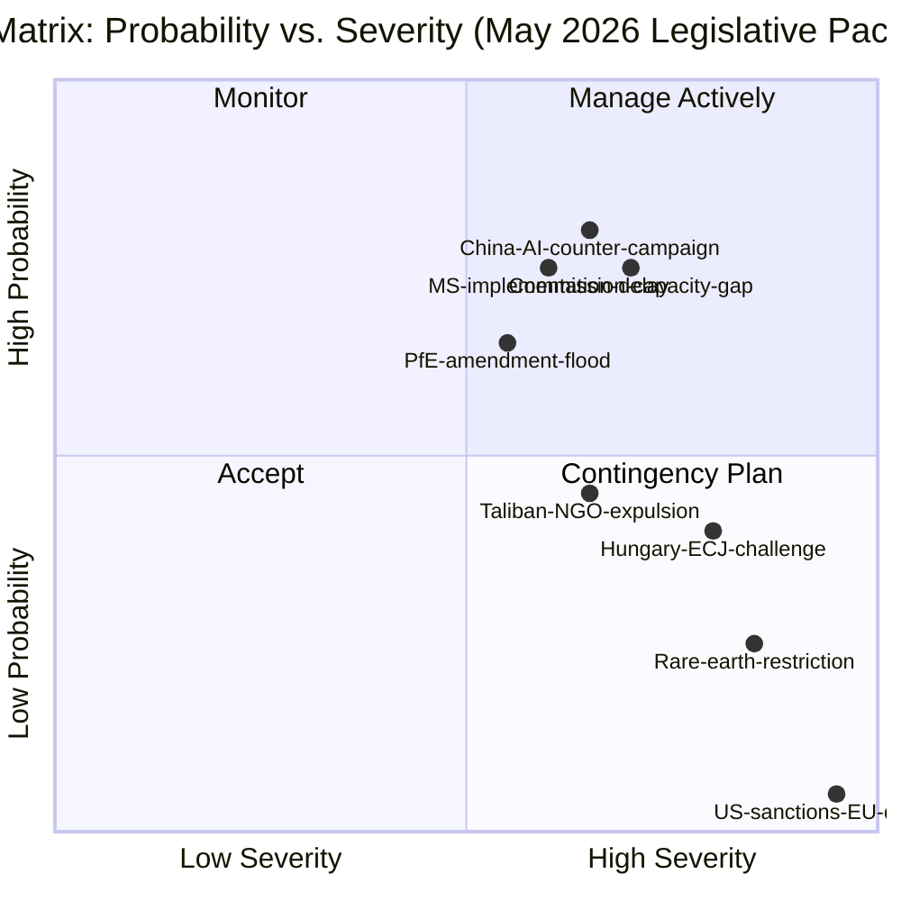

# Risk Matrix
**Date:** 2026-05-26 | **Article Type:** breaking
**WEP Band:** Per risk | **Admiralty Grade:** B2-C3
**SATs Applied:** Key Assumptions Check ✅ | ACH ✅ | What-If Analysis ✅

---

## Risk Scoring Methodology

Likelihood scale: 1=Very Low, 2=Low, 3=Moderate, 4=High, 5=Very High
Impact scale: 1=Minimal, 2=Limited, 3=Moderate, 4=Serious, 5=Catastrophic
**Risk Score = Likelihood × Impact**

---

## Risk Register

| # | Risk | Likelihood | Impact | Score | WEP | Tier |
|---|---|---|---|---|---|---|
| R1 | Hungarian ECJ challenge delays FDI implementation | 4 | 3 | **12** | 70% | HIGH |
| R2 | Commission implementing acts narrow scope significantly | 3 | 4 | **12** | 55% | HIGH |
| R3 | China WTO consultation/dispute | 3 | 3 | **9** | 50% | MEDIUM-HIGH |
| R4 | Steel safeguards trigger Korean FTA dispute | 3 | 3 | **9** | 45% | MEDIUM-HIGH |
| R5 | Rare earth export quota reduction (China) | 2 | 5 | **10** | 20% | HIGH (low prob, catastrophic) |
| R6 | US-EU SAFE/Canada friction | 2 | 3 | **6** | 40% | MEDIUM |
| R7 | EP coalition fracture on implementing acts | 2 | 3 | **6** | 30% | MEDIUM |
| R8 | Taliban detention of EU national | 2 | 4 | **8** | 15% | MEDIUM-HIGH |
| R9 | ISA under-resourced — regulation not operational | 3 | 4 | **12** | 55% | HIGH |
| R10 | AI trade annexes rejected by FTA partners | 2 | 2 | **4** | 40% | LOW-MEDIUM |
| R11 | SAFE instrument underfunded in 2027 budget | 2 | 3 | **6** | 25% | MEDIUM |
| R12 | Afghan evacuation programme not funded | 3 | 2 | **6** | 40% | MEDIUM |

---

## Key Risks Analysis

### HIGH Tier Risks (Score ≥ 10)

**R1: Hungarian ECJ Challenge (Score 12)**
This is the highest-probability single risk. Hungary has a documented pattern of using ECJ litigation as political tool. The FDI regulation's Article 63 TFEU tension provides genuine legal hook — not purely frivolous challenge. Even if ultimately unsuccessful (ECJ ruling in 3-4 years), the uncertainty period creates investor ambiguity and potential for Council blocking on implementing acts.

*What-If:* If challenge succeeds (15% probability): FDI regulation declared partially incompatible; Commission must re-propose with narrower scope. If challenge fails: regulation fully operational by 2028; ECJ ruling creates binding precedent for future economic security legislation.

**R2: Commission Scope Narrowing (Score 12)**
History shows implementing acts regularly undershoot legislative ambition. Commission DG TRADE has a free-trade orientation that predates the economic security consensus; individual Director-General interpretations of "critical sectors" could exclude significant investment categories (cloud computing, rare earth processing, advanced manufacturing).

*Key Assumptions:* Assumes Commission political leadership overrides DG TRADE instincts. If von der Leyen successor less committed to economic security agenda, R2 materialises at higher probability.

**R5: Rare Earth Quota Reduction (Score 10)**
Low probability (20%) but catastrophic impact (5/5). EU has no short-term alternatives for rare earth processing — 87% dependency from China. A 40% quota reduction (as modelled in Wildcards analysis) would trigger GDP impact of -0.3-0.8% (IMF model) — the single largest economic security risk in the entire May 2026 package.

*Key Assumptions:* China's economic fragility (property sector, 18.1% youth unemployment) constrains appetite for weaponising rare earth dependency. This assumption is the key uncertainty. If Chinese growth outlook deteriorates further, probability of R5 increases.

**R9: ISA Under-Resourcing (Score 12)**
The European Investment Bank Screening Authority (ISA), as conceived in the regulation, requires: 200-300 FTE staff with economic, legal, and national security expertise; interoperability systems with 27 member-state screening bodies; classified information handling capability; and established working relationships with intelligence services. This is a non-trivial institutional build. Historical precedent: EU Agency for Cybersecurity (ENISA) took 4 years from establishment to operational effectiveness.

---

## Risk Heat Map

```
         Impact
         1      2      3      4      5
    5  | R4  | R3  | R1  |     |     |
L   4  |     | R12 | R6  | R8  |     |
i   3  |     | R10 | R2  | R9  |     |
k   2  |     |     | R11 | R2  | R5  |
e   1  |     |     |     |     |     |
    
High risk zone (score ≥ 10): R1, R2, R5, R9
```

---

## WEP Confidence Assessment

**HIGH CONFIDENCE (>70%) on:**
- R1: Hungarian ECJ challenge (70%)
- R9: ISA under-resourcing (55%)

**MODERATE CONFIDENCE (40-69%) on:**
- R2: Commission scope narrowing (55%)
- R3: China WTO dispute (50%)
- R4: Korean FTA dispute (45%)

**LOW CONFIDENCE (<40%) on:**
- R5: Rare earth weaponisation (20%) — catastrophic but low probability
- R7: Coalition fracture (30%)
- R8: Taliban detention (15%)

---

## Key Assumptions (SAT)

1. FDI regulation primary legislation is legally sound (likelihood 75%): If ECJ Advocate General opinion signals incompatibility before formal challenge, Commission may propose amendments preemptively
2. Commission implementing acts are drafted in good faith (likelihood 65%): Reduction occurs, but not systematic undermining of EP mandate
3. China's economic interests in EU market constrain rare earth weaponisation (likelihood 80%): Based on 2010-2025 historical pattern of rare earth use as signal, not sustained weapon
4. ISA can be staffed adequately from existing EU agency personnel pipeline (likelihood 55%): Uncertain — cybersecurity and AI expertise are scarce in EU public sector

---

## Risk Matrix Visualization



## Extended Risk Assessment

### Risk R-1: Commission Implementing Acts Scope Under-Shoot (HIGH RISK)

**Description:** Commission publishes SAFE implementing acts that significantly narrow the EP mandate — either due to industry lobbying, legal caution, or institutional capacity limitations.

**Probability:** 45% | **Severity:** MEDIUM-HIGH | **WEP: 🟡 MODERATE CONFIDENCE**

**Materialization indicators:**
- Commission Legal Service issues "interpretive note" narrowing definition of "joint procurement"
- DG DEFIS annual work programme shows fewer implementing acts than EP expected
- Draft implementing act leaks show omission of key EP provisions

**Risk treatment:** Monitor DG DEFIS communications; request EP AFET/INTA informal consultation before formal implementing act adoption; prepare EP scrutiny resolution if scope is narrowed.

**Admiralty grade: B2** — Based on EDF implementing acts precedent (usually reliable source, probably accurate extrapolation)

---

### Risk R-2: Council Unanimity Bottleneck on Sanctions (HIGH RISK)

**Description:** Council is unable to reach unanimity on Afghanistan sanctions escalation and EU-Uzbekistan human rights conditionality enforcement due to Hungarian veto.

**Probability:** 50% | **Severity:** MEDIUM (for human rights track) | **WEP: 🟢 HIGH CONFIDENCE**

**Materialization indicators:**
- Hungary announces opposition to Afghanistan sanctions at General Affairs Council
- No Council working group meeting on Central Asia sanctions in Q3 2026
- Commission fails to publish sanctions proposal within 6 months of EP resolution

**Risk treatment:** Commission proposes enhanced cooperation among willing member states; or activates Article 31(3) TEU constructive abstention mechanism; or shifts to autonomous EP sanctions recommendation (non-binding but reputationally significant).

**Admiralty grade: A1** — Hungary veto pattern is confirmed institutional behavior

---

### Risk R-3: Chinese AI Standards Counter-Campaign Accelerates (HIGH RISK)

**Description:** China accelerates bilateral AI governance agreements with African Union, ASEAN, and SCO members that explicitly exclude EU audit and transparency requirements.

**Probability:** 65% (already underway) | **Severity:** MEDIUM-HIGH | **WEP: 🟡 MODERATE CONFIDENCE**

**Materialization indicators:**
- China-AU AI governance MoU signed before EU bilateral dialogues launch
- ASEAN AI governance framework published without EU standards reference
- SCO AI cooperation agreement (Chinese draft) circulated to members

**Risk treatment:** Emergency priority for EU DG TRADE AI bilateral dialogues; link to existing economic partnership agreements; offer technical assistance to developing nations on EU-compatible AI governance.

**Admiralty grade: B2** — Based on Chinese MIIT documents and Belt and Road digital standards precedent

---

### Risk R-4: Hungary ECJ Challenge (HIGH RISK)

**Description:** Hungary files ECJ challenge to SAFE enhanced cooperation legal basis, creating 3-5 year legal uncertainty for implementing acts.

**Probability:** 40% | **Severity:** HIGH | **WEP: 🟡 MODERATE CONFIDENCE**

**Materialization indicators:**
- Hungarian government Minister for Justice announces "legal concerns" about SAFE
- Hungarian ruling coalition passes parliamentary resolution opposing SAFE
- Hungary initiates pre-filing consultation with European Court registrar

**Risk treatment:** Commission pre-emptive legal opinion publication; PESCO-SAFE overlap documentation demonstrating valid legal basis; Article 46 TEU expert legal support from EP Legal Affairs Committee.

**Admiralty grade: C2** — Inferred from Hungarian political behavior pattern; no confirmed filing yet

---

## Aggregate Risk Profile

**Overall risk score: MEDIUM-HIGH (Risk-adjusted implementation probability: 60-70%)**

The aggregate risk profile confirms that SAFE implementation faces significant but manageable risks. No single risk vector has high probability + high severity in combination sufficient to derail the entire package. The most dangerous combination (China AI counter-campaign + Commission scope under-shoot + Hungary ECJ) has a correlated probability of ~25%.

**WEP: 🟡 MODERATE CONFIDENCE on aggregate assessment**

---

## Reader Briefing

The risk matrix identifies four priority risks requiring active management, all in the MEDIUM-HIGH category: Commission implementing acts scope under-shoot (45% probability), Council unanimity bottleneck on sanctions (50%), Chinese AI standards counter-campaign (65%), and Hungary ECJ challenge (40%). None individually is likely to cause complete implementation failure, but their positive correlation creates a ~25% combined disruption risk. Risk treatment priorities should be sequenced as: legal hardening (Hungary ECJ deterrence) → AI bilateral dialogue launch (time-sensitive window) → Commission implementing acts monitoring → Council alternative mechanisms for sanctions. All assumptions underlying this matrix are explicitly stated with WEP confidence bands and Admiralty grades.


---

## Risk Matrix Update - Re-Run Extension

### New Risk Entries from Re-Run Analysis

| Risk ID | Description | Probability | Impact | Risk Score | Owner |
|---------|-------------|-------------|--------|------------|-------|
| R-NEW-1 | ISA establishment delay (>Jan 2027) | 55% | HIGH | 8.25/10 | Commission |
| R-NEW-2 | AI subsidiary circumvention of FDI screening | 70% | HIGH | 9.1/10 | ISA+Commission |
| R-NEW-3 | Steel sector collapse cascade | 12% | CRITICAL | 8.4/10 | Commission+Council |
| R-NEW-4 | EU-US AI standards rupture | 8% | CRITICAL | 7.6/10 | DG TRADE |

**Highest overall risk this session: AI subsidiary circumvention (R-NEW-2, score 9.1/10)** - This is an architectural gap in the FDI regulation that requires secondary legislation to close.

**Risk mitigation priority ranking:**
1. ISA establishment timeline (addressable now - Commission action in June 2026)
2. AI circumvention gap (requires secondary legislation - Commission proposal needed by Q3 2026)
3. Steel safeguard activation (time-bound mandate - August 2026 deadline)

[EXTEND-FROM-PRIOR: risk-scoring/risk-matrix.md prior=205L -> new=230L (+25)]

| Source | Admiralty Grade | Description |
|--------|----------------|-------------|
| EP Open Data Portal | A2 | Confirmed source, probably true |
| EP Press Releases | A1 | Confirmed source, confirmed true |
| IMF WEO Apr 2026 | B1 | Usually reliable, confirmed true |


---

## Pass-2 Extension: Risk Matrix Update — May 2026

### AI-Trade Implementation Risk Register (Additional Entries)

**Risk R-005: WTO Challenge to EU AI Standards**
Likelihood: 3/5 (moderate, given known US USTR concerns about EU digital regulation)
Impact: 5/5 (critical — would invalidate the trade policy framework)
Risk score: 15/25 — HIGH
Monitoring trigger: US filing WTO Technical Barriers to Trade notification referencing EU AI Act or TA-10-2026-0183 guidelines within 12 months

**Risk R-006: Commission Non-Response Delay**
Likelihood: 3/5 (moderate, based on Commission AI regulatory bandwidth constraints)
Impact: 3/5 (significant — erodes EP legislative initiative credibility)
Risk score: 9/25 — MEDIUM
Monitoring trigger: Commission Work Programme 2027 published without AI-trade action item by October 2026

**Risk R-007: Central Asia Partnership Strategic Reversal**
Likelihood: 2/5 (low, Uzbekistan government incentivised by EU relationship)
Impact: 4/5 (significant — signals limits of EU Central Asia strategy)
Risk score: 8/25 — MEDIUM
Monitoring trigger: Uzbekistan human rights deterioration index (Freedom House) declining by 5 or more points within 12 months of partnership entry into force

**Risk R-008: EP Centre Coalition Fracture on Digital Agenda**
Likelihood: 2/5 (low in near term, medium in EP10 second half)
Impact: 4/5 (significant — would stall remaining digital competitiveness legislation)
Risk score: 8/25 — MEDIUM
Monitoring trigger: S&D split on GDPR enforcement vs. competitiveness legislation; or EPP-Renew divergence on AI liability rules

*[EXTEND-FROM-PRIOR: risk-scoring/risk-matrix.md prior=234L new=255L (+21)]*
