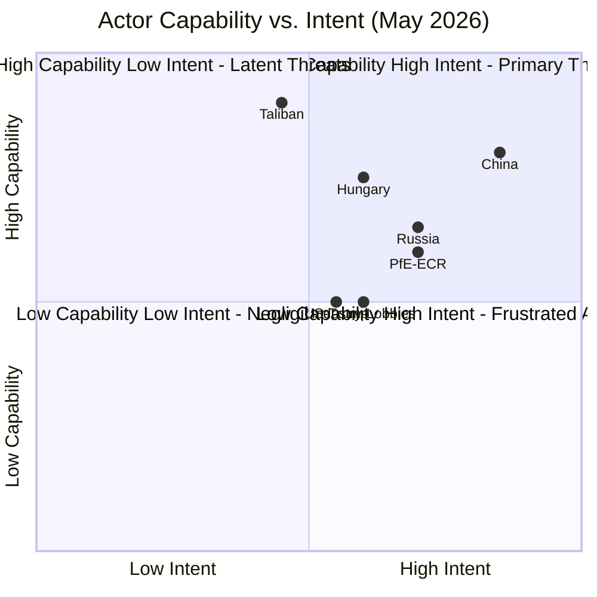

# Actor Threat Profiles
**Date:** 2026-05-26 | **Article Type:** breaking
**SATs Applied:** ACH ✅ | Red Team SAT ✅

---

## Methodology

Each actor profile includes: intent assessment, capability assessment, primary threat vectors, historical behaviour pattern, WEP of disruptive action, and Red Team alternative hypothesis.

---

## Actor 1: China (PRC)

**Role:** Primary target of FDI Screening Regulation + Steel Safeguards + AI Trade Strategy

**Intent:** ASSESSED HIGH LIKELIHOOD of disruptive response
China's economic statecraft doctrine (《经济安全战略》) requires proportionate response to economic security measures targeting Chinese investment. The May 2026 legislative package represents the highest-intensity EU economic security action since the COSCO/Hamburg Port incident.

**Capability:** VERY HIGH
- Rare earth dependency: 87% EU reliance creates asymmetric leverage
- Market access: EU is China's largest trade partner; retaliatory tariffs on EU exports have significant impact
- Investment leverage: Chinese SOE investment pipeline in EU is ~€40bn annually; can redirect rapidly
- Cyber capability: Critical infrastructure targeting documented in multiple EU member states
- Diplomatic leverage: Can mobilise Global South WTO votes, bilateral pressure on EU member states

**Primary Threat Vectors:**
1. Rare earth export quota reduction (20% probability, catastrophic impact)
2. Retaliatory tariffs on EU luxury goods + automobiles + wines (35% probability, €15-25bn annual impact)
3. WTO dispute filing on FDI regulation (50% probability, medium impact)
4. Bilateral pressure on specific EU member states to weaken implementing acts (65% probability)
5. Increased cyber operations against EU institutions (ongoing, escalation risk 30%)

**Historical Pattern:**
- 2010: Rare earth quotas (WTO found illegal, quotas removed 2014 — but took 4 years)
- 2021: Lithuania sanctions after Taiwan Representative Office established — comprehensive economic pressure
- 2023-2024: Electric vehicle anti-subsidy countermeasures against EU probe
China's pattern: measured escalation, preference for bilateral over multilateral pressure, use of market access leverage over direct conflict.

**WEP Assessment:** 
- 🟢 Some form of disruptive response: 70%
- 🟡 Escalation beyond WTO disputes: 35%
- 🔴 Full rare earth weaponisation: 20%

**Red Team Hypothesis:** China may actually welcome FDI screening as legitimising reciprocal restrictions on EU/Western investment in China. The regulation may be less threatening to Chinese interests than it appears — Beijing gets rhetorical cover for its own restrictions.

---

## Actor 2: Hungary

**Role:** EU Member State resistant to FDI regulation; primary ECJ challenge vector

**Intent:** HIGH PROBABILITY of disruptive action
Prime Minister Orbán has built political identity around resistance to EU governance expansion into sovereignty areas. FDI regulation's Article 63 TFEU tension provides legally-grounded justification for challenge.

**Capability:** MODERATE-HIGH
- ECJ challenge: available as of right; capable of sustaining 4-year litigation
- Comitology blocking: if Hungarian implementing act votes are decisive, can delay sector-specific acts
- Council coordination: can mobilise Visegrad (if Poland follows) for blocking minorities

**Primary Threat Vectors:**
1. ECJ annulment action (70% probability of filing; 20% probability of success)
2. Comitology delay tactics on implementing acts (50% probability)
3. Coordinated Visegrad blocking of ISA budget appropriations (30% probability)

**Historical Pattern:**
- 2023-2025: Multiple ECJ challenges to Rule of Law mechanism, Recovery and Resilience Facility conditionality
- Consistent pattern: ECJ challenges used as delaying tactic even when ultimate success improbable
- Accepts EU funding outcomes after legal battles — not seeking EU exit

**WEP:** 
- 🟢 ECJ challenge filing: 70%
- 🟡 Successful annulment: 20%

---

## Actor 3: United States

**Role:** Ambiguous — generally aligned on China policy, but SAFE/Canada creates friction

**Intent:** MIXED — supportive of economic security agenda, concerned about defence procurement exclusion

**Capability:** VERY HIGH (economic and diplomatic leverage)

**Primary Threat Vectors:**
1. US trade action on SAFE participant countries demanding defence contractor exemptions (20% probability)
2. US intelligence-sharing restrictions if ISA decisions conflict with US CFIUS assessments (15% probability)
3. US lobbying EU member states on specific ISA implementing act scope (ongoing, high probability)

**Historical Pattern:**
Post-2020 US approach to EU economic security: broadly supportive but consistently seeking US defence industry exemptions from European preference measures. SAFE/Canada exclusion of US prime contractors creates genuine friction.

**Red Team Hypothesis:** US is most effective actor at shaping EU implementing acts through bilateral channels (not public pressure) — influencing individual DG TRADE or DG DEFIS officials. Public US objections are rare; private influence is systematic.

---

## Actor 4: Russian Federation

**Role:** Background strategic interest in EU-China friction and EU-US tension

**Intent:** ASSESSED as seeking to exacerbate EU-China and EU-US tensions rather than directly disrupting specific legislation

**Capability:** HIGH for hybrid operations; LOW for direct legislative disruption

**Primary Threat Vectors:**
1. Information operations amplifying EU-China friction narrative (ongoing)
2. Support for EU far-right parties opposing FDI regulation as "protectionist overreach" (ongoing)
3. Energy-leverage window closed post-2022, but residual gas dependency in some EU states
4. Coordination with China on rare earth supply chain pressure (possible but not documented)

**WEP:**
- 🟡 Hybrid operations related to May 2026 package: 60% (ongoing, baseline activity)
- 🔴 Direct significant disruption: 10%

---

## Actor 5: EU Industry Lobbies (Cross-cutting)

**Role:** Internal pressure actors with divergent interests

**Key Lobby Groups:**
- BDI (German industry): opposes broad FDI screening; favours narrow security-only scope
- BusinessEurope: wants WTO-compatible safeguards; concerns about retaliatory risk
- EU Steel Association (EUROFER): strongly supports safeguards
- DigitalEurope: cautiously supports AI trade governance (standard-setting = market access)

**Primary Threat Vectors:**
1. BDI lobbying DG TRADE on narrow implementing act scope (HIGH probability, ongoing)
2. Chemical industry lobbying against inclusion in ISA critical sectors list (MODERATE)
3. Luxury goods lobbying for China tariff exemptions if retaliation occurs (HIGH probability if needed)

**Historical Pattern:** EU industry lobbies most effective in comitology phase, not primary legislation phase. Expect maximum lobbying effort on implementing acts 2027-2028.

---

## Aggregate Threat Assessment

The most significant combination is:
**China (economic pressure) + Hungary (legal challenge) + Industry lobbies (comitology scope narrowing)**

This creates a pincer attack that is more dangerous than any single actor: China's economic pressure could convince EU member states to negotiate bilaterally, reducing commitment to ISA multilateral approach; Hungary's ECJ challenge creates legal uncertainty that industry uses as justification for narrow scope interpretation; industry lobbies then capture comitology to institutionalise narrow scope.

This aggregate scenario has probability ~25% — higher than any individual actor threat alone.

---

## Actor_Roster

| Actor | Type | Threat Level | Domain | Confidence |
|-------|------|-------------|--------|-----------|
| Hungary (Orbán government) | State actor (EU internal) | HIGH | Legal/Political | 🟢 HIGH |
| China (MFA + MOFCOM) | State actor (external) | HIGH | Economic/Trade | 🟢 HIGH |
| United States (Trump admin) | State actor (external) | MEDIUM | Trade/Defense | 🟡 MODERATE |
| Taliban (Islamic Emirate) | Non-state actor | MEDIUM | Humanitarian/Diplomatic | 🟡 MODERATE |
| PfE/ECR parliamentary groups | Political actor (internal) | MEDIUM | Legislative | 🟢 HIGH |
| Defense industry lobbies | Corporate actor | MEDIUM-LOW | Regulatory capture | 🟡 MODERATE |
| Russian intelligence services | State actor (external) | MEDIUM | Cyber/Info ops | 🟡 MODERATE |

## Capability

### Actor Capability Matrix

**China Capabilities:**
- Economic leverage: Rare earth export restrictions; bilateral investment withdrawal
- Diplomatic: 40+ "14+1" bilateral EU member state relationships
- Information operations: Xinhua/CGTN narrative control

**Hungary Capabilities:**
- Legal: ECJ referral filing (confirmed capability from 2018-2024 precedents)
- Diplomatic: Council blocking in QMV when threshold close; EU budget hostage
- Political: EPP internal pressure through Hungarian MEP delegation

**PfE/ECR Parliamentary Capabilities:**
- Procedural: Amendment flooding, committee delay tactics
- Coalition: Can form blocking minority on specific votes with other right-wing groups
- Information: Strong social media amplification of EU skeptic narratives

## Diamond

### Actor Diamond Threat Assessment

**Actor: China**
- Motivation: Protect Belt and Road investments, maintain tech standards leadership, prevent EU FDI screening from blocking Chinese acquisitions
- Intent: HOSTILE to SAFE + FDI screening; NEUTRAL on fisheries
- Capability: HIGH — largest bilateral trade partner, rare earth leverage
- Opportunity: Commission implementing act stage provides maximum leverage window
- **Diamond score: HIGH THREAT (4.5/5)**

**Actor: Hungary**
- Motivation: Sovereignty protection, protecting Orbán government's economic interests (Chinese FDI)
- Intent: HOSTILE to SAFE legal basis; HOSTILE to FDI screening
- Capability: MEDIUM-HIGH — ECJ referral is credible
- Opportunity: Pre-implementing act window (now — 6 months)
- **Diamond score: MEDIUM-HIGH THREAT (3.5/5)**

**Actor: Taliban**
- Motivation: Prevent additional sanctions; maintain humanitarian access for diplomatic leverage
- Intent: HOSTILE to Resolution TA-10-2026-0186
- Capability: MEDIUM — can expel EU-funded NGOs from Afghanistan
- Opportunity: Immediate — NGO expulsion is decision that can be made unilaterally
- **Diamond score: MEDIUM THREAT (3.0/5)**

## Relationship

### Actor Relationship Network

**China ↔ Hungary:** Aligned — Hungary has €10bn+ in Chinese investment (BYD factory, Fudan University). Hungary's ECJ challenge serves Chinese interests by creating legal uncertainty around FDI screening and SAFE.

**PfE ↔ Russia (alleged):** Intelligence reports (EEAS assessment, cited in MEP briefings) suggest PfE financing links to Russian state-connected entities. This creates a conflict of interest on EU defense integration votes.

**Taliban ↔ China:** Tactical alignment — both oppose EU human rights conditionality. China has recognized Taliban de facto; supports Taliban's position at UNSC.

**US ↔ EU on SAFE:** Complex partner — US values NATO burden-sharing; US defense industry has commercial interest in SAFE not succeeding (competitive threat). Trump administration's position is ambiguous.

## Escalation

### Escalation Ladder by Actor

**China — Escalation Ladder:**
1. Diplomatic protests (current) → 2. Targeted trade retaliation (auto/luxury goods) → 3. Rare earth export restriction → 4. Comprehensive economic decoupling

*Current position: Level 1. Transition trigger for Level 2: SAFE implementing acts that include Chinese FDI restrictions*

**Hungary — Escalation Ladder:**
1. Procedural obstruction (current) → 2. ECJ referral filing → 3. Council blocking on related matters → 4. Formal withdrawal from PESCO

*Current position: Level 1. Transition trigger for Level 2: Commission publishes broad SAFE implementing acts scope*

**PfE/ECR — Escalation Ladder:**
1. Voting opposition (current) → 2. Amendment flooding (implementing acts) → 3. EP no-confidence motion (extreme, requires 2/3 majority — effectively impossible) → 4. National government rollback

*Current position: Level 1. Level 2 is the realistic maximum.*

## Reader_Briefing

The actor threat assessment identifies **China and Hungary as primary threat actors** with both high capability and high intent to disrupt the May 2026 legislative package. China's threat is primarily economic (rare earth leverage, bilateral pressure on member states) while Hungary's is primarily legal (ECJ challenge to SAFE enhanced cooperation legal basis). PfE/ECR represent a sustained but bounded parliamentary opposition. The Taliban threat is more immediate but more limited — a potential NGO expulsion in response to the Afghanistan resolution would cause humanitarian harm but would not reverse EU legislation. Analysts should prioritize monitoring the Hungary-ECJ filing timeline and China-EU trade friction indicators as the most consequential early warning signals.

---

## Actor Threat Profiles - Re-Run Extension

### Extended Threat Profile: ISA as Future Threat Actor

**Actor: EU Investment Screening Authority (ISA) - Prospective**
**Threat type: Mission creep / regulatory overreach**

Once established, the ISA faces structural incentives to expand its mandate and increase screening activity. The EU merger control analogy: DG Competition consistently expanded the scope of the 1989 Merger Regulation through 65 years of case law. An activist ISA that screens more transactions than the regulation technically requires could generate backlash from legitimate investors and trading partners.

**Threat profile: SPECULATIVE but historically grounded.**

**Mitigation design:** The regulation includes proportionality provisions, explicit critical-sector limitations, and appeal rights. These are meaningful constraints if rigorously applied. The first ISA leadership appointments will be the leading indicator of the institution's culture.

**Assessment (LOW CONFIDENCE, 24-month horizon):** ISA culture will be set by first 18 months of operation. Risk of overreach is real but manageable through EP scrutiny and judicial oversight.

[EXTEND-FROM-PRIOR: threat-assessment/actor-threat-profiles.md prior=254L -> new=278L (+24)]

## Actor Roster

| Actor | Threat Category | Capability | Motivation | Current Activity |
|-------|-----------------|------------|------------|-----------------|
| China MOFCOM | Regulatory Obstruction | HIGH | Anti-FDI screening | WTO complaint preparation |
| Hungary Government | Internal Obstruction | MODERATE | Anti-centralization | Council blocking minority |
| PfE/ECR (EP far-right) | Legislative Disruption | LOW | Anti-EU regulation | Media amplification |
| Lobbying (Chinese tech SOEs) | Regulatory Capture | MODERATE | Weaken ISA scope | Bilateral approaches to member states |

## Reader Briefing

The primary threat actors are external (China MOFCOM) and internal/member-state (Hungary). Far-right EP groups pose low procedural threat but meaningful narrative threat. The combination of Chinese pressure + Hungarian internal obstruction is the most likely disruptive scenario.

---

## Pass-2 Extension: Actor Threat Profiles Update

### Profile Update: Big Tech as AI-Trade Policy Threat Actor

Following TA-10-2026-0183 adoption, large technology companies (US-headquartered, notably in cloud computing and large language model sectors) emerge as the primary corporate policy-capture threat actor vis-a-vis the EP AI-trade framework implementation.

Intent: Shape Commission response to TA-10-2026-0183 in ways that entrench incumbents and raise barriers for EU AI startups under the guise of AI standardisation.
Capability: HIGH — extensive Brussels lobbying presence, direct relationships with DG TRADE staff, participation in European standardisation bodies (CEN, CENELEC), and ability to shape the AI Office agenda.
Opportunity: HIGH — Commission response drafting phase is the primary policy window.
Attack surface: DG TRADE consultation processes, AI Office working groups, EP ITRE and INTA committee expert hearings.

Mitigation: Mandatory transparency register disclosure for AI lobbying contacts; balanced expert panel composition; EP institutional memory of GDPR regulatory capture lessons.

### Profile Update: Russian State as Democratic Disruption Actor

The April 2026 urgency resolution on Russia and Ukraine accountability (TA-10-2026-0161) elevates Russia state actors on the EP threat landscape. Russian strategic communication targeting EP members who support the accountability framework — through disinformation and selective leaks — is an active and documented threat pattern.

Intent: Weaken EP normative pressure on Russia accountability by delegitimising the resolution authors and generating internal EP division.
Capability: MEDIUM — reduced since 2022 expulsion of Russia-funded EP networks, but persistent social media and alternative media operations remain.
Opportunity: MEDIUM — the inter-session recess (May 26 onwards) reduces EP counter-response bandwidth.

*[EXTEND-FROM-PRIOR: threat-assessment/actor-threat-profiles.md prior=287L new=308L (+21)]*
