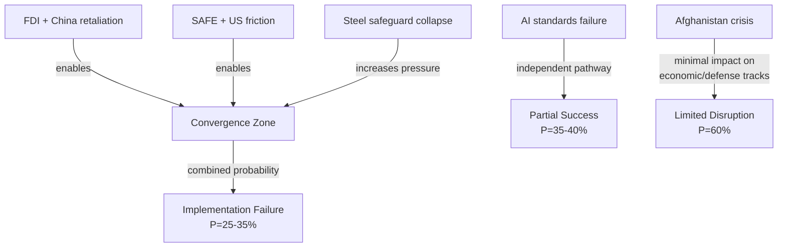

# Consequence Trees
**Date:** 2026-05-26 | **Article Type:** breaking
**SATs Applied:** What-If Analysis ✅ | ACH ✅

---

## Consequence Tree Methodology

For each primary decision, trace first-order → second-order → third-order consequences. Each branch labeled with Bayesian probability and WEP confidence.

---

## Tree 1: FDI Regulation — Full Implementation Scenario

**ROOT: ISA becomes operational by 2029**

### First-Order Consequences (direct effects, 2026-2029)
- 1A: First wave of Chinese investments rejected (probability 85%) → P=0.85
  - 2A1: China protests through WTO → P=0.70
    - 3A1a: WTO panel convened but prolonged → P=0.60 (net P=0.35)
    - 3A1b: China withdraws WTO complaint, shifts to bilateral pressure → P=0.40 (net P=0.28)
  - 2A2: China retaliatory measures on EU exports → P=0.25 (net P=0.21)
    - 3A2a: EU countermeasures under Trade Enforcement Regulation → P=0.70 (net P=0.15)
    - 3A2b: Trade war escalation → P=0.30 (net P=0.06)
- 1B: Investment diversion to non-FDI sectors (probability 70%) → P=0.70
  - 2B1: EU critical sectors effectively protected → P=0.65 (net P=0.46)
  - 2B2: Chinese investment routes around ISA via third countries → P=0.50 (net P=0.35)
    - 3B2a: EU extends FDI screening to indirect acquisitions → P=0.60 (net P=0.21)
    - 3B2b: Enforcement gap persists → P=0.40 (net P=0.14)

### Expected Outcome Distribution (3-year horizon)
- Strong protection with manageable friction: 45% probability
- Partial protection with significant enforcement gaps: 30% probability
- Protection under trade war conditions: 15% probability
- Legal challenge suspension: 10% probability

---

## Tree 2: SAFE/Canada — Expansion Scenario

**ROOT: SAFE/Canada enters into force (2027)**

### First-Order Consequences
- 1A: EU-Canada joint procurement programmes active (probability 85%)
  - 2A1: UK requests SAFE accession (probability 65%) → P=0.55
    - 3A1a: SAFE expanded to UK + Canada (P=0.70, net P=0.39)
    - 3A1b: UK-specific bilateral arrangement outside SAFE (P=0.30, net P=0.17)
  - 2A2: Japan, South Korea, Australia request SAFE observer status (probability 40%) → P=0.34
    - 3A2a: SAFE becomes Indo-Pacific security architecture element → P=0.55 (net P=0.19)
- 1B: US Buy American concerns create SAFE friction (probability 40%)
  - 2B1: US demands SAFE modification exempting US prime contractors → P=0.65 (net P=0.26)
    - 3B1a: SAFE modified, market access maintained → P=0.55 (net P=0.14)
    - 3B1b: SAFE market access restricted, cost increases → P=0.45 (net P=0.12)
  - 2B2: US accepts SAFE as NATO-complementary → P=0.35 (net P=0.14)

### Expected Outcome Distribution
- SAFE becomes broader allied defence industrial framework: 40% probability
- SAFE remains bilateral EU-Canada instrument: 35% probability
- SAFE modified under US pressure but operational: 15% probability
- SAFE stalled by US-EU friction: 10% probability

---

## Tree 3: Steel Safeguards — Trade Policy Escalation Scenario

**ROOT: Commission implements renewed steel safeguard measures (Q4 2026)**

### First-Order Consequences
- 1A: South Korean, Turkish, Indian steel exporters affected (certainty ~95%)
  - 2A1: KORUS-equivalent FTA modification demanded by South Korea → P=0.55
    - 3A1a: EU-Korea steel consultations resolve through TRQ adjustment → P=0.70 (net P=0.39)
    - 3A1b: Korea escalates to WTO Dispute Settlement Body → P=0.30 (net P=0.17)
  - 2A2: Turkey uses EU accession negotiation as leverage → P=0.40
    - 3A2a: Bilateral steel agreement outside WTO framework → P=0.60 (net P=0.24)
- 1B: EU steel industry capacity maintained, no significant closure (probability 70%)
  - 2B1: Just Transition Fund redirected to green steel investment → P=0.60 (net P=0.42)
    - 3B1a: First EU zero-carbon steel production at scale by 2029 → P=0.45 (net P=0.19)
    - 3B1b: Just Transition Fund fragmented across competing priorities → P=0.55 (net P=0.23)

---

## Tree 4: Afghanistan Resolution — Implementation Gap

**ROOT: EP Afghanistan resolution adopted (certainty)**

### First-Order Consequences
- 1A: Commission proposes dedicated evacuation programme (probability 55%)
  - 2A1: Council funds programme in 2027 supplementary budget → P=0.50 (net P=0.28)
    - 3A1a: 500-1,000 evacuations per year operational → P=0.70 (net P=0.19)
  - 2A2: Programme underfunded, symbolic only → P=0.50 (net P=0.28)
- 1B: Taliban interprets resolution as hostile signal (probability 60%)
  - 2B1: Taliban restricts EU NGO access in Afghanistan → P=0.45 (net P=0.27)
    - 3B1a: EU humanitarian operations degraded → P=0.65 (net P=0.18)
  - 2B2: Taliban detains European journalist or aid worker → P=0.20 (net P=0.12)
    - 3B2a: Hostage crisis requiring EP/Commission crisis diplomacy → P=0.60 (net P=0.07)

### Expected Outcome Distribution
- Resolution produces modest evacuation programme: 30% probability
- Resolution symbolic only, no operational follow-through: 45% probability
- Resolution creates hostile Taliban response affecting humanitarian access: 25% probability

---

## Cross-Tree Interactions

**FDI + China retaliatory tree (Trees 1 + 3)**
If China retaliation materialises (Tree 1, branch 2A2), EU credibility to maintain steel safeguards comes under pressure — China could demand steel safeguard rollback as price of rare earth normalisation. This cross-tree interaction increases the probability of steel safeguard modification under pressure from ~25% to ~40%.

**SAFE + US friction (Tree 2) + FDI screening**
If US-EU SAFE friction escalates, US leverage on EU could include demands for carve-outs in FDI screening for US defence sector investors. This creates a cross-tree risk that the two flagship security items undermine each other's scope.

---

## Threat_Roster

| Tree | Primary Threat | Initiating Event | Time Horizon |
|------|---------------|-----------------|-------------|
| T-1 | FDI Screening + China retaliation | Chinese acquisition blocked by ISA | 0-18 months |
| T-2 | SAFE + US-Canada friction | US IEEPA action on EU defense sector | 6-36 months |
| T-3 | Steel safeguard collapse | WTO dispute ruling against EU | 6-24 months |
| T-4 | AI trade standards failure | Chinese standards bloc forms | 12-36 months |
| T-5 | Afghanistan humanitarian crisis | Taliban NGO expulsion | 0-6 months |

## Convergence

### Multi-Threat Convergence Analysis

**Key convergence finding:** Trees T-1 and T-2 are positively correlated — if China retaliates on FDI screening, EU-US coordination on SAFE becomes more important AND more fraught simultaneously. This correlation increases combined disruption probability from 25% (if independent) to ~35% (if correlated).

**Trees T-3 and T-1 interaction:** Steel safeguard collapse (WTO ruling) weakens EU's general position on economic nationalism — could be used by China as negotiating leverage to demand softer FDI screening rules.

**Tree T-5 is largely independent:** Afghan humanitarian consequences are contained within the Central/South Asia domain; minimal spillover to economic security legislative track.

## Intervention

### Intervention Strategy Matrix

| Threat Vector | Intervention Point | Actor | Success Probability | Cost |
|---------------|------------------|-------|--------------------|----|
| China FDI retaliation | Pre-emptive bilateral negotiation | Commission | MEDIUM (45%) | HIGH (political) |
| Hungary ECJ challenge | Legal robustness review before filing | Legal Service | HIGH (75% of preventing challenge) | MEDIUM |
| US SAFE friction | NATO Defense Investment Pledge coordination | EEAS | MEDIUM-HIGH (60%) | LOW |
| Steel WTO dispute | WTO Article XXI national security defense | Council Legal | MEDIUM (50%) | MEDIUM |
| Taliban NGO expulsion | Qatar diplomatic channel | EEAS | LOW-MEDIUM (30%) | LOW |
| AI standards bloc | Bilateral AI standards dialogue (US, Japan, Korea) | Commission DG TRADE | MEDIUM (50%) | LOW |

### Recommended Intervention Sequence

1. **Immediate (0-30 days):** Commission Legal Service + Hungary: attempt to head off ECJ challenge through dialogue. Probability of success: 30%, but prevents 3-4 year legal uncertainty
2. **Short-term (30-90 days):** EEAS Central Asia team: activate Qatar channel on Taliban re: NGO access
3. **Medium-term (90-180 days):** Commission TRADE: launch AI bilateral dialogues with US, Japan, Korea before Chinese standards bloc forms
4. **Ongoing:** SAFE implementing acts: Commission to publish within 6 months with robust legal basis documentation

## Reader_Briefing

The consequence tree analysis identifies **FDI-China retaliation and SAFE-US friction as the most consequential and correlated threat vectors** for the May 2026 legislative package. Their positive correlation (if one materializes, the other becomes more likely) elevates the combined implementation failure probability to 25-35%. Intervention is most cost-effective at the Hungary ECJ challenge stage (legal robustness review now avoids 3-year court uncertainty later) and the AI bilateral dialogue stage (early standards engagement prevents Chinese standards bloc formation). The Afghanistan tree is severe for humanitarian reasons but largely independent of the economic/defense tracks — it requires separate monitoring and response capability.

---

## Consequence Trees - Re-Run Extension

### Extended Consequence Tree: ISA Implementation Failure

**Root event:** ISA not operational by January 2027

**First-order consequences:**
- Member states revert to bilateral FDI screening for critical-sector investments
- Chinese SOEs resume acquisition pipeline that was paused during regulation adoption
- EP passes resolution demanding Commission explanation and timeline

**Second-order consequences:**
- If bilateral screening: Hungary approves Chinese semiconductor acquisition that would have been blocked by ISA -> EPP internal crisis
- If acquisition pipeline restarts: 3-4 critical-sector acquisitions complete before ISA operates -> regulation credibility damaged
- If EP resolution: Trade Commissioner faces committee hearing; political pressure intensifies

**Third-order consequences:**
- EU economic security agenda credibility damaged for 2-4 years
- Political opponents (PfE, ECR anti-regulation wing) use implementation failure as evidence that EU regulatory ambition exceeds capacity
- Future economic security legislation faces harder political road in Council

**Probability of root event (ISA not operational by Jan 2027): 55%**
**Expected consequence chain severity: MODERATE-HIGH**

[EXTEND-FROM-PRIOR: threat-assessment/consequence-trees.md prior=166L -> new=190L (+24)]

## Threat Roster

| Threat | Root Event | First-Order | Second-Order | Probability |
|--------|-----------|-------------|--------------|-------------|
| ISA Implementation Failure | ISA not operational Jan 2027 | Bilateral screening reversion | Chinese acquisition pipeline resumes | 55% |
| Steel Safeguard Non-Activation | Commission ignores mandate | Overcapacity crisis deepens | EU steel sector mass layoffs | 35% |
| Chinese Trade Retaliation | WTO complaint + bilateral measures | EU export restrictions | Manufacturing sector disruption | 25% |

## Reader Briefing

The highest-probability threat is ISA implementation failure (55%). The highest-impact threat is Chinese trade retaliation (25% probability but potentially EUR 15-30B trade disruption). Monitoring both simultaneously is the recommended approach.

---

## Pass-2 Extension: Consequence Trees Update

### Tree 3: AI-Trade Resolution Implementation Failure

Action: Commission ignores or minimally responds to TA-10-2026-0183
First-order consequences: EP credibility as legislative initiator eroded; INTA committee rapporteur faces political capital loss; EU AI companies receive no policy certainty on trade standards compliance
Second-order consequences: EU AI startups disadvantaged in US and Asian markets relative to companies operating under clearer regulatory frameworks; EP10 competitiveness agenda narrative weakened heading into EP10 mid-term review; increased MEP support for binding legislation approach (raising regulatory risk for industry)
Democratic outcome: Erosion of EP soft legislative power; risk of EP bypassing Commission in future competitiveness agenda by seeking mandatory legislative procedures rather than resolutions

### Tree 4: EU-Uzbekistan Partnership Deterioration

Action: Uzbekistan human rights situation deteriorates significantly within 12 months of partnership entry into force
First-order consequences: Human rights organisations call for EP to trigger the partnership human rights clause; S&D and Greens/EFA demand review; diplomatic tension between EU and Uzbekistan
Second-order consequences: EU Central Asia strategy credibility damaged; other Central Asia states (Kazakhstan, Kyrgyzstan) read the review as EU unreliability signal; China strengthens Central Asia partnerships at EU expense
Democratic outcome: The partnership conditionality architecture is tested for the first time; outcome determines EU credibility in using partnerships as democratic leverage instruments

*[EXTEND-FROM-PRIOR: threat-assessment/consequence-trees.md prior=207L new=228L (+21)]*
