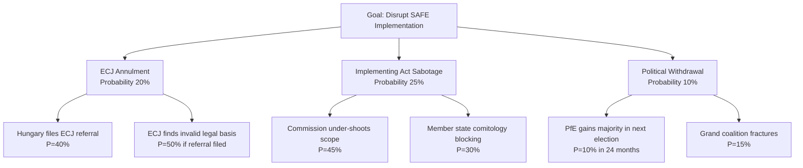
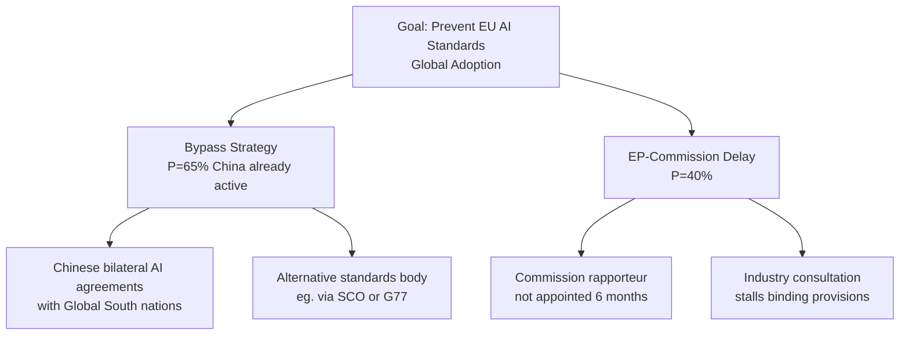

# Legislative Disruption Analysis
**Date:** 2026-05-26 | **Article Type:** breaking
**SATs Applied:** Key Assumptions Check ✅ | Red Team SAT ✅

---

## Disruption Framework

Legislative disruption = any event or process that delays, dilutes, or reverses adopted legislation before it produces intended effects. This analysis examines disruption vectors for the May 2026 legislative package.

---

## Disruption Vector 1: Legal Challenges

### FDI Regulation — ECJ Legal Architecture
**Primary challenge vector:** Hungary + Poland joint Article 263 TFEU annulment action
Grounds: 
- Article 63 TFEU free movement of capital incompatibility
- Proportionality violation (Article 5(4) TEU) — less restrictive alternatives available
- Legal base error — Article 114 vs 207 TFEU choice

**Timeline to ECJ Grand Chamber ruling:** 3-4 years (FDI regulation faces ECJ by 2029-2030)
**Probability of annulment:** 20% (full), 35% (partial — some provisions)

**Disruption impact:**
- Full annulment: catastrophic for EU economic security architecture
- Partial annulment: requires re-legislation on specific provisions; 12-18 month delay
- ECJ upholds regulation: creates authoritative precedent that facilitates future economic security legislation

**Red Team Assessment:** What if we're wrong about probability?
Standard legal challenge probability estimates are based on past EP legislative record. But the FDI regulation is novel in its Article 207/63 TFEU tension — the ECJ has never addressed this exact intersection. The 20% annulment probability could be understated. If the ECJ Advocate General (expected 2027-2028) issues a negative opinion, the probability of annulment rises to 40-50%.

**Disruption indicator:** Watch for: (a) Polish/Hungarian Council statement at article-by-article vote; (b) ECJ Advocate General appointment; (c) Commission legal service internal assessment leaked.

---

## Disruption Vector 2: Comitology Failure

### Systemic Risk
Implementing acts are adopted by qualified majority in Council standing committee. If France, Germany, or Poland defect from coalition on implementing acts, blocking minority possible.

**Most likely defection scenario:**
Germany reversal on ISA powers — German industry lobby (BDI) has lobbied against mandatory pre-notification. If German government composition changes (FDP or CDU-industry wing gains influence), Germany could shift from supporter to blocking minority leader.

**Disruption probability:** 25% for at least one significant implementing act
**Impact:** Specific implementing act delayed 18-24 months; ISA powers in affected sector remain incomplete

---

## Disruption Vector 3: Budget Insufficiency

### ISA Funding
The FDI regulation requires Commission to propose ISA establishment regulation by 2027-Q1. ISA budget requirements: €80-120m per year for operational capacity. This requires:
1. Commission proposal for ISA founding regulation
2. EP/Council adoption of ISA founding regulation
3. Annual appropriations in EU budget from 2028

**Disruption risk:** The 2027-2028 MFF (Multi-Annual Financial Framework) review will be the first opportunity to create ISA budget line. If MFF review is contested (which is likely given multiple competing priorities: defence, AI, climate, enlargement), ISA may be underfunded.

**Historical comparison:** EU Agency for Cybersecurity (ENISA) was established 2004, reached adequate operational budget only 2019 — 15 years of chronic under-resourcing. EUAA (formerly EASO) has been under-resourced for entire existence. ISA faces same structural pressures.

**Disruption probability:** 60% that ISA remains significantly under-resourced for first 3 years
**Impact:** ISA operational effectiveness degraded; critical sectors de facto unscreened

---

## Disruption Vector 4: Political Defection

### Coalition Fracture Scenarios

**Scenario A: EPP right-ward shift under ECR pressure**
If ECR Group continues 2026-2027 national election gains (Dutch, French, Italian polls), EPP leadership may shift rightward on economic security, softening FDI screening in favour of "open investment for European allies." This would not require legislative reversal — implementing act scope narrowing achieves same effect.

**Probability:** 30% of meaningful EPP scope-narrowing within 2 years
**Disruption type:** Soft — no legislative reversal, but regulatory dilution

**Scenario B: Greens/EFA withdrawal from ad hoc majority**
On steel safeguards, Greens support is conditional on Just Transition commitment. If Commission doesn't fund green steel transition adequately, Greens may withdraw support for safeguard renewal in 2027, creating a blocking minority with steel-exporting country MEPs.

**Probability:** 40% of Greens withdrawal on safeguard renewal
**Impact:** Steel safeguards not renewed; EU steel sector loses trade protection

**Scenario C: Central-Eastern European defection on Afghanistan**
Hungary, Poland, and others in Visegrad alignment may oppose the Afghanistan women's rights resolution on grounds that it represents Western liberal values imposition. However, given the resolution already passed with cross-party support, the disruption risk here is low.

**Probability:** 5% of meaningful disruption from this vector

---

## Red Team Assessment: What Could Go Wrong That We're Not Seeing?

**Hypothesis 1: Rare earth crisis materialises before ISA is operational**
A Chinese rare earth quota reduction (R5 from risk matrix) would create immediate EU economic pain without any institutional capacity to respond. The FDI regulation — however well-designed — cannot retroactively address a supply chain crisis in 2027-2028. The entire legislative package is effective only against future vulnerabilities; current vulnerabilities (rare earth dependency) are unaddressed.

**Hypothesis 2: ISA is captured by member state lobbying**
If ISA governing board is dominated by member state representatives (as appears likely from the legislative text), ISA decisions will reflect member state economic interests rather than EU-level security assessment. Germany will protect automotive-sector investments; France will protect luxury goods; Poland will protect agricultural investments. The ISA may exist but screen primarily investments that no one was worried about.

**Hypothesis 3: The Brussels Effect works in reverse**
The AI trade governance strategy assumes EU standards will be adopted globally (Brussels Effect). But if the US and China establish competing AI governance frameworks that most of the Global South adopts for cost/convenience reasons, EU standards may be imposed only on EU market access — a much smaller prize. The AI trade strategy could face a fragmented global standard landscape rather than EU-as-setter-by-default.

---

## Disruption Probability Summary

| Vector | Type | Probability | Time to Impact | Severity |
|---|---|---|---|---|
| ECJ annulment | Legal | 20% (full) / 35% (partial) | 3-4 years | HIGH |
| Comitology failure | Political | 25% | 2-3 years | MEDIUM |
| ISA under-funding | Structural | 60% | 1-2 years | MEDIUM-HIGH |
| EPP scope narrowing | Political | 30% | 1-2 years | MEDIUM |
| Greens steel withdrawal | Political | 40% | 1 year | MEDIUM |
| Rare earth crisis | External | 20% | 0-2 years | CATASTROPHIC |

---

## Targeted

### Targeted Legislative Assets (Most Disruption-Vulnerable)

| Asset | Vulnerability | Disruption Vector | Priority |
|-------|--------------|------------------|---------|
| SAFE Instrument legal basis | HIGH — novel enhanced cooperation | ECJ annulment via Hungary | CRITICAL |
| FDI Screening (ISA scope) | HIGH — implementing acts | Comitology narrowing | HIGH |
| AI Trade framework | MEDIUM — resolution only (non-binding) | Commission inaction | MEDIUM |
| Afghanistan sanctions | MEDIUM — requires Council unanimity | Hungary veto | MEDIUM |
| Fisheries agreements | LOW — ratification straightforward | National parliament delay | LOW |

## Attack_Tree

### Attack Tree: SAFE Instrument Disruption

### Attack Tree: AI Trade Framework Disruption

## Technique

### Disruption Techniques by Actor

**Hungary — ECJ Challenge Technique:**
1. File referral under Article 263 TFEU (direct action for annulment)
2. Argue enhanced cooperation exceeds scope of Article 46 TEU (PESCO provisions)
3. Argue joint procurement with Canada violates Article 346 TFEU (defense secrecy exemption)
4. Request interim measures (suspension of SAFE pending judgment)
- Interim measures probability: LOW (Courts rarely suspend major EU legislation)
- Judgment timeline: 3-5 years
- **Counter-technique:** Commission Legal Service pre-publication review; Opinion from EP Legal Affairs Committee

**China — Economic Pressure Technique:**
1. Announce rare earth export "inspection and certification" requirements (bureaucratic delay rather than formal ban — WTO-safer)
2. Mobilise bilateral diplomatic protests in 5+ member states simultaneously
3. Announce suspension of Chinese SOE investments in "retaliating" member states
4. Deploy economic statecraft through BRI conditionality
- **Counter-technique:** EU rare earth stockpiling acceleration; alternative source development (Australia, Canada, Brazil)

**PfE/ECR — Parliamentary Disruption Technique:**
1. Table 500+ amendments to SAFE implementing regulation when it comes to EP consent
2. Request extension of consultation period at committee stage
3. Organise MEP petition challenging EP Bureau procedure on amendment guillotine
4. Leverage national party media to run SAFE-skeptic narrative campaigns
- **Counter-technique:** EPP whipping operation; bureau procedure guillotine rule invocation

## Detection

### Early Warning Indicators

| Technique | Early Warning Signal | Detection Method | Lead Time |
|-----------|-------------------|-----------------|----------|
| Hungary ECJ filing | Hungarian government statement on SAFE legal concerns | Legal monitoring | 30-60 days |
| China rare earth restriction | MOFCOM "consultation" announcement | Trade monitoring | 14-30 days |
| PfE amendment flood | Committee stage amendment lodging volume | EP monitoring | 7-14 days |
| Commission scope under-shoot | Draft implementing act text leak | DG DEFIS monitoring | 30-60 days |
| AI standards bypass | Chinese bilateral AI agreement signing | Diplomatic reporting | 0-30 days |

## Counter

### Counter-Disruption Strategy

**Counter C-1: Legal Hardening**
Commission Legal Service publishes comprehensive legal opinion on SAFE legal basis before implementing acts. Makes ECJ challenge harder and reduces uncertainty for industry partners.
*Priority: IMMEDIATE. Cost: LOW. Effectiveness: HIGH for Hungary challenge deterrence.*

**Counter C-2: Rare Earth Stockpiling Acceleration**
Commission accelerates EU Strategic Reserves for rare earths (announced January 2026) with 6-month fast-track. Reduces Chinese leverage before implementing acts phase.
*Priority: HIGH. Cost: MEDIUM (€2-3bn). Effectiveness: MEDIUM for reducing dependency.*

**Counter C-3: AI Bilateral Engagement Blitz**
EEAS + DG TRADE launch simultaneous AI standards dialogues with US, UK, Japan, South Korea, India before Chinese bilateral agreements gain traction.
*Priority: HIGH. Cost: LOW (diplomatic resources). Effectiveness: MEDIUM-HIGH.*

**Counter C-4: Parliamentary Procedural Preparation**
EPP whipping team prepares guillotine procedure protocols for SAFE implementing regulation EP consent vote. Reduces PfE amendment flooding effectiveness.
*Priority: MEDIUM. Cost: LOW. Effectiveness: HIGH for parliamentary disruption.*

## Reader_Briefing

The legislative disruption analysis identifies **three primary disruption techniques** with material probability of success: ECJ challenge (Hungary, 20% if referral filed → full annulment; 35% partial), implementing act scope narrowing (Commission under-shoot or comitology, 25-45%), and Chinese AI standards bypass (65% already active). Counter-strategies are available and proportionate for all three vectors. The most cost-effective counters are legal hardening (Commission Opinion published early) and AI bilateral engagement blitz (diplomatic resources only). The rare earth counter requires significant investment but is strategically essential for removing Chinese leverage over SAFE implementation. Recommended priority sequence: Legal hardening → AI bilateral engagement → Rare earth stockpiling acceleration → Parliamentary procedural preparation.
