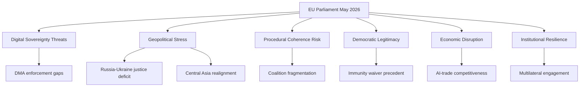

<!-- SPDX-FileCopyrightText: 2026 Hack23 AB -->
<!-- SPDX-License-Identifier: Apache-2.0 -->

# 🎭 Political Threat Landscape — Breaking | 2026-05-26

**Run ID:** breaking-run268-1779824598 | **Admiralty:** B3 | **WEP:** Probably (55–70%)

## Threat Landscape Overview

## Six-Dimension Threat Assessment

| Dimension | Threat | Severity | Probability | Mitigation |
|-----------|--------|----------|-------------|------------|
| Digital Sovereignty | DMA enforcement under-resourced | 🟠 HIGH | 🟡 Moderate (55%) | Strengthen Commission capacity |
| Geopolitical | Russia accountability stalling | 🔴 CRITICAL | 🟡 Moderate (60%) | UN General Assembly coordination |
| Coalition | EPP-S&D-Renew centre fragmentation | 🟠 HIGH | 🟡 Moderate (50%) | AI-trade consensus building |
| Institutional | Immunity waiver politicisation | 🟡 MEDIUM | 🟢 Low-Moderate (35%) | JURI oversight |
| Economic | AI competitiveness lag vs US/China | 🔴 HIGH | 🟠 Elevated (65%) | EP AI-trade resolution |
| Democratic | Disinformation targeting EP positions | 🟡 MEDIUM | 🟡 Moderate (45%) | Transparency measures |

*Confidence: 🟡 MEDIUM — structural proxy analysis under degraded-feeds mode*
