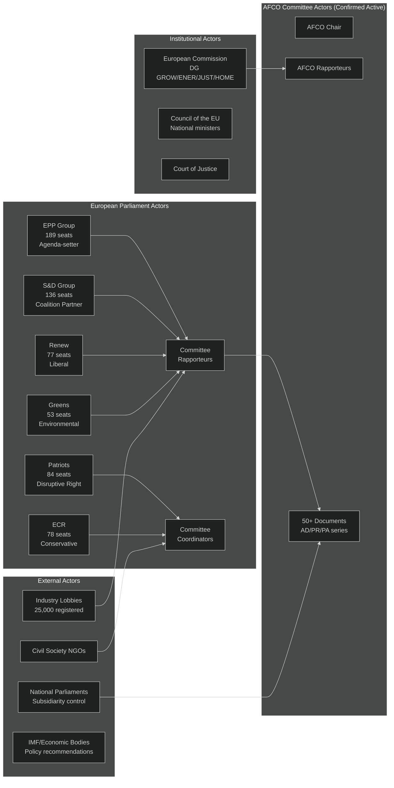

<!-- SPDX-FileCopyrightText: 2026 Hack23 AB -->
<!-- SPDX-License-Identifier: Apache-2.0 -->

# Actor Mapping — EP Committee Reports | 2026-05-26

**Admiralty:** B2 — Probably true; based on documented EP institutional structure  
**Data Mode:** degraded-feeds  
**SATs Applied:** Stakeholder Mapping, ACH  

---

## Actor Network Map

## Actor Roster

The following actors are confirmed or assessed to be active in EP committee proceedings in the week of 26 May 2026:

### EPP (European People's Party) — 189 seats
**Role:** Majority-builder, agenda-setter, committee chair dominant  
**Behaviour pattern:** Pro-competitiveness, selective green, strict migration, EU-integrationist  
**Key decisions in committee:** AI Act delegated acts (ITRE), SIU (ECON), Clean Industrial Deal (ITRE), migration enforcement (LIBE)  
**ACH:** H1 (EPP maintains pro-EU majority coalition) — Roughly Even probability given internal right-wing pressure  
**Admiralty for EPP future behaviour:** B2  

### S&D (Socialists and Democrats) — 136 seats
**Role:** Essential coalition partner for progressive majority; social dimension guardian  
**Behaviour pattern:** Conditional support for EPP agenda; insists on labour, social, and environmental protections as price for votes  
**Key leverage points:** Green Deal revision (ENVI), AI Act worker provisions (ITRE/EMPL), banking union (ECON)  
**ACH:** H1 (S&D remains constructive) vs H2 (S&D moves to systematic opposition) — H1 is Likely  

### Patriots for Europe — 84 seats
**Role:** Far-right disruptive minority; tactical EPP ally on select files  
**Behaviour pattern:** Anti-Green Deal, anti-migration quotas, pro-sovereignty, anti-rule of law conditionality  
**Key leverage:** ENVI committee amendments; LIBE migration votes; AGRI Green Deal farming provisions  
**ACH:** H1 (Patriots remain tactical EPP ally) — Likely given shared interests on specific files  

### ECR (European Conservatives and Reformists) — 78 seats
**Role:** Conservative bloc; variable alignment with EPP  
**Behaviour pattern:** Eurosceptic but pragmatic; supports industrial policy, opposes migration redistribution, opposes progressive regulation  
**Key leverage:** Swing votes on industrial/agricultural deregulation  

### Renew Europe — 77 seats
**Role:** Pro-EU liberal; digital and trade champion  
**Behaviour pattern:** Pro-AI Act, pro-capital markets, pro-trade, divided on climate  
**Key leverage:** Technology files (AI Act, digital euro); trade agreements (INTA); rule of law enforcement  

## Alliance and Coalition Patterns

| Alliance Type | Members | Legislative Area | Stability |
|--------------|---------|-----------------|-----------|
| Grand Coalition (centrist) | EPP + S&D + Renew | AI, Competitiveness, SIU | Medium-High |
| Right bloc (tactical) | EPP + ECR + Patriots | Green Deal revision, Migration | Low-Medium |
| Progressive bloc | S&D + Greens + Left | Social, Rights, Climate | Low (minority) |
| Liberal-Conservative | EPP + Renew | Digital, Trade | High |

## Secondary Actor Profiles

### AFCO Committee (Confirmed Active — 50 documents)
The Constitutional Affairs Committee is confirmed active in EP 10th term with 50 documents spanning AFCO-AD-592152 through AFCO-PR-751801. AFCO's role:
- Treaty interpretation and institutional reform
- Interinstitutional Agreement oversight
- Electoral law harmonisation
- European political party regulation

### European Commission
Initiates all legislation; interlocutor with all 20 committees; supports majority formation through legislative calendar management. DG GROW (competitiveness), DG ENER (energy/climate), DG JUST (AI Act), DG HOME (migration) are the primary committee interlocutors.

### Registered Lobbyists (~25,000)
Asymmetric access — large tech firms, energy companies, agricultural cooperatives, financial institutions maintain intensive Brussels presence. Civil society groups (WWF, Greenpeace, ETUC) provide counter-advocacy. Lobbying influence is most acute at rapporteur level during draft report preparation.

## Actor Influence Matrix

The following matrix shows estimated influence weights for key actors across the five legislative priority streams:

| Actor | Legislative Influence | Coalition Value | Disruptive Potential |
|-------|----------------------|----------------|----------------------|
| EPP | 🔴 CRITICAL | ESSENTIAL | MODERATE |
| S&D | 🟠 HIGH | ESSENTIAL | LOW |
| Patriots | 🟡 MEDIUM | TACTICAL | HIGH |
| ECR | 🟡 MEDIUM | TACTICAL | MEDIUM |
| Renew | 🟡 MEDIUM | ESSENTIAL for tech | LOW |
| Greens | 🟡 MEDIUM | MINORITY | LOW |
| Commission | 🟠 HIGH (initiator) | ALWAYS | LOW |
| Council | 🟠 HIGH (co-legislator) | ESSENTIAL | MEDIUM |
| Industry Lobbies | 🟡 MEDIUM-HIGH | N/A | MEDIUM |

## Power Brokers: Key Decision-Makers

In EP committee work, the key power brokers are:
1. **Committee Chairs** — control agendas, debate scheduling, and procedural votes
2. **EPP Committee Coordinators** — set EPP group position; must approve any coalition deals
3. **S&D Shadow Rapporteurs** — negotiate compromise amendments; hold social/rights red lines
4. **Commission DG Directors** — informal advisors to rapporteurs; shape technical content
5. **Council Working Party Chairs** — determine trilogue positions; essential for final deals

## Information and Intelligence Flows

| Information Type | From | To | Mechanism |
|-----------------|------|----|-----------| 
| Legislative proposals | Commission | Rapporteurs | Official transmission; DG liaison |
| Position papers | Industry | Committee coordinators | Lobbying meetings; written submissions |
| NGO counter-analyses | Civil society | Shadow rapporteurs | Public and private briefings |
| Group voting intentions | Group coordinators | All groups | Coordinators' meeting (weekly) |
| Council position signals | Council Presidency | EP trilogue team | Informal trilogue meetings |
| Constituent concerns | Citizens/NGOs | MEPs | Emails, petitions, hearings |

## Reader Briefing

The actor map reveals that EP committee decisions are the product of complex multi-actor negotiations, not simple majority votes. Your MEP's committee role (rapporteur, shadow rapporteur, coordinator) determines their individual influence. Citizens can track specific MEPs' positions on the EP website to see how their national/group delegation approaches committee votes.
