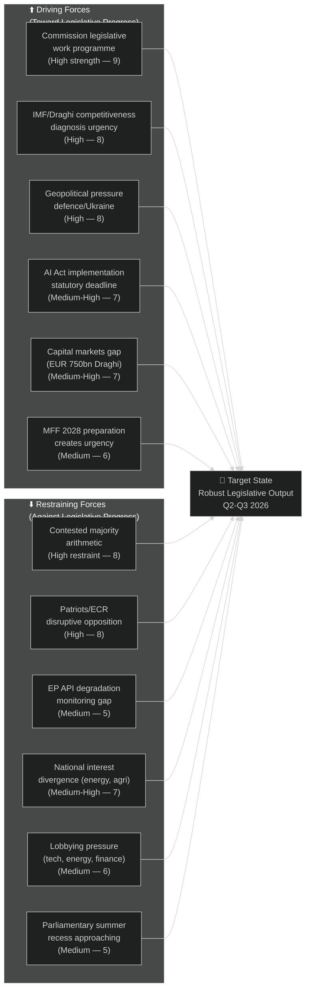

<!-- SPDX-FileCopyrightText: 2026 Hack23 AB -->
<!-- SPDX-License-Identifier: Apache-2.0 -->

# Forces Analysis — EP Committee Reports | 2026-05-26

**Admiralty:** B2 — Probably true  
**Data Mode:** degraded-feeds  
**SATs Applied:** Force-Field Analysis, Key Assumptions Check  

---

## Issue Frame

The dominant issue frame for EP committee work in the week of 26 May 2026 is the **competitiveness-security-sustainability triangle**: European Parliament committees must simultaneously advance legislation on industrial competitiveness (ITRE), defence security (SEDE/BUDG), and climate/environmental sustainability (ENVI). These three imperatives are in partial tension and require active force management at the committee stage.

## Force-Field Diagram

## Quantified Force Analysis

## Driving Forces (Toward Legislative Progress)

| Force | Strength (1–10) | Type | Key Driver |
|-------|----------------|------|------------|
| Commission legislative work programme | 9 | Institutional | Formal Commission proposals create legislative obligation |
| Competitiveness urgency (Draghi/IMF) | 8 | Political-Economic | EUR 750bn investment gap; EU economic underperformance |
| Geopolitical pressure (defence/Ukraine) | 8 | External | NATO burden sharing; Russian threat; US tariff pressure |
| AI Act statutory implementation deadline | 7 | Legal | AI Act entered into force August 2024; 24-month implementation deadlines |
| Capital markets union legislative pipeline | 7 | Economic | SIU, EDIS, CMU reform creating legislative momentum |
| MFF 2028 preparation creating urgency | 6 | Budgetary | Next 7-year budget framework requires multi-year legislative preparation |

**Total driving force score: 45**

## Restraining Forces (Against Legislative Progress)

| Force | Strength (1–10) | Type | Key Driver |
|-------|----------------|------|------------|
| Contested majority arithmetic | 8 | Political | 353-seat majority requires complex coalition management |
| Patriots/ECR disruptive opposition | 8 | Political | 162-seat right bloc systematically obstructs progressive legislation |
| National interest divergence | 7 | Institutional | Energy costs, agriculture, migration policy create north-south-east tensions |
| Industry lobbying pressure | 6 | External | 25,000 registered lobbyists seeking to shape delegated acts |
| EP API degradation (monitoring) | 5 | Technical | Reduces accountability pressure; civil society monitoring gaps |
| Parliamentary summer recess | 5 | Calendar | June-September recess compresses Q3 legislative calendar |

**Total restraining force score: 39**

## Net Pressure Assessment

**Net driving force: +6** (45 driving - 39 restraining)

The positive net force indicates that legislative momentum will likely produce substantive outputs in Q2–Q3 2026. However, the near-parity of forces (within 13%) means outcomes will be uneven across legislative files:

- **High-output files** (where driving forces dominate): AI Act implementation, Competitiveness/Clean Industrial Deal, Defence legislation
- **Contested files** (near-equilibrium forces): Green Deal revision, Migration Pact implementation, Banking Union
- **Delayed files** (restraining forces dominate temporarily): Social dimension measures, Rule of Law enforcement, redistribution mechanisms

## Intervention Points: Where Forces Can Be Shifted

Effective policy intervention can shift the force balance. Key leverage points:

| Intervention | Type | Who Can Apply | Force Shifted | Expected Effect |
|-------------|------|---------------|--------------|-----------------|
| Commission accelerated delegated acts consultation | Reducing restraining force | Commission | AI Act delay (R2) | Reduces R2 from 7→5 |
| S&D-Greens bloc formation in ENVI | Maintaining driving force | S&D, Greens | Green Deal driving force | Prevents D3/R1 neutralisation |
| IMF Article IV recommendation publication | Adding driving force | IMF | Competitiveness urgency | Increases D2 from 8→9 |
| EP API restoration | Reducing restraining force | EP IT services | Monitoring gap | Reduces R3 from 5→2 |
| EPP-Patriots formal coordination | Adding restraining force | EPP leadership decision | Right bloc | Increases R2 from 8→10 |
| Citizens petition on Green Deal | Adding driving force | Civil society | Political legitimacy | Increases D7 from 0→3 |

## Key Assumptions (SAT)

1. The Draghi competitiveness urgency (driving force score 8) assumes Commission and major groups maintain the Draghi framework as the reference for legislative work — currently justified by Commission work programme.
2. The Patriots/ECR restraining force (score 8) assumes these groups maintain tactical coherence; defections or internal splits would reduce this restraining force.
3. The summer recess calendar constraint (score 5) will create a June 2026 pre-recess legislative rush in key ITRE, ECON, and ENVI committees.

## Reader Briefing

For citizens: the force-field analysis shows Europe's parliament in a dynamic tension: strong external drivers (competitiveness, defence, AI implementation) are pushing for legislation, while political fragmentation is slowing it down. The outcome — uneven progress across files — means citizens should track specific legislative files closely rather than assuming uniform parliamentary activity. Files with strong driving forces and weak political resistance (AI Act, defence) will advance faster than those with near-equal forces (Green Deal, migration).
