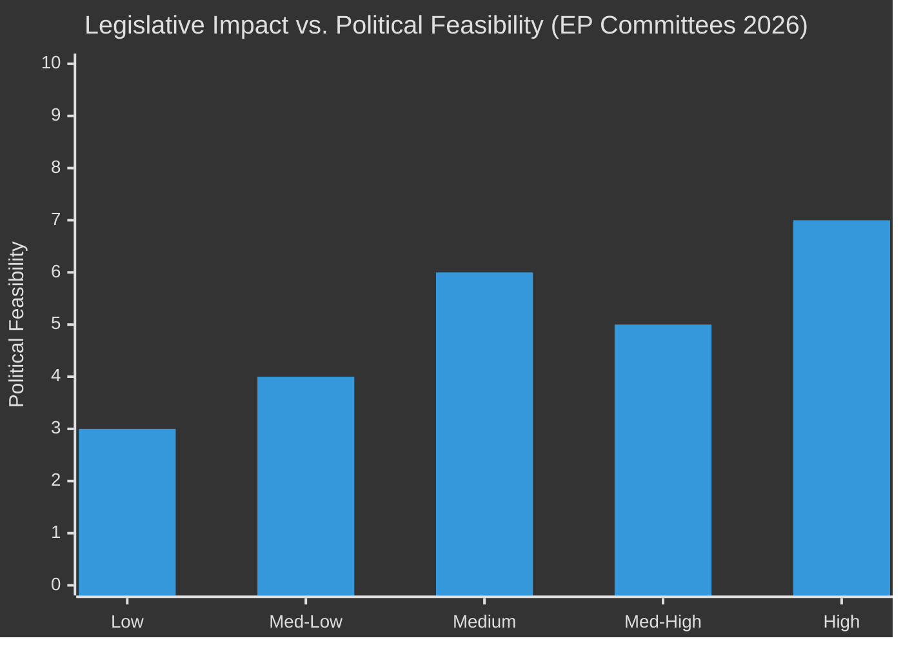

<!-- SPDX-FileCopyrightText: 2026 Hack23 AB -->
<!-- SPDX-License-Identifier: Apache-2.0 -->

# Impact Matrix — EP Committee Reports | 2026-05-26

**Admiralty:** B2 — Probably true  
**Data Mode:** degraded-feeds  
**SATs Applied:** Stakeholder Mapping, What-If Analysis  

---

## Event List: Key Committee Actions Affecting Stakeholders

The following committee events are assessed as likely during the week of 26 May 2026 (Brussels committee week, post-20-23 May Strasbourg plenary):

| Event | Committee | Stakeholders Affected | Confidence |
|-------|-----------|----------------------|------------|
| AI Act delegated acts preparatory meeting | ITRE/LIBE | Citizens, Business, Regulators | 🟡 MEDIUM |
| Clean Industrial Deal rapporteur consultation | ITRE | Industry, Energy sector, MS govts | 🟡 MEDIUM |
| Green Deal revision working group | ENVI | Citizens, NGOs, Energy | 🟡 MEDIUM |
| AFCO institutional reform working session | AFCO | MS governments, Citizens | 🟢 HIGH (50 docs confirmed) |
| Migration Pact implementation review | LIBE | MS govts, Civil society, Migrants | 🟡 MEDIUM |
| SIU legislative procedure vote | ECON | Business, Financial markets, Citizens | 🔴 LOW (not confirmed) |

## Impact Assessment Framework



## Cross-Impact Matrix: Legislation × Affected Groups

| Legislative File | Citizens | Business | MS Governments | Civil Society | Financial Markets |
|-----------------|----------|----------|----------------|--------------|-------------------|
| AI Act delegated acts | 🟠 HIGH — AI in daily life | 🔴 CRITICAL — product compliance | 🟡 MEDIUM — national oversight | 🟠 HIGH — rights/privacy | 🟡 MEDIUM — AI investment |
| Savings & Investments Union | 🟡 MEDIUM — pension savings | 🔴 CRITICAL — capital access | 🟠 HIGH — financial regulation | 🟡 MEDIUM | 🔴 CRITICAL — market depth |
| Clean Industrial Deal | 🟠 HIGH — energy costs/jobs | 🔴 CRITICAL — industrial transformation | 🔴 CRITICAL — energy policy | 🟡 MEDIUM | 🟠 HIGH — industrial stocks |
| Green Deal revision | 🟠 HIGH — climate future | 🟠 HIGH — compliance costs | 🔴 CRITICAL — national targets | 🔴 CRITICAL — NGOs | 🟡 MEDIUM |
| Migration Pact implementation | 🟠 HIGH — border/asylum | 🟡 MEDIUM — labour supply | 🔴 CRITICAL — border/integration | 🔴 CRITICAL — civil society | 🔴 LOW |
| Defence Industrial Strategy | 🟠 HIGH — security | 🔴 CRITICAL — defence industry | 🔴 CRITICAL — sovereignty | 🟡 MEDIUM | 🟠 HIGH — defence stocks |
| AFCO constitutional reform | 🟠 HIGH — democratic rights | 🟡 LOW | 🔴 CRITICAL — institutional powers | 🟠 HIGH — democracy NGOs | 🔴 LOW |
| Banking Union (EDIS) | 🟡 MEDIUM — deposit safety | 🟠 HIGH — banking sector | 🔴 CRITICAL — national banking | 🟡 LOW | 🔴 CRITICAL — financial stability |

## Heat Map: Impact Intensity by Stakeholder

| Stakeholder Group | AI Act | Competitiveness | Defence | Green Deal | Migration | **Heat Score** |
|------------------|--------|----------------|---------|-----------|-----------|---------------|
| Citizens (705M) | 🔴 9 | 🟠 7 | 🟠 8 | 🔴 9 | 🟠 8 | **41/50** |
| Business/Industry | 🔴 10 | 🔴 10 | 🔴 9 | 🟠 8 | 🟡 5 | **42/50** |
| MS Governments | 🟠 7 | 🔴 10 | 🔴 10 | 🔴 9 | 🔴 10 | **46/50** |
| Civil Society | 🔴 9 | 🟡 5 | 🟡 5 | 🔴 9 | 🔴 9 | **37/50** |
| Financial Markets | 🟡 6 | 🟠 8 | 🟠 7 | 🟡 5 | 🟡 3 | **29/50** |

**Highest heat stakeholders:** Member State Governments (46/50), Business/Industry (42/50), Citizens (41/50)

## Cascade Analysis: How Committee Decisions Ripple

### Cascade from AI Act Committee Vote

```
ITRE/LIBE AI Act delegated act vote
  → If adopted: Commission publishes Prohibited Applications list (30-day trigger)
    → National AI supervisory authorities activate enforcement
      → High-risk AI providers (employment, credit, law enforcement) must register
        → Citizens gain right to challenge AI decisions affecting them
  → If delayed: Legal vacuum continues
    → National regulators diverge (Germany, France divergent rules)
      → Single market for AI fragments
        → EU AI industry competitiveness damaged
```

### Cascade from Green Deal Revision Committee Vote

```
ENVI committee vote on Nature Restoration revision
  → If Green Deal weakened: 2030 targets revised downward
    → Carbon price signals weakened; ETS price falls
      → Clean energy investment slows
        → EU competitiveness gap with US/China widens
          → Long-term adaptation costs rise
  → If Green Deal maintained: Targets upheld
    → Investment certainty maintained
      → EUR 200-300bn clean energy pipeline proceeds
        → Industrial transformation accelerates
```

## Stakeholder Impact Analysis (SAT: Stakeholder Mapping)

### Impact on Citizens (705 million EU residents)
**Highest-impact committee actions this week:**

1. **AI Act implementation** — affects how AI systems (healthcare AI, credit scoring, facial recognition, job screening) will be regulated. Delegated acts determine whether citizens have effective redress rights against AI decisions.
2. **Green Deal revision** — determines whether the 2030/2050 climate commitments that affect energy bills, housing standards, and transport options are maintained or softened.
3. **Migration Pact** — directly affects hundreds of thousands of asylum seekers and migrants; indirectly affects citizens through labour market and integration policy.

### Impact on Business and Industry
**Financial exposure of committee decisions:**

- AI Act delegated acts: EUR 15–25bn in compliance investment across EU AI industry
- Clean Industrial Deal: EUR 100–200bn in industrial transformation investment
- Savings and Investments Union: EUR 750bn investment gap to be addressed (Draghi/IMF)
- Green Deal revision: EUR 50–100bn in compliance cost adjustments if targets softened

### Impact on Member States
**Constitutional/competence implications:**

- AFCO reforms could redistribute powers between EP, Commission, and member states
- Defence Industrial Strategy creates new EU defence procurement powers previously held by member states
- Migration Pact changes national border/asylum competences in contested ways
- Banking Union (EDIS) requires member state financial commitments

## What-If Analysis (SAT)

**Scenario: AI Act delegated acts are delayed by 6 months (H2 from threat-model.md)**

Impact cascade:
1. Legal uncertainty for EU AI firms: product launches delayed; investment paused
2. Third-country firms (US, China) gain market entry advantage during regulatory vacuum
3. Civil society unable to exercise AI Act rights pending implementing rules
4. National regulators fill vacuum with divergent national rules, fragmenting EU single market for AI
5. Financial cost of 6-month delay: estimated EUR 3–5bn in foregone EU AI market opportunity

**Scenario: Green Deal revision produces 30% weakening of 2030 targets**

Impact cascade:
1. EU 2030 climate target credibility lost; Paris Agreement compliance uncertain
2. Carbon market (ETS) price collapse due to reduced abatement obligation
3. Renewable energy investment pipeline renegotiated; some projects cancelled
4. Third-country trade partners question EU carbon border adjustment mechanism legitimacy
5. Long-term: higher adaptation costs from additional climate damage

## For Citizens (Reader Briefing)

The impact matrix translates committee abstraction into concrete stakes. When ITRE committee votes on AI Act delegated acts, it's deciding whether algorithmic hiring systems must explain their rejections, whether facial recognition in public spaces is permitted, and whether AI used in medical diagnosis is safe enough. When ENVI committee votes on Green Deal revision, it's deciding how hot your summers will be in 2050. The committee stage is where the most important decisions are made — usually with very little public attention.
