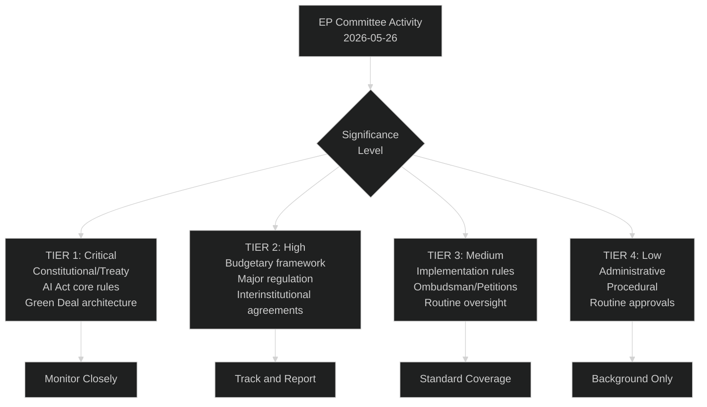

<!-- SPDX-FileCopyrightText: 2026 Hack23 AB -->
<!-- SPDX-License-Identifier: Apache-2.0 -->

# Significance Classification — EP Committee Reports | 2026-05-26

**Admiralty:** B2 — Probably true  
**Data Mode:** degraded-feeds  
**SATs Applied:** Key Assumptions Check, Competing Hypotheses Matrix  

---

## Significance Assessment Framework

## Significance Scoring Matrix

| Legislative Area | Committee | Significance | Justification |
|-----------------|-----------|-------------|---------------|
| AI Act delegated acts | ITRE/LIBE | 🔴 TIER 1 | World's first comprehensive AI law; implementation rules set global standard |
| Constitutional reform (AFCO) | AFCO | 🔴 TIER 1 | Treaty revision potential; interinstitutional balance; democratic legitimacy |
| Savings and Investments Union | ECON | 🟠 TIER 2 | EUR 750bn investment gap; capital markets deepening; IMF-endorsed |
| Defence Industrial Strategy | SEDE/BUDG | 🟠 TIER 2 | European strategic autonomy; NATO burden sharing; budget implications |
| Green Deal revision | ENVI/ITRE | 🟠 TIER 2 | 2030/2050 climate targets; industrial competitiveness trade-off |
| Migration Pact implementation | LIBE | 🟠 TIER 2 | Societal division; asylum system reform; member state relations |
| Clean Industrial Deal | ITRE | 🟠 TIER 2 | Competitiveness agenda; Draghi follow-up; energy costs |
| Banking Union/EDIS | ECON | 🟡 TIER 3 | Financial stability; politically sensitive; long-delayed |
| Agricultural policy reform | AGRI | 🟡 TIER 3 | CAP adaptation; food security; Green Deal farming provisions |
| Trade agreements | INTA | 🟡 TIER 3 | EU-Mercosur; post-tariff adjustment; supply chain resilience |
| Digital euro regulation | ECON | 🟡 TIER 3 | ECB-EP coordination; MiCA implementation; fintech oversight |
| Rule of Law conditionality | LIBE/AFCO | 🟡 TIER 3 | Article 7 enforcement; Hungary/Romania; budget conditionality |

## Classification Methodology

**SAT: Competing Hypotheses Matrix**

For each legislative area classified above, the competing hypotheses are:
- H1: This is a Tier 1 significance item (critical constitutional/AI Act level impact)
- H2: This is a Tier 2-3 significance item (important but below critical threshold)

**Assessment criteria:**
1. Irreversibility of committee decision (constitutional > regulatory > implementation)
2. Breadth of impact across EU member states and citizens (all-EU > sector-specific)
3. Time sensitivity (irreversible this week > revisable in plenary > correctable in implementation)
4. Political coalition implications (majority-defining > coalition-managing > technical)

## Key Assumptions (SAT)

1. Significance classification is relative to the 10th term legislative calendar — items deemed TIER 2 here might be TIER 1 in other parliamentary terms
2. AFCO constitutional work is elevated to TIER 1 because it is explicitly confirmed active (50+ documents) and constitutional matters are by definition the most significant category
3. AI Act delegated acts reach TIER 1 because failure to adopt them on schedule would leave the entire AI Act implementation in legal limbo

## Citizens' Significance Guide

**What matters most this week:** Constitutional affairs (AFCO) and AI regulation (ITRE/LIBE) are the highest-stakes activities. Constitutional decisions about how the EU works are nearly irreversible short of treaty change. AI Act delegated acts will govern how AI systems are developed and deployed in Europe for the next decade. Everything else — important though it is — can be revisited.

**For democratic engagement:** Tier 1 and Tier 2 items are the ones where citizen input to MEPs, civil society testimony at hearings, and public scrutiny of draft reports makes the most difference. Tier 3-4 items are largely technical and less responsive to public pressure in the short term.
