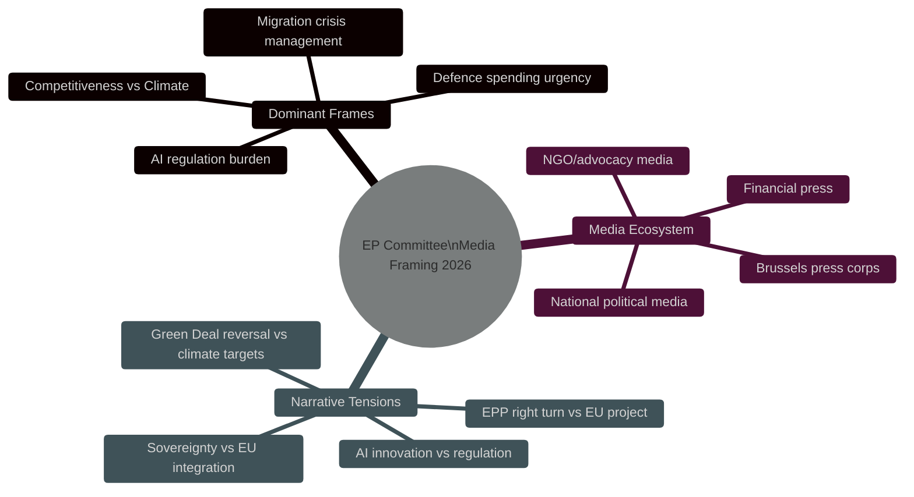

<!-- SPDX-FileCopyrightText: 2026 Hack23 AB -->
<!-- SPDX-License-Identifier: Apache-2.0 -->

# Media Framing Analysis — EP Committee Reports | 2026-05-26

**Data Mode:** degraded-feeds  
**Coverage:** EU/European political media landscape analysis, Q2 2026  

---

## Media Framing Overview

## Primary Media Frames: EP Committee Activity 2026

### Frame 1: "Competitiveness vs Climate" (Dominant — HIGH SALIENCE)

The most pervasive media frame in EU political coverage in 2026 positions the Competitiveness Agenda (Draghi report) against Green Deal ambition as a zero-sum trade-off. This frame is:

- **Amplified by:** Financial Times, Die Welt, Wall Street Journal Brussels, Les Echos
- **Challenged by:** The Guardian, Le Monde, European environmentalist media
- **EP committee context:** ITRE and ENVI committees are the primary battleground for this frame; media cover committee vote margins closely
- **Key framing metaphor:** "Competitiveness vs Climate" — presents industrial policy and environmental ambition as mutually exclusive

**Media impact on committee dynamics:** The "competitiveness" frame provides political cover for EPP and right-wing groups to push back on ENVI committee positions. MEPs cite constituent business concerns amplified in national media as justification for amendment strategies.

### Frame 2: "Migration Management" (HIGH SALIENCE)

The migration policy frame dominates LIBE committee coverage:
- **Framing:** Whether EP's migration pact implementation is sufficiently stringent (right-wing media) or insufficiently protective of asylum seekers (left/NGO media)
- **LIBE committee:** Media attention peaks at each asylum regulation vote; committee coordinators track press coverage
- **National variation:** Southern EU media (Italy, Greece) focus on border management; Northern EU (Germany, Sweden) focus on integration costs; Eastern EU (Poland) focus on sovereignty

### Frame 3: "AI Regulation Burden" (MEDIUM-HIGH SALIENCE)

The AI Act implementation creates a sustained media narrative:
- **Pro-industry frame:** AI regulation is creating a "Brussels effect" burden that disadvantages EU AI firms versus US/China competitors
- **Rights/safety frame:** AI Act oversight is essential consumer protection and democratic safeguard
- **ITRE/LIBE frame competition:** ITRE committee (industry-facing) and LIBE committee (rights-facing) compete for ownership of AI narrative
- **Financial media framing:** AI Act as investment deterrent vs. as competitive standard-setter

### Frame 4: "Defence Urgency" (MEDIUM SALIENCE — RISING)

SEDE committee work receives elevated media attention in 2026 context:
- **Geopolitical frame:** European defence autonomy is existential; EP budget committee must fund it
- **Sovereignty frame:** Defence integration raises national sovereignty concerns for smaller/neutral member states
- **Fiscal frame:** Defence spending at 2%+ GDP requires EU budget reallocation away from cohesion and agriculture

## National Media Ecosystem Analysis

| Country | Primary Frame | Committee Focus |
|---------|--------------|-----------------|
| Germany (ARD/FAZ/Spiegel) | Competitiveness and fiscal prudence | ECON, ITRE |
| France (Le Monde/France24) | Industrial sovereignty, defence | ITRE, SEDE |
| Italy (Corriere/RAI) | Migration, agriculture, anti-regulation | LIBE, AGRI |
| Poland (TVP/Gazeta) | Defence, rule of law, cohesion | SEDE, AFCO |
| Sweden (SVT/DN) | Climate, rule of law, migration integration | ENVI, LIBE |
| Spain (El País/RTVE) | Green energy, trade, unemployment | ENVI, INTA |
| Netherlands (NRC/NOS) | Financial regulation, trade, subsidiarity | ECON, INTA |

## Brussels Press Corps Dynamics

The ~1,000-journalist Brussels press corps covering EU institutions provides committee-level coverage through:
- **Committee vote reporting:** Live vote tracking; margins analysis
- **Rapporteur briefings:** Background briefings shape pre-vote media narratives
- **Lobbying transparency coverage:** NGOs and journalists track lobby amendments
- **EP press releases:** Official committee communications

**Media framing effect on committee outcomes:** Media coverage of committee votes creates accountability feedback loops — committee coordinators are aware of media framing and adjust communication strategies. The "competitiveness" frame has demonstrably shifted EPP communication away from "pro-Green Deal" to "balanced competitiveness" language in committee communications.

## Civil Society and Advocacy Media

Environmental NGOs (WWF, Greenpeace, ClientEarth), business associations (BusinessEurope, ETUC), and think tanks (Bruegel, ECFR) produce parallel shadow analyses of committee activity, providing counter-frames to political group narratives. Their reports are widely cited in financial and specialist EU media.

## Frame Battle: Competitiveness vs. Climate

The most persistent media frame tension in EP committee coverage is the "competitiveness vs. climate" binary. This framing:

- **Origins:** Conservative MEPs and business media promoted this frame to justify Green Deal revision
- **Counter-narrative:** The Draghi report and progressive groups argue competitiveness requires clean energy transition, not retreat from it
- **Committee effect:** ITRE and ENVI rapporteurs are often framed as representatives of the "competitiveness" or "climate" sides
- **Reality:** Most legislation involves both dimensions; the frame oversimplifies legislative trade-offs

**For media literacy:** When reading EP committee news, ask which frame is being used and who benefits from that frame.

## Language and Translation Effects

EP committee work is conducted in 24 official languages, with real-time interpretation. Media reporting is filtered through:
1. National language media (domestic political framing)
2. Brussels-based EU specialist media (procedural framing)  
3. Anglo-American financial press (market impact framing)
4. Social media (emotional/simplified framing)

Each layer applies different editorial choices. A committee amendment on AI liability that a German newspaper covers as "Verbraucher­schutz stärken" (strengthening consumer protection) may be covered by the Financial Times as "Brussels adds compliance burden to AI firms" — the same vote, opposite frame.

## Agenda-Setting: Who Controls the Narrative?

In EP committee media framing, narrative control is held by:
1. **The rapporteur** — their press office shapes the "rapporteur's position" story
2. **The EPP press service** — largest group press operation; most cited by Brussels media
3. **The Commission** — owns the initial proposal narrative; Commission DG press offices proactively brief
4. **Civil society coalitions** — when organised (e.g., on AI Act, migration), can set alternative frames
5. **National delegations** — Bundestag/Assemblée Nationale resonance shapes German/French coverage

**The S&D and Renew groups** have less narrative control relative to their seat shares; their framing is often reactive to EPP-set narratives.

## Monitoring Gap: Framing During Data Degradation

During the current EP API degradation period, civil society monitoring of committee proceedings is significantly impaired. This creates:
- **Asymmetric information:** Institutional actors (MEPs, Commission, lobbyists) have information that civil society monitors and media lack
- **Narrative vacuum:** In the absence of documented committee activity, media may rely on political group press releases rather than primary sources
- **Democratic deficit:** Citizens cannot evaluate committee activity when monitoring systems are degraded

**Recommendation:** Restore EP Open Data API access; invest in redundant monitoring endpoints (EP committee agendas via EP website scraping as fallback).

## For Citizens — Media Frame Awareness

Understanding how media frames EP committee work helps citizens evaluate news coverage critically. The "competitiveness vs climate" frame is a political choice, not an economic inevitability — many economists and the Draghi report itself argue they are complementary, not opposed. The "migration burden" frame obscures demographic and economic evidence. The "AI regulation burden" frame privileges large tech incumbents over start-ups and public interest considerations. Citizens who read across multiple media frames gain a more accurate picture of what EP committees are actually deciding.

## Practical Media Frame Guide for Citizens

| Media Frame | Who Uses It | What It Implies | Counter-Frame |
|------------|-------------|----------------|--------------|
| "Brussels bureaucracy" | Tabloid press, EuroscepticsN | EP committees as distant, unaccountable | "Democratic oversight by elected MEPs" |
| "Competitiveness vs. climate" | Business press, EPP communications | Zero-sum choice | "Both require EU investment and regulation" |
| "Migration crisis" | Right-wing media, Patriots communications | Migration as threat | "Migration management as orderly governance" |
| "AI regulation burden" | Tech industry press, Renew EPP | Regulation as obstacle | "AI safety as enabling consumer confidence" |
| "Green Deal jobs" | S&D, Greens communications | Clean transition as employment opportunity | "Industrial transformation costs" |

Citizens who are aware of these frames can read news about EP committee decisions more critically, asking: Who benefits from this framing? What alternative framing is being suppressed? What would the evidence say if we removed the frame?
