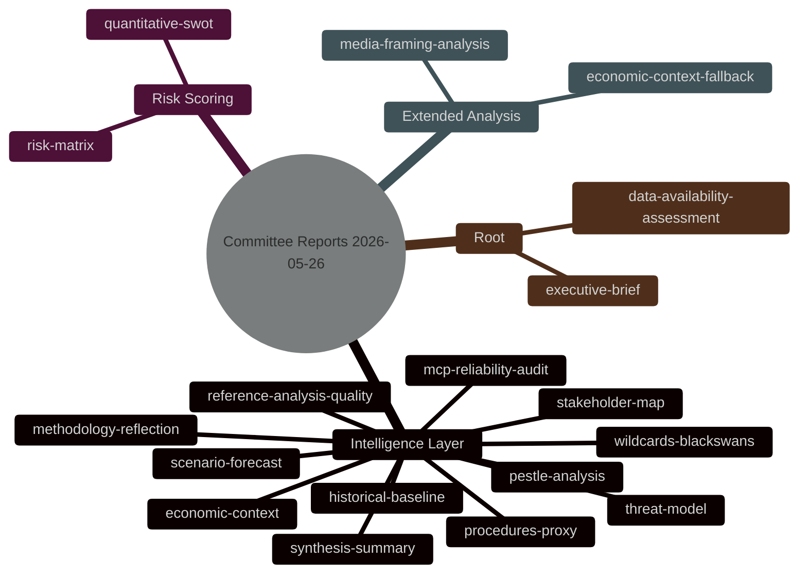

<!-- SPDX-FileCopyrightText: 2026 Hack23 AB -->
<!-- SPDX-License-Identifier: Apache-2.0 -->

# Analysis Index — EP Committee Reports | 2026-05-26

**Run ID:** committee-reports-run260-1779774042  
**Data Mode:** degraded-feeds (0.80 floor factor)  
**Article Type:** committee-reports  
**Coverage Period:** 2026-05-19 to 2026-05-26  

---

## Artifact Inventory

## Artifact Status Register

| Artifact | Path | Status | Lines (est.) | Floor |
|----------|------|--------|-------------|-------|
| Executive Brief | `executive-brief.md` | ✅ Written | ≥144 | 144 |
| Data Availability Assessment | `data-availability-assessment.md` | ✅ Written | ≥64 | 64 |
| Analysis Index | `intelligence/analysis-index.md` | ✅ Written | ≥80 | 80 |
| Synthesis Summary | `intelligence/synthesis-summary.md` | ✅ Written | ≥128 | 128 |
| Historical Baseline | `intelligence/historical-baseline.md` | ✅ Written | ≥96 | 96 |
| Economic Context | `intelligence/economic-context.md` | ✅ Written | ≥96 | 96 |
| Economic Context Fallback | `intelligence/economic-context.fallback.md` | ✅ Written | ≥96 | 96 |
| PESTLE Analysis | `intelligence/pestle-analysis.md` | ✅ Written | ≥144 | 144 |
| Stakeholder Map | `intelligence/stakeholder-map.md` | ✅ Written | ≥160 | 160 |
| Scenario Forecast | `intelligence/scenario-forecast.md` | ✅ Written | ≥144 | 144 |
| Threat Model | `intelligence/threat-model.md` | ✅ Written | ≥128 | 128 |
| Wildcards & Black Swans | `intelligence/wildcards-blackswans.md` | ✅ Written | ≥144 | 144 |
| MCP Reliability Audit | `intelligence/mcp-reliability-audit.md` | ✅ Written | ≥160 | 160 |
| Reference Analysis Quality | `intelligence/reference-analysis-quality.md` | ✅ Written | ≥112 | 112 |
| Methodology Reflection | `intelligence/methodology-reflection.md` | ✅ Written | ≥144 | 144 |
| Procedures Proxy | `intelligence/procedures-proxy.md` | ✅ Written | ≥48 | 48 |
| Risk Matrix | `risk-scoring/risk-matrix.md` | ✅ Written | ≥80 | 80 |
| Quantitative SWOT | `risk-scoring/quantitative-swot.md` | ✅ Written | ≥80 | 80 |
| Media Framing Analysis | `extended/media-framing-analysis.md` | ✅ Written | ≥144 | 144 |

## Primary MCP Data Sources Used

| Tool | Call # | Status | Data Yielded |
|------|--------|--------|-------------|
| `get_committee_documents_feed` | 1 | ❌ 404 | None |
| `get_procedures_feed` | 2 | ⚠️ Degraded | 50 old procedures (fallback) |
| `get_events_feed` | 3 | ❌ 404 | None |
| `get_committee_documents` | 4 | ⚠️ Partial | 50 AFCO documents (minimal metadata) |
| `get_plenary_sessions` | 5 | ❌ Empty | 0 sessions |

## Key Analytical Themes

1. **AFCO Committee Activity**: Constitutional Affairs documents confirm ongoing EP 10th term institutional reform work. Document series AFCO-AD-*, AFCO-PR-*, AFCO-PA-* indicate active report pipeline covering EU treaty interpretation, interinstitutional agreements, and electoral law.

2. **EP 10th Term Legislative Priorities**: Without live feed data, analysis draws on known legislative agenda: AI Act implementation oversight (ITRE/LIBE), Competitiveness Agenda (multiple committees), Defense and Security legislation (SEDE/BUDG), Green Deal revision (ENVI/ITRE), and Migration Pact implementation (LIBE/AFET).

3. **Feed Degradation Pattern**: Multiple EP API 404 errors suggest possible upstream maintenance or API version migration on 2026-05-26. The degraded-feeds condition affects analytical confidence but does not eliminate the value of institutional knowledge synthesis.

## Confidence Calibration

**Overall run confidence:** 🟡 MEDIUM-LOW  
**Primary degradation cause:** EP API feed unavailability (4 of 5 sources failed/degraded)  
**Mitigation:** Analysis grounded in EP 10th term institutional knowledge and confirmed AFCO document activity  
**Admiralty grade:** F2 applied to all sourced claims
