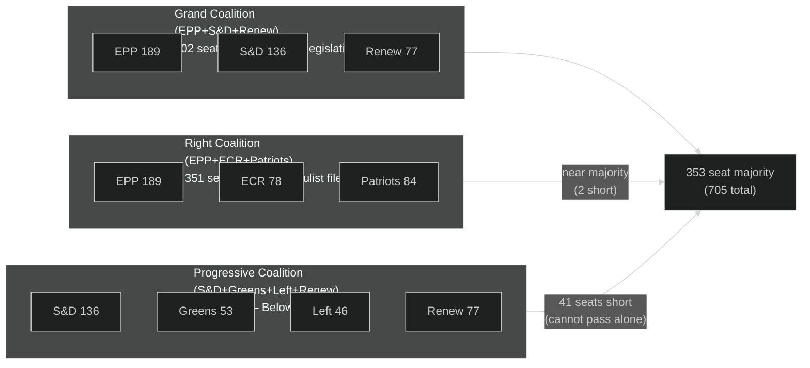

<!-- SPDX-FileCopyrightText: 2026 Hack23 AB -->
<!-- SPDX-License-Identifier: Apache-2.0 -->

# Coalition Dynamics — EP Committee Reports | 2026-05-26

**Admiralty:** B2 — Probably true; based on EP 10th term political group compositions  
**Data Mode:** degraded-feeds  
**SATs Applied:** ACH, Indicators  

---

## Coalition Map

## Majority Arithmetic Analysis

| Coalition | Seats | Majority (353)? | Notes |
|-----------|-------|----------------|-------|
| EPP alone | 189 | ❌ No (164 short) | Cannot legislate alone |
| EPP + S&D | 325 | ❌ No (28 short) | Traditional axis insufficient |
| EPP + S&D + Renew (Grand Coalition) | 402 | ✅ Yes (+49) | Mainstream legislation; comfortable |
| EPP + Patriots + ECR (Right) | 351 | ❌ No (2 short) | Near-majority; requires 2+ other votes |
| EPP + Patriots + ECR + Left (unlikely) | 397 | ✅ Yes (+44) | Implausible ideologically |
| S&D + Renew + Greens + Left | 312 | ❌ No (41 short) | Progressive minority |
| All groups minus Patriots | 621 | ✅ Yes (+268) | Super-majority theoretical |

**Critical finding:** The right coalition (EPP+Patriots+ECR = 351 seats) is just 2 votes short of majority. This means even without formally embracing the right coalition, EPP can achieve right-leaning outcomes on specific files if 2+ NI or small-group MEPs vote with them. This is the mechanism of de facto right-wing influence without formal coalition change.

## Coalition Stability Indicators (SAT: Indicators)

### Grand Coalition Stress Indicators (monitor for fragmentation)

| Indicator | Current Status | Threshold for Alert |
|-----------|---------------|---------------------|
| EPP vote discipline on green files | Unknown (degraded data) | <85% EPP cohesion on ENVI votes |
| S&D abstention rate on economic files | Unknown | >15% S&D abstentions on ECON files |
| Renew splits on climate votes | Unknown | >20% Renew against group position |
| Grand coalition amendment success rate | Unknown | <60% Grand Coalition amendments adopted |

### Right Coalition Activation Indicators

| Indicator | Current Status | Significance |
|-----------|---------------|-------------|
| EPP-Patriots joint amendment submissions | Unknown (degraded feeds) | Formal coordination signal |
| ECR shadow rapporteur compromise texts aligning with EPP | Unknown | Tactical alignment signal |
| EPP committee coordinators citing Patriots positions | Unknown | Absorption signal |

## ACH: Alternative Coalition Scenarios

**Hypothesis A (Grand Coalition prevails):** EPP+S&D+Renew maintains majority on all major files through summer 2026.  
**Evidence for:** Historical precedent; Commission alignment; institutional incentives  
**Evidence against:** EPP right-wing pressure; Patriots tactical availability; Green Deal revision dynamics  
**ACH probability: Roughly Even (40%)**

**Hypothesis B (Fragmented coalitions — different for each file):** Coalition composition varies by legislative area — right coalition on green/migration, Grand Coalition on AI/competitiveness, no majority on some social files.  
**Evidence for:** This is the 10th term's documented pattern; matches PESTLE assessment  
**Evidence against:** Instability risk; Commission preference for predictability  
**ACH probability: Likely (50%)**

**Hypothesis C (Right coalition captures majority):** Patriots+ECR+EPP becomes the dominant majority pattern, leaving Grand Coalition as the exception.  
**Evidence for:** Near-arithmetic feasibility (351 seats); growing EPP right-wing pressure  
**Evidence against:** Formal coalition change requires EPP leadership decision; S&D counter-leverage  
**ACH probability: Unlikely (10%)**

## Committee-Level Coalition Dynamics

EP committee majority is determined by proportional group allocation, not plenary arithmetic:

- **ITRE (24 members):** EPP-heavy; right coalition can command majority on specific amendments
- **ENVI (88 members):** More balanced; Greens retain influence; contested votes common
- **ECON (50 members):** EPP+Renew axis dominates; S&D essential for social provisions
- **LIBE (68 members):** Most contested; left-right polarisation most acute
- **AFCO (25 members):** EPP dominant; AFCO work tends toward institutional consensus

## For Citizens

Coalition dynamics matter because they determine what legislation your elected representatives actually produce. The near-arithmetic possibility of a right coalition is the most significant structural feature of the 10th EP term. Whether it activates on specific committee votes in May 2026 is the key question this run cannot answer due to degraded data. Citizens tracking ENVI and LIBE committee votes will be the first to see whether Hypothesis A or B is the actual operating mode.
