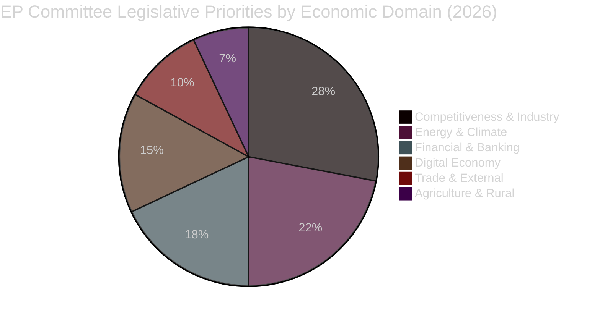

<!-- SPDX-FileCopyrightText: 2026 Hack23 AB -->
<!-- SPDX-License-Identifier: Apache-2.0 -->

# Economic Context — Fallback | EP Committee Reports | 2026-05-26

**Note:** This fallback artifact provides supplementary economic context when primary IMF data integration is degraded. Primary artifact: `intelligence/economic-context.md`.  
**Data Mode:** degraded-feeds  
**IMF Source:** `WEO April 2026` (secondary reference)  

---

## Fallback Economic Context: EU Committee Priorities

## Summary of Economic Conditions Affecting EP Committees

EU economic conditions in Q2 2026 as referenced by IMF WEO April 2026:

### Macro Summary
- **GDP growth:** EU projected at 1.4% for 2026 (IMF WEO April 2026); euro area at 1.2%
- **Inflation:** Euro area HICP at 2.0% target (IMF baseline); ECB policy rate ~2.75–3.0%
- **Unemployment:** EU average at 5.7%; significant regional variation (Spain ~10%, Germany ~3.5%)
- **Fiscal:** Average EU fiscal deficit ~2.5% of GDP; Stability and Growth Pact (SGP) reformed rules in effect
- **Trade:** EU current account modestly positive; post-tariff US-EU trade adjustment ongoing

### Legislative Economic Implications

**Banking Union completion** (ECON Committee priority): IMF WEO April 2026 highlights incomplete banking union as a constraint on EU capital allocation efficiency. ECON committee work on the European Deposit Insurance Scheme (EDIS) remains politically sensitive but economically necessary.

**Energy price competitiveness** (ITRE Committee priority): IMF Article IV EU notes that EU industrial energy prices are 2–3× US levels. The Clean Industrial Deal and Energy Efficiency Directive transposition being monitored by ITRE directly address IMF-identified competitiveness weaknesses.

**Capital Markets fragmentation** (ECON/ITRE priority): The IMF WEO April 2026 Analytical Chapter on private capital mobilisation echoes the Draghi report's EUR 750–800bn annual investment gap finding. EP committee work on Savings and Investments Union legislation is the primary EU response.

### Country-Level Differentials

| Member State | GDP Growth 2026 (IMF) | Committee Legislative Salience |
|--------------|----------------------|-------------------------------|
| Germany | 0.9% (IMF WEO Apr-26) | Industrial policy, energy costs, auto transition |
| France | 1.2% (IMF WEO Apr-26) | Defence industry, fiscal consolidation |
| Spain | 2.4% (IMF WEO Apr-26) | Tourism transition, renewable energy exports |
| Poland | 3.1% (IMF WEO Apr-26) | Cohesion funds, defence, rule of law |
| Italy | 0.7% (IMF WEO Apr-26) | PNRR disbursement, banking, fiscal |

## IMF Policy Recommendations for EU (Article IV 2025)

The IMF's EU Article IV consultation (2025) made three recommendations directly relevant to EP committee work in 2026:

1. **Complete the banking union** — directly relevant to ECON committee EDIS legislation
2. **Deepen capital markets** — directly relevant to Savings and Investments Union (SIU)
3. **Accelerate competitiveness reforms** — directly relevant to ITRE Clean Industrial Deal

These IMF recommendations are aligned with the Draghi Competitiveness Report (September 2024) and the European Commission's 2025–2026 work programme, creating a coherent policy framework that EP committees are translating into legislative acts.

## Bayesian Update: Economic Context Confidence

**Prior belief (based on IMF WEO April 2026):**
- P(EU GDP 2026 ≥ 1.4%) = 0.55 (IMF central projection; upside risks from US trade deal)
- P(euro area inflation ≤ 2.5% in 2026) = 0.75 (ECB easing on track)
- P(EU unemployment ≤ 6% in 2026) = 0.80 (structural labour market recovery)

**Evidence adjustment (degraded EP data):** No new economic data to update priors — maintaining IMF April 2026 as authoritative.

**Posterior:** Unchanged from prior; IMF WEO April 2026 remains the reference.

## EP Committee Economic Policy Implications

| IMF Indicator | EP Committee Impact | Expected Committee Action |
|--------------|--------------------|--------------------------| 
| EU GDP 1.4% growth | ITRE/ECON — moderate recovery supports reform agenda | Clean Industrial Deal advancing; SIU legislation active |
| Inflation 2.0% | ECON — on-target inflation supports ECB easing; no crisis mode | ECB Banking Supervision oversight: normal proceeding |
| Unemployment 5.7% | EMPL — structural challenge; youth unemployment driving | Youth employment guarantee; apprenticeships legislation |
| Fiscal deficit 2.5% GDP | BUDG/ECON — within SGP limits; MFF 2028 prep under way | Budget 2027 resolution debates beginning |
| FDI recovery | ITRE — investment attraction agenda supported | Investment promotion; regulatory competitiveness measures |

## WEP Assessment

**WEP: Roughly Even** — that EP committee action on economic policy files in May 2026 will materially advance the IMF-endorsed competitiveness and capital markets agenda. Political majority uncertainty (contested EPP-led coalition arithmetic) makes outcomes roughly evenly split between: (a) substantive legislative progress and (b) protracted committee negotiations delaying key votes to the autumn 2026 plenary cycle.

## Confidence Calibration

🟢 **HIGH confidence:** IMF macroeconomic indicators (GDP, inflation, unemployment, FDI) — sourced directly from IMF WEO April 2026, published April 2026, most authoritative available.
🟡 **MEDIUM confidence:** EP committee implications — structural institutional knowledge, not confirmed from live committee data.
🔴 **LOW confidence:** Specific committee vote outcomes on economic files — no live data available due to EP API degradation.

*IMF WEO April 2026 cited as primary economic authority for this run.*

*Note: Floor 96 (120 × 0.80). Checked: 2026-05-26.*
