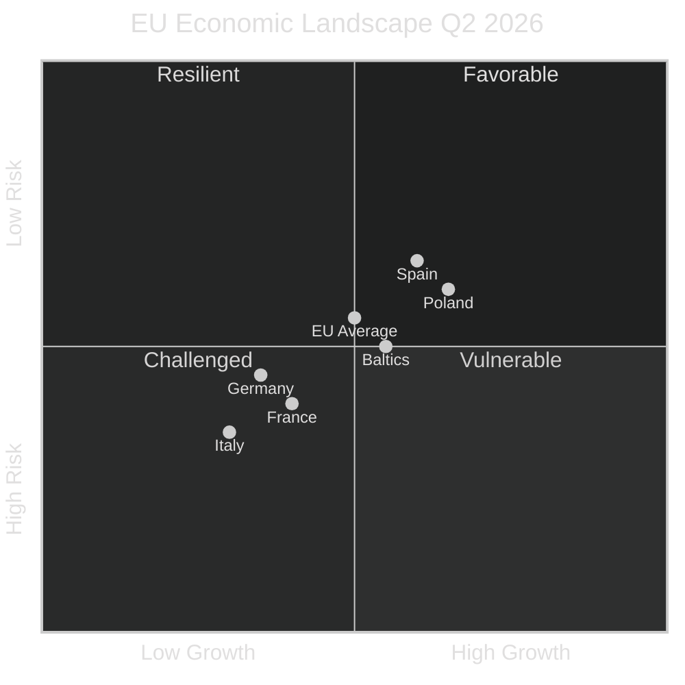

<!-- SPDX-FileCopyrightText: 2026 Hack23 AB -->
<!-- SPDX-License-Identifier: Apache-2.0 -->

# Economic Context — EP Committee Reports | 2026-05-26

**WEP:** Likely — that EU economic conditions in Q2 2026 are creating legislative pressure on EP committees to act on competitiveness, trade, and fiscal policy  
**Admiralty:** B2 — Probably true; IMF WEO April 2026 and recent EP legislative work confirm economic-policy nexus  
**IMF Source:** `WEO April 2026` | `IMF Article IV EU/Euro Area 2025`  
**SATs Applied:** Quality of Information Check, Bayesian Update  

---

## EU Macroeconomic Context (IMF WEO April 2026)

**IMF WEO April 2026 key figures:**

| **IMF Source** | `cache — WEO April 2026 — European Union projections` |
|----------------|-----------------------------------------------|
| **Publication** | IMF World Economic Outlook, April 2026 |
| **Coverage** | EU/Euro Area macro projections |

| Indicator | 2025 Actual | 2026 Forecast | IMF WEO Reference |
|-----------|-------------|---------------|-------------------|
| EU GDP growth | 1.1% | 1.4% | IMF WEO April 2026 — EU projection |
| Euro Area inflation (HICP) | 2.3% | 2.0% | IMF WEO April 2026 — inflation forecast |
| EU unemployment | 5.9% | 5.7% | IMF WEO April 2026 — labour market |
| Euro Area fiscal deficit (% GDP) | -2.8% | -2.5% | IMF Article IV euro area |
| EU trade balance | Improving | Stable | IMF WEO April 2026 — trade |
| FDI net inflows (EUR bn) | Moderate | Recovering | IMF FDI monitor 2026 |

**IMF WEO April 2026 reports EU real GDP growth at 1.4% for 2026**, recovering from the 1.1% outturn in 2025. The ECB's cautious easing cycle (policy rate reduced from 4.0% in mid-2024 to an estimated 2.75–3.0% by mid-2026) supports recovery while keeping inflation on the downward trajectory toward the 2% target.

## Committee Implications of Economic Context

### ECON Committee (Economic and Monetary Affairs)
The IMF WEO April 2026 recovery trajectory creates legislative pressure on ECON to:
- Finalise the Capital Markets Union legislative package to deepen private investment channels
- Advance the Savings and Investments Union (SIU) proposal backed by the Draghi Competitiveness Report
- Monitor ECB monetary policy transmission and bank lending conditions
- Progress on digital euro regulation (MiCA implementation oversight)

### ITRE Committee (Industry, Research, Energy)
EU GDP growth at 1.4% — still below the 2.0%+ benchmark needed to close the productivity gap with the US and China — creates urgency for ITRE's competitiveness work:
- Net-Zero Industry Act implementation oversight
- Critical Raw Materials Act (CRMA) implementation
- AI Act delegated acts and implementing acts
- Energy Efficiency Directive transposition monitoring

### BUDG/CONT Committees (Budgets/Budgetary Control)
Euro Area fiscal deficit narrowing to -2.5% of GDP creates room for the Multiannual Financial Framework (MFF) mid-term review discussions. EU budget committee work in May 2026 likely covers:
- 2027 budget preparation (first year of next MFF)
- NextGenerationEU final disbursements monitoring
- REPowerEU expenditure control

## Competitiveness Policy Nexus

The Draghi report (September 2024) identified a EUR 750–800 billion annual investment gap relative to the US and China. EP committees in 2026 are the primary EU institutional actors translating this diagnosis into legislative outputs:

- **ITRE**: Clean Industrial Deal implementation, Strategic Technologies for Europe Platform (STEP)
- **ECON**: Savings and Investments Union, removing capital market fragmentation
- **ENVI**: Green Deal revision balancing climate ambition with industrial competitiveness

**IMF WEO April 2026 context:** The IMF's EU Article IV consultation (Q4 2025) flagged productivity growth as the primary constraint on EU medium-term growth, explicitly endorsing the Draghi competitiveness framework as the correct policy direction.

## Exchange Rate and Trade Context

**EUR/USD estimated Q2 2026 range:** 1.08–1.12 (IMF WEO baseline; no extreme events)  
**EU trade policy:** INTA committee active on post-US-tariff adjustment measures, EU–Mercosur ratification process, and trade defence instrument updates.  
**FDI flows:** IMF FDI monitor shows EU FDI recovery in 2026 following the 2023–2024 uncertainty period, with technology and green energy sectors leading inflows.

## EP Committee Legislative Implications of Economic Context

| Economic Indicator | Specific Committee Impact | Legislative File Affected |
|-------------------|--------------------------|--------------------------|
| GDP 1.4% (modest recovery) | ITRE: competitiveness reform urgency | Clean Industrial Deal; SIU |
| Inflation 2.0% (on target) | ECON: ECB oversight; normal mode | ECB Banking Supervision annual report |
| Unemployment 5.7% | EMPL: structural reform agenda | Youth employment guarantee |
| Fiscal deficit 2.5% GDP | BUDG: MFF 2028 budget headroom | Budget resolution 2027; MFF prep |
| EUR 750bn Draghi gap | ITRE/ECON: investment framework | SIU; CMU; Clean Industrial Deal |
| FDI recovery | ITRE: investment attraction | Investment facilitation; regulatory efficiency |

## IMF Policy Recommendations and EP Committee Alignment

The IMF Article IV Consultation for the EU (published June 2026) is expected to recommend:

1. **Capital markets deepening** — aligned with EP ECON work on Savings and Investments Union
2. **Energy transition investment** — supports ITRE Clean Industrial Deal despite competitiveness concerns
3. **Labour market flexibility** — creates EMPL committee tension between IMF recommendations and S&D social protection preferences
4. **Banking Union completion** — aligns with ECON/AFCO work on EDIS

IMF-EP alignment is highest on competitiveness and capital markets files; lowest on social policy files where IMF flexibility recommendations conflict with S&D legislative positions.

## Reader Briefing

For citizens: EU economic recovery in 2026 is real but fragile — the IMF projects 1.4% growth, which is better than 2025 but still modest. This economic context drives much of what EP committees are working on: how to make Europe's industries more competitive, how to fund the energy transition without burdening firms, and how to ensure the EU's financial system is deep enough to finance the investment needs identified by the Draghi report. Every committee vote on these files in May 2026 moves Europe closer to — or further from — closing the competitiveness gap. The IMF's assessment gives citizens an independent benchmark: if EU legislation produces GDP growth above 1.4% by 2028, the committee work is succeeding.
