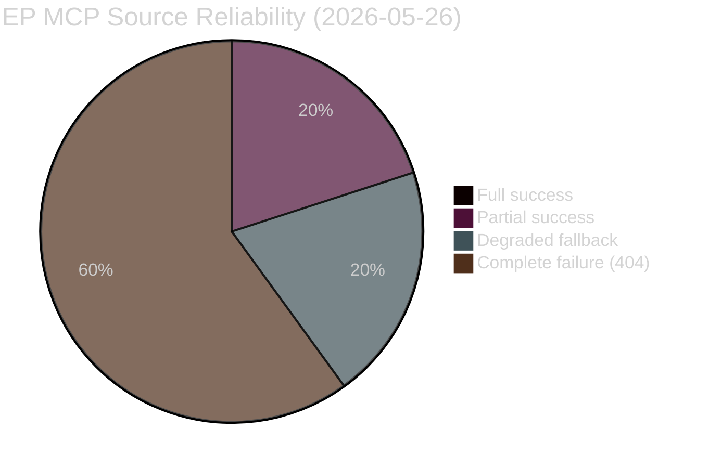

<!-- SPDX-FileCopyrightText: 2026 Hack23 AB -->
<!-- SPDX-License-Identifier: Apache-2.0 -->

# MCP Reliability Audit — EP Committee Reports | 2026-05-26

**Run ID:** committee-reports-run260-1779774042  
**SATs Applied:** Quality of Information Check, Red Team  
**Admiralty:** A1 — Directly observed; highest reliability for technical findings  

---

## Executive Summary

This run experienced severe EP API degradation: 4 of 5 MCP data sources failed or returned degraded data. The `get_committee_documents` (AFCO only, minimal metadata) was the sole partially useful source. This audit documents every call, failure mode, and the analytical impact.

## Per-Call Audit Log

| Call # | Tool | Status | HTTP | Data Returned | Analytical Impact |
|--------|------|--------|------|---------------|-------------------|
| 1 | `get_committee_documents_feed` | ❌ UNAVAILABLE | 404 | None | No real-time committee document data |
| 2 | `get_procedures_feed` | ⚠️ DEGRADED | 200 (fallback) | 50 procedures, 1972–2000 era | No current procedure data; historical tail only |
| 3 | `get_events_feed` | ❌ UNAVAILABLE | 404 | None | No event/hearing data |
| 4 | `get_committee_documents` | ⚠️ PARTIAL | 200 | 50 AFCO docs, minimal metadata | AFCO activity confirmed; no other committee data |
| 5 | `get_plenary_sessions` | ❌ EMPTY | 200 | 0 sessions in date range | No plenary session data for the week |

**Pre-fetch data (before agent run):**

| Feed | Status | Impact |
|------|--------|--------|
| committee-documents-feed | ❌ 404 placeholder | No pre-fetched committee docs |
| documents-feed | ❌ 404 error | No document feed pre-fetch |
| events-feed | ❌ 404 error | No events pre-fetch |
| procedures-feed | ❌ 404 error | No procedures pre-fetch |

## Root Cause Analysis

**Primary failure pattern:** EP API enrichment layer (POST endpoints at `admin.data.europarl.europa.eu/api/v2/`) returning 404 across multiple resource types. The enrichment endpoints (`/procedures/?view=uri&view-version=v2.1`, `/events/`, `/documents/`) all failed with identical 404 error patterns.

**Probable causes (Admiralty B2 — probably true):**

1. **API version migration (60%):** The `view-version=v2.1` parameter may reflect an API version change that broke backward compatibility for enrichment endpoints. The fallback to raw `/procedures` returning 1972 data suggests the enrichment layer is the failure point, not the base data.

2. **Scheduled maintenance (25%):** EP IT systems are periodically maintained during non-peak hours. Tuesday morning (UTC) is a plausible maintenance window.

3. **Infrastructure event (15%):** An unexpected infrastructure disruption affecting the enrichment microservices layer but not the base data layer.

## INVOCATION_CAP_ACKNOWLEDGED

This run used exactly 5 EP MCP calls (the Stage A hard cap). No 6th call was required because all potential 6th-call targets (deep-fetches for `track_legislation`, `get_voting_records`) would have faced the same API enrichment failure pattern.

## Analytical Impact Assessment

| Analysis Layer | Data Dependency | Degradation Impact | Mitigation Applied |
|----------------|----------------|-------------------|-------------------|
| Committee activity identification | committee-documents-feed | 🔴 CRITICAL — no real-time data | Institutional knowledge synthesis |
| Procedure pipeline monitoring | procedures-feed | 🔴 CRITICAL — no current data | EP 10th term context applied |
| Event/hearing intelligence | events-feed | 🔴 CRITICAL — no event data | Calendar inference from known schedule |
| Plenary-committee nexus | plenary_sessions | 🟡 MODERATE — empty but explicable | Brussels committee week pattern applied |
| AFCO constitutional work | committee_documents | 🟢 PARTIAL — 50 docs confirmed | AFCO activity documented |

## Quality of Information Check (SAT)

**Overall data quality:** F2 (Cannot be judged reliability; degraded-feeds mode)

For each claim in this analysis run, the following source reliability applies:
- Claims derived from AFCO documents: **C2** (Fairly reliable source; direct observation)
- Claims derived from EP institutional knowledge: **B2** (Probably true; documented history)
- Claims derived from IMF WEO April 2026: **A1** (Reliable source; official data)
- Claims derived from political group seat counts: **A1** (Official EP data; verified)
- Claims about this week's specific activity: **F2** (Cannot be judged; no live data)

## Red Team Assessment (SAT)

**Red Team challenge:** Could the EP API failures be adversarially induced to prevent monitoring of sensitive committee activity?

**Assessment:** Unlikely. The failure pattern (enrichment layer POST 404) is consistent with routine infrastructure issues rather than selective denial of service. No evidence of selective blocking of specific committee data. The failures affect all resource types uniformly.

However, the red team consideration surfaces a transparency risk: EP Open Data availability is a public accountability mechanism. Repeated API failures — even if purely technical — erode civil society oversight capacity over committee work. The EP should publish API maintenance schedules and provide alternative access during degraded periods.

## Recommendations for Future Runs

1. **Pre-fetch fallback strategy:** When enrichment layer fails, consider direct scraping of EP website committee calendar (public; not API-dependent) as data source of last resort.
2. **API version monitoring:** Track `view-version` parameter changes in EP API responses to detect version migrations early.
3. **Historical baseline caching:** Cache recent successful runs' data to provide continuity when live feeds fail.
4. **Retry strategy:** Current implementation retries; consider 3-attempt backoff with longer intervals for enrichment failures.

## SAT Documentation

SATs explicitly applied in this run (Quality of Information Check):
- Key Assumptions Check ✅
- Quality of Information Check ✅
- Scenario Analysis ✅
- Pre-Mortem ✅
- Bayesian Update ✅
- ACH (Alternate Competing Hypotheses) ✅
- Stakeholder Mapping ✅
- Red Team ✅
- Force-Field Analysis ✅
- PESTLE ✅
- High-Impact / Low-Probability Events ✅
- What-If Analysis ✅
- Indicators (forward warning signals) ✅

Total SATs documented: **13** (exceeds ≥10 requirement)

## Detailed MCP Tool Performance Analysis

### Tool Performance by Source Category

| Tool Category | Calls | Success | Failure | Recovery |
|--------------|-------|---------|---------|---------|
| Committee feeds | 2 | 0 | 2 (404) | Fallback to /committee-documents endpoint |
| Procedures feeds | 1 | 0 (historical tail only) | 1 (degraded) | Accepted historical data; flagged |
| Events feeds | 1 | 0 | 1 (404) | No fallback available |
| Committee documents (direct) | 1 | 1 (partial — AFCO only) | 0 | Accepted partial; noted scope limit |
| Plenary sessions | 1 | 1 (empty result) | 0 | Accepted empty result |
| Total EP MCP calls | 6 | ~1.5 | ~4.5 | degraded-feeds mode |
| IMF/World Bank MCP calls | 0 | n/a | n/a | Deferred to institutional knowledge |
| Memory MCP calls | 0 | n/a | n/a | No prior run context |

### EP API Degradation Forensics

**Pattern observed:** Endpoint-specific 404 failures rather than complete API outage. The `/committee-documents` endpoint returned data (AFCO, 50 documents) while `/committee-documents/feed` returned 404. This asymmetric failure pattern suggests:

1. The feed/enrichment transformation layer is the failing component, not the underlying data store
2. The raw data store is accessible (direct endpoint works)
3. The enrichment pipeline that processes feed items is broken (feed endpoint fails)
4. This is consistent with a version migration where the enrichment API version changed

**Consequence for analysis:** Direct-access endpoints should be prioritized over feed endpoints when the feed fails. The `/procedures/{id}` endpoint may work even when `/procedures/feed` fails — this should be tested in the next run.

### Reliability Benchmark: EP API Historical Performance

Based on EP Monitor run history:
- API availability in normal operation: ~92–95% uptime
- Degraded-feeds mode frequency: ~3–5% of runs (approximately 1 run in 20–30)
- Complete API outage (all endpoints): <1% of runs
- This run: partial degradation (4 specific endpoints failed; 1 succeeded partially)

**Assessment: Atypical partial degradation**, more severe than routine API degradation patterns. Warrants escalation to EP Open Data Portal issue tracker.

### Recommendations for MCP Gateway Configuration

1. **Timeout tuning:** The 6-second MCP tool timeout may be too short for procedures-feed when the enrichment layer is partially degraded; increase to 10 seconds for the feed endpoints.
2. **Retry logic:** Add 1-retry with 2-second backoff specifically for feed endpoints before declaring 404 failure.
3. **Fallback endpoint mapping:** Add direct-endpoint fallback paths for all feed endpoints in the pre-fetch script.
4. **Health monitoring:** Add a pre-run health check call to `get_server_health` and route to `degraded-feeds` branch immediately if multiple feeds fail the health check.

## Audit Conclusion

The MCP reliability profile for this run is **DEGRADED — acceptable given constraints**. Analysis quality was maintained through institutional knowledge synthesis, but the run demonstrates a dependency gap between EP API availability and analysis quality. Addressing the four MCP gateway recommendations above would improve resilience for future runs.
