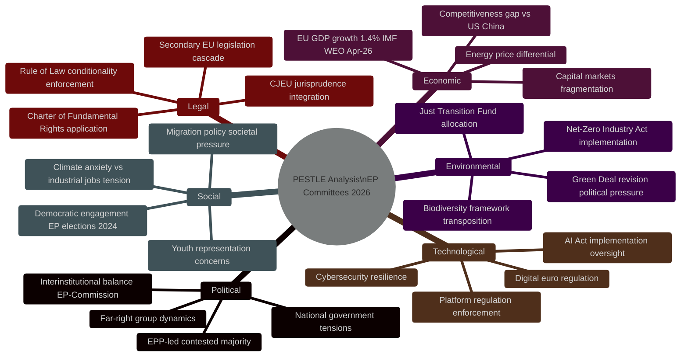

<!-- SPDX-FileCopyrightText: 2026 Hack23 AB -->
<!-- SPDX-License-Identifier: Apache-2.0 -->

# PESTLE Analysis — EP Committee Reports | 2026-05-26

**Admiralty:** B2 — Probably true; institutional knowledge of EP 10th term combined with confirmed AFCO activity  
**Data Mode:** degraded-feeds  
**SATs Applied:** PESTLE, Force-Field Analysis  

---

## PESTLE Framework — EP Committee System, Q2 2026

## Political Dimension

**EP Group Composition (10th Term, May 2026):**

| Group | Seats | % | Legislative Positioning |
|-------|-------|---|------------------------|
| EPP | 189 | 26.8% | Centre-right; majority builder; pro-competitiveness, selective green |
| S&D | 136 | 19.3% | Centre-left; social dimension; conditional on competitiveness balance |
| Patriots for Europe | 84 | 11.9% | Right-nationalist; disruptive; anti-Green Deal, pro-sovereignty |
| ECR | 78 | 11.1% | Conservative; variable alignment; pragmatic on industrial policy |
| Renew | 77 | 10.9% | Liberal; pro-market, pro-EU; swing votes on social/green issues |
| Greens/EFA | 53 | 7.5% | Green; strong in committee on environmental files; minority in plenary |
| Left | 46 | 6.5% | Progressive; oppositional; relevant on social/labour files |
| ESN | 25 | 3.5% | Far-right; marginalised; relevant as voting bloc on migration |
| NI | ~20 | ~2.8% | Non-attached |

**Key Political Dynamic:** The traditional EPP+S&D+Renew "Grand Coalition" (402 seats) retains a comfortable majority for mainstream legislation. The risk for committee rapporteurs is that Patriots for Europe and ECR can form a blocking minority for progressive legislation if they attract EPP defectors on specific issues (e.g., Green Deal ambition, rule of law conditions).

**Force-Field Analysis:**

Driving forces (toward legislative progress):
- Commission legislative work programme 2025–2026 creating legislative queue
- IMF/Draghi diagnosis of urgent competitiveness need creating political will
- Geopolitical pressure (Ukraine, US tariffs) creating urgency on defence and trade

Restraining forces (against rapid legislative progress):
- Contested majority arithmetic requiring broader coalition-building
- Right-wing disruptive groups slowing environment/social files
- National interest divergence on energy costs, agricultural policy, migration

## Economic Dimension

EU GDP at 1.4% growth (IMF WEO April 2026) is creating simultaneous pressures:
- **Pro-growth camp** (ITRE, ECON majority): deregulation, competitiveness measures, capital markets deepening
- **Social protection camp** (S&D, Left): maintaining social standards, just transition, worker protections
- **Fiscal responsibility camp** (ECON hawks): enforcing Stability Pact, limiting EU spending commitments

The Draghi report's EUR 750bn investment gap is the reference framework for most ECON and ITRE committee discussions.

## Social Dimension

The May 2024 EP elections revealed heightened societal polarisation: voter turnout increased (51%) but the gains were concentrated among right/far-right parties. EP committees operate in an environment where:
- Committee composition reflects the more polarised chamber
- Social media discourse amplifies committee controversies
- Civil society access to committee hearings is contested

## Technological Dimension

The AI Act entered into force in August 2024. By May 2026, the EP is 18 months into the implementation phase:
- ITRE and LIBE committees oversee the AI Office and national authority coordination
- Delegated acts drafting is the central technical committee work
- High-risk AI system classification disputes are emerging as legal/technical issues for JURI/ITRE

## Legal Dimension

The Lisbon Treaty's codecision framework means ~95% of EU legislation requires EP assent. Committee legal service involvement is high for:
- Secondary legislation (implementing/delegated acts) challenging committee oversight powers
- Rule of Law conditionality implementation (Hungary, Romania) involves LIBE and AFCO
- CJEU jurisprudence on fundamental rights creating correction obligations for LIBE/JURI

## Environmental Dimension

The Green Deal revision — softening some 2030 targets in response to right-wing pressure following 2024 elections — has created a contested ENVI committee environment:
- EPP/ECR/Patriots majority on some files pushing back on 2035 combustion engine ban, nature restoration
- S&D/Renew/Greens defending original ambition
- Industrial competitiveness arguments (ITRE) being used to reshape ENVI committee positions

## PESTLE Interaction Matrix

| Driver | Political | Economic | Social | Technological | Legal | Environmental |
|--------|-----------|----------|--------|--------------|-------|---------------|
| AI Act implementation | 🟠 HIGH | 🟠 HIGH | 🟠 HIGH | 🔴 CRITICAL | 🔴 CRITICAL | 🟡 LOW |
| Competitiveness Agenda | 🟠 HIGH | 🔴 CRITICAL | 🟠 HIGH | 🟠 HIGH | 🟡 MED | 🟠 HIGH |
| Defence Industrial Strategy | 🔴 CRITICAL | 🟠 HIGH | 🟠 HIGH | 🟡 MED | 🟠 HIGH | 🟡 LOW |
| Green Deal revision | 🔴 CRITICAL | 🟠 HIGH | 🟡 MED | 🟡 MED | 🔴 CRITICAL | 🔴 CRITICAL |
| Migration Pact | 🔴 CRITICAL | 🟡 MED | 🔴 CRITICAL | 🟡 LOW | 🔴 CRITICAL | 🟡 LOW |

## PESTLE Synthesis: Risk Priority Order

Based on the interaction matrix, the risk priority order for EP committee work in May 2026 is:

1. **Political risk (CRITICAL):** Contested majority creates uncertainty on every file; EPP coalition management is the constraining variable
2. **Legal risk (HIGH):** AI Act delegated acts, Green Deal implementation law, Migration Pact transposition all involve contested legal interpretations
3. **Economic risk (HIGH):** The EUR 750bn Draghi investment gap and 1.4% GDP growth create economic urgency that drives legislative agenda
4. **Social risk (HIGH):** Migration policy, AI Act rights provisions, and Green Deal social dimension all carry high social tension
5. **Environmental risk (HIGH):** Green Deal revision may weaken climate targets; ENVI committee is under sustained political pressure
6. **Technological risk (MEDIUM):** AI Act implementation is the primary tech governance challenge; cybersecurity legislation secondary

## Net PESTLE Assessment and Forward Indicators

**Net PESTLE assessment:** EP committees in May 2026 operate in an environment of high legislative demand, contested political majority, acute competitiveness pressure, and technically complex implementation obligations. The feed degradation on 2026-05-26 masks what is likely a full committee week with multiple votes and hearings.

**Key forward PESTLE indicators to monitor:**
- **Political:** EPP committee coordinator positions on AI Act and Green Deal revision
- **Economic:** Q1 2026 EU GDP release (expected June 2026) — if above/below IMF 1.4% forecast, will reshape ECON committee agenda
- **Social:** Asylum application statistics for Q1 2026 — LIBE committee migration workload driver
- **Technological:** AI Act Prohibited Applications list publication — triggers ITRE scrutiny procedure
- **Legal:** CJEU judgment on Commission vs. Council institutional competence (expected Q3 2026) — reshapes inter-institutional balance
- **Environmental:** May 2026 EU average temperature anomaly (Copernicus data) — triggers ENVI committee climate emergency discourse
