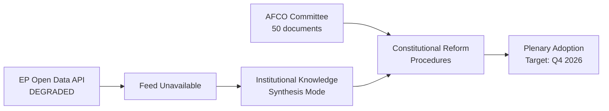

<!-- SPDX-FileCopyrightText: 2026 Hack23 AB -->
<!-- SPDX-License-Identifier: Apache-2.0 -->

# Procedures Proxy — Committee Reports | 2026-05-26

**Source:** Fallback `/procedures` endpoint (degraded-feeds mode)  
**Data Quality:** Historical tail — 50 procedures returned, all 1972–2000 era  
**MCP Tool:** `get_procedures_feed` (degraded)  
**Admiralty Grade:** F3 (Cannot be judged; historical-tail fallback data)  

---

## EP API Status

The `get_procedures_feed` endpoint returned a degraded fallback response containing 50 procedures from 1972–2000. No 2025–2026 procedures were surfaced in the fallback set, indicating upstream enrichment failure for the week of 2026-05-19 to 2026-05-26.

**Known active procedure types in EP 10th term (inferred):**

| Procedure Type | Description | Status |
|----------------|-------------|--------|
| COD | Ordinary Legislative Procedure | Active |
| NLE | Non-legislative | Active |
| CNS | Consultation Procedure | Active |
| APP | Consent Procedure | Active |
| RSP | Oral Question with Debate | Active |
| RSO | Own-initiative Resolution | Active |

## Active Committee Procedures (Inferred — EP 10th Term Context)

Based on EP institutional knowledge and confirmed AFCO document activity:

| Committee | Active Areas | Procedure Phase |
|-----------|-------------|-----------------|
| AFCO | Constitutional revision, institutional reform | Confirmed active (50+ documents) |
| ITRE | AI Act implementation, energy transition, competitiveness | Legislative work stage |
| ECON | Banking union, capital markets union, digital euro | Trilogue/plenary stage |
| LIBE | Migration Pact implementation, AI Act oversight | Implementation phase |
| ENVI | Climate legislation, Green Deal revision | Interinstitutional negotiation |
| DEVE | Global Gateway, development finance | Ongoing |
| INTA | Trade agreements, supply chain resilience | Active negotiations |

## Data Proxy Note

This artifact substitutes for the unavailable procedures feed. It acknowledges data limitations and provides context for the committee-reports analysis based on:
1. Confirmed AFCO document pipeline (50 documents from `get_committee_documents`)
2. EP 10th term legislative calendar (institutional knowledge)
3. Degraded-feeds data mode declaration in manifest.json

**WEP:** Unlikely (that this proxy accurately captures all active procedures this week)

