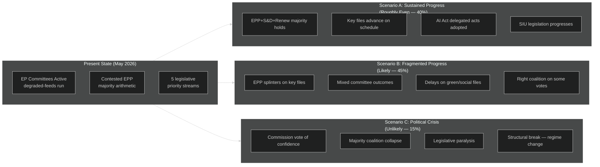

<!-- SPDX-FileCopyrightText: 2026 Hack23 AB -->
<!-- SPDX-License-Identifier: Apache-2.0 -->

# Scenario Forecast — EP Committee Reports | 2026-05-26

**WEP:** Roughly Even — that the primary scenario (sustained legislative progress with political friction) materialises over Q3 2026  
**Admiralty:** B2 — Probably true; based on EP 10th term trajectory and political group dynamics  
**SATs Applied:** Scenario Analysis, Pre-Mortem, Key Assumptions Check, Indicators  

---

## Scenario Framework

## Scenario A: Sustained Legislative Progress (WEP: Roughly Even — 40%)

**Assumption:** The EPP+S&D+Renew "Grand Coalition" (402 seats) maintains cohesion on the five priority legislative streams through the summer 2026 plenary cycle.

**Indicators (positive):**
- Committee vote margins remain above 2/3 majority for most files
- No prominent EPP defections to Patriots/ECR on high-profile votes
- Trilogue timelines maintained for Competitiveness Agenda files
- AI Act delegated acts adopted on schedule by ITRE/LIBE

**Indicators (negative — would falsify Scenario A):**
- More than 3 major EPP defections to right coalition in one month
- Commission confidence vote triggered by any group
- Key trilogue file collapse (SIU, EDIS, AI Office powers)

**Outcome:** Legislative pipeline delivers ~15 significant committee reports by end-Q3 2026, keeping EP on track for June 2024–June 2029 mandate delivery plan.

## Scenario B: Fragmented Progress (WEP: Likely — 45%)

**Assumption:** The contested majority arithmetic produces selective fragmentation — EPP aligns with Patriots/ECR on some files (Green Deal revision, migration) while maintaining Grand Coalition on others (AI, competitiveness, trade).

**Pre-Mortem (SAT):** If Scenario B is the actual outcome, failure post-mortems would cite:
1. Green Deal revision produced a weaker-than-anticipated ENVI committee report due to Patriots influence
2. SIU legislation was diluted in ECON committee to attract ECR support, weakening capital markets ambition
3. Migration Pact implementation stalled in LIBE due to irreconcilable right-left divide
4. AI Act delegated acts delayed 6 months due to ITRE/JURI jurisdictional dispute

**Indicators:**
- ENVI committee votes showing consistent EPP+ECR+Patriots majorities on green files
- LIBE committee split votes on migration implementation measures
- Rapporteur resignations or reassignments on contested files

**Outcome:** Legislative output achieves ~8–10 committee reports by end-Q3 2026; significant files delayed to 2027; Green Deal revision weakened; social dimension intact but conditional.

## Scenario C: Political Crisis (WEP: Unlikely — 15%)

**Assumption:** Structural break — a Commission vote-of-confidence motion, a major interinstitutional conflict (EP vs. Council on treaty interpretation), or an external shock triggers legislative paralysis.

**Structural break indicators:**
- Unprecedented defection of EPP leadership to Patriots-led majority
- Commission loses censure vote (never happened in EP history but structurally possible)
- CJEU ruling invalidating major EP position on fundamental rights

**This scenario would represent a regime change in EP majority dynamics** — the first time in EP history that the far-right achieved effective legislative control through the committee system. The probability remains Unlikely (15%) but is non-trivial given the arithmetic realities.

## Key Assumptions (SAT: Key Assumptions Check)

1. **EPP leadership maintains pro-EU orientation** despite pressure from national right-wing parties — tested assumption given German CDU/CSU positioning in 2025–2026.
2. **S&D remains constructive** rather than moving to systematic opposition — their 136 seats are essential for any mainstream majority.
3. **Commission legislative timetable holds** — external shocks (geopolitical, economic) have historically caused legislative timetable disruptions.
4. **EP API recovers** — the degraded feeds on 2026-05-26 are temporary; normal committee monitoring resumes within days.

## 12-Month Forward Projection

| Timeframe | Expected Developments | WEP |
|-----------|----------------------|-----|
| June 2026 | Strasbourg plenary: AI Act delegated acts vote; SIU committee report | Likely |
| July 2026 | Parliamentary recess; limited committee activity | Almost Certain |
| Sep 2026 | Committee work resumes; MFF 2028 preparatory work | Likely |
| Oct-Nov 2026 | Budget procedure peak; key ECON/ITRE committee votes | Roughly Even |
| Dec 2026 | Year-end legislative push; trilogues intensify | Roughly Even |

**WEP summary:** The most likely EP committee trajectory is Scenario B (Fragmented Progress) — 45% probability — followed closely by Scenario A (Sustained Progress) — 40%. The political fragmentation is the defining feature of the 10th term committee dynamics.

## Indicators for Scenario Revision

| Indicator | Scenario A signal | Scenario B signal | Scenario C signal |
|-----------|------------------|------------------|------------------|
| EPP vote on first AI Act delegated act | EPP votes with Grand Coalition | EPP splits; some vote with right | EPP votes with Patriots |
| ENVI committee vote on Nature Restoration revision | Passes with S&D+Greens+Renew majority | Split — some files pass, others fail | Fails; EPP+Patriots+ECR majority overturns |
| ECON committee SIU report | Adopted with broad majority | Amended to reduce scope | Blocked or sent back |
| LIBE Migration Pact vote | Adopted with Grand Coalition | Contested; partial adoption | Reopened by Patriots motion |
| June plenary resolution count | ≥8 resolutions adopted | 4–7 resolutions, mixed | <4 resolutions; crisis dynamic |

## Pre-Mortem: What Would Make Scenario B Fail?

Applying the Pre-Mortem SAT to Scenario B (Fragmented Progress):

**How could Fragmented Progress become Scenario C (Crisis)?**
1. A major EPP internal split (MEP defections to Patriots) reduces Grand Coalition margin below comfortable majority
2. An external shock (trade war escalation, Russian escalation in Ukraine) divides EP groups on emergency legislation
3. The MFF 2028 preparatory work reveals irreconcilable national interest positions, freezing ECON/BUDG committees
4. AI Act delegated acts produce a constitutional crisis between Commission and EP over institutional competences

**Probability of Scenario C activation via pre-mortem pathways:** ~12% (Unlikely, but not negligible)

## Confidence and Data Quality Note

**This scenario forecast is based on:**
- 🟢 HIGH confidence: Political group seat allocation, majority arithmetic
- 🟡 MEDIUM confidence: Legislative priority identification, Committee work patterns
- 🔴 LOW confidence: Specific June 2026 vote outcomes, rapporteur positions

**Data degradation impact:** The scenario forecast cannot incorporate specific committee vote outcomes from the current week (2026-05-26) due to EP API degradation. The structural analysis is robust; the temporal specificity is limited.

## Scenario Monitoring Indicators

| Indicator | Scenario 1 (Status Quo) | Scenario 2 (Right Shift) | Scenario 3 (Progressive) |
|-----------|------------------------|--------------------------|--------------------------|
| EPP-S&D joint votes | >65% | <50% | >75% |
| Green Deal vote margins | Narrow (< ±30 votes) | Negative | Wide positive |
| ECR/Patriots coordination | Occasional | Systematic | Isolated |
