<!-- SPDX-FileCopyrightText: 2026 Hack23 AB -->
<!-- SPDX-License-Identifier: Apache-2.0 -->

# Stakeholder Map — EP Committee Reports | 2026-05-26

**Admiralty:** B2 — Probably true; based on documented EP institutional structure  
**Data Mode:** degraded-feeds  
**SATs Applied:** Stakeholder Mapping, ACH  

---

## Stakeholder Architecture

```mermaid
%%{init:{"theme":"dark"}}%%
flowchart TB
    subgraph EP["European Parliament — Committee System"]
        EPP["EPP Group\n189 seats"]
        SD["S&D Group\n136 seats"]
        PAT["Patriots\n84 seats"]
        ECR["ECR\n78 seats"]
        REN["Renew\n77 seats"]
        GRN["Greens/EFA\n53 seats"]
        LEFT["Left\n46 seats"]
        COM["EP Committees\n20 Permanent"]
        RAP["Rapporteurs"]
        SHAD["Shadow Rapporteurs"]
    end
    subgraph INST["EU Institutions"]
        EC["European Commission\nLegislative proposals"]
        COUNCIL["Council of the EU\nNational governments"]
        CJEU["Court of Justice"]
        ECB["European Central Bank"]
    end
    subgraph EXT["External Stakeholders"]
        LOBBY["Industry Lobbyists\n~25,000 registered"]
        CS["Civil Society\nNGOs, trade unions"]
        MS["Member States\nNational parliaments"]
        INT["International\nIMF, WB, NATO"]
    end
    EPP --> COM
    SD --> COM
    PAT --> COM
    ECR --> COM
    REN --> COM
    GRN --> COM
    LEFT --> COM
    COM --> RAP
    COM --> SHAD
    EC --> COM
    COUNCIL --> COM
    LOBBY --> RAP
    CS --> COM
    MS --> COM
    INT --> COM
```

## Primary Stakeholders: Political Groups

### EPP (189 seats) — Perspective
The EPP enters the May 2026 committee week as the legislative agenda-setter. With the EP presidency and key committee chairmanships, EPP rapporteurs are driving the competitiveness/industrial agenda. Key EPP positions in committee: (a) AI Act implementation must not over-burden innovation; (b) Green Deal ambition must be balanced against industrial competitiveness; (c) migration policy should be restrictive and enforcement-focused. EPP's challenge is managing its own right flank — Patriots and ECR offer alternative majority paths for specific files but at the cost of EPP's pro-EU credibility.

**Influence score:** 🔴 CRITICAL — majority builder, agenda-setter, committee chair dominant  
**ACH Assessment:** Hypothesis A (EPP maintains majority control) — Likely true

### S&D (136 seats) — Perspective
S&D acts as the essential coalition partner for the EPP on most mainstream legislation. In committee, S&D shadow rapporteurs negotiate social dimension amendments — labour standards, just transition, consumer protections — as the price for their votes. S&D is increasingly pressured by the Left and Greens not to make too many concessions to EPP positions, particularly on Green Deal revision and AI Act's social impact provisions.

**Influence score:** 🟠 HIGH — essential for majority; swing factor on social/green files  
**ACH Assessment:** Hypothesis B (S&D remains constructive coalition partner) — Roughly Even

### Renew Europe (77 seats) — Perspective
Renew's committee role focuses on digital policy (AI, data, fintech), trade liberalisation, and rule of law. As a liberal pro-EU group, Renew provides the margin for EPP majorities on forward-looking technology legislation. However, Renew MEPs are increasingly divided on climate ambition (liberal economic wing vs. progressive wing), creating split votes on ENVI files.

**Influence score:** 🟡 MEDIUM-HIGH — key for technology, trade, and rule of law files  

### Patriots for Europe (84 seats) — Perspective
The Patriots (Italian MEPs including Lega, French RN, Hungarian Fidesz) are the second-largest group despite their far-right positioning. In committee, Patriots systematically oppose Green Deal files, asylum harmonisation, and rule of law conditionality. They offer EPP an alternative majority path on some right-wing populist files (agricultural deregulation, migration enforcement), creating a controversial tactical dilemma for EPP leadership.

**Influence score:** 🟡 MEDIUM — disruptive minority; tactical EPP ally on select files  
**ACH Assessment:** Hypothesis C (Patriots disrupt at least 2 committee votes/week) — Likely true

### Greens/EFA (53 seats) — Perspective
Post-2024 election decline has reduced Greens' committee influence, but they retain strong positions in ENVI, ITRE (energy), and LIBE. Greens use committee hearings and rapporteurship (where retained) to strengthen environmental and fundamental rights provisions. Their diminished numbers mean coalition formation with S&D and Left is essential.

**Influence score:** 🟡 MEDIUM — environmental/rights files; reduced post-2024  

## Secondary Stakeholders

### European Commission
The Commission's Right to Initiative means all committee legislative work traces to Commission proposals. DG GROW (industry), DG ENER (energy), DG JUST (AI Act oversight), and DG HOME (migration) are the primary interlocutors with relevant committees. Commission officials regularly brief committee coordinators on implementation timelines.

**Influence score:** 🟠 HIGH — legislative initiator, implementation partner  

### Council of the EU (Member States)
Council presidency (Poland, May 2026 assumption) shapes the interinstitutional negotiation pace. Committee rapporteurs interact with COREPER II and Council working groups in trilogue. Fast Council timelines pressure EP committees to complete votes quickly; slow Council processes give committees more time but risk legislative stagnation.

**Influence score:** 🟠 HIGH — co-legislator; trilogue pace-setter  

### Registered Lobbyists (~25,000 EU Transparency Register)
Technology companies (on AI Act), energy sector (on Clean Industrial Deal), financial sector (on SIU), and agricultural cooperatives (on Farm to Fork/Green Deal revision) are the most active lobby groups in EP committees in 2026. Access is regulated but pervasive.

**Influence score:** 🟡 MEDIUM — amendment shaping; expert witness role in hearings  

## Stakeholder Interaction Matrix: Committee Stage Dynamics

| Stakeholder | Most Active Committee | Primary Tactic | Typical Goal | Success Rate Estimate |
|------------|----------------------|----------------|--------------|----------------------|
| EPP MEPs | All committees | Coalition building; rapporteur appointment | Centrist-right legislative outcomes | High (majority anchor) |
| S&D MEPs | EMPL, LIBE, ECON | Amendment tables; veto threat | Social protections; rights | Medium-High |
| Commission | All | Proposal ownership; delegated acts | Commission programme adoption | High if Grand Coalition holds |
| BusinessEurope | ITRE, ECON | Position papers; MEP briefings | Regulatory relief; competitiveness agenda | Medium |
| ETUC (labour) | EMPL, ECON | Mobilisation; counter-lobbying | Social clause maintenance | Medium-Low |
| Tech sector | ITRE, LIBE | Expert testimony; delegated act influence | AI Act softening; lighter implementation | Medium |
| Environmental NGOs | ENVI, ITRE | Public pressure; legal challenge threat | Green Deal ambition maintenance | Low-Medium |
| Member State govts | All (Council liaison) | Council position signalling | National interest protection | High (Council veto ultimately) |

## Stakeholder Conflict Map

### Conflict 1: EPP vs. S&D on Green Deal Revision
**Nature:** EPP wants to relax 2030 targets and farm regulations; S&D insists on maintaining Green Deal core commitments.
**Committee locus:** ENVI, ITRE, AGRI
**Likely outcome:** Compromise — some relaxation on agricultural rules, maintenance of core industrial decarbonisation targets
**Citizen impact:** Agricultural food standards may be softened; industrial emissions trajectory maintained

### Conflict 2: Commission vs. EPP on AI Act delegated acts
**Nature:** Commission drafts delegated acts; EPP right wing wants to review and restrict implementation scope.
**Committee locus:** ITRE/LIBE joint proceedings
**Likely outcome:** EP scrutiny exercise resulting in 1–3 month delay per contested delegated act
**Citizen impact:** AI regulation implementation slows; legal uncertainty for EU AI industry

### Conflict 3: Patriots vs. Grand Coalition on Migration Pact
**Nature:** Patriots want to reopen the Migration Pact before full implementation; Grand Coalition insists on implementation.
**Committee locus:** LIBE, AFET
**Likely outcome:** Patriots raise obstructions in LIBE; Grand Coalition procedurally overrides.
**Citizen impact:** Migration Pact implementation proceeds slower than planned

## Stakeholder Power Balance Assessment

The current stakeholder power balance favours conservative/industrial interests over progressive/environmental interests. This is a structural shift from the 9th term (2019–2024) when the progressive majority produced the Green Deal, AI Act, and Digital Markets Act. The 10th term's contested majority redistributes power toward EPP, ECR, and Patriots, which have different stakeholder priorities.

**Net effect for citizens:** Legislation affecting climate, AI rights, and migration is subject to greater pressure from business and conservative political groups than in the previous term. Citizens and civil society groups need to be more actively engaged to counter this structural shift.

## Cross-Artifact Stakeholder Consistency Check

| Stakeholder | In Stakeholder-Map | In Coalition-Dynamics | In Risk-Matrix | Consistent? |
|------------|-------------------|----------------------|----------------|------------|
| EPP | ✅ 189 seats, agenda-setter | ✅ 189 seats, pivot group | ✅ Majority fragmentation risk | ✅ |
| S&D | ✅ 136 seats, coalition partner | ✅ 136 seats, Grand Coalition anchor | ✅ Essential for social provisions | ✅ |
| Commission | ✅ Initiator | ✅ Proposal owner | ✅ Implicit in legislative pipeline | ✅ |
| Industry Lobbies | ✅ 25,000 registered | ✅ N/A | ✅ R-07 lobbying risk | ✅ |
| Citizens (705M) | ✅ Direct impact | ✅ Indirect via elections | ✅ All risk categories affect | ✅ |

## For Citizens — What Stakeholders Mean for You

The stakeholder map matters for citizens because it reveals who shapes EU legislation before you see the final vote. The EPP's committee dominance means centre-right priorities (competitiveness, controlled green transition, strict migration) are likely to shape most 2026 legislation. S&D's essential coalition role means some social protections survive. The Patriots' tactical leverage means EPP periodically trades concessions on anti-EU cultural issues for votes on its economic agenda. Understanding this map helps citizens see why final legislation often differs from initial Commission proposals — the committee stage is where political deals are made.

**Five questions every citizen should ask about EP committee reports:**
1. Who is the rapporteur and what political group do they belong to?
2. Which amendments passed in committee and who sponsored them?
3. What is the committee vote margin and does it reflect the full Parliament majority?
4. Are there minority opinions filed and what do they say?
5. What industry or civil society groups testified as expert witnesses?
