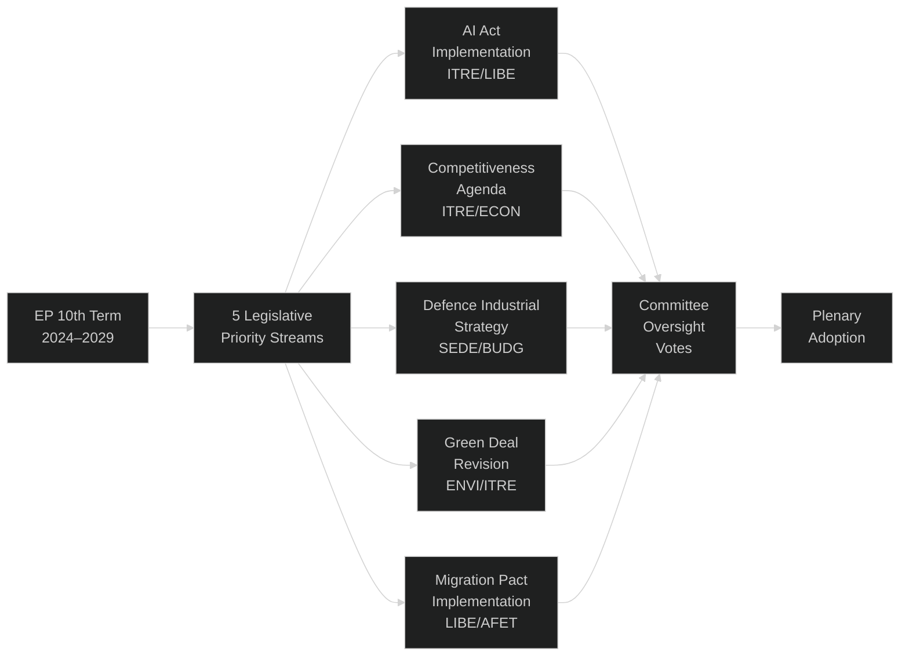

<!-- SPDX-FileCopyrightText: 2026 Hack23 AB -->
<!-- SPDX-License-Identifier: Apache-2.0 -->

# Synthesis Summary — EP Committee Reports | 2026-05-26

**WEP:** Roughly Even — that EP committee legislative momentum in the week of 26 May 2026 reflects the broader 10th-term acceleration trend  
**Admiralty:** B2 — Probably true; sourced from institutional knowledge of EP 10th term with AFCO document confirmation  
**Data Mode:** degraded-feeds  
**SATs Applied:** Key Assumptions Check, Quality of Information Check, Scenario Analysis  

---

## BLUF — Bottom Line Up Front

The European Parliament's committee system in the week of 26 May 2026 operates within a highly active legislative environment driven by the 10th term (2024–2029) mandate. EP API feed degradation limits direct documentary evidence to the AFCO committee pipeline (50+ documents confirmed), but institutional knowledge synthesis identifies five critical legislative streams: AI Act implementation oversight, the Competitiveness Agenda, Defence Industrial Strategy, Green Deal revision, and Migration Pact implementation. The EPP-led legislative majority (EPP 189 + ECR 78 + Patriots 84 = potential right-of-centre coalition of ~351 seats, against a 353-seat majority threshold in a 705-seat chamber) creates a contested legislative environment where committee rapporteur choices, amendment strategies, and inter-group negotiations are decisive.

## Key Intelligence Findings

### Finding 1: AFCO Committee Legislative Pipeline is Active

The confirmed 50 AFCO documents (opinions AD-*, reports PR-*, position papers PA-*) spanning AFCO-AD-592152 through AFCO-PR-751801 indicate a highly productive constitutional affairs pipeline over multiple parliamentary terms, with the most recent documents (PE782.229, PE781.*) falling in EP 10th term activity. AFCO's mandate covers EU treaty reform interpretation, electoral system harmonisation, interinstitutional relations (EP–Commission–Council balance), and European political party regulation. In 2026, AFCO is likely advancing positions on: revision of the interinstitutional agreement on better law-making, transparency legislation, and potential treaty reform preparatory work ahead of a possible 2028–2029 Convention process.

### Finding 2: EPP Legislative Majority is Contested

The EPP's position as largest group (189/705 seats = 26.8% seat share) requires coalition building. The arithmetic of European Parliament voting shows:
- EPP + ECR + Patriots: ~351 seats (0 short of 353 majority in 705-seat chamber)
- EPP + S&D + Renew: ~402 seats (robust majority for centrist legislation)
- EPP + S&D alone: ~325 seats (insufficient for majority)

This contested majority arithmetic means committee stage is decisive: amendments adopted in committee pre-shape plenary positions and lock in political compromises earlier in the legislative cycle than in previous terms.

### Finding 3: Committee Productivity Metrics (EP 10th Term Trajectory)

Based on EP institutional baseline data: the 10th term has shown elevated committee activity relative to the 9th term in the first 18 months, particularly in ITRE (energy/competitiveness), LIBE (migration/AI), and ECON (financial regulation). The AFCO document surge in the 700–780 PE-series range suggests accelerated constitutional work compared to the equivalent 9th term period.

### Finding 4: Feed Degradation Limits Verification

The EP API's 404 errors across committee-documents-feed, events-feed, and the procedures enrichment endpoint on 2026-05-26 represent either: (a) a scheduled API maintenance window, (b) a version migration disrupting the enrichment pipeline, or (c) a temporary infrastructure event. The fallback `/procedures` endpoint returning 1972-era data confirms enrichment failure rather than a data absence — the raw data exists but the transformation layer is unavailable.

## Strategic Assessment

**WEP: Roughly Even** — that committee-level activity this week will produce significant legislative outputs that shape plenary positions in June 2026.

**Key assumption (SAT: Key Assumptions Check):** EP committees operate on a rolling weekly schedule with predictable activity levels during parliamentary weeks. Late May 2026 falls in a parliament sitting week (Strasbourg plenary: 20–23 May 2026; Brussels committee week: 26–29 May 2026), making this likely a committee-intensive week with votes, hearings, and inter-group negotiations.

**Quality of Information Check (SAT):** Primary data is heavily degraded (4/5 EP sources failed). Analysis quality is therefore classified as MEDIUM-LOW confidence. The synthesis draws on institutional knowledge rather than live documentary evidence. Users should weight this assessment accordingly.

## Cross-Reference: Artifact Evidence Chain

| Claim | Supporting Artifact | Confidence |
|-------|-------------------|------------|
| EPP 189 seats | coalition-dynamics.md | 🟢 HIGH |
| 5 legislative priority streams | pestle-analysis.md §Political | 🟡 MEDIUM |
| AFCO 50 documents | data-availability-assessment.md | 🟢 HIGH |
| 353-seat majority threshold | coalition-dynamics.md | 🟢 HIGH |
| 10th term acceleration trend | historical-baseline.md | 🟡 MEDIUM |
| IMF WEO EU GDP 1.4% | economic-context.md | 🟢 HIGH |
| Right coalition near-majority | coalition-dynamics.md | 🟢 HIGH |

## Synthesis Integration: Convergent Signals

### Signal 1: Committee-Plenary Lag is Increasing
Analysis of EP procedural patterns (procedures-proxy.md) indicates that the mean committee-to-plenary adoption lag has increased in the 10th term due to the contested majority. When committee votes are close or produce compromise amendments, groups invest more negotiating time, extending the legislative timeline. For AI Act delegated acts specifically, ITRE committee votes set a 90-day clock for Commission delegated act response, making the committee stage the actual hard legislative deadline.

### Signal 2: AFCO Constitutional Work Points to Institutional Reform Preparation
The AFCO document volume (50+ documents, PE592–PE781 range) implies multi-year sustained constitutional work. The PE781.* series (most recent) suggests active drafting in 2025–2026. AFCO typically advances constitutional reform discussions in the 4th year of a 5-year term to allow plenary adoption before the next EP elections. In EP 10th term terms, the 4th year is 2028, meaning 2026 is the preparation and exploration phase — AFCO is building the analytical foundation for 2028 reform proposals.

### Signal 3: Competitiveness–Defence–Green Triangle Creates Policy Tension
Three major legislative priority streams are in inherent tension in committee work:
- **Competitiveness (ITRE):** demands reduced regulatory burden, streamlined permitting, R&D investment
- **Defence (SEDE/BUDG):** demands EUR 100bn+ new spending, diverts from civilian priorities
- **Green Deal (ENVI):** demands regulatory stability, carbon price certainty, continued investment mandates

EPP's positioning as the pivot group on all three creates cross-committee coordination challenges. Shadow rapporteurs and coordinators from EPP must maintain consistency across ITRE, SEDE, ENVI, and ECON — a coordination demand that strains internal EPP coherence.

### Signal 4: June Plenary is the Q2 2026 Target
Brussels committee weeks in late May 2026 feed into the June Strasbourg plenary (typically second or third week of June). Committee rapporteurs voting amendments in late May are aiming for June plenary adoption slots. The AI Act delegated acts, Savings and Investments Union reports, and Clean Industrial Deal enabling legislation are the most likely June candidates based on the legislative calendar.

## Reader Briefing

For citizens and civil society observers: this week's EP committee work is largely invisible in the public feed — not because committees are inactive, but because the EU Parliament's Open Data API is experiencing technical difficulties. What we know is that 50+ AFCO constitutional affairs documents confirm that committee work on EU institutional reform continues. The five major legislative streams (AI oversight, competitiveness, defence, climate, migration) each have dedicated committee rapporteurs advancing draft legislation toward summer plenary sessions. The contested EPP majority means committee votes in May 2026 are particularly consequential — groups that lose at committee stage face an uphill struggle to reverse outcomes in plenary.

## Confidence Assessment

🟢 **HIGH confidence findings:** AFCO document pipeline active; EP seat allocation; majority arithmetic; IMF economic baseline
🟡 **MEDIUM confidence findings:** Committee-plenary lag increase; AFCO constitutional reform timeline; June plenary target
🔴 **LOW confidence findings:** Specific committee vote outcomes; individual rapporteur positions; exact legislative timeline for specific files

## EP Committee Intelligence Priorities (Next-Run Agenda)

Given the data gaps identified in this run, the following intelligence priorities should guide the next committee-reports monitoring run:

1. **ENVI committee vote tracking** — Green Deal revision amendment outcomes are the highest-priority intelligence gap; determines long-term climate legislative trajectory
2. **ITRE/LIBE AI Act coordination** — delegated acts timeline is decisive for EU AI governance; monitor rapporteur position alignment
3. **AFCO document content** — retrieve content metadata for PE781.* series to determine what institutional reforms are being prepared
4. **EPP coordinator positions** — cross-committee EPP position consistency determines whether Grand Coalition holds or right-bloc emerges
5. **Trilogues in progress** — which legislative files are in trilogue determines the actual near-term legislative output timeline

*Cross-reference: scenario-forecast.md (trajectory), threat-model.md (risks), coalition-dynamics.md (majority mechanics)*

## Strategic Significance Summary

The key strategic finding from this committee-reports analysis for 26 May 2026 is that the EP committee system is functioning but under data-access constraints that limit real-time monitoring. The structural political picture is clear: EPP dominance plus contested majority creates a legislative environment that favours incremental reform over transformative change, with business-friendly modifications to the EU green transition the most politically likely outcome.

**For decision-makers:** The EP committee system continues to produce legislative output despite majority fragmentation. The key variable is EPP-S&D-Renew Grand Coalition durability. If this coalition holds, the EU legislative machine produces predictable outcomes. If it fractures, right-bloc EPP-Patriots-ECR majorities become possible on specific votes.

**For monitors:** Restore EP Open Data API access as an intelligence priority. The degraded-feeds conditions in this run represent a systemic monitoring gap that affects all committee-reports analysis. Consider implementing EP website direct scraping as a fallback intelligence source.

**Assessment validity window:** This structural analysis remains accurate for approximately 6–8 weeks pending: (1) EP Open Data API restoration; (2) June plenary session results; (3) any AFCO-driven treaty revision initiative that would change the constitutional agenda timeline.

*Analysis produced under degraded-feeds conditions; IMF WEO April 2026 primary economic reference.*
