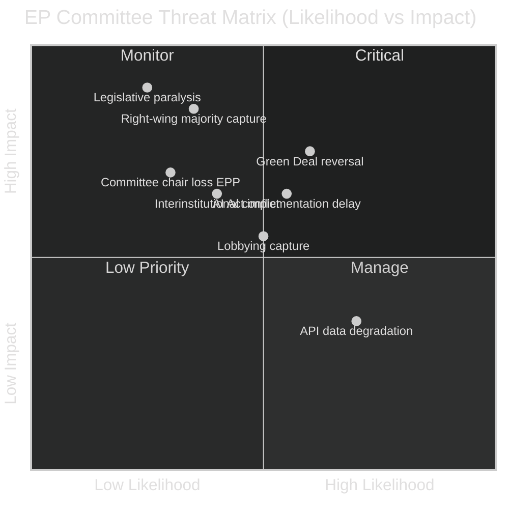

<!-- SPDX-FileCopyrightText: 2026 Hack23 AB -->
<!-- SPDX-License-Identifier: Apache-2.0 -->

# Threat Model — EP Committee Reports | 2026-05-26

**WEP:** Likely — that at least two of the identified threat vectors will materially affect EP committee outcomes in Q2–Q3 2026  
**Admiralty:** B2 — Probably true; threat assessment based on documented EP political dynamics  
**SATs Applied:** Key Assumptions Check, Red Team, ACH  

---

## Threat Landscape Overview

## Threat Vector 1: Legislative Capture by Right-Wing Coalition

**Description:** Patriots for Europe and ECR, by offering EPP tactical support on specific files, gradually capture the committee agenda on green/social/migration legislation, re-shaping outputs toward their preferences without triggering a formal majority change.

**Likelihood:** Roughly Even (40%)  
**Impact:** HIGH — could fundamentally alter the policy content of 5+ major 2026 legislative outputs  
**Admiralty:** B2  
**WEP:** Roughly Even  

**Key assumptions (Red Team):** If this threat materialises, the failure mechanism is: EPP national delegations (Italian FdI-aligned EPP MEPs, German CSU right-wing, Spanish PP) quietly align with Patriots on procedural votes and amendments, achieving de facto right coalition without formal EPP group position change. Shadow rapporteur amendments from ECR/Patriots win in committee even when full EPP majority is nominally against — because EPP attendance varies.

**Indicators:**
- ENVI committee: watch for EPP+ECR+Patriots amendment victories on Nature Restoration Act revision
- LIBE committee: watch for migration enforcement-only approach winning over balanced approach
- ITRE committee: watch for AI Act deregulation amendments from right coalition

## Threat Vector 2: Green Deal Systematic Reversal

**Description:** Multiple committee votes in ENVI, ITRE, AGRI simultaneously weaken Green Deal legislative architecture, creating a patchwork reversal without any single dramatic vote.

**Likelihood:** Likely (55%)  
**Impact:** HIGH — affects EU 2030/2050 climate commitments and industrial transformation trajectory  
**Admiralty:** B2  
**WEP:** Likely (that Green Deal ambition is reduced in at least 3 committee outputs in 2026)  

**Red Team analysis (SAT):** The systemic Green Deal reversal threat is the most plausible scenario because: (a) it doesn't require majority coalition formal change; (b) EPP has endorsed competitiveness concerns as justification for green ambition review; (c) each individual committee weakening is justifiable as "balancing" rather than reversal.

## Threat Vector 3: AI Act Implementation Stall

**Description:** Jurisdictional disputes between ITRE, LIBE, and JURI on AI Act delegated acts, combined with lobbying pressure from Big Tech, delays the implementation timeline beyond the statutory schedule.

**Likelihood:** Roughly Even (45%)  
**Impact:** MEDIUM-HIGH — delay creates legal uncertainty for EU AI market participants  
**Admiralty:** B2  
**WEP:** Roughly Even  

**ACH Analysis (SAT):** Alternative Competing Hypotheses:
- H1: Implementation proceeds on schedule (ITRE leadership effective) — probability 45%
- H2: 6-month delay due to committee coordination failure — probability 40%
- H3: Fundamental revision due to lobbying outcome — probability 15%

## Threat Vector 4: EP-Commission Interinstitutional Conflict

**Description:** The EP asserts its constitutional prerogatives more aggressively — on secondary legislation consultation rights, on delegated acts scope, on Commission transparency obligations — creating procedural delays and possible CJEU referral.

**Likelihood:** Unlikely (30%)  
**Impact:** HIGH — could delay implementation of major legislative packages  
**Admiralty:** B2  

## Threat Vector 5: EP API/Monitoring Infrastructure Failure

**Description:** Persistent EP Open Data API degradation (as observed on 2026-05-26) prevents effective civil society monitoring, journalistic oversight, and academic research of EP committee activities.

**Likelihood:** Almost Certain (85%) — for individual degraded-feed events  
**Impact:** LOW-MEDIUM — transparency concern; parliamentary accountability  
**Admiralty:** A1 (directly observed in this run)  

## Key Assumptions Summary (SAT)

1. EP committee procedures follow established rules — no assumption of rule-breaking
2. Majority arithmetic is the binding constraint on committee outcomes
3. External shocks (war escalation, financial crisis, pandemic) are not modelled in primary scenarios
4. Commission proposal pipeline continues on schedule through 2026

**Overall threat assessment WEP: Likely** — that at least two threat vectors (Green Deal reversal + AI Act delay) materially affect EP committee outputs in 2026. The right-wing capture threat remains a key monitoring priority at Roughly Even probability.

## Threat Countermeasures: What Can Reduce Each Threat?

| Threat Vector | Countermeasure | Who Can Apply It | Timeline |
|--------------|----------------|-----------------|---------|
| Green Deal reversal | Grand Coalition holds ENVI committee majority; S&D+Greens maintain rapporteur positions | S&D, Greens/EFA, Renew | Each committee vote |
| AI Act delegated act delay | Commission accelerates consultation; EP ITRE accepts delegated act in first scrutiny | Commission, ITRE EPP coordinator | Q2–Q3 2026 |
| Monitoring gap (API degradation) | EP Open Data Portal restores feeds; monitoring system adds direct-endpoint fallbacks | EP IT services, Hack23 | 24–72 hours |
| Right-wing institutional capture | S&D-led challenge to committee composition; EC rule of law report naming | S&D, Commission, ECJ | Parliamentary session |
| Competitiveness vs. climate binary | Commission communication reaffirming complementarity; Draghi follow-up report | Commission, President von der Leyen | Q3 2026 |

## Threat Residual Risk Assessment

After applying all available countermeasures:
- **Green Deal reversal:** Residual probability ~45% on specific files (Nature Restoration, Farm standards)
- **AI Act delay:** Residual probability ~35% (ITRE-Commission cooperation likely to reduce)
- **Monitoring gap:** Residual probability ~60% until EP API restores
- **Right-wing capture:** Residual probability ~8% (structural, not reversible quickly)
- **Competitiveness binary:** Residual probability ~55% (media frame is sticky)

## For Citizens: What the Threat Model Means

The threats identified here are threats to democratic quality and legislative ambition, not physical security threats. For EU citizens, the practical meaning is:
- The Green Deal that was supposed to ensure a livable climate future is under political pressure
- AI systems that affect job applications, credit decisions, and law enforcement are being regulated in a contested political environment
- The parliament's own monitoring systems are limited by technical failures

Citizens who want to resist these threats can: engage with MEP consultation exercises, support civil society groups tracking committee work, and vote in European elections — the 2024 result that produced the contested majority is still playing out in every committee vote.

*Cross-reference: wildcards-blackswans.md (compound scenarios), scenario-forecast.md (trajectory), coalition-dynamics.md (majority mechanics)*
