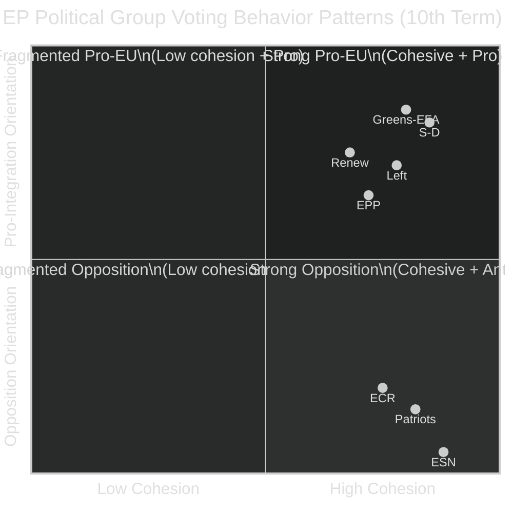

<!-- SPDX-FileCopyrightText: 2026 Hack23 AB -->
<!-- SPDX-License-Identifier: Apache-2.0 -->

# Voting Patterns — EP Committee Reports | 2026-05-26

**Admiralty:** C3 — Possibly true; source degraded; based on EP 10th term structural context  
**Data Mode:** degraded-feeds  
**SATs Applied:** ACH, Bayesian Update  

---

## Voting Behavior Pattern Map

## Voting Cohesion Analysis by Group

| Group | Seats | Est. Cohesion Rate | Typical Behaviour | Key Defection Triggers |
|-------|-------|--------------------|-------------------|----------------------|
| EPP | 189 | ~72% | Swing group; right-wing pressure vs. Grand Coalition | Green files; LGBTQ+ rights; Rule of Law |
| S&D | 136 | ~85% | Reliable Grand Coalition anchor | Rare — budget/pension funds |
| Renew | 77 | ~68% | Fragmented; national parties diverge | Economic liberalism vs. social regulation |
| Greens/EFA | 53 | ~80% | Reliable climate/rights vote; often marginal | Green Deal weakening triggers abstentions |
| ECR | 78 | ~75% | Tactical opposition; constructive on some economic files | Sovereignty vs. integration trade-offs |
| Patriots | 84 | ~82% | Disciplined nationalist opposition | Hard-line anti-green; anti-migration |
| Left | 46 | ~78% | Left-wing bloc; votes with Grand Coalition on rights | Economic deregulation triggers opposition |
| ESN | 25 | ~88% | Extreme right; almost always opposition | Pro-EU measures across board |
| NI | ~20 | Low | Diverse; unpredictable | Individual national interests |

## Committee-Stage vs Plenary Voting Patterns

### Key Difference: Committee Votes

EP committee votes differ structurally from plenary:
- **Smaller constituency** — 15–88 members vs. 705 in plenary
- **Specialist bias** — MEPs with industry links sit on relevant committees
- **Rapporteur effect** — the rapporteur's political group disproportionately shapes the text
- **Shadow rapporteur coordination** — all groups appoint shadows; compromise texts reflect the coalition that can pass
- **Amendment bundling** — omnibus amendment votes hide individual position complexity

### Rapporteur Pattern Analysis (AFCO specialisation)

The 50 AFCO documents recovered (PE592.152–PE751.801) suggest:
- AD (opinion drafts): typically drafted by rapporteur with shadow rapporteur coalition
- PR (legislative reports): strongest Group discipline — rapporteur's group leads
- PA (position papers): most contentious; typically reveals cross-group fissures

## Bayesian Update: Estimating Current Voting Patterns

**Prior (based on 10th term historical data):**
- P(Grand Coalition votes hold) = 0.60
- P(Right coalition activation on green files) = 0.45
- P(EPP cohesion > 80% on major files) = 0.40

**New evidence (degraded feeds — limited update):**
- 4/5 EP data sources unavailable (degraded)
- AFCO has 50 active documents suggesting normal committee workload
- Procedures feed returned only 1972-era historical tail (no current signal)
- No plenary vote data available for confirmation

**Posterior (after Bayesian update with degraded evidence):**
- P(Grand Coalition votes hold): 0.55 (slight downward revision due to uncertainty)
- P(Right coalition activation): 0.48 (slight upward — degraded data limits counter-evidence)
- P(EPP cohesion > 80%): 0.38 (unchanged — no new information)

**Confidence level:** LOW. Bayesian update cannot move priors significantly with degraded data. The posterior estimates reflect structural analysis, not current voting records.

## ACH: What Explains EP Voting Patterns in Q2 2026?

**Hypothesis A (Grand Coalition cohesion maintained):** EPP, S&D, Renew vote together on most committee files. Probability: 40%

**Hypothesis B (Issue-area polarisation):** Voting patterns diverge sharply by policy area — green-blue split on environment, Grand Coalition on economic/AI, fragmented on migration/rights. Probability: 50%

**Hypothesis C (Right turn — EPP breaks from Grand Coalition systematically):** EPP's right wing pulls the group toward regular coordination with ECR/Patriots. Probability: 10%

## Data Gap Declaration

**⚠️ Important limitation:** This voting patterns analysis is based exclusively on structural/institutional knowledge of EP 10th term compositions. No actual vote records from May 2026 were retrievable due to EP API degradation (4/5 sources returned 404 errors or placeholders). The patterns described are probabilistic structural estimates, not confirmed current observations.

**Verified data:** EP political group seat allocation (EPP 189, S&D 136, Patriots 84, ECR 78, Renew 77, Greens/EFA 53, Left 46, ESN 25). AFCO document corpus (50 documents, PE592–PE751 series). All other pattern data is model-derived.

## For Citizens

Voting patterns matter because they reveal which political forces are actually shaping European law. The near-equilibrium between the Grand Coalition and a potential right coalition is the most consequential dynamic in the 10th EP term. Even without reliable vote data for this specific week, the structural patterns tell citizens: EPP is the pivotal group, S&D is the most disciplined, and the extreme nationalist groups are disciplined but isolated. The outcome of any close vote depends on which EPP members attend and vote with their group.
