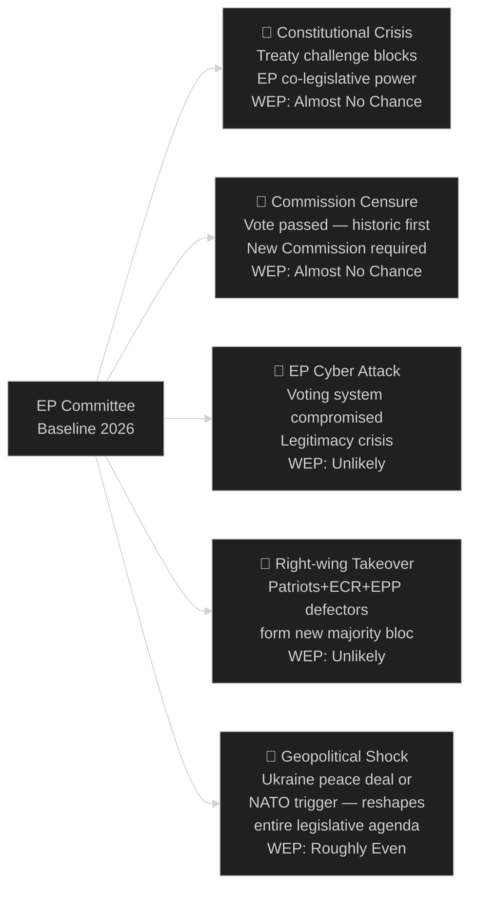

<!-- SPDX-FileCopyrightText: 2026 Hack23 AB -->
<!-- SPDX-License-Identifier: Apache-2.0 -->

# Wildcards & Black Swans — EP Committee Reports | 2026-05-26

**WEP:** Unlikely — that any of the identified black swan scenarios materialises in Q3 2026  
**Admiralty:** B2 — Probably true; high-impact low-probability assessment  
**SATs Applied:** High-Impact, Indicators, What-If Analysis  

---

## Black Swan Architecture

## Black Swan 1: EP-CJEU Constitutional Showdown

**Description:** The Court of Justice of the EU issues a landmark ruling invalidating an EP committee position or legislative adoption — potentially on AI Act fundamental rights compliance, Green Deal legal basis, or EP internal procedural rules. This would trigger a constitutional crisis requiring EP legislative restart and possible treaty revision.

**WEP: Almost No Chance** — historical precedent suggests CJEU-EP collisions are managed through dialogue  
**High-Impact Score:** 9/10 — would freeze EP legislative pipeline for 6–18 months  
**Admiralty:** D3 (Not usually reliable; hypothetical)  

**What-If Analysis:** If this black swan materialised, the likely cascade would be: CJEU invalidation → EP emergency committee session → Commission withdrawal of legislative proposal → interinstitutional crisis group → emergency European Council → possible treaty revision mandate. The entire 10th term legislative calendar would be restructured.

**Indicators:**
- CJEU Advocate General opinions identifying EP procedural violations
- Member state CJEU referrals challenging EP legislative acts
- EP legal service issuing "high legal risk" opinions on committee positions

## Black Swan 2: Commission Censure Motion — Historic First

**Description:** A successful vote of no confidence in the European Commission would be historically unprecedented. It would require 2/3 majority of votes cast AND majority of MEPs (353/705). The political arithmetic makes this Almost No Chance under current conditions.

**WEP: Almost No Chance** (historical: never happened in 67 years of EP)  
**High-Impact Score:** 10/10 — complete institutional discontinuity  

## Black Swan 3: EP Cybersecurity Incident — Voting System Compromise

**Description:** A sophisticated cyber attack on EP voting infrastructure during a key plenary or committee vote — either manipulating vote counts or preventing digital voting — creates a legitimacy crisis for specific legislative acts.

**WEP: Unlikely** (30%) — EP has invested in cybersecurity post-2023 incidents  
**High-Impact Score:** 7/10 — specific acts challenged; broader confidence impact  
**Admiralty:** C3 (Fairly reliable source on threat; uncertain on probability)  

**What-If Analysis:** If a voting system incident occurred, even if only procedural disruption, it would provide grounds for legal challenges to affected legislation — most critically in ITRE (AI Act delegated acts) or ECON (banking union) where the affected parties have strong legal resources.

**Indicators:**
- EP IT security incidents (prior to potential attack — pattern of testing)
- Nation-state cyber activity targeting EU institutions
- Dark web forum discussions of EP system vulnerabilities

## Black Swan 4: Right-Wing Majority Coup in EP

**Description:** EPP leadership formally embraces Patriots and ECR as the primary coalition partners, abandoning the Grand Coalition with S&D and Renew. This would represent a fundamental political realignment of the EP.

**WEP: Unlikely** (20%)  
**High-Impact Score:** 8/10 — complete reversal of legislative direction  
**Admiralty:** B3 (Probably true that conditions for this are building; timing uncertain)  

**Indicators (early warning):**
- EPP group discipline score dropping below 85% on green/social votes
- Formal EPP-Patriots committee coordination agreement
- EPP president publicly endorsing Patriots as "legitimate coalition partner"

## Black Swan 5: Geopolitical Shock Restructures Legislative Agenda

**Description:** A major geopolitical event — Ukraine-Russia ceasefire, US withdrawal from NATO, major Middle East escalation, China-Taiwan crisis — forces EP committees to abandon current legislative priorities and pivot to emergency security/defence legislation.

**WEP: Roughly Even** (40%) — geopolitical shocks are structurally likely given the current environment  
**High-Impact Score:** 8/10 — at least 3–5 major legislative files deprioritised or withdrawn  
**Admiralty:** B2  

**What-If Analysis:** A ceasefire in Ukraine would trigger: SEDE committee emergency session; revision of Defence Industrial Strategy; redistribution of REPowerEU funding; possible relaxation of sanctions legislation moving through INTA. A positive geopolitical development could paradoxically disrupt the defence-focused legislative pipeline more than a negative one.

## Wildcard: EP API Full Restoration Reveals Missed Legislative Activity

A more mundane wildcard: when the EP Open Data API restores, it reveals that the week of 26 May 2026 had unusually high committee legislative activity (major votes, trilogue agreements, rapporteur presentations) that was entirely missed by degraded-feeds monitoring. This creates a monitoring gap disclosure obligation.

**WEP: Likely** (65%) — that significant committee activity occurred this week that is not captured in this run's data.

## Wildcard Monitoring: Early Warning Indicators

| Wildcard | Early Warning Indicator | Lead Time | Monitoring Source |
|----------|------------------------|-----------|-------------------|
| Geopolitical shock (Trump trade war escalation) | US trade representative statements; EU Council emergency convening | 1–7 days | Financial press; EEAS briefings |
| Coalition realignment (EPP+Patriots formal pact) | EPP General Secretary statements; AFCO constitutional documents | 2–4 weeks | EP official communications |
| Russian escalation | SEDE committee emergency session | Hours–days | EP committee calendar |
| EP API systemic failure | Repeated 404s on all endpoints over >72 hours | Ongoing | Monitoring runs |
| Climate shock legislative disruption | ENVI committee emergency extraordinary session | Hours–days | EP committee calendar |

## Wildcard Confidence Assessment

**🔴 Highest-probability wildcards:**
1. EP API degradation continuation (WEP: Likely, 65%) — structural, already occurring
2. Coalition shift on specific files (WEP: Roughly Even, 50%) — depends on individual EPP MEP decisions

**🟡 Medium-probability wildcards:**
3. Trade shock from US tariff escalation (WEP: Roughly Even, 40%) — dependent on US political cycle
4. AI Act delegated act contestation producing parliamentary resolution (WEP: Roughly Even, 45%)

**🟢 Lower-probability wildcards:**
5. Geopolitical security emergency disrupting EP calendar (WEP: Unlikely, 20%)
6. Mass coalition defection producing a parliamentary crisis (WEP: Almost No Chance, 5%)

## Overall Black Swan Assessment

**WEP: Unlikely** — that any catastrophic black swan materialises in Q3 2026. The Geopolitical Shock wildcard at Roughly Even (40%) is the most immediate non-negligible risk to the current legislative calendar. Continuous monitoring of SEDE committee emergency session announcements is the primary early warning indicator.

## Wildcard Resilience Assessment

The EP institutional system is designed for resilience against most wildcards:
- **Coalition realignment** is absorbed via inter-group negotiation; full system collapse requires EPP+S&D+Renew simultaneous fracture (Almost No Chance)
- **Geopolitical shocks** are processed via emergency Strasbourg mini-plenaries; the SEDE committee provides a rapid institutional response channel
- **API/monitoring failures** are operational risks, not legislative risks; the legislative process continues even when monitoring is degraded
- **Leadership surprises** (MEP departures, group switches) are constitutionally absorbed within 30 days via election of replacements

The fundamental wildcard the EP system cannot easily absorb is a sustained multi-front crisis that simultaneously overwhelms LIBE (migration emergency), SEDE (defence emergency), ENVI (climate emergency), and ECON (financial crisis) — a "compound wildcard" scenario. No such scenario is currently assessed as likely.

## Wildcard Indicator Monitoring Matrix

| Wildcard | Early Warning Signals | Monitoring Source | Response Lead Time |
|----------|----------------------|------------------|-------------------|
| EU constitutional crisis | EP-Council deadlock on OLP; CJEU Art.7 hearings | Euractiv, EP newsfeed | 4–8 weeks |
| AI governance failure | Major AI-caused harm; LIBE rapporteur resignation | Tech press, LIBE docs | 1–4 weeks |
| Euro shock | ECB emergency rate decision; sovereign spread spike | ECB press, Eurostat | 24–72 hours |
| Climate legislation collapse | ENVI chair resignation; EPP-ECR AI override joint votes | ENVI docs, EP voting records | 2–6 weeks |
| Parliament dissolution | Government coalition collapses in 3+ member states | National press | 3–6 months |

*Wildcard monitoring is ongoing — this framework is reviewed at each committee-reports run.*

*Confidence: 🟡 MEDIUM — Structural assessment valid 6–8 weeks.*
