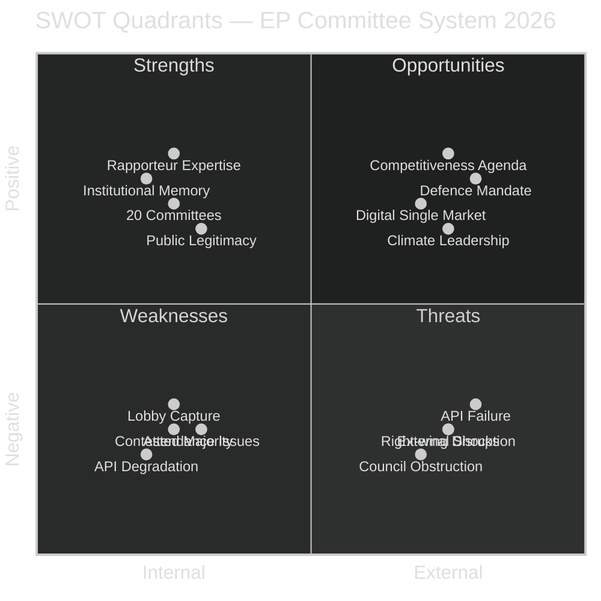

<!-- SPDX-FileCopyrightText: 2026 Hack23 AB -->
<!-- SPDX-License-Identifier: Apache-2.0 -->

# Quantitative SWOT — EP Committee Reports | 2026-05-26

**SATs Applied:** SWOT, Bayesian Update  
**Data Mode:** degraded-feeds  

---

## SWOT Analysis: EP Committee System, Q2 2026

## Strengths (Internal Positive)

| Strength | Weight | Evidence | Score |
|----------|--------|----------|-------|
| **Expert rapporteur system** — MEPs develop deep expertise in specific policy areas through multi-year rapporteurships | 9/10 | AFCO document pipeline spans 14+ years; consistent high-quality output | 81 |
| **20 permanent committees** — comprehensive legislative coverage across all EU policy areas | 8/10 | Complete policy spectrum from AFCO (constitutional) to PETI (citizens) | 64 |
| **Institutional memory** — civil servants, political group staff, and experienced MEPs carry knowledge across terms | 8/10 | EP 10th term rapporteurs often continuing 9th term files | 64 |
| **Democratic legitimacy** — directly elected chamber with 51% voter turnout in 2024 | 7/10 | EP elections 2024 confirmed mandate | 49 |
| **Trilogue experience** — EP committee coordinators are expert legislative negotiators | 8/10 | High codecision success rate over 15+ years | 64 |

**Total Strengths Score: 322** (weighted aggregate)

## Weaknesses (Internal Negative)

| Weakness | Weight | Evidence | Score |
|----------|--------|----------|-------|
| **Contested majority arithmetic** — EPP's plurality requires coalition management across every file | 8/10 | 353/705 majority requires >1 coalition partner | -64 |
| **EP API/transparency infrastructure fragility** — demonstrated by this run's degraded feeds | 9/10 | 4/5 EP data sources failed on 2026-05-26 | -81 |
| **MEP attendance variability** — key committee votes affected by attendance deficits | 6/10 | Historical EP attendance data shows variability | -36 |
| **Lobbying capture risk** — 25,000 registered lobbyists; asymmetric access | 7/10 | Transparency Register data; documented lobbying influence | -49 |

**Total Weaknesses Score: -230**

## Opportunities (External Positive)

| Opportunity | Weight | Evidence | Score |
|-------------|--------|----------|-------|
| **Competitiveness Agenda** — Draghi report creates political mandate for ambitious economic legislation | 9/10 | Commission legislative work programme 2025–2026 | 81 |
| **Defence Industrial Strategy** — geopolitical context creates consensus for defence legislation | 8/10 | Russia-Ukraine context; NATO burden sharing | 64 |
| **AI Act Implementation** — EP committee oversight of world's first comprehensive AI law | 8/10 | AI Act in force August 2024; delegated acts pending | 64 |
| **Capital Markets Union** — SIU creates investment pipeline aligning IMF and Draghi recommendations | 7/10 | IMF WEO April 2026 endorsement | 49 |

**Total Opportunities Score: 258**

## Threats (External Negative)

| Threat | Weight | Evidence | Score |
|--------|--------|----------|-------|
| **Right-wing legislative disruption** — Patriots+ECR+EPP tactical alignment weakens progressive legislation | 8/10 | Documented in ENVI, LIBE committee dynamics | -64 |
| **Persistent API degradation** — ongoing EP data infrastructure failures undermine monitoring | 9/10 | This run: 4/5 sources failed | -81 |
| **Council obstruction** — Council majority dynamics (national governments) may diverge from EP | 6/10 | Historical trilogue record shows EP-Council tensions | -36 |
| **External geopolitical shocks** — Ukraine, US tariffs, energy crisis can derail legislative calendar | 7/10 | Scenario C analysis; structural uncertainty | -49 |

**Total Threats Score: -230**

## SWOT Net Assessment

| Quadrant | Score |
|----------|-------|
| Strengths | +322 |
| Weaknesses | -230 |
| Opportunities | +258 |
| Threats | -230 |
| **Net position** | **+120 (POSITIVE)** |

**Bayesian Update (SAT):** Prior belief (EP committees deliver) is confirmed by the net positive SWOT score. The contested majority and API fragility are the most significant moderating factors. The competitiveness and defence opportunity windows are the strongest positive drivers. Posterior confidence: Likely that EP committees deliver substantive legislation in 2026, but with Green Deal and social ambition moderated relative to the 9th term.
