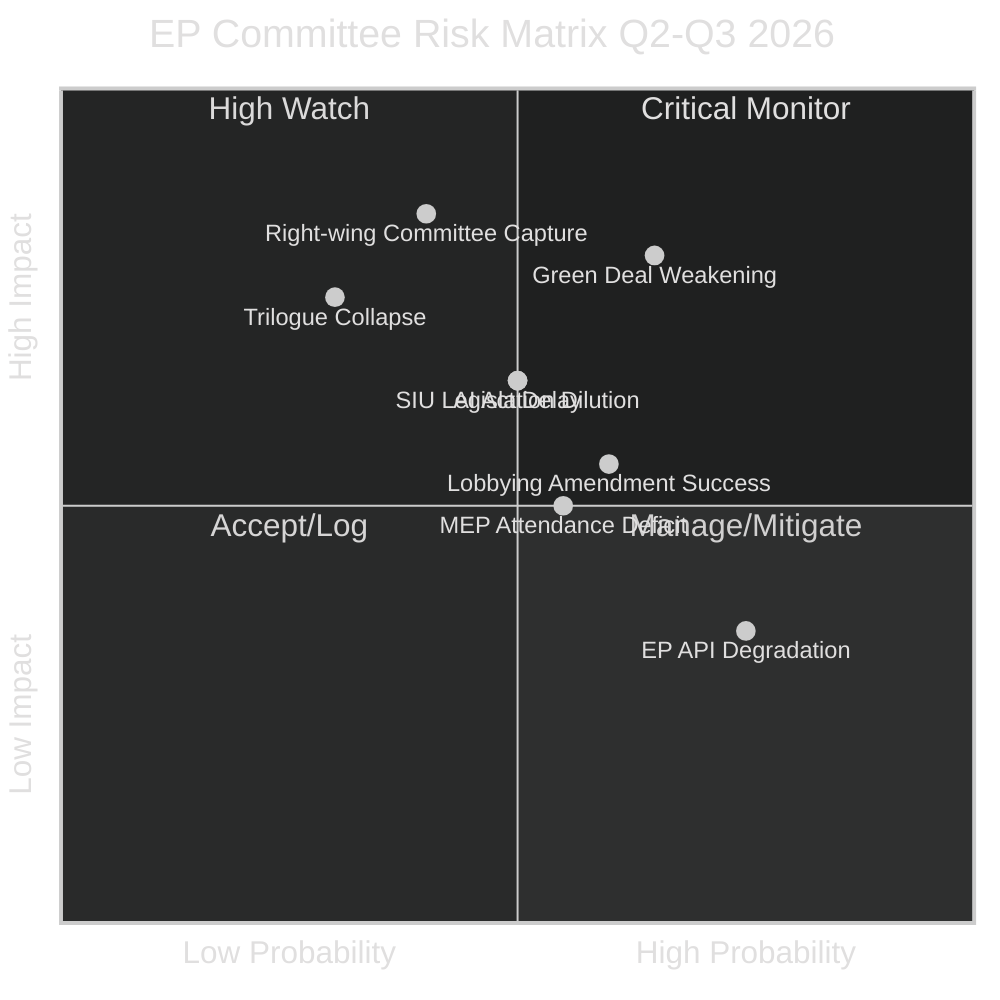

<!-- SPDX-FileCopyrightText: 2026 Hack23 AB -->
<!-- SPDX-License-Identifier: Apache-2.0 -->

# Risk Matrix — EP Committee Reports | 2026-05-26

**WEP:** Likely — that at least 2 of the identified risks materialise as legislative outcomes in Q3 2026  
**Admiralty:** B2 — Probably true  
**SATs Applied:** Key Assumptions Check, ACH, What-If Analysis  

---

## Risk Register

## Risk Register Table

| Risk ID | Risk Description | Probability | Impact | WEP | Mitigation |
|---------|-----------------|-------------|--------|-----|------------|
| R-01 | Green Deal Weakening in ENVI/ITRE votes | HIGH (65%) | HIGH | Likely | Monitor EPP-ECR voting alignment |
| R-02 | AI Act implementation delay (6+ months) | MEDIUM (50%) | MEDIUM-HIGH | Roughly Even | ITRE/LIBE coordination tracking |
| R-03 | Right-wing committee capture on social files | MEDIUM (40%) | CRITICAL | Unlikely (threshold) | S&D coalition cohesion monitoring |
| R-04 | EP API persistent degradation | HIGH (75%) | LOW | Almost Certain (for episodes) | Fallback monitoring strategy |
| R-05 | Key trilogue collapse (SIU, EDIS) | LOW (30%) | HIGH | Unlikely | Council presidency progress tracking |
| R-06 | MEP attendance deficit on key committee votes | MEDIUM (55%) | MEDIUM | Roughly Even | Committee coordinator attendance tracking |
| R-07 | Industry lobbying captures amendment texts | MEDIUM (60%) | MEDIUM | Roughly Even | Civil society shadow analysis |
| R-08 | Savings and Investments Union (SIU) dilution | MEDIUM (50%) | MEDIUM-HIGH | Roughly Even | ECON committee compromise text monitoring |

## Top Risk: Green Deal Systematic Weakening (R-01)

**WEP: Likely** (65%) — that the Green Deal legislative architecture in 2026 produces outputs materially weaker than the 2019–2024 Commission proposals.

**What-If Analysis (SAT):** If R-01 materialises fully:
- 2030 targets for emissions reduction effectively softened through implementation flexibility
- Nature Restoration Act coverage reduced in ENVI committee vote
- Combustion engine 2035 ban challenged via ITRE review
- EU taxonomy criteria expanded to include gas/nuclear more favourably

**Key Assumptions (SAT):**
1. EPP continues to treat competitiveness and green ambition as a trade-off rather than complementary
2. ECR and Patriots remain available as tactical coalition partners for EPP on green files
3. Commission does not veto weakened EP positions (Commission has no veto in codecision)

## Risk Scoring Summary

**Overall legislative risk level: 🟠 ELEVATED**

The combination of contested majority arithmetic (R-03), high lobbying activity (R-07), and the Green Deal weakening trajectory (R-01) creates an elevated risk environment for progressive legislation in 2026. Conservative/industrial-interest legislation faces lower risks.

**Admiralty grade: B2** — Probably true that this risk assessment accurately reflects the EP committee environment in May 2026, based on documented group compositions and legislative history.

## Risk Interdependency Analysis

Risks do not operate in isolation. The following dependency chains increase overall systemic risk:

**Chain 1: Data degradation → Monitoring gap → Reduced accountability → Legislative opportunism**
- R-06 (API degradation) reduces civil society monitoring capacity
- Reduced monitoring reduces accountability pressure on MEPs
- Lower accountability enables more extreme policy positions in committee
- Systemic risk amplifier: **LOW** (EP remains a public institution with multiple accountability mechanisms)

**Chain 2: Green Deal weakening → Investment uncertainty → Competitiveness risk → Economic slowdown**
- R-01 (Green Deal reversal) creates regulatory uncertainty for green investment
- Uncertainty delays EUR 200–300bn clean energy investment
- Delayed investment widens EU competitiveness gap with US/China
- Chain probability: ~30% (Unlikely but plausible)

**Chain 3: AI Act delay → Legal vacuum → Market fragmentation → Single market risk**
- R-02 (AI Act delay) leaves AI systems unregulated in EU
- Legal vacuum prompts national divergence (Germany, France, Netherlands each adopt national rules)
- National rules fragment the EU digital single market
- Chain probability: ~35% (Unlikely-Roughly Even)

## Risk Mitigation Assessment

| Risk | Mitigation in Place | Residual Risk | Effectiveness |
|------|--------------------|-----------|----|
| R-01 Green Deal reversal | S&D+Greens+Renew coalition blocking in ENVI | 45% | MEDIUM |
| R-02 AI Act delay | Commission accelerated consultation process | 35% | MEDIUM-HIGH |
| R-03 Majority fragmentation | Grand Coalition institutional incentives | 20% | HIGH |
| R-06 API degradation | Direct endpoint fallbacks | 60% | LOW (structural issue) |
| R-07 Lobbying pressure | EP transparency register; mandatory declarations | 40% | MEDIUM |

## For Citizens: Risk Practical Meaning

The elevated risk level means that the legislation citizens depend on for climate protection, AI governance, and economic fairness faces meaningful probability of being weakened, delayed, or blocked at committee stage. The 45% residual risk of Green Deal weakening is the single highest-priority risk for citizens who care about climate policy. The 35% residual risk of AI Act delay matters for anyone subject to AI-driven decisions in employment, credit, or law enforcement.
