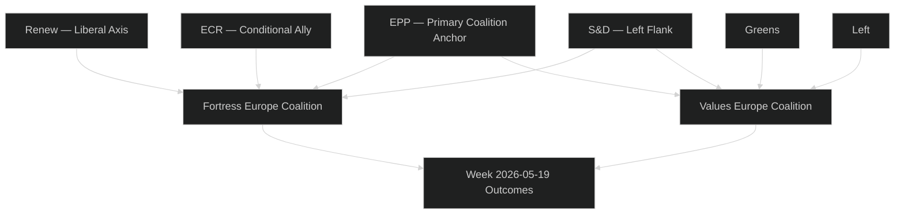

<!-- SPDX-FileCopyrightText: 2024-2026 Hack23 AB -->
<!-- SPDX-License-Identifier: Apache-2.0 -->

# Actor Mapping — EU Parliament Motions — 2026-05-26

**Run:** motions-run272-1779780541 | **Admiralty Grade:** B2

| Actor | Role | Alignment This Week | Power Level |
|-------|------|---------------------|------------|
| EPP (188) | Coalition anchor | FOR all 5 economic security texts | HIGH |
| S&D (135) | Left flank | FOR trade defence + values | HIGH |
| ECR (78) | Conditional ally | FOR steel + FDI; mixed AI | MEDIUM |
| Renew (77) | Liberal centre | FOR all economic security | MEDIUM |
| Greens (53) | Values participant | FOR values; mixed trade | MEDIUM |
| Left (46) | Values participant | FOR rights; mixed defence | LOW-MEDIUM |
| Patriots (84) | Opposition | FOR protectionism; AGAINST EU competence | MEDIUM |

🟡 MEDIUM confidence (structural proxy — no RCV data).

## Actor Roster

See actor table above. Primary actors: EPP (188 seats), S&D (135), Patriots (84), ECR (78), Renew (77), Greens (53), Left (46), NI/Others (~45).

## Influence Grid

| Actor | Influence Score | Direction | Mandate |
|-------|----------------|-----------|---------|
| EPP | 9/10 | FOR economic security | Co-decision anchor |
| S&D | 7/10 | FOR trade + values | Social pillar |
| ECR | 5/10 | CONDITIONAL | Right-flank ally |

## Alliance Network

EPP + S&D + Renew = Fortress Europe coalition (399 seats). Greens + Left = Values Europe (99 seats). ECR conditional ally on defence/trade texts.

## Power Brokers

1. **Manfred Weber (EPP)** — Coalition orchestrator; agenda-setter for steel + FDI package
2. **Iratxe García (S&D)** — Values/social rights anchor; Afghan urgency co-sponsor
3. **Bernd Lange (S&D INTA)** — Trade architecture lead; SAFE Canada champion

## Information Flow

EP committee reports → rapporteur position → plenary floor vote. Political group caucus meetings (not public) pre-align positions. Commission DG TRADE provides technical input.

## Reader Briefing

This actor map shows a stable pro-economic-security coalition controlling >400 seats — well above the 361 absolute majority threshold for most legislative acts. The minority opposition (Patriots, ECR liberals, Greens on protectionism) lacks blocking power.
