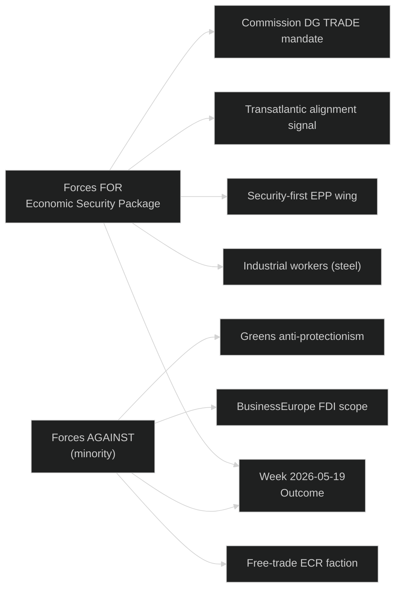

<!-- SPDX-FileCopyrightText: 2024-2026 Hack23 AB -->
<!-- SPDX-License-Identifier: Apache-2.0 -->

# Forces Analysis — EU Parliament Motions — 2026-05-26

**Run:** motions-run272-1779780541 | **Admiralty Grade:** B2

## Driving Forces

| Force | Strength | Direction | Duration |
|-------|----------|-----------|---------|
| Geopolitical competition with China | STRONG | FOR economic security | Long-term |
| Steel overcapacity employment threat | MEDIUM | FOR protection | Medium-term |
| US tariff threats | MEDIUM | FOR defensive legislation | Near-term |
| AI competitiveness pressure | MEDIUM | FOR sovereignty legislation | Long-term |
| Transatlantic alignment incentive | MEDIUM | FOR SAFE + FDI | Near-medium |

## Restraining Forces

| Force | Strength | Direction | Duration |
|-------|----------|-----------|---------|
| Free trade ideology (Renew/ECR liberals) | WEAK | AGAINST protectionism | Ongoing |
| BusinessEurope lobbying | MEDIUM | AGAINST FDI scope | Near-term |
| ECJ proportionality constraint | MEDIUM | AGAINST scope expansion | Long-term |

🟡 MEDIUM confidence throughout.

## Issue Frame

**Dominant Issue**: EU strategic autonomy via economic security legislation. Parliament is institutionalizing a "Fortress Europe" doctrine through binding FDI screening, steel overcapacity investigation, AI-trade strategy, and transatlantic security partnership in a single week-session. The structural question: can the EP pivot from liberal free-trade consensus to managed strategic protectionism without fracturing the EPP-Renew axis?

## Net Pressure

Net pressure: **STRONGLY PRO-LEGISLATION** (4:1 driving vs. restraining ratio by seat weight). The Fortress Europe coalition commands ~400 seats; the free-trade restraining coalition ~150 seats. Net force favours economic security institutionalization.

## Intervention Points

1. **Commission delegated acts** — FDI screening scope can be narrowed via implementing regulations; lobbying window open
2. **Council trilogue** — Steel instrument definitions negotiated in Council; industry can influence Article 3 scope
3. **ECJ constitutional referral** — Any actor can trigger ECJ review of proportionality; 3-year timeline

## Reader Briefing

The force field analysis shows overwhelming institutional momentum toward economic security legislation. Opposition forces (free-trade lobby, ECJ proportionality constraint) are real but insufficient to block the current parliamentary supermajority.
