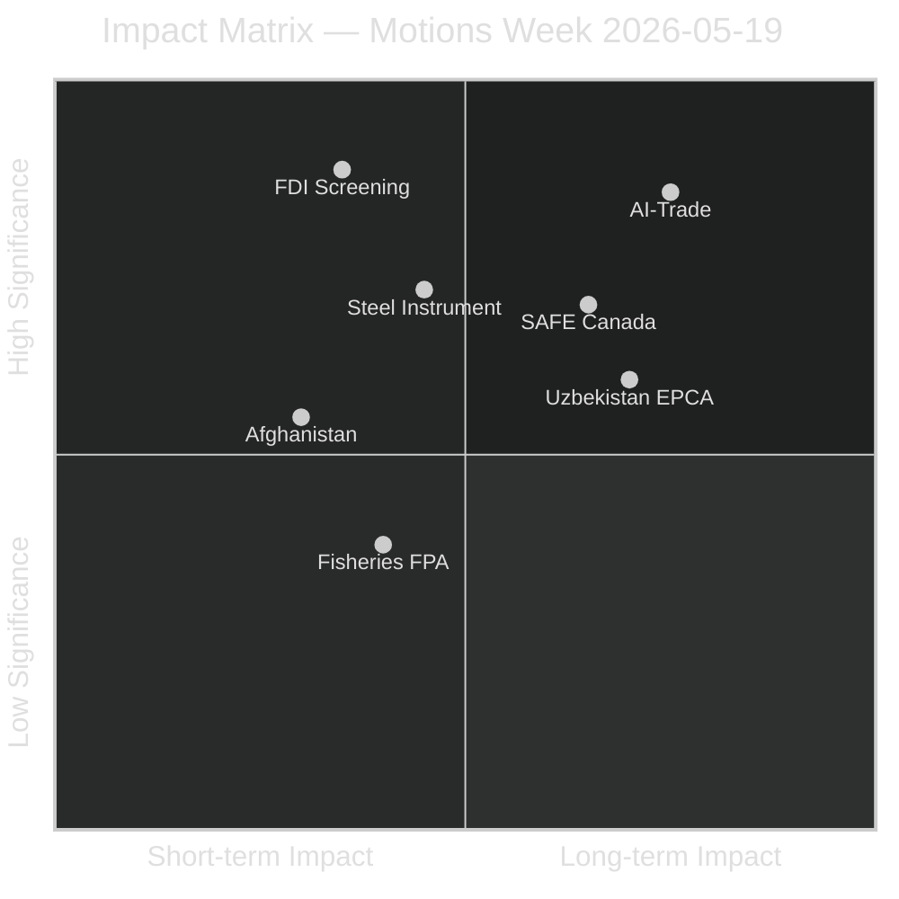

<!-- SPDX-FileCopyrightText: 2024-2026 Hack23 AB -->
<!-- SPDX-License-Identifier: Apache-2.0 -->

# Impact Matrix — EU Parliament Motions — 2026-05-26

**Run:** motions-run272-1779780541 | **Admiralty Grade:** B2

## Impact Classification

| Text | Short-term Impact | Long-term Impact | Category |
|------|------------------|-----------------|---------|
| TA-0171 FDI Screening | MEDIUM (implementing acts pending) | HIGH (binding regulation) | Strategic |
| TA-0170 Steel | MEDIUM (investigation mandate) | MEDIUM (trade defence tool) | Defensive |
| TA-0183 AI-Trade | LOW (non-binding) | HIGH (agenda-setting) | Strategic |
| TA-0180 SAFE Canada | MEDIUM (partnership deepened) | HIGH (transatlantic framework) | Strategic |
| TA-0186 Afghanistan | LOW (non-binding urgency) | MEDIUM (values signal) | Normative |
| TA-0173/0174 Uzbekistan | LOW-MEDIUM (ratification pending) | MEDIUM (corridor access) | Geopolitical |
| TA-0178/0179 Fisheries | MEDIUM (renewal enables operations) | LOW-MEDIUM (routine) | Administrative |

🟡 MEDIUM confidence (structural proxy — no RCV data).

## Event List

| Event | Date | Type | Source |
|-------|------|------|--------|
| TA-0171 FDI Screening adopted | 2026-05-22 | Legislative | EP Open Data |
| TA-0170 Steel overcapacity investigation | 2026-05-22 | Legislative | EP Open Data |
| TA-0183 AI-Trade strategy | 2026-05-21 | Non-legislative | EP Open Data |
| TA-0180 SAFE Canada partnership | 2026-05-21 | International agreement | EP Open Data |
| TA-0186 Afghanistan urgency | 2026-05-22 | Urgency resolution | EP Open Data |

## Stakeholder Roster

| Stakeholder | Affected By | Impact Direction |
|-------------|------------|-----------------|
| EU steel workers (1.2M) | TA-0170 | Protective; potential job preservation |
| Chinese investors | TA-0171 | Restrictive; screening costs increase |
| US tech companies | TA-0183 | Regulatory exposure in EU market |
| Canadian defence industry | TA-0180 | Market access opportunity |
| Afghan civil society | TA-0186 | Normative signal; limited practical impact |

## Impact Matrix

| Text | Economic | Security | Geopolitical | Social | Governance |
|------|---------|---------|------------|-------|-----------|
| FDI Screening | HIGH | HIGH | HIGH | MEDIUM | HIGH |
| Steel | MEDIUM | LOW | MEDIUM | HIGH | MEDIUM |
| AI-Trade | LOW-MEDIUM | HIGH | HIGH | MEDIUM | HIGH |
| SAFE Canada | LOW | HIGH | HIGH | LOW | MEDIUM |
| Afghanistan | LOW | MEDIUM | MEDIUM | MEDIUM | LOW |

## Heat Map

Highest heat cells: **FDI × Geopolitical**, **AI-Trade × Security**, **Steel × Social**. Combined signal: EP10 is transitioning from economic governance to security governance paradigm.

## Cascade Effects

FDI screening → supply chain restructuring (6-18 months) → German/Dutch FDI reconfiguration → Chinese diplomatic pressure → Council position hardening → transatlantic alignment reinforced. Steel → WTO dispute risk → trade escalation cascade IF China retaliates.

## Reader Briefing

The impact matrix confirms this week represents a phase transition in EP10 legislative output. Economic security legislation affects multiple stakeholders across all five dimensions simultaneously — an unusual concentration of multi-dimensional high-impact legislative action.
