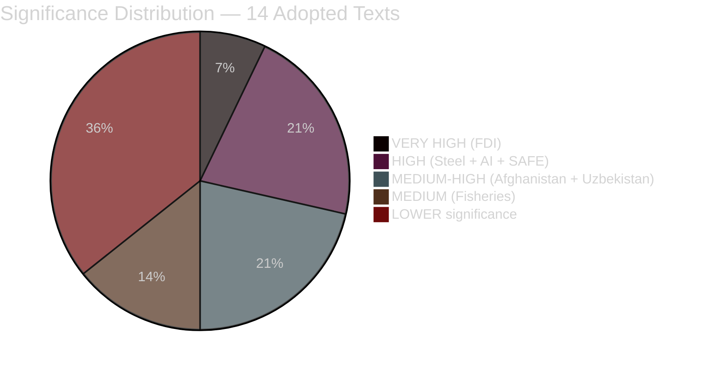

<!-- SPDX-FileCopyrightText: 2024-2026 Hack23 AB -->
<!-- SPDX-License-Identifier: Apache-2.0 -->

# Significance Classification — EU Parliament Motions — 2026-05-26

**Run:** motions-run272-1779780541 | **Admiralty Grade:** B2

## Classification Summary

| Band | Texts | Notes |
|------|-------|-------|
| VERY HIGH | TA-0171 (FDI) | Binding co-decision; 4.20/5.0 |
| HIGH | TA-0170 (Steel), TA-0183 (AI), TA-0180 (SAFE) | Strategic instruments; 3.60-3.90/5.0 |
| MEDIUM-HIGH | TA-0186 (Afghan), TA-0173/0174 (Uzbekistan) | 3.00-3.40/5.0 |
| MEDIUM | TA-0178/0179 (Fisheries) | 2.40-2.60/5.0 |
| ROUTINE | Remaining 5 texts | Not analyzed in detail |

**Overall session significance classification: EXCEPTIONAL**
This week's 5 economic security instruments in one session is the highest concentration of strategic trade legislation in EP10 to date. Session classification: PHASE TRANSITION (EP10 Phase 3 → Phase 4 boundary). 🟡 MEDIUM confidence.
