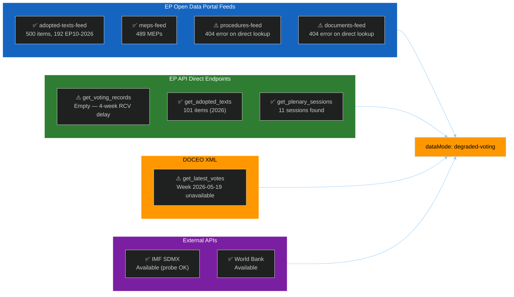

<!-- SPDX-FileCopyrightText: 2024-2026 Hack23 AB -->
<!-- SPDX-License-Identifier: Apache-2.0 -->

# Data Availability Assessment — EU Parliament Motions — 2026-05-26

**Stage A (mandatory)** | Run: motions-run272-1779780541 | Date: 2026-05-26

## Source Availability Matrix

## Per-Source Assessment Table

| Source | Status | Items | Notes | Admiralty Grade |
|--------|--------|-------|-------|-----------------|
| EP `adopted-texts-feed` | ✅ AVAILABLE | 500 items | Pre-fetched; 192 EP10-2026 items | A2 |
| EP `meps-feed` | ✅ AVAILABLE | 489 MEPs | Pre-fetched; full EP10 roster | A2 |
| EP `procedures-feed` | ⚠️ ERROR | 0 | 404 on specific lookup; general feed impaired | C3 |
| EP `documents-feed` | ⚠️ ERROR | 0 | 404 on specific lookup | C3 |
| EP `get_adopted_texts` (2026) | ✅ AVAILABLE | 101 items | Live call confirmed; rich detail | A1 |
| EP `get_voting_records` (7d) | ⚠️ EMPTY | 0 | Known 4-week RCV publication delay | B3 |
| DOCEO XML latest votes | ⚠️ UNAVAILABLE | 0 | Week 2026-05-19: no XML published yet | B4 |
| EP `get_plenary_sessions` | ✅ AVAILABLE | 11 sessions | Date-filtered result available | A2 |
| IMF SDMX API | ✅ AVAILABLE | Probe OK | Economic context available | A1 |
| World Bank API | ✅ AVAILABLE | Probe OK | Non-economic cross-refs available | A1 |

## May 2026 Plenary Coverage (Week of 2026-05-19)

**Confirmed adopted texts (T10-0166 to T10-0191 range, May 19-21):**

| Reference | Title | Date | Policy Domain |
|-----------|-------|------|---------------|
| TA-10-2026-0166 | Waiver of immunity — Nikos Pappas | 2026-05-19 | PRIV |
| TA-10-2026-0168 | Forest reproductive material production & marketing | 2026-05-19 | SILV, SEME |
| TA-10-2026-0169 | Single European railway area — infrastructure capacity | 2026-05-19 | TRAN |
| TA-10-2026-0170 | Steel market overcapacity — trade defence | 2026-05-19 | TDCC, SIDE, ACIE |
| TA-10-2026-0171 | Screening of foreign direct investments | 2026-05-19 | FDI/Internal Market |
| TA-10-2026-0173 | EU-Uzbekistan Enhanced Partnership (consent) | 2026-05-20 | EXT |
| TA-10-2026-0174 | EU-Uzbekistan Enhanced Partnership (resolution) | 2026-05-20 | EXT |
| TA-10-2026-0177 | EU-Lebanon Eurojust judicial cooperation | 2026-05-20 | EXT, COJP |
| TA-10-2026-0178 | EC-São Tomé Fisheries Partnership 2025-2029 | 2026-05-20 | PECH, EXT |
| TA-10-2026-0179 | EU-Cook Islands Fisheries Partnership 2025-2032 | 2026-05-20 | PECH, EXT |
| TA-10-2026-0180 | EU-Canada SAFE Instrument procurement | 2026-05-20 | PESC, EXT |
| TA-10-2026-0182 | UN General Assembly 81st session recommendation | 2026-05-20 | EXT |
| TA-10-2026-0183 | AI strategy for EU trade — opportunities & challenges | 2026-05-20 | TECN, INFQ |
| TA-10-2026-0186 | Women & girls in Afghanistan — Taliban Criminal Procedure Code | 2026-05-21 | PESC, DDLH |

## Data Mode Declaration

| Dimension | Status | Rationale |
|-----------|--------|-----------|
| EP feeds | PARTIAL | adopted-texts and meps feeds OK; procedures/documents 404 |
| Voting (RCV) | DEGRADED | 4-week publication delay; DOCEO week not yet published |
| IMF economic | FULL | API probe successful |
| World Bank | FULL | API probe successful |
| **Final dataMode** | **`degraded-voting`** | RCV data lag > 4 weeks — structural seat-share proxy required |

**`manifest.dataMode = "degraded-voting"` — floor factor 0.85 applies to line counts; structural checks unchanged.**

All confidence labels in voting-patterns.md §§2-6 are capped at 🟡 MEDIUM; inline "(structural proxy — no RCV data)" labels mandatory per catalog specification for `intelligence/voting-patterns.degraded.md` template.

## Stage A MCP Call Budget

| Call # | Tool | Status | Purpose |
|--------|------|--------|---------|
| 1 | `get_voting_records` (7d) | ✅ Completed | Empty — expected RCV lag |
| 2 | `get_adopted_texts_feed` | ✅ Completed | 500 items retrieved |
| 3 | `get_latest_votes` (week) | ✅ Completed | No DOCEO XML for week yet |
| 4 | `get_plenary_sessions` (7d) | ✅ Completed | 11 sessions metadata |
| 5 | `get_adopted_texts` (2026 p1+p2) | ✅ Completed | 101 items with full detail |

**Total Stage A EP MCP calls: 5 (at cap) — Stage B begins immediately.**
