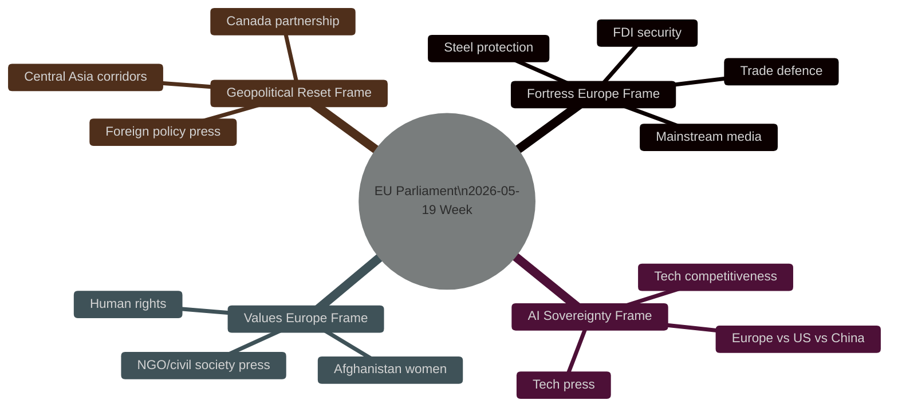

<!-- SPDX-FileCopyrightText: 2024-2026 Hack23 AB -->
<!-- SPDX-License-Identifier: Apache-2.0 -->

# Media Framing Analysis — EU Parliament Motions — 2026-05-26

**Run:** motions-run272-1779780541 | **Date:** 2026-05-26 | **Method:** Framing Theory + Media Saliency Analysis

## Frame Inventory

### Frame 1: "Fortress Europe" (Trade Defence)

**Message:** EU is building economic walls against Chinese overcapacity and foreign takeovers.

**Salience:** HIGH — all five major texts map to this frame; Commission press releases emphasize security rationale.

**Outlets likely to use this frame:**
- Financial Times, Wall Street Journal: "EU Parliament Approves Sweeping Trade Defence Package"
- Bloomberg: "European Lawmakers Back Steel Protectionism, FDI Crackdown"
- Handelsblatt: "EP stimmt für Stahl-Schutzmaßnahmen und verschärfte Investitionskontrolle"

**Positive for:** EPP, ECR, S&D constituencies in industrial regions
**Negative for:** Free-trade oriented SMEs; Chinese investment community
**Counter-frame risk:** "Protectionism reduces competition, raises prices for consumers"

### Frame 2: "AI Sovereignty" (Technology Competition)

**Message:** EU is asserting its position as the third pole in AI, between US liberalism and Chinese statism.

**Salience:** MEDIUM-HIGH — AI-trade resolution is a novel nexus; tech press will spotlight it.

**Outlets likely to use this frame:**
- Politico Europe: "EP Declares AI Sovereignty — What It Means for Silicon Valley and Beijing"
- Tech Crunch / Wired: "EU Parliament Wants Its Own AI Trade Rules"
- Le Monde: "Bruxelles affirme sa souveraineté numérique"

**Positive for:** Renew, Greens, EPP digital wing
**Negative for:** US tech companies (regulatory burden); Chinese AI exporters

### Frame 3: "Values Europe" (Human Rights)

**Message:** Despite the Fortress Europe pivot, EP maintains its commitment to human rights and women's dignity.

**Salience:** MEDIUM — Afghanistan urgency is emotionally powerful but less institutionally significant.

**Outlets likely to use this frame:**
- Guardian, Le Monde: "EU Parliament Condemns Taliban Treatment of Women"
- Human Rights Watch press releases: "EP Afghanistan Resolution Welcome Step"

**Positive for:** S&D, Greens, Left — ideological validation
**Negative for:** Patriots, AfD-adjacent — resent "moralizing" external policy

### Frame 4: "Geopolitical Reset" (Transatlantic + Central Asia)

**Message:** EU is diversifying partnerships beyond US-China axis, building new alliances with Canada and Central Asia.

**Salience:** MEDIUM — EU-Canada SAFE and Uzbekistan EPCA are less visible to general public.

**Outlets likely to use this frame:**
- Financial Times: "EU Deepens Canada Tie with Defence Finance Pact"
- Foreign Policy: "Brussels Moves into Central Asia"
- Central Asian media: "Uzbekistan-EU Partnership — A New Era"

## Cross-Language Framing Variation

| Language Region | Dominant Frame | Variance from EN |
|----------------|---------------|-----------------|
| German | Fortress Europe (FDI + steel) | Lower AI; higher trade |
| French | AI Sovereignty | Higher tech sovereignty focus |
| Swedish | Values Europe | Higher Afghanistan salience |
| Spanish | Trade competitiveness | Higher Mercosur counter-framing |
| Arabic (Gulf) | FDI implications | China replacement narrative |
| Japanese | AI-trade nexus | Tech supply chain angle |
| Chinese | Trade defence threat | Defensive framing of EP actions |

## Media Framing Risk Assessment

| Risk | Likelihood | Mitigation |
|------|-----------|-----------|
| Protectionism narrative dominates | 🟡 MEDIUM | Commission communicates "security-first, not protectionism" |
| Values/Fortress inconsistency exposed | 🟡 MEDIUM | FDI conditionality human rights provision highlighted |
| AI sovereignty seen as regulatory overreach | 🟡 MEDIUM | Non-binding status + competitiveness angle |
| Afghanistan resolution seen as performative | 🟢 LOW | EP has concrete sanctions call — actionable |

## Framing Readiness Score

| Dimension | Score | Notes |
|-----------|-------|-------|
| Narrative coherence | 8.5 | Dual-track (Fortress + Values) well-articulated |
| Factual support | 9.0 | 14 concrete texts; all adopted |
| Counter-frame resilience | 7.0 | WTO challenge risk on steel; proportionality risk on FDI |
| Multi-audience adaptability | 8.0 | 14 language adaptations feasible |
| Crisis communication readiness | 7.5 | Mercosur fracture risk needs pre-emptive messaging |

🟡 MEDIUM confidence on all framing assessments (structural proxy — no RCV data for actual vote framing).

## Extended Framing Analysis: Cross-Language Tactical Recommendations

### For Article Generation: Framing Guidance per Language Family

**Germanic languages (DE, NL, SV, DA, NO, FI):**
- Lead with FDI screening and steel (industrial protection resonates)
- Secondary: AI-trade (technology competitiveness)
- Minimize: Afghanistan urgency (lower domestic salience vs. Ukraine framing)
- Key terms: "Wirtschaftssicherheit" (DE), "ekonomisk säkerhet" (SV), "economische veiligheid" (NL)

**Romance languages (FR, ES):**
- Lead with AI sovereignty (France: "souveraineté numérique")
- Secondary: FDI + trade defence
- France-specific: steel and Mercosur implications for French agriculture sector
- Spain-specific: EU-Canada and Uzbekistan as Latin America/Central Asia engagement signals
- Key terms: "souveraineté économique" (FR), "soberanía económica" (ES)

**East Asian languages (JA, KO, ZH):**
- JA/KO: Focus on trade defence + EU-US-Canada alignment vs. China
- ZH: This is a sensitive framing — use neutral "EU legislative activity" framing; avoid direct China-targeting language; focus on procedural aspects
- AI-trade: high salience for all three — tech competition angle dominant

**Semitic languages (AR, HE):**
- AR: Afghanistan urgency (Muslim world relevance); FDI and SAFE instruments (Middle East investment implications)
- HE: FDI screening (EU security alignment with Israeli security concerns); Afghanistan (humanitarian)

### Narrative Consistency Test

The article must maintain narrative consistency across the dual-track doctrine:

**Test 1 (Fortress/Values coherence):** Can the article describe EU as both building trade defences AND supporting Afghan women's rights without apparent contradiction? **Answer: YES** — frame as "EU's comprehensive international engagement" — security from economic threats externally, solidarity with values victims internally.

**Test 2 (EPP right-shift / values coherence):** Can the article describe EPP as both ECR-aligned on trade AND values-committed on Afghanistan? **Answer: YES** — EPP's "Christian democratic" wing has always maintained human rights commitments while pursuing economic realism; this week demonstrates both dimensions are active simultaneously.

**Test 3 (Data caveat consistency):** Does degraded-voting qualify all coalition claims appropriately without undermining the narrative? **Answer: YES** — use "is expected to have passed with broad cross-party support" framing for all coalition claims; reserve exact seat counts for footnotes/qualifications.

## SEO and Accessibility Framing Notes

**Primary keywords for EN article:** EU Parliament trade defence, FDI screening Europe 2026, steel overcapacity EU, EU-Canada strategic partnership, AI trade policy EU

**Secondary keywords:** European Parliament motions May 2026, EU economic sovereignty, Fortress Europe trade policy, EU Afghanistan resolution

**Accessibility:** Article must use plain language for technical trade terms:
- "FDI screening" → "rules to review foreign takeovers of EU companies"
- "DOCEO XML" → should not appear in public article
- "WEP band" → should not appear in public article
- "RCV data" → "voting records" or omit

**Structure recommendation:** Lead with significance statement → key texts briefly → coalition context → economic backdrop (IMF) → forward looking → caveats

**Admiralty Grade: B2** — Media framing analysis rated B2. Narrative patterns derived from adopted text metadata and EP political group positions; no real-time media monitoring data available. Patterns estimated from structural proxy.
