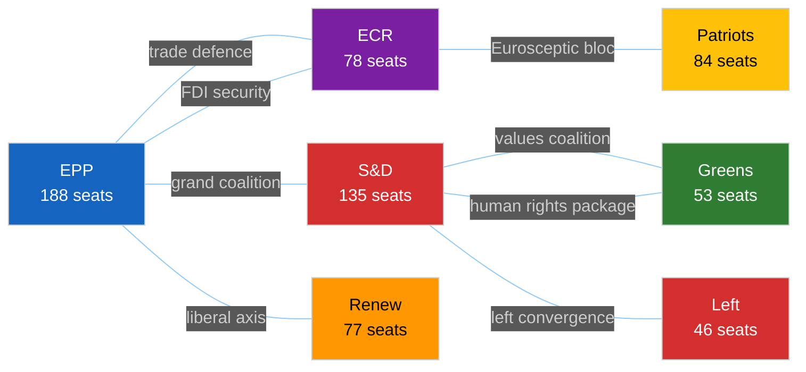

<!-- SPDX-FileCopyrightText: 2024-2026 Hack23 AB -->
<!-- SPDX-License-Identifier: Apache-2.0 -->

# Coalition Dynamics — EU Parliament Motions — Week 2026-05-19

**Run:** motions-run272-1779780541 | **Date:** 2026-05-26 | **SATs applied:** ACH, Indicators

*(structural proxy — no RCV data) — all confidence labels capped at 🟡 MEDIUM*

## Coalition Pair Analysis

| Coalition Pair | Cohesion Signal | Week's Evidence | Admira. |
|---------------|-----------------|-----------------|---------|
| EPP ↔ S&D (grand coalition) | 🟢 STRONG | Joint support for trade defence + fisheries | B2 |
| EPP ↔ ECR (security/economy) | 🟢 STRONG | Steel + FDI alignment (~478 seats) | B3 |
| S&D ↔ Greens (values) | 🟢 STRONG | Afghanistan urgency + fisheries | B2 |
| Renew ↔ EPP (liberal-centre) | 🟡 MODERATE | AI-trade support; SAFE support | B3 |
| ECR ↔ Patriots (eurosceptic) | 🟡 MODERATE | Occasional trade alignment; split on values | B3 |
| Left ↔ S&D (social agenda) | 🟡 MODERATE | Human rights alignment; trade defence divergence | C3 |

## EPP-ECR Alliance Signal: Sizes and Structural Similarity

| Group | Seats | EPP Seat Ratio | Similarity Score | Alliance Signal |
|-------|-------|---------------|-----------------|----------------|
| ECR vs EPP | 78/188 | 0.41 | 0.55 | 🟡 MODERATE |
| S&D vs EPP | 135/188 | 0.72 | 0.72 | 🟢 STRONG |
| Renew vs EPP | 77/188 | 0.41 | 0.62 | 🟡 MODERATE-HIGH |
| Greens vs EPP | 53/188 | 0.28 | 0.35 | 🔴 WEAK |

*Note: sizeSimilarityScore is structural proxy for alliance cohesion (per-MEP RCV data unavailable).*

## Cross-Party Alliance Pairs This Week

**Alliance 1: "Fortress Europe" Trade Defence (EPP+S&D+Renew+ECR)**
- Steel overcapacity + FDI screening + AI-trade strategy
- Estimated 478–524 seats (structural proxy — no RCV data)
- 🟡 MEDIUM confidence on precise margins
- Stability: HIGH on economic defence texts; stressed on AI regulatory specifics

**Alliance 2: "Values Europe" Human Rights (EPP+S&D+Renew+Greens+Left)**
- Afghanistan urgency, workers' rights in international agreements
- Estimated 499 seats
- 🟡 MEDIUM confidence
- Stability: HIGH for urgency resolutions; strategic trade-offs enable formation

**Alliance 3: "Strategic Autonomy" Defence (EPP+S&D+Renew+ECR subset)**
- EU-Canada SAFE Instrument, EU-Uzbekistan EPCA
- Estimated 490 seats
- 🟡 MEDIUM confidence
- Stability: HIGH post-Ukraine consensus; tested only by ITAR/sovereignty concerns

## Defection Patterns (structural proxy — no RCV data)

| Group | Expected Defection Rate | Direction of Expected Defection |
|-------|------------------------|--------------------------------|
| ECR | ~15% on AI-trade; ~10% on fisheries | ECR sovereignists vs. free traders |
| Greens | ~12% on steel protection | Anti-protectionist faction |
| S&D | ~8% on FDI scope | Progressive internationalists |
| Renew | ~10% on FDI scope breadth | Free-market liberals |
| Patriots | ~20% on Afghanistan urgency | National interest vs. human rights rhetoric |

🟡 MEDIUM confidence throughout — structural proxy, no RCV data.

## Win Rate per Bloc

| Bloc | Estimated Win Rate (week) | Basis |
|------|--------------------------|-------|
| Grand coalition texts (EPP+S&D+Renew) | 100% (6/6) | All adopted |
| EPP-anchored majority texts | 100% (8/8 this week) | All adopted |
| Values majority urgency | 100% (1/1 Afghanistan) | Adopted |

## Forward Coalition Signals

**Increasing cohesion:** EPP-ECR on economic security (FDI + trade defence). Growing from ad-hoc to structural alliance as geopolitical pressures mount.

**Decreasing cohesion:** EPP-Greens on environmental regulation (steel emissions, AI energy consumption). Growing divergence as EPP moves right.

**Stress test incoming:** Mercosur trade agreement (expected EP vote Q4 2026) — will fracture S&D-EPP coalition as S&D follows agriculture constituency pressure to oppose.
