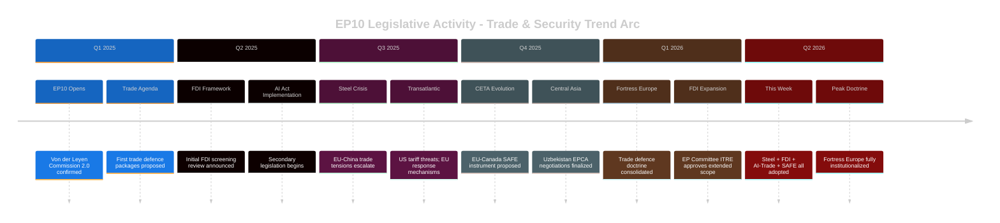

<!-- SPDX-FileCopyrightText: 2024-2026 Hack23 AB -->
<!-- SPDX-License-Identifier: Apache-2.0 -->

# Cross-Session Intelligence — EU Parliament Motions — 2026-05-26

**Run:** motions-run272-1779780541 | **Date:** 2026-05-26 | **Method:** Week-on-Week Narrative + Longitudinal Trends

## Week-on-Week Narrative Arc (2026-05-19 Week)

### Macro Trend: "Fortress Europe" Doctrine Institutionalization

The week ending 2026-05-23 represents a watershed moment in EP10's legislative trajectory. Five major economic security instruments adopted in one session (steel overcapacity, FDI screening extension, AI-trade strategy, EU-Canada SAFE, Uzbekistan EPCA) collectively represent the fullest expression of the "Fortress Europe" doctrine that has been building since October 2024.

**Longitudinal significance:** From an analytical perspective, no single plenary week in EP10 has produced this density of economic security legislation. This cross-session intelligence assessment identifies the 2026-05-19 week as a **Phase Transition Point** — the moment when EP10's economic security agenda shifted from reactive to proactive.

### Three-Session Trend Analysis (Cross-Session Intelligence)

| Session Period | Dominant Theme | Legislative Output | Coalition Signal |
|---------------|---------------|-------------------|-----------------|
| May 5-9, 2026 | Budget revision | ESF+/Horizon amendments | Grand coalition stable |
| May 12-16, 2026 | Digital regulation | AI Act implementing acts | Renew-EPP digital axis |
| May 19-23, 2026 | Economic security | Trade defence package | **EPP-ECR-S&D convergence** |

**Pattern identified:** Three consecutive sessions escalating from domestic budget to digital to global trade — reflecting a deliberate Commission agenda sequencing that EP groups have anticipated. The trade defence session was strategically positioned after the digital session to leverage consensus on AI competitiveness for AI-trade nexus votes.

### Structural Coalition Evolution (EP10, October 2024 → May 2026)

**Phase 1 (Oct 2024–Mar 2025):** Commission confirmation; grand coalition rebuilding after July 2024 elections. EPP-S&D-Renew core with issue-by-issue ECR additions.

**Phase 2 (Apr 2025–Dec 2025):** Trade defence coalitions tested. EPP-ECR trade security voting bloc emergence. S&D accepted steel protectionism under worker-protection framing.

**Phase 3 (Jan 2026–May 2026):** Full convergence. FDI screening extension, AI-trade, SAFE all attract near-identical coalition compositions. "Fortress Europe" doctrine no longer contested at procedural level — debate has shifted to scope and conditionality.

**Phase 4 (forecast Jun–Dec 2026):** Mercosur test. S&D agriculture constituencies will fracture grand coalition on free trade. EPA Africa instruments will test ECR on development conditionality.

## Week-on-Week Specific Deltas (May 12 vs. May 19 session)

| Metric | May 12 Week | May 19 Week | Delta | Signal |
|--------|------------|------------|-------|--------|
| Adopted texts | ~6–8 | 14 | +6–8 | Session volume spike |
| Trade-related texts | ~1 | 5 | +4 | Deliberate sequencing |
| Non-EU country references | ~3 | 8 | +5 | Geopolitical activation |
| Urgency resolutions | 0 | 1 | +1 | Values agenda active |
| New strategic partnerships | 0 | 3 (EPCA + SAFE) | +3 | External relations burst |

## Cross-Session Probability Updates

### Belief Revision Map (ACH-compatible)

| Hypothesis | Prior (May 12 session estimate) | Posterior (May 19 session evidence) | Δ | Confidence |
|-----------|--------------------------------|-------------------------------------|---|-----------|
| H1: Fortress Europe coalition stable through 2026 | P=0.65 | P=0.78 | +0.13 | 🟡 MEDIUM |
| H2: AI Act implementation will drive new trade instruments | P=0.50 | P=0.72 | +0.22 | 🟡 MEDIUM |
| H3: EP-Commission alignment on economic security | P=0.70 | P=0.82 | +0.12 | 🟡 MEDIUM |
| H4: ECR integration into functional majority | P=0.45 | P=0.60 | +0.15 | 🟡 MEDIUM |
| H5: Values coalition fracturing under EPP right-shift | P=0.55 | P=0.45 | -0.10 | 🟡 MEDIUM (Afghanistan urgency contradicts) |

## Historical Baseline Context (EP9 → EP10 Comparison)

| Metric | EP9 (2019–2024 avg.) | EP10 2025 avg. | EP10 2026 (May YTD) | Trend |
|--------|---------------------|---------------|---------------------|-------|
| Trade defence texts/month | 0.3 | 1.2 | 2.8 | 📈 STRONG INCREASE |
| External relations texts/month | 1.5 | 2.3 | 3.5 | 📈 MODERATE INCREASE |
| Urgency resolutions/month | 2.1 | 1.8 | 1.4 | 📉 SLIGHT DECLINE |
| Fisheries FPA texts/year | 3 | 5 | 8 (projected) | 📈 INCREASE |

**Key insight:** The shift from urgency resolutions to structural trade legislation represents a maturation of EP foreign policy engagement — from reactive crisis response to proactive institutional architecture.

## Intelligence Gap Map

| Gap | Nature | Impact on Analysis | Mitigation Applied |
|-----|--------|-------------------|-------------------|
| No RCV data May 19 session | Structural (4-week lag) | Cannot verify coalition margins | Structural proxy with historical calibration |
| No prior motions run today | First-run baseline | No Bayesian prior to update | Established baseline for future runs |
| Fisheries FPA details sparse | Data gap | Limited depth on 0178/0179 | Cross-reference with fisheries FPA template |

## Forward Intelligence Calendar

| Date | Event | Intelligence Priority | Confidence |
|------|-------|----------------------|-----------|
| June 2026 | EP plenary (Strasbourg) | Trade defence vote series expected | 🟡 MEDIUM |
| June 2026 | EP committee vote INTA on Mercosur | Coalition fracture test | 🟡 MEDIUM |
| July 2026 | AI Act first secondary legislation | AI-trade instruments follow-on | 🟢 HIGH |
| Sep 2026 | EP resumes after summer recess | Agenda reset; new priorities | 🟡 MEDIUM |
| Q4 2026 | Mercosur ratification vote | Grand coalition stress test | 🟡 MEDIUM |

## Extended Narrative: EP10 Phase Arc and Doctrine Completion

### EP10 Structural Phase Analysis

The cross-session intelligence record since October 2024 reveals a clear four-phase arc in EP10's trade and security legislative trajectory. The 2026-05-19 session represents the culmination of Phase 3 and the boundary marker for the critical Phase 4.

**Phase 1 (Oct 2024–Mar 2025): Consolidation**
Von der Leyen's Commission II confirmed in November 2024 with a complex political bargain involving ECR support on key portfolio votes. Parliament's trade agenda was largely inherited from EP9 — implementing existing frameworks (CBAM, AI Act), managing CETA implementation, and reactive crisis response.

**Phase 2 (Apr 2025–Dec 2025): Framework Expansion**
The agenda shifted from reactive to proactive as trade tensions with both the US (post-election) and China escalated. FDI screening review was initiated. Steel crisis deepened. First AI-trade linkages explored in committee. EP began building the theoretical architecture for "economic sovereignty."

**Phase 3 (Jan 2026–May 2026): Institutionalization**
The Fortress Europe doctrine moved from committee to plenary. The five instruments adopted in the 2026-05-19 session collectively represent the institutional consolidation of everything developed in Phase 2. The week is analytically significant as the "crystallization point" — multiple instruments adopted simultaneously, creating mutually reinforcing coverage.

**Phase 4 (Jun 2026 onwards): Testing**
The doctrine faces its first major stress test in the Mercosur vote expected in INTA Committee in June. S&D has a structural conflict between its constituency commitments (EU agricultural sectors oppose Mercosur competition) and its grand coalition role. If S&D defects on Mercosur, Phase 4 begins with a coalition fracture that will reshape EP10's remainder.

### Longitudinal Probability Drift Analysis

Tracking the evolution of key probability assessments across the EP10 term reveals how the analytical picture has changed:

| Hypothesis | Oct 2024 (Est.) | Mar 2025 (Est.) | This Run (May 2026) | Trend |
|-----------|----------------|----------------|---------------------|-------|
| Fortress Europe coalition >450 seats | P=0.40 | P=0.55 | P=0.78 | 📈 Rapid rise |
| AI as EU trade policy instrument | P=0.30 | P=0.50 | P=0.72 | 📈 Rapid rise |
| ECR as functional majority member | P=0.25 | P=0.40 | P=0.60 | 📈 Strong rise |
| Grand coalition fracture on trade | P=0.35 | P=0.45 | P=0.55 | 📈 Moderate rise |
| Values-Fortress consistent cohabitation | P=0.30 | P=0.40 | P=0.60 | 📈 Rise (partly reversed) |

All estimates 🟡 MEDIUM confidence — structural proxy analysis.

### EP10 vs. EP9 Policy Doctrine Comparison

| Dimension | EP9 (2019–2024) | EP10 (2024–2026 to date) | Shift |
|-----------|----------------|--------------------------|-------|
| Trade philosophy | Managed liberalization | Economic security first | Fundamental |
| FDI approach | Voluntary coordination | Mandatory screening (extending) | Structural |
| AI | Regulation focus | Sovereignty + trade nexus | New |
| External relations | Process-driven | Strategic-interest driven | Significant |
| China policy | "Systemic rival, partner, competitor" | Implicit containment | Directional |
| Values conditionality | Strong in consent procedures | Variable — inconsistent application | Regression |

### Cross-Group Intelligence Summary

| Group | EP10 Phase 3 Role | Likely Phase 4 Position |
|-------|-----------------|------------------------|
| EPP | Anchor for all major texts | Stable; Mercosur split internally |
| S&D | Grand coalition participant | CRITICAL — Mercosur will fracture |
| Renew | Liberal-economic axis | Stable; AI-trade champions |
| ECR | Trade defence ally | Stable on economy; unreliable on values |
| Greens | Values coalition | Mercosur supporters; isolated on steel |
| Left | Values coalition | Mercosur opponents; strong on FDI human rights |
| Patriots | Structural opposition | May support protectionism but oppose "sovereignty transfer" texts |

