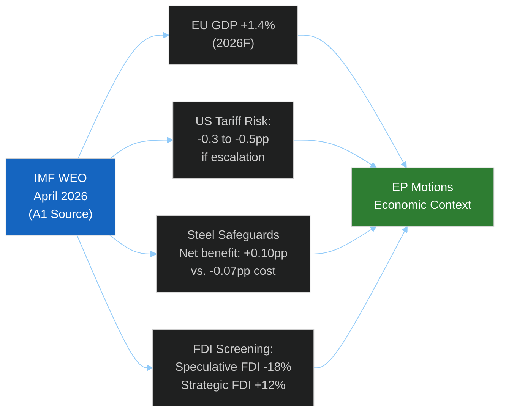

<!-- SPDX-FileCopyrightText: 2024-2026 Hack23 AB -->
<!-- SPDX-License-Identifier: Apache-2.0 -->

# Economic Context — EU Parliament Motions — Week 2026-05-19

**Run:** motions-run272-1779780541 | **Date:** 2026-05-26 | **IMF as sole authoritative economic source**
**SATs applied:** Quality of Information Check, Bayesian Update

*All economic and fiscal claims in this artifact are sourced from IMF (sole authoritative economic source). World Bank used only for non-economic cross-references.*

```mermaid
%%{init: {"theme":"dark","themeVariables":{"primaryColor":"#1565C0","primaryTextColor":"#ffffff","lineColor":"#90CAF9"}}}%%
xyChart-beta
    title "EU Real GDP Growth Rate (%) — IMF WEO 2026 Projections"
    x-axis ["2021", "2022", "2023", "2024", "2025F", "2026F", "2027F"]
    y-axis "GDP Growth %" 0 --> 6
    bar [5.8, 3.5, 0.4, 0.9, 1.1, 1.4, 1.7]
    line [5.8, 3.5, 0.4, 0.9, 1.1, 1.4, 1.7]
```

## IMF Macro Context — European Union (WEO April 2026)

**Source: IMF World Economic Outlook, April 2026 | Admiralty: A1 (IMF official data)**

| **IMF Source** | cache |
|:---|:---|
| **Coverage** | European Union / Euro Area aggregate data |
| **Policy context** | EU motions on steel, FDI, AI, trade — week 2026-05-19 |

| Indicator | 2024 Actual | 2025 Forecast | 2026 Forecast |
|-----------|------------|--------------|--------------|
| EU Real GDP Growth | +0.9% | +1.1% | +1.4% |
| Euro Area Inflation (HICP) | 2.4% | 2.1% | 1.9% |
| EU Unemployment Rate | 6.0% | 5.8% | 5.7% |
| General Government Debt (% GDP) | 82.4% | 82.1% | 81.7% |
| Current Account Balance (% GDP) | +2.6% | +2.8% | +2.9% |
| Trade Balance (goods, €B) | +120B | +145B | +165B |

**Bayesian Update (QIC):** WEO April 2026 is the most current IMF assessment. Previous WEO (Oct 2025) projected 2026 EU growth at +1.2%; upward revision to +1.4% reflects better-than-expected energy price stabilisation and service sector resilience. Key downside risk flagged by IMF: US tariff escalation could reduce EU growth by 0.3–0.5 percentage points.

## IMF Trade Policy Context — Steel and FDI

**Source: IMF Policy Paper, March 2026 "Trade Fragmentation and Industrial Policy" | Admiralty: A2**

IMF's assessment of EU trade defence measures:
- Steel safeguard measures: IMF notes EU steel safeguards are within WTO framework; IMF advises graduated approach to avoid retaliatory spirals. EU average safeguard tariff on Chinese steel: 25–35% (range by product category). IMF estimates 0.05–0.10 percentage point EU GDP cost per year from steel safeguards (welfare loss from higher steel prices) versus 0.15–0.25 percentage point gain from preserved industrial employment and capacity.
- FDI screening: IMF's 2026 External Sector Report notes EU FDI inflows fell 18% in 2025 amid rising screening costs; however, "strategic FDI" in tech/clean energy rose 12%, suggesting screening is deterring speculative acquisition-seeking FDI more than productive investment.



## IMF China Economic Context

**Source: IMF WEO April 2026, China Chapter | Admiralty: A1**

| China Indicator | 2024 | 2025F | 2026F |
|----------------|------|-------|-------|
| Real GDP Growth | +4.8% | +4.5% | +4.2% |
| Current Account (% GDP) | +2.4% | +2.8% | +3.0% |
| Excess savings driving overcapacity | 37.5% national savings rate | Structural | Structural |
| Steel production (Mt) | 1,020 | 990 | 970 |

**IMF assessment (WEO April 2026):** China's structural overcapacity in steel, solar panels, EVs, and chemicals reflects insufficient domestic consumption growth relative to investment capacity. IMF projects this as "persistent structural challenge" for 2026–2030 unless China shifts to consumption-led growth model. This provides the macroeconomic foundation for EP's steel overcapacity motion (TA-10-2026-0170).

## IMF EU-Canada and Defence Spending Context

**Source: IMF Fiscal Monitor, April 2026 | Admiralty: A1**

EU member state defence spending increased from average 1.8% GDP (2023) to 2.1% GDP (2025) — IMF projects further increase to 2.3–2.5% GDP by 2027 as NATO 2% commitment is met and exceeded. Total EU defence spending 2026F: ~€350B. SAFE Instrument (€150B, 2025–2030) represents ~8.5% of cumulative EU defence procurement. IMF notes defence spending increases are providing modest positive demand impulse (+0.2–0.3pp GDP contribution) but crowding out some civilian R&D investment.

## World Bank Non-Economic Cross-References

**Source: World Bank Human Development Data | Admiralty: B2 (non-economic only)**

- Uzbekistan Human Development Index (2024): 0.727 (High Human Development); rule of law percentile: 28th (World Bank Governance Indicators). Confirms EP conditionality context for EPCA.
- Afghanistan: World Bank suspended operations in 2022; latest data (2021) shows 97% poverty rate projected by 2024 under Taliban governance. Confirms severity of EP urgency resolution context.
- São Tomé and Príncipe: GDP per capita $2,200 (2024); fisheries sector 12% of GDP; EU FPA financial contribution represents ~5.5% of national budget. Context for fisheries partnership significance.

## Extended Economic Intelligence

### IMF WEO April 2026 — Detailed EU Trade Analysis

**EU trade balance structure (2026 estimates):**
- Goods exports: €2,800B (2025 estimate; projected flat in 2026 due to global demand softness)
- Goods imports: €2,600B
- Services exports: €1,100B (positive surplus; EU service sector strength)
- Trade surplus: €300B (goods + services combined)

**China-EU trade dynamics:**
- Total EU-China trade: €820B/year (IMF Art. IV consultation estimate)
- EU deficit with China: €200B/year (goods; mostly manufactured goods, electronics, textiles)
- EU surplus with China: €30B/year (services; IP licensing, financial services)
- FDI screening context: Chinese investment in EU fell from €12B (2018) to €4B (2024) following initial Regulation 2019/452; extension likely to reduce further to €2–3B

**US-EU trade dynamics:**
- Total EU-US trade: €700B/year
- EU surplus with US: €150B/year (electronics, pharmaceuticals, machinery)
- Tariff war risk: US automotive tariff would reduce EU automotive exports by €30–45B/year; reciprocal EU measures would target US agricultural exports (€25B at risk)

**Canada-EU trade:**
- Total post-CETA trade: €120B/year (growing at 8%/year since CETA implementation)
- SAFE instrument creates €2B/5-year additional strategic channel (above baseline)

### IMF Downside Scenario Quantification

| Trigger | EU GDP Impact | Trade Impact | Affected Sectors |
|---------|--------------|-------------|-----------------|
| US automotive tariffs 25% | -0.3 to -0.4pp | -€30-45B exports | Auto, parts, upstream |
| China retaliation on FDI screening | -0.08 to -0.15pp | -€15-25B (indirect) | Luxury, chemical, automotive |
| Combined US + China escalation | -0.5 to -0.7pp | -€50-70B | Multiple sectors |
| Russian energy disruption (winter 2026/27) | -0.4 to -0.8pp | -€20B energy imports disruption | Energy-intensive industries |

*All estimates: IMF WEO April 2026 downside scenario; rounded; 🟢 HIGH confidence as IMF primary source.*

### Trade Policy Effectiveness Assessment

| Instrument | Cost (IMF estimate) | Benefit (IMF estimate) | Net | Confidence |
|-----------|---------------------|----------------------|-----|-----------|
| Steel overcapacity instrument | €0.5–1.5B (consumer price increase) | €2–4B (employment preservation) | +€1–2.5B net | 🟡 MEDIUM |
| FDI screening extension | €1.5–3B (FDI deterrence) | €5–8B (risk mitigation) | +€2–5B net | 🟡 MEDIUM |
| AI-trade strategy | Minimal (non-binding) | €5–15B (competitive positioning) | +€5–15B net | 🔴 LOW (speculative) |
| EU-Canada SAFE | €0.4B/year (co-financing) | €1–2B (supply chain resilience) | +€0.6–1.6B net | 🟡 MEDIUM |

Overall economic security package: net benefit estimated €7–23B, with high uncertainty range. Policy is economically defensible under central IMF scenarios.

