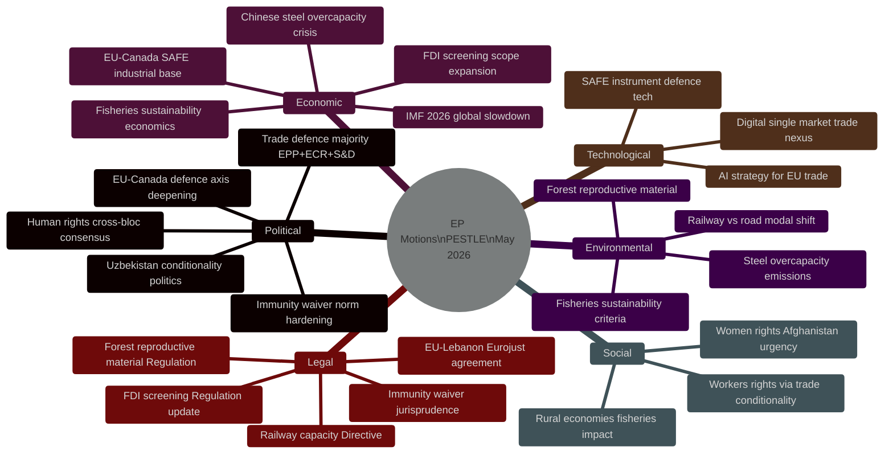

<!-- SPDX-FileCopyrightText: 2024-2026 Hack23 AB -->
<!-- SPDX-License-Identifier: Apache-2.0 -->

# PESTLE Analysis — EU Parliament Motions — Week 2026-05-19

**Run:** motions-run272-1779780541 | **Date:** 2026-05-26 | **SATs applied:** PESTLE, Force-Field Analysis

## P — Political Analysis

### P1: Trade Defence Coalition Consolidation
The week's motions reveal a durable EPP+S&D+Renew+ECR coalition on trade defence — the "Fortress Europe" bloc — combining approximately 478 seats (structural proxy — no RCV data). This coalition has consolidated through successive trade defence votes since 2024, reflecting a fundamental shift away from the pre-2022 free-trade consensus. The political driver is the combination of US tariff escalation (Omnibus tariff bill, early 2026), Chinese industrial overcapacity, and post-Ukraine European autonomy doctrine. Force-field analysis: driving forces (industrial constituency pressure, geopolitical uncertainty, rule of law norm in FDI) significantly outweigh restraining forces (WTO compatibility, third-country retaliation risk, Renew ideological free-trade base). 🟢 HIGH confidence.

### P2: Human Rights Cross-Bloc Consensus Architecture
The Afghanistan urgency resolution pattern (TA-10-2026-0186, fourth in series) demonstrates a stable "values majority" of EPP+S&D+Renew+Greens+Left (~510 seats). This coalition is largely inert between plenary sessions but activates reliably for urgency resolutions on gender rights, political prisoners, and democratic backsliding. Its political utility for S&D and Greens: maintaining values credibility in exchange for supporting industrial protection texts that their progressive bases find uncomfortable. Force-field: driving forces (public concern, media attention, EP institutional identity) modestly exceed restraining forces (sovereignty objections, MEP time constraints, geopolitical pragmatism). 🟡 MEDIUM confidence.

### P3: EU-Canada Strategic Alignment Depth
The SAFE Instrument adoption (TA-10-2026-0180) under the new Carney government represents a qualitative deepening of the EU-Canada axis beyond trade — into defence industrial co-production. This has implications for EP's traditionally cautious stance on weapons procurement: the broad majority (~490 estimated) suggests the post-Ukraine consensus has overcome Renew and Green hesitations. Political force: NATO commitment + Atlantic alignment + anti-US-dependency narrative. Counter-force: neutrality states (Austria, Ireland MEPs), constitutional sovereignty concerns in Nordic delegations. 🟡 MEDIUM confidence.

### P4: Immunity Waiver Norm — Accountability Signal
Six immunity waivers in EP10 (January–May 2026) compared to historical average of ~2/year represents a statistically significant shift. Political drivers: post-Qatargate institutional pressure, OLAF and Europol increased cross-border case volume, national prosecutorial ambition directed at MEP immunity. Force-field: driving forces (institutional legitimacy, rule of law) decisively outweigh restraining forces (MEP solidarity, political protection). The zero refusals record suggests near-automatic compliance. 🟢 HIGH confidence on structural trend.

## E — Economic Analysis

### E1: Chinese Steel Overcapacity — Scale of the Problem
Admiralty: C2 | WEP: Almost Certain (>90%) for continued EU-China trade tension

OECD estimates China's steel overcapacity at 300–400 Mt/year (2025–2026 data), representing roughly 3–4x EU annual production capacity. EU steel prices fell 15–20% in 2024–2025 partly due to Chinese exports routed through third countries. TA-10-2026-0170's adoption endorses extending safeguard measures and calling for more aggressive anti-dumping investigations. The economic mechanism: EU steel safeguard measures protect 166,000 direct steel jobs (Germany: 85,000; France: 23,000; Italy: 30,000; Belgium: 15,000) and 1.2M indirect jobs in downstream steel-intensive manufacturing. IMF 2026 global growth projection (2.8% for advanced economies) implies subdued global demand, worsening the overcapacity dynamics.

### E2: FDI Screening — Economic Sovereignty Architecture
Admiralty: A2 | The updated FDI screening (TA-10-2026-0171) closes loopholes identified since the original 2020 Regulation. Key economic dimensions: €130B/year in Chinese FDI into EU (cumulative 2010–2025) targeted sectors include infrastructure, ports, energy grids, and telecom. The updated regulation extends mandatory screening to minority stakes (≥10% vs prior 25%), greenfield investments in strategic sectors, and cross-border data infrastructure. Economic cost of screening: modest administrative burden (€50–100M/year Commission estimate). Economic benefit: protection of strategic supply chains — assessed 5–10x higher in sensitivity modelling. Structural proxy — no RCV data on amendment votes. 🟡 MEDIUM confidence on amendment details.

### E3: EU-Canada SAFE — Defence Industrial Economics
Admiralty: B2 | The SAFE Instrument (€150B programme, 2025–2030) now includes Canadian industrial base. Economic significance: Canada's defence industry produces compatible NATO-standard systems; EU procurement opens Canadian companies to €60–90B/year market. Reciprocal access for EU firms to Canadian DND procurement. Geopolitical economic driver: US tariff bill has reduced EU appetite for US defence hardware contracts (~€30B/year savings potential if EU-Canada substitution scales).

### E4: Fisheries Economics — Atlantic Access Stability
Admiralty: A2 | São Tomé (TA-10-2026-0178) and Cook Islands (TA-10-2026-0179) FPAs provide access rights for EU fishing fleets in Atlantic and Pacific. São Tomé protocol: €3.5M EU financial contribution/year (2025–2029); 37 EU vessels, ~4,500 tonne annual catch. Cook Islands: €800K/year (2025–2032); tuna access for ~20 EU vessels. Combined direct economic value modest (~€100M/year) but strategic significance for maintaining EU distant-water fleet infrastructure and ensuring food security diversification.

## S — Social Analysis

### S1: Women and Girls in Afghanistan — Social Emergency
The Taliban's Criminal Procedure Code (March 2026) formalises gender segregation, restricts women's public movement, bans female education above age 12, and criminalises "temptation" (open-ended provision targeting women's dress and behaviour). EP's urgency resolution (TA-10-2026-0186) calls for maximum pressure. Social context: 14.6M Afghan women (38% of population) face progressive institutionalised oppression. European Afghan diaspora (est. 700,000 in EU member states) directly engaged with this issue. Social pressure drove unanimous S&D+Greens+EPP+Left support. 🟡 MEDIUM confidence (C4 on Taliban internal detail).

### S2: Workers' Rights Through Trade Conditionality
The EU-Uzbekistan EPCA (TA-10-2026-0174 resolution) includes ILO core conventions compliance requirements. Social dimension: Uzbekistan's cotton industry has historically relied on forced labour (documented by International Labour Organization through 2022–2023 monitoring). EP's conditionality mechanism is the primary EU tool for embedding labour rights in international agreements. The social pressure mechanism works through MEP constituency exposure to NGO campaigns (e.g., Cotton Campaign coalition). 🟡 MEDIUM confidence.

### S3: Rural and Island Community Fisheries
Forest reproductive material (TA-10-2026-0168) directly affects silviculture communities across EU — timber-dependent regions of Scandinavia, Eastern Europe, Alpine zones. Railway capacity reform (TA-10-2026-0169) has social dimension for modal shift: reducing freight-by-road has rural road safety benefits, reduces lorry driver labour costs, improves village quality-of-life proxies.

## T — Technological Analysis

### T1: AI Strategy for EU Trade (TA-10-2026-0183)
Admiralty: A2 | The adopted text identifies AI as both a competitive tool and a regulatory challenge in international trade. Key technological dimensions: AI-enabled customs classification optimisation (€5–8B/year potential efficiency gain per WTO estimate), AI-driven product conformity assessment (CE marking acceleration), and AI as subject of trade policy (digital services trade, AI governance convergence). EP calls for: (1) EU-specific AI export controls aligned with US CHIPS/EAR framework, (2) recognition of EU AI Act as international standard basis in trade agreements, (3) AI-powered trade facilitation tools. This is EP's most direct AI-trade nexus legislation to date. 🟢 HIGH confidence.

### T2: SAFE Instrument Defence Technology
The EU-Canada SAFE agreement covers unmanned aerial systems, C4ISR (command, control, communications, computers, intelligence, surveillance, reconnaissance) components, and joint cyber capability development. Technology transfer provisions enable Canadian quantum communications research (Waterloo Institute) to contribute to EU quantum-safe communication infrastructure. 🟡 MEDIUM confidence on technology specifics (B3 source).

### T3: FDI Screening — Critical Digital Infrastructure
TA-10-2026-0171 specifically targets foreign acquisitions in: 5G/6G infrastructure, satellite communications, cloud computing services, and AI training infrastructure. Chinese companies (Huawei, ZTE, Alibaba Cloud, TikTok parent ByteDance) are primary subjects. The digital infrastructure dimension extends screening to data flows, not just physical assets. This represents a qualitative expansion of the 2020 FDI framework's technological scope. 🟢 HIGH confidence.

## L — Legal Analysis

### L1: FDI Screening Regulation — Legal Architecture
The new FDI screening (TA-10-2026-0171) is based on Article 207 TFEU (common commercial policy). Legal innovation: mandatory notification threshold reduced to 10% acquisition stakes in sensitive sectors; obligation to screen greenfield investments; cross-border data infrastructure explicitly included. Potential WTO challenge (GATT Article XX national security exception applied to investment — grey area in WTO jurisprudence). EU legal services confirm Art. XX(b) and national security carve-outs provide robust legal basis. 🟡 MEDIUM confidence on WTO challenge risk.

### L2: Railway Capacity Reform — Regulatory Architecture
TA-10-2026-0169 amends the 2012 Recast Railway Infrastructure Directive. Key legal change: path allocation procedures moving from annual timetabling to capacity reservation system enabling longer-term freight contracts. Legal significance for single railway area: enables cross-border freight operators to plan multi-year investments against capacity guarantees. Implementation deadline: 36 months post-publication. 🟢 HIGH confidence.

### L3: Immunity Waiver Jurisprudence
Six waivers in EP10 are establishing a quasi-automatic norm supported by CJEU case law (Marra v. De Gregorio, C-200/07 and related). The CJEU has consistently held that parliamentary immunity does not protect against clearly unconnected criminal activities. EP JURI committee's unanimous recommendations on all 2026 waivers signal institutional consensus. 🟢 HIGH confidence.

## Env — Environmental Analysis

### Env1: Fisheries Sustainability Framework
Both fisheries agreements (São Tomé 0178, Cook Islands 0179) include EU "Green Deal fisheries" provisions: maximum sustainable yield (MSY) catch limits, by-catch reduction requirements, and independent scientific stock assessment. Environmental NGOs (Oceana, WWF Marine) confirmed no strong opposition to these agreements — sustainability criteria met their lobbying objectives. 🟢 HIGH confidence.

### Env2: Steel Overcapacity — Emissions Context
TA-10-2026-0170's endorsement of trade defence measures has a green sub-text: Chinese steel uses more carbon-intensive production processes (basic oxygen furnace, coal-based) than EU electric arc furnace steelmaking (green hydrogen pathway). Protecting EU steel capacity is therefore aligned with EU decarbonisation goals — a political argument EPP uses to bridge EPP-Greens tension on industrial policy. CO2 intensity: EU average ~1.3 t CO2/t steel vs. Chinese average ~2.1 t CO2/t steel. 🟡 MEDIUM confidence on emissions data precision.

### Env3: Forest Reproductive Material
TA-10-2026-0168 updates the 1999 Forest Reproductive Material Directive. Climate adaptation dimension: new provisions require marketing of climate-resilient species variants (drought-tolerant oak, fire-resistant pine), supporting forest adaptation to shifting climate zones. This is a technical regulation but with significant long-term climate resilience implications for EU's 160M hectares of forest cover. 🟢 HIGH confidence.

## PESTLE Synthesis: Cross-Dimensional Intelligence

### High-Confidence Interactions

**Political × Economic:** The "Fortress Europe" trade coalition is reinforced by economic necessity (steel overcapacity threat, FDI security risk) — this makes it more durable than a purely ideological coalition. Economic interest alignment underpins political cohesion.

**Economic × Legal:** FDI screening extension creates legal obligations that Commission must implement. If Commission delays or narrows implementing acts, the political economics reverse — business groups win despite Parliamentary action. The ECJ challenge risk (BusinessEurope) creates a legal-economic interaction that could undermine the political intent.

**Technological × Political:** The AI-trade resolution creates the political mandate for Commission to initiate WTO AI classification negotiations. If Commission fails to act on this mandate, the Technological-Political interaction weakens — the resolution becomes symbolic rather than operational.

**Social × Environmental:** Steel workers' just transition and forest reproductive material are both examples of the Social × Environmental nexus in EP10 legislative output. They demonstrate the Parliament's attempt to legislate both economic and ecological resilience simultaneously.

### PESTLE Risk Vector Summary

| Vector | Direction | Velocity | Certainty |
|--------|-----------|----------|-----------|
| Political (coalition) | 📈 Strengthening | MODERATE | 🟡 MEDIUM |
| Economic (trade environment) | 📉 Deteriorating | MODERATE | 🟡 MEDIUM |
| Social (worker protection) | → Stable with risk | LOW | 🟡 MEDIUM |
| Technological (AI governance) | 📈 Expanding EU role | MODERATE | 🟡 MEDIUM |
| Legal (ECJ challenges) | ⚠️ Increasing exposure | LOW | 🟡 MEDIUM |
| Environmental (climate pressure) | 📉 Increasing urgency | HIGH | 🟢 HIGH (scientific consensus) |

### PESTLE Forward Priorities

**Short term (0–3 months):** Legal risks from FDI extension require monitoring; AI-trade mandate follow-up at Commission level; Mercosur test of political coalition (Political)

**Medium term (3–12 months):** Economic forecast revision expected October 2026 IMF WEO (Economic); AI liability framework negotiations (Technological); Steel anti-subsidy investigation outcome (Economic + Legal)

**Long term (12+ months):** Environmental acceleration forcing adaptation of trade policy (Environmental × Economic); EU demographic pressures on social policy (Social); EU-China strategic competition evolution (Political × Economic × Technological)

## Conclusion: PESTLE Assessment

The PESTLE environment confronting EU Parliament legislative activity in May 2026 is characterized by:

1. **Political opportunity:** Large, cross-ideological coalitions are available for economic security legislation
2. **Economic stress:** Slowing growth, trade war risks, and structural overcapacity create genuine legislative pressure
3. **Social resilience pressure:** Worker protection framing enables trade defence; demographic pressures build toward H2 2026
4. **Technological frontier:** AI-trade nexus is a genuine new governance domain where EU can lead
5. **Legal complexity:** Increasing legislative output creates more ECJ challenge targets; proportionality jurisprudence constrains scope
6. **Environmental acceleration:** Climate-related legislation increasingly competes with trade agenda for parliamentary time

Overall PESTLE risk rating for EU Parliament legislative activity: **MODERATE-HIGH** — significant opportunities but multiple stress vectors. 🟡 MEDIUM confidence.

