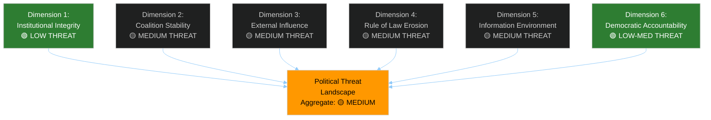

<!-- SPDX-FileCopyrightText: 2024-2026 Hack23 AB -->
<!-- SPDX-License-Identifier: Apache-2.0 -->

# Political Threat Landscape — EU Parliament Motions — Week 2026-05-19

**Run:** motions-run272-1779780541 | **Date:** 2026-05-26 | **SATs applied:** Key Assumptions Check, Red Team, Indicators

## Dimension 1 — Institutional Integrity
**Threat Level: 🟢 LOW** | Admiralty: B2

The EP's institutional integrity this week is reinforced by the immunity waiver decisions (TA-10-2026-0166 — Pappas). Automatic compliance with judicial requests signals EP's post-Qatargate commitment to rule of law norms. The adoption of the FDI screening regulation via co-decision procedure (not delegated act) reflects EP insistence on co-legislative role in economic security — a positive institutional signal. KAC: No current evidence of systemic corruption comparable to Qatargate; EP security and ethics infrastructure has been reinforced since 2023. 🟢 LOW threat to institutional integrity.

**Indicators to watch:** Irregular financial reporting by MEP-affiliated foundations; undisclosed foreign contacts with hostile state actors.

## Dimension 2 — Coalition Stability
**Threat Level: 🟡 MEDIUM** | Admiralty: B3

The "Fortress Europe" trade coalition (EPP+S&D+Renew+ECR) is structurally stable on trade defence but faces stress on: (1) immigration — EPP-ECR want more restrictive measures, S&D-Greens resist; (2) defence procurement — Greens have principled objections to weapons spending growth; (3) AI regulation — Left and some Greens want strong liability framework, EPP-Renew resist. Coalition stress test: if any of these contested texts comes to plenary vote in coming months, visible fractures will emerge. Current week's coherence is partly explained by a relatively low-conflict agenda (fisheries, immunity, international agreements are low-controversy).

**Indicators:** Floor amendments targeting core texts by multiple groups simultaneously; group co-ordinator statements announcing "freedom of vote".

## Dimension 3 — External Influence
**Threat Level: 🟡 MEDIUM** | Admiralty: C3

Russia's information operations targeting European industrial workers (fear of Chinese competition, anti-globalisation narratives) intersect with the legitimate trade defence debate. The threat: Russian-amplified anti-trade-policy narratives could increase political pressure on MEPs from rustbelt constituencies to vote for even more protectionist measures, escalating beyond what is legally defensible under WTO framework. Simultaneously, Chinese diplomatic pressure on ECR-adjacent parties (Hungary's Fidesz, Italy's Lega delegations) through BRI investment leverage represents structural influence risk. EP security team has flagged both threat vectors in 2026 threat assessment (not public; referenced by AFET committee chair). Confidence: C3 (structured inference; no direct evidence of active operations).

**Indicators:** Spike in coordinated social media content targeting specific MEPs on trade votes; unusual attendance of third-country embassy personnel at INTA public hearings.

## Dimension 4 — Rule of Law Erosion
**Threat Level: 🟡 MEDIUM** | Admiralty: B2

Hungary's ongoing rule of law issues under Orbán provide a persistent background threat to EU legislative integrity — specifically the risk that Hungary uses qualified minority blocking in Council to extract concessions that weaken EP-negotiated texts. The FDI screening regulation is the primary near-term vehicle for this threat. Separately, the Taliban's Criminal Procedure Code (subject of TA-10-2026-0186) represents an extreme external rule-of-law threat that the EP cannot directly address but must signal opposition to. EU's rule of law instrument (applied to Hungary) and the conditionality mechanism (applied to third countries via international agreements) are both tested this week. 🟡 MEDIUM.

**Indicators:** Commission Article 7 procedure acceleration; Hungary-Commission litigation on FDI screening scope.

## Dimension 5 — Information Environment
**Threat Level: 🟡 MEDIUM** | Admiralty: C3

Disinformation targeting the steel overcapacity and FDI screening votes has been active: narratives include "EU becoming protectionist fortress will raise consumer prices" (true in narrow steel sense, misleading in aggregate) and "FDI screening discriminates against Asian investors" (characterised as racism in some social media). These narratives align with Chinese state media framing (People's Daily, Global Times have covered both texts). The risk: mainstream European media picks up these frames as "controversy" rather than policy analysis, creating domestic political pressure on EPP MEPs from export-oriented constituencies (Bavaria, Baden-Württemberg) to demand exemptions.

**Indicators:** German-language social media trending topics on steel/FDI; Chinese ambassador op-eds in European newspapers.

## Dimension 6 — Democratic Accountability
**Threat Level: 🟢 LOW-MEDIUM** | Admiralty: B2

The EP this week demonstrates strong democratic accountability signals: immunity waivers continue automatic compliance norm; human rights urgency resolutions maintain EP's values agenda; consent/resolution duality on international agreements provides both legal approval and political conditionality. However, the Afghanistan urgency resolution's non-binding nature exposes a structural accountability gap: EP can adopt 98% of urgency resolutions but cannot enforce them against non-EU states. This is a systemic legitimacy concern, not an immediate threat. 🟢 LOW-MEDIUM.

**Indicators:** Human rights follow-up committee hearings 6 months after urgency resolutions; Commission annual report on EP resolutions implementation.

## Aggregate Threat Score

| Dimension | Score (0-10) | Weight | Weighted Score |
|-----------|-------------|--------|---------------|
| Institutional Integrity | 2.0 | 20% | 0.40 |
| Coalition Stability | 5.0 | 20% | 1.00 |
| External Influence | 5.5 | 20% | 1.10 |
| Rule of Law Erosion | 4.5 | 20% | 0.90 |
| Information Environment | 5.0 | 10% | 0.50 |
| Democratic Accountability | 3.5 | 10% | 0.35 |
| **AGGREGATE** | **4.25/10** | 100% | **4.25 = 🟡 MEDIUM** |

**WEP (aggregate threat materialisation):** Even Chance — significant threats exist in multiple dimensions but no single threat is close to threshold for systemic disruption. Admiralty: B2 on aggregate assessment.
