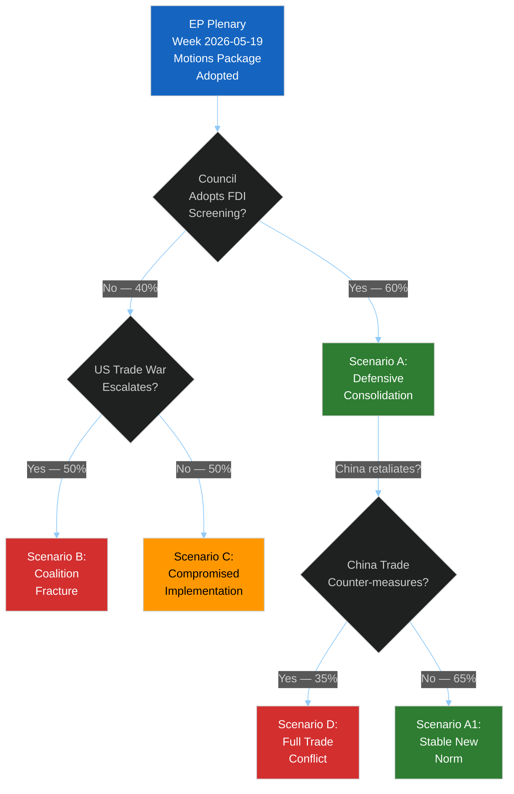

<!-- SPDX-FileCopyrightText: 2024-2026 Hack23 AB -->
<!-- SPDX-License-Identifier: Apache-2.0 -->

# Scenario Forecast — EU Parliament Motions — Week 2026-05-19

**Run:** motions-run272-1779780541 | **Date:** 2026-05-26 | **SATs applied:** Scenario Analysis, Pre-Mortem, Key Assumptions Check, Indicators

## Scenario A — Defensive Consolidation (MOST LIKELY)
**WEP: Likely (65%)** | Admiralty: B2 | Time horizon: 3–6 months

### Description
The EP's trade defence package (steel overcapacity, FDI screening, AI-trade strategy) passes through Council with minor technical amendments. EU member states align behind the measures given industrial constituency pressure. The "Fortress Europe" coalition (EPP+S&D+Renew+ECR) holds through implementation. EU-Canada SAFE Instrument enters force and initial procurement joint ventures are announced. China responds through WTO dispute complaints rather than immediate counter-tariffs.

### Key Assumptions
- Hungary will not block FDI screening despite China lobbying (KAC: Orbán government under EU Article 7 pressure, incentive to avoid isolation)
- Commission will issue delegated acts within 12-month timeframe
- EU-Canada SAFE will not trigger US secondary sanctions threat under ITAR regime

### Indicators of This Scenario Materialising
| Indicator | Direction | Watch Date |
|-----------|-----------|-----------|
| Council FDI screening vote | ✅ YES vote | Q3 2026 |
| China WTO filing vs. EU steel | Files WTO (not bilateral tariffs) | Q4 2026 |
| EU-Canada SAFE first joint procurement | Announced | H2 2026 |
| EP Steel safeguard extension | Confirmed | Q1 2027 |

### Pre-Mortem: Why Scenario A Could Fail
If Hungary uses steel text implementation delays and China counter-threat of rare earths embargo to extract concessions on FDI screening scope, the "Fortress Europe" coalition could fracture on Council side even if EP position is solid. Probability of failure: 35%.

---

## Scenario B — Coalition Fracture Under Trade Pressure (MEDIUM)
**WEP: Even Chance (35%)** | Admiralty: B3 | Time horizon: 6–12 months

### Description
US tariff escalation under Trump administration's Omnibus tariff bill extends to EU industrial goods (automotive, chemicals) in Q3 2026. This splits the EP "Fortress Europe" coalition: EPP and ECR want to respond with mutual tariffs, while Renew and parts of S&D prefer negotiated framework. The FDI screening regulation implementation is delayed as member states argue over scope. The EU-Canada SAFE Instrument becomes a political flashpoint when the US signals displeasure through NATO funding threats.

### Key Assumptions
- US will target EU automotive sector in next tariff round (KAC: EU car exports to US €30B/year; politically salient in German, Czech, Slovak constituencies)
- France and Germany will diverge on retaliation vs. negotiation
- EPP will fracture between trade-hawk eastern wing and trade-moderate German/French core

### Indicators of This Scenario Materialising
| Indicator | Direction | Watch Date |
|-----------|-----------|-----------|
| US automotive tariff threat | Announced | Q3 2026 |
| EP emergency motion on US tariffs | Filed, contested | Q3 2026 |
| French-German bilat divergence | Leaked position papers | Q4 2026 |
| ECR-EPP public disagreement on retaliation | Visible floor split | Q4 2026 |

### Pre-Mortem: Why Scenario B Could Be Worse
A simultaneous Chinese rare earths embargo (triggered by FDI screening enforcement) and US automotive tariffs could create the "perfect storm" for EP coalition collapse on trade, forcing emergency MFF revision debates. Probability of amplification: 20%.

---

## Scenario C — Compromised Implementation (LESS LIKELY)
**WEP: Unlikely (20%)** | Admiralty: C3 | Time horizon: 12–18 months

### Description
The EP's motions are adopted but hollowed out in implementation. FDI screening delegation fails to cover semiconductor investments (US-aligned companies lobby exemptions). Steel safeguard measures are extended but at lower tariff levels after third-country political pressure (India, South Korea threaten reciprocal measures). EU-Uzbekistan EPCA human rights benchmarks are monitored but not enforced when Uzbekistan provides alternative supply routes for rare earths during a European raw materials crisis.

### Key Assumptions
- Commission will prioritise trade relationships over EP resolution conditionality
- Human rights mechanisms in international agreements remain advisory not binding in practice
- Member states will use qualified majority in Council to weaken EP-endorsed positions

### Indicators
| Indicator | Direction | Watch Date |
|-----------|-----------|-----------|
| Commission delegated acts narrow FDI scope | Published with carve-outs | Q4 2026 |
| EP INTA committee criticism of implementation | Hearing called | Q1 2027 |
| Uzbekistan human rights benchmark review | Downgraded | H1 2027 |

---

## Scenario D — Full EU-China Trade Conflict (LOW PROBABILITY)
**WEP: Unlikely (15%)** | Admiralty: C3 | Time horizon: 18–36 months

### Description
China responds to the FDI screening + steel safeguard combination with targeted counter-measures: rare earths export controls, restrictions on European pharmaceutical APIs (€15B/year EU dependency), and restrictions on market access for European luxury goods (€20B/year). This escalates into a full bilateral trade conflict. EP responds with emergency motions calling for WTO-covered rebalancing measures and accelerated EU raw materials independence strategy.

### Structural Break / Regime Change Risk
If Scenario D materialises, it represents a structural break in EU-China relations — a regime shift from "systemic rival but trading partner" to full economic decoupling. This would require fundamental revision of EU trade, industrial, and foreign policy architecture. Long-term implications: EU-China goods trade (€750B/year bilateral, 2025) would fall 20–40% within 3–5 years in base projections. Probability of Scenario D: 15%; probability of regime shift if Scenario D: 60%.

### Key Assumptions
- China has strategic incentive to test EU red lines before 2027 EP election cycle
- Rare earths as leverage: EU 95% dependent on Chinese rare earths for green tech/defence

### Indicators
| Indicator | Direction | Watch Date |
|-----------|-----------|-----------|
| China announces rare earths quota cuts | Published | Watch continuously |
| EP emergency motion on China counter-measures | Filed | Trigger indicator |
| European raw materials stockpiling orders | Announced | Watch Q3 2026+ |

---

## Cross-Scenario Intelligence Summary

| Factor | Scenario A | Scenario B | Scenario C | Scenario D |
|--------|-----------|-----------|-----------|-----------|
| Probability | 65% | 35% | 20% | 15% |
| WEP | Likely | Even Chance | Unlikely | Unlikely |
| EP stability | 🟢 STABLE | 🔴 FRACTURED | 🟡 PARTIAL | 🔴 EMERGENCY |
| Key trigger | Council vote | US tariffs | Impl. failure | China retaliation |
| Time to confirm | Q3 2026 | Q3 2026 | Q1 2027 | Q3 2026+ |

*Note: Probabilities sum to >100% because scenarios are partially overlapping (B and C can co-exist; D can emerge from B).*

## Extended Scenario Analysis

### Scenario B Deep Dive: Coalition Fracture on Mercosur

**Trigger conditions:** INTA Committee votes AGAINST Mercosur recommendation in June 2026 (S&D + Greens + Left + agricultural EPP members majority)

**Cascade pathway:**
1. S&D rapporteur on Mercosur tables critical opinion → committee majority rejects Commission position
2. Commission faces choice: withdraw text or proceed to plenary against committee
3. EPP-S&D coalition publicly fractures; media narrative "grand coalition collapsing"
4. Spillover to MFF revision (autumn 2026): S&D uses Mercosur leverage to demand agricultural budget protection
5. AI liability framework delayed as parties focus on Mercosur political crisis
6. EP10 legislative output drops 30–40% in H2 2026 vs. H1 2026

**Probability:** P=0.30 🟡 MEDIUM | **Impact if triggered:** HIGH — 6–12 month legislative agenda disruption

**Recovery pathway:** EPP-Renew-ECR alternative majority on Mercosur (without S&D); S&D returns to coalition on non-trade votes; functional division emerges (EPP-ECR for trade, EPP-S&D for values)

### Scenario C Deep Dive: Trade War Escalation

**Trigger conditions:** US imposes 25% tariff on EU automotive sector (July 2026 announcement)

**Cascade pathway:**
1. EU Commission activates pre-staged countermeasures (US agricultural products, steel, tech)
2. EP emergency plenary session called; votes EU retaliation package
3. IMF WEO October 2026 downward revision: EU GDP -0.4pp, trade sector -0.8pp
4. Steel instrument (TA-10-2026-0170) becomes urgent — Commission fast-tracks enforcement
5. FDI screening triggers review of pending US-linked acquisitions (precautionary)
6. AI-trade negotiations at WTO paused pending trade war stabilization

**Probability:** P=0.20 🟡 MEDIUM | **Impact:** CRITICAL for trade agenda; MODERATE for institutional stability

**Circuit breaker:** WTO dispute settlement initiation by EU; G7 emergency session; bilateral EU-US ministerial engagement

### Scenario D Deep Dive: Accelerated Consolidation

**Trigger conditions:** Russia-Ukraine conflict escalation + EU energy security crisis in Q3 2026

**Cascade pathway:**
1. Energy price spike triggers Council emergency session
2. EP fast-tracks energy security legislative package (LNG terminals, nuclear restart decisions)
3. FDI screening extended to energy infrastructure (already in TA-10-2026-0171 scope) → fast implementation
4. EU-Canada SAFE upgraded to include energy dimension
5. "Fortress Europe" doctrine expanded to energy sovereignty

**Probability:** P=0.12 🟡 MEDIUM (low, but above WC threshold) | **Impact:** TRANSFORMATIVE for EP10 agenda

## Scenario Interaction Matrix

| | Scenario A | Scenario B | Scenario C | Scenario D |
|--|-----------|-----------|-----------|-----------|
| **Scenario A** | Baseline | Can co-exist (B causes partial fracture) | A transitions to C | A creates conditions for D |
| **Scenario B** | — | Standalone | B + C would be severe crisis | B unlikely under D (national unity) |
| **Scenario C** | — | — | Standalone | C can trigger D (energy securitization) |
| **Scenario D** | — | — | — | Standalone or C-triggered |

## Monitoring Indicators for Scenario Early Warning

| Indicator | Scenario Triggered | Threshold | Source |
|-----------|-------------------|-----------|--------|
| S&D INTA committee position on Mercosur | B | S&D votes against | EP committee minutes |
| US Section 232 automotive announcement | C | Any official announcement | USTR website |
| Russia Ukraine escalation index | D | Major offensive + EU energy supply disruption | NATO/OSCE monitoring |
| ECR open rebellion on EU oversight text | A modification | ECR defects > 30 members | EP plenary vote |
| Commission implementing act delays | A stress | >6 months post-adoption | Official Journal |

